# Shard Markdown Architecture Documentation

## Table of Contents

1. [Overview](#overview)
2. [High-Level Architecture](#high-level-architecture)
3. [Component Architecture](#component-architecture)
4. [Data Flow](#data-flow)
5. [Sequence Diagrams](#sequence-diagrams)
6. [Module Dependencies](#module-dependencies)
7. [Key Design Patterns](#key-design-patterns)
8. [Performance Considerations](#performance-considerations)
9. [Security Architecture](#security-architecture)

## Overview

Shard Markdown is an intelligent document processing system that chunks markdown documents and stores them in ChromaDB collections for efficient retrieval and search. The architecture follows a layered approach with clear separation of concerns across CLI interface, core processing logic, ChromaDB integration, and configuration management.

## High-Level Architecture

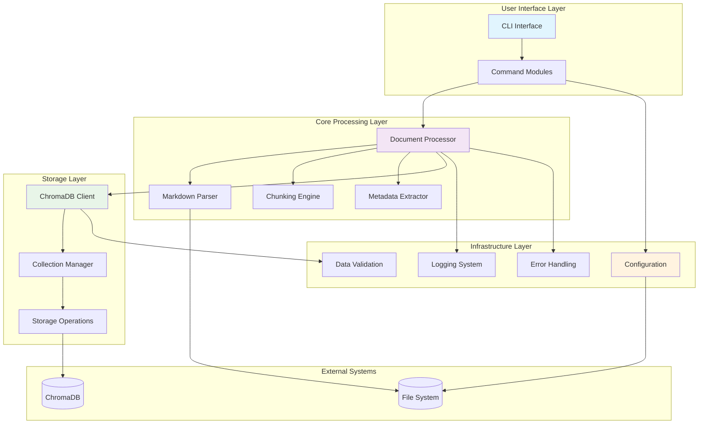

## Component Architecture

### CLI Layer Components

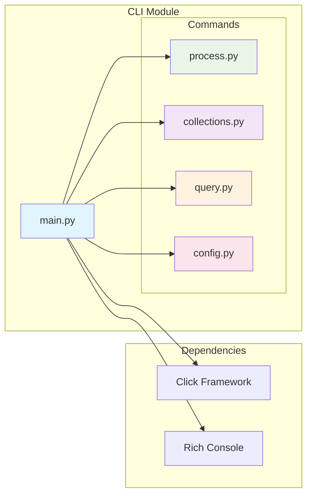

### Core Processing Components

```mermaid
graph TB
    subgraph "Core Processing"
        Processor[DocumentProcessor]
        Parser[MarkdownParser]
        
        subgraph "Chunking System"
            ChunkEngine[ChunkingEngine]
            BaseChunker[BaseChunker]
            FixedChunker[FixedChunker]
            StructureChunker[StructureChunker]
        end
        
        Metadata[MetadataExtractor]
        Models[Data Models]
    end

    Processor --> Parser
    Processor --> ChunkEngine
    Processor --> Metadata
    
    ChunkEngine --> BaseChunker
    BaseChunker <|-- FixedChunker
    BaseChunker <|-- StructureChunker
    
    Parser --> Models
    ChunkEngine --> Models
    Metadata --> Models

    style Processor fill:#e3f2fd
    style ChunkEngine fill:#f1f8e9
    style Models fill:#fce4ec
```

### ChromaDB Integration Components

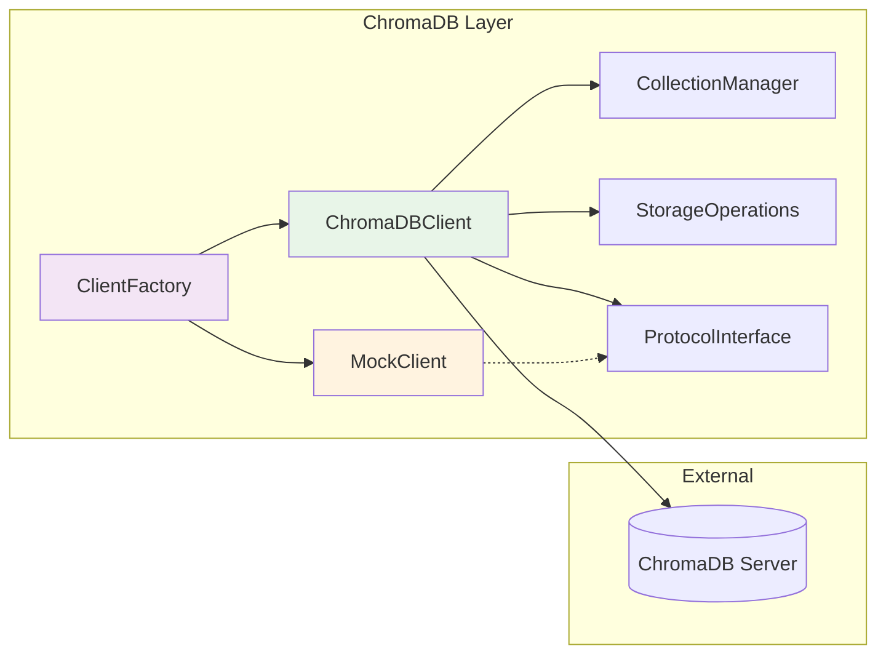

## Data Flow

### Document Processing Flow

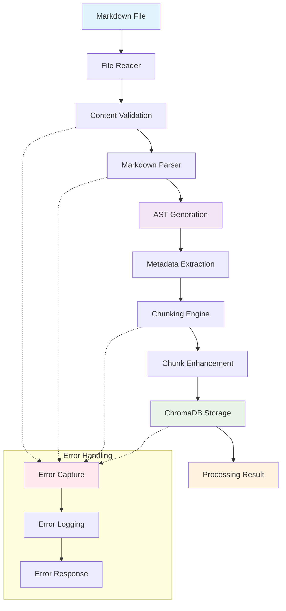

### Batch Processing Flow

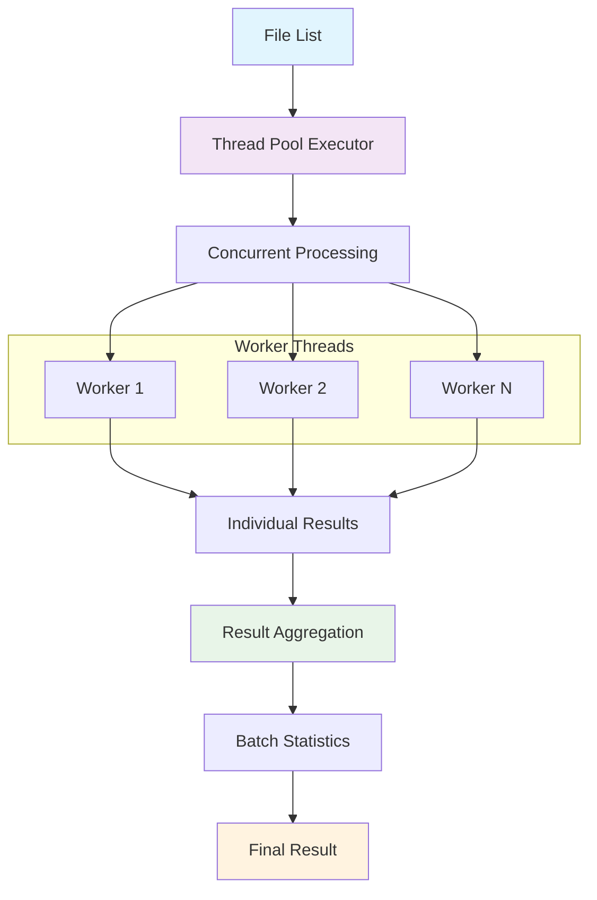

## Sequence Diagrams

### Single Document Processing

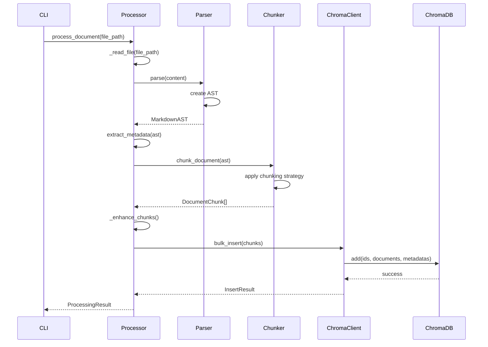

### Collection Management

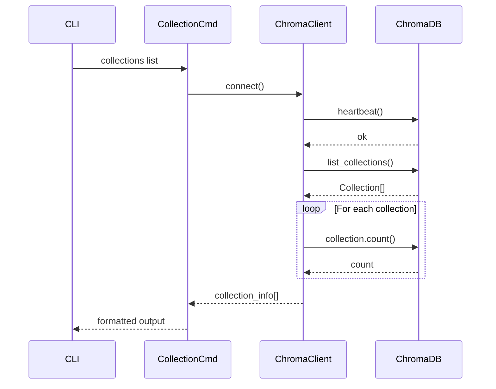

### Error Handling Flow

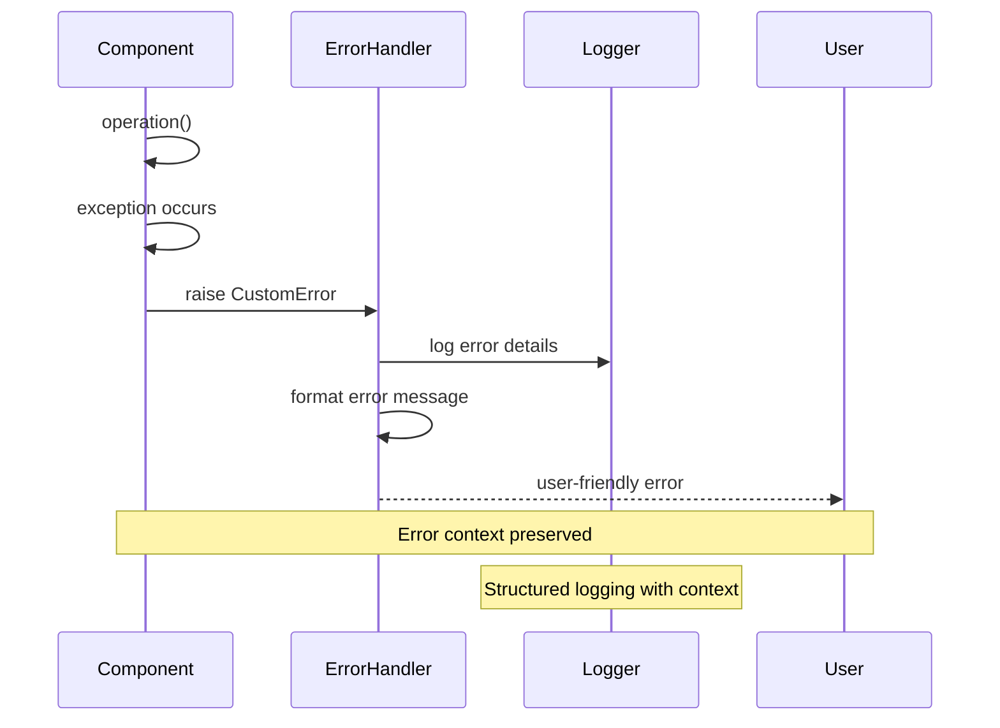

## Module Dependencies

### Dependency Graph

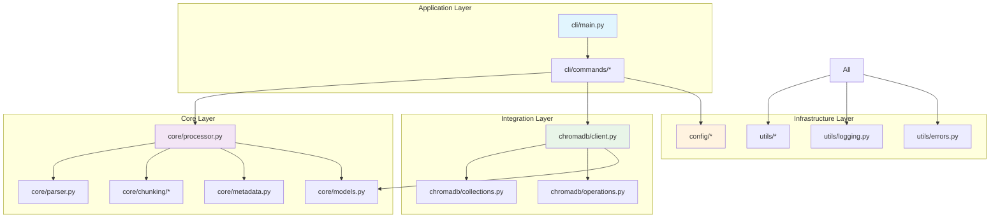

## Key Design Patterns

### 1. Strategy Pattern (Chunking)

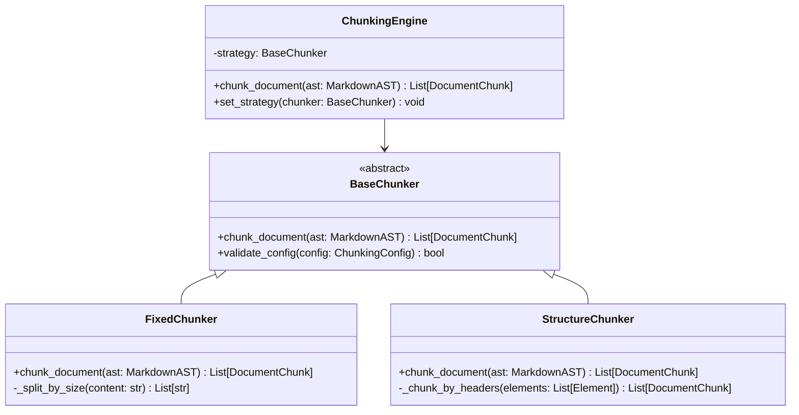

### 2. Factory Pattern (ChromaDB Client)

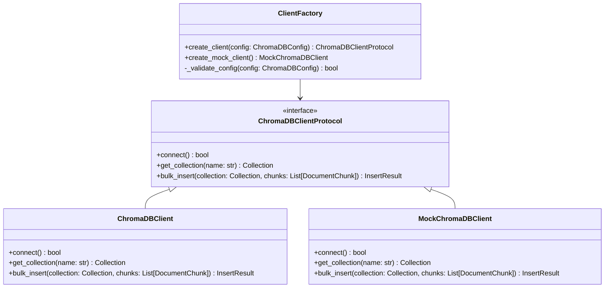

### 3. Command Pattern (CLI Commands)

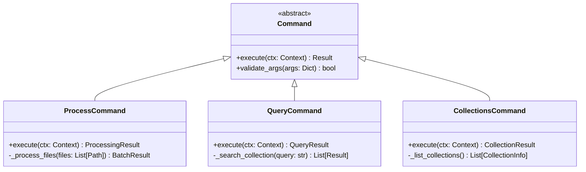

## Performance Considerations

### Concurrency Architecture

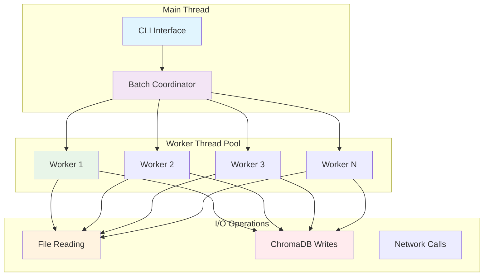

### Memory Management

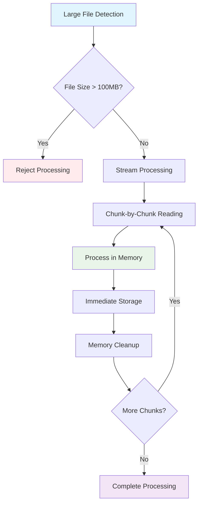

## Security Architecture

### Input Validation Flow

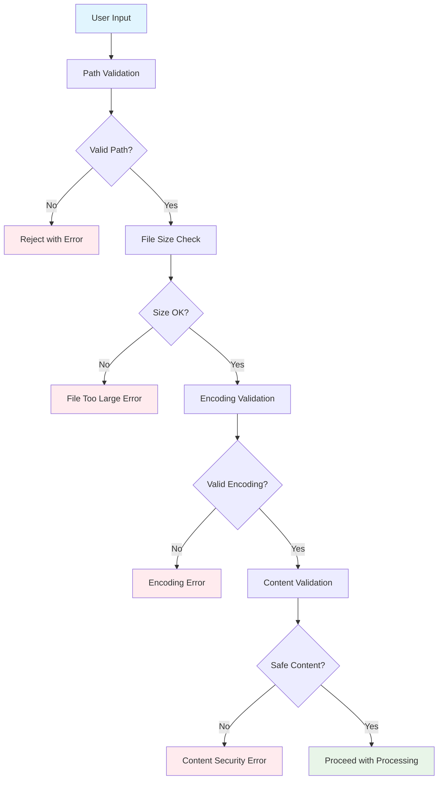

### Error Boundary Architecture

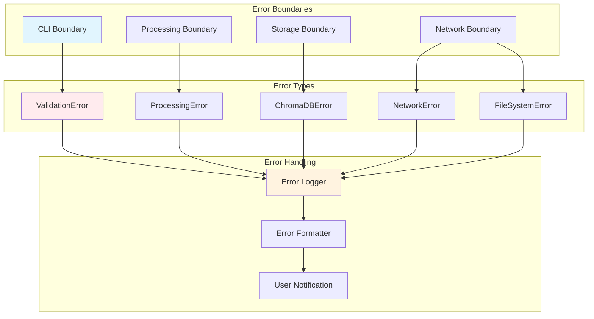

This architecture documentation provides a comprehensive view of the Shard Markdown system's design, showing how components interact, data flows through the system, and key architectural patterns are implemented. The modular design ensures maintainability, testability, and extensibility while providing robust error handling and performance optimization.