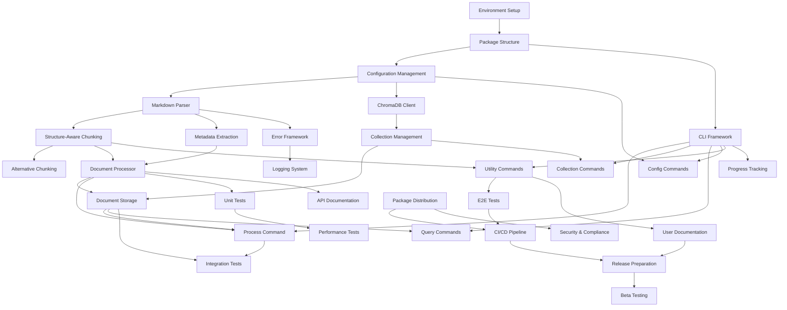

# Dependency Map for Shard-Markdown CLI Development

## Overview

This document maps the dependencies between tasks and establishes the optimal development sequence for the shard-markdown CLI project. The dependency relationships ensure that prerequisite components are completed before dependent tasks begin.

## Dependency Visualization



## Critical Path Analysis

### Primary Critical Path
The critical path that determines the minimum project duration:

1. **SETUP-001** → **SETUP-002** → **SETUP-003** (Project Foundation)
2. **CORE-001** → **CORE-002** → **CORE-005** (Core Processing)
3. **CHROMA-001** → **CHROMA-002** → **CHROMA-003** (Database Integration)
4. **CLI-001** → **CLI-002** (Primary CLI Interface)
5. **TEST-001** → **TEST-002** → **TEST-003** (Testing Suite)
6. **DOC-002** → **DEPLOY-002** → **DEPLOY-003** (Release Preparation)

**Critical Path Duration**: ~145 hours (~4 weeks)

### Secondary Critical Paths

#### Error Handling Path
- **CORE-001** → **ERROR-001** → **ERROR-002**
- Can be developed in parallel with ChromaDB integration
- Duration: ~20 hours

#### Documentation Path
- **CORE-005** → **DOC-001** (API docs)
- **CLI-006** → **DOC-002** (User docs)
- Can be developed in parallel with testing
- Duration: ~20 hours

## Parallel Development Opportunities

### Phase 1-2 Parallelization
```
Timeline Week 1:
├── Developer 1: SETUP-001 → SETUP-002 → SETUP-003
└── Developer 2: Can start on documentation planning and test strategy
```

### Phase 2-3 Parallelization
```
Timeline Week 2:
├── Developer 1: CORE-001 → CORE-004 (Parsing & Metadata)
└── Developer 2: CHROMA-001 → CHROMA-002 (Database foundation)
```

### Phase 4 Parallelization
```
Timeline Week 3:
├── Developer 1: CLI-002 (Process Command) - Critical Path
├── Developer 2: CLI-003, CLI-004, CLI-005 (Other commands)
└── Developer 3: ERROR-001 → ERROR-002 (Error handling)
```

### Phase 6 Parallelization
```
Timeline Week 4:
├── Developer 1: TEST-001 (Unit tests)
├── Developer 2: TEST-002 (Integration tests)
└── Developer 3: DOC-001 (API documentation)
```

## Dependency Details by Phase

### Phase 1: Project Setup Dependencies

| Task | Direct Dependencies | Reason |
|------|-------------------|---------|
| SETUP-001 | None | Foundation task |
| SETUP-002 | SETUP-001 | Needs development environment |
| SETUP-003 | SETUP-002 | Needs package structure |

### Phase 2: Core Components Dependencies

| Task | Direct Dependencies | Reason |
|------|-------------------|---------|
| CORE-001 | SETUP-003 | Needs configuration system |
| CORE-002 | CORE-001 | Needs parsed markdown AST |
| CORE-003 | CORE-002 | Needs base chunking interface |
| CORE-004 | CORE-001 | Needs markdown parsing capability |
| CORE-005 | CORE-002, CORE-004 | Orchestrates parsing, chunking, metadata |

### Phase 3: ChromaDB Integration Dependencies

| Task | Direct Dependencies | Reason |
|------|-------------------|---------|
| CHROMA-001 | SETUP-003 | Needs configuration models |
| CHROMA-002 | CHROMA-001 | Needs database client |
| CHROMA-003 | CHROMA-002, CORE-005 | Needs collections and processed documents |

### Phase 4: CLI Interface Dependencies

| Task | Direct Dependencies | Reason |
|------|-------------------|---------|
| CLI-001 | SETUP-002 | Needs package entry point |
| CLI-002 | CLI-001, CORE-005, CHROMA-003 | Main processing workflow |
| CLI-003 | CLI-001, CHROMA-002 | Collection management operations |
| CLI-004 | CLI-001, CHROMA-003 | Query and search operations |
| CLI-005 | CLI-001, SETUP-003 | Configuration management |
| CLI-006 | CLI-001, CORE-002 | Preview and validation utilities |

### Phase 5: Error Handling Dependencies

| Task | Direct Dependencies | Reason |
|------|-------------------|---------|
| ERROR-001 | CORE-001 | Needs core exception scenarios |
| ERROR-002 | ERROR-001 | Needs error classification system |
| ERROR-003 | CLI-001 | Needs CLI framework for progress display |

### Phase 6: Testing Dependencies

| Task | Direct Dependencies | Reason |
|------|-------------------|---------|
| TEST-001 | All CORE tasks | Tests core functionality |
| TEST-002 | CHROMA-003, CLI-002 | Tests integrated components |
| TEST-003 | All CLI tasks | Tests complete user workflows |
| TEST-004 | TEST-001 | Builds on unit test infrastructure |

### Phase 7: Documentation Dependencies

| Task | Direct Dependencies | Reason |
|------|-------------------|---------|
| DOC-001 | All CORE tasks | Documents API interfaces |
| DOC-002 | All CLI tasks | Documents user-facing features |

### Phase 8: Deployment Dependencies

| Task | Direct Dependencies | Reason |
|------|-------------------|---------|
| PKG-001 | All implementation tasks | Packages complete system |
| PKG-002 | PKG-001 | Security analysis needs package |
| DEPLOY-001 | TEST-003, PKG-001 | CI/CD needs tests and packaging |
| DEPLOY-002 | DEPLOY-001, DOC-002 | Release needs CI/CD and docs |
| DEPLOY-003 | DEPLOY-002 | Beta testing needs release artifacts |

## Resource Allocation Recommendations

### Single Developer Sequence
For a single developer, follow the critical path strictly:
1. Complete Phase 1 entirely before Phase 2
2. Complete CORE-001, CORE-002, CORE-004, CORE-005 before Phase 3
3. Complete CHROMA tasks before CLI-002
4. Develop other CLI commands after CLI-002
5. Implement testing after core functionality is stable

### Two Developer Team
**Developer 1 (Critical Path):**
- Week 1: SETUP-001 → SETUP-002 → SETUP-003
- Week 2: CORE-001 → CORE-002 → CORE-005
- Week 3: CHROMA-001 → CHROMA-002 → CHROMA-003
- Week 4: CLI-001 → CLI-002

**Developer 2 (Supporting Tasks):**
- Week 1: Documentation planning, test strategy
- Week 2: CORE-004 (Metadata) in parallel
- Week 3: ERROR-001 → ERROR-002 in parallel
- Week 4: CLI-003, CLI-004, CLI-005, CLI-006

### Three+ Developer Team
Add additional developers for:
- **Developer 3**: Focus on testing (TEST-001 → TEST-004)
- **Developer 4**: Focus on documentation (DOC-001, DOC-002)
- **Developer 5**: Focus on deployment and DevOps (PKG-001, DEPLOY tasks)

## Risk Mitigation Through Dependencies

### ChromaDB Integration Risk
**Risk**: ChromaDB API changes or connection issues
**Mitigation**:
- Start CHROMA-001 early to identify issues
- Implement mock ChromaDB client for testing
- Design abstraction layer for database operations

### Performance Risk
**Risk**: Chunking algorithms may be too slow for large documents
**Mitigation**:
- Implement TEST-004 (performance tests) immediately after CORE-002
- Profile memory usage during CORE-005 development
- Parallel implementation of CORE-003 for algorithm alternatives

### CLI Usability Risk
**Risk**: CLI interface may not meet user expectations
**Mitigation**:
- Implement CLI-006 (preview/validate) early for user feedback
- Prioritize ERROR-003 (progress tracking) for better UX
- Start DEPLOY-003 (beta testing) as soon as CLI is functional

## Bottleneck Analysis

### Identified Bottlenecks

1. **CORE-005 (Document Processor)**: Critical for both CLI and ChromaDB integration
   - **Impact**: Delays CLI-002, CHROMA-003, TEST-002
   - **Mitigation**: Assign most experienced developer, implement in smaller increments

2. **CLI-002 (Process Command)**: Main user-facing functionality
   - **Impact**: Delays TEST-003, DOC-002, DEPLOY-002
   - **Mitigation**: Start with minimal viable implementation, iterate based on feedback

3. **TEST-002 (Integration Tests)**: Required for confident deployment
   - **Impact**: Delays DEPLOY-001, potentially DEPLOY-002
   - **Mitigation**: Develop in parallel with core features, use mocking where appropriate

### Bottleneck Resolution Strategies

1. **Incremental Development**: Break large tasks into smaller, testable increments
2. **Early Integration**: Test component integration as soon as basic functionality exists
3. **Parallel Implementation**: Use mocking and stubs to enable parallel development
4. **Risk-First Development**: Implement highest-risk components first to identify issues early

## Validation Gates

### Phase Completion Gates

**Phase 1 Gate**:
- ✅ Package can be installed and imported
- ✅ Basic CLI entry point works (`shard-md --version`)
- ✅ Configuration loads from file and environment

**Phase 2 Gate**:
- ✅ Markdown parsing works for sample documents
- ✅ Chunking produces reasonable output
- ✅ Metadata extraction captures all required fields

**Phase 3 Gate**:
- ✅ ChromaDB connection established
- ✅ Collections can be created and managed
- ✅ Documents can be stored and retrieved

**Phase 4 Gate**:
- ✅ Process command works end-to-end
- ✅ All CLI commands have basic functionality
- ✅ Help system is complete

**Phase 6 Gate**:
- ✅ >90% test coverage achieved
- ✅ Integration tests pass with real ChromaDB
- ✅ Performance benchmarks meet requirements

**Phase 8 Gate**:
- ✅ Package builds and installs correctly
- ✅ Documentation is complete and accurate
- ✅ Beta testing feedback incorporated
