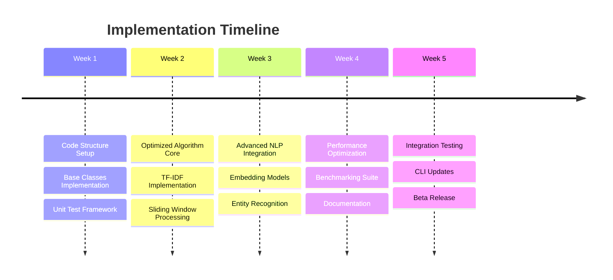

# Semantic Chunking Implementation Guide

## Quick Start

This guide provides practical implementation steps for integrating the optimized and advanced semantic chunking algorithms into the shard-markdown codebase.

## Implementation Roadmap



## Step-by-Step Implementation

### Step 1: Project Structure Setup

```bash
# Create new directories for chunking algorithms
mkdir -p src/shard_markdown/core/chunking
mkdir -p tests/benchmarks
mkdir -p tests/fixtures/chunking

# Create implementation files
touch src/shard_markdown/core/chunking/__init__.py
touch src/shard_markdown/core/chunking/base.py
touch src/shard_markdown/core/chunking/semantic_optimized.py
touch src/shard_markdown/core/chunking/semantic_advanced.py
touch src/shard_markdown/core/chunking/utils.py
```

### Step 2: Base Classes and Interfaces

#### `src/shard_markdown/core/chunking/base.py`

```python
"""Base classes for semantic chunking algorithms."""

from abc import ABC, abstractmethod
from dataclasses import dataclass, field
from typing import List, Dict, Any, Optional
from enum import Enum

class ChunkingAlgorithm(Enum):
    """Available chunking algorithms."""
    SEMANTIC_LEGACY = "semantic_legacy"
    SEMANTIC_OPTIMIZED = "semantic_optimized"
    SEMANTIC_ADVANCED = "semantic_advanced"

@dataclass
class Chunk:
    """Represents a document chunk."""
    content: str
    metadata: Dict[str, Any] = field(default_factory=dict)
    start_pos: int = 0
    end_pos: int = 0
    
    def __len__(self) -> int:
        return len(self.content)
    
    def __str__(self) -> str:
        return f"Chunk({len(self.content)} chars)"
    
    def to_dict(self) -> Dict[str, Any]:
        """Convert to dictionary for serialization."""
        return {
            'content': self.content,
            'metadata': self.metadata,
            'start_pos': self.start_pos,
            'end_pos': self.end_pos,
            'size': len(self.content)
        }

@dataclass
class ChunkConfig:
    """Configuration for chunking algorithms."""
    algorithm: ChunkingAlgorithm = ChunkingAlgorithm.SEMANTIC_OPTIMIZED
    max_chunk_size: int = 1000
    min_chunk_size: int = 100
    overlap: int = 0
    
    # Algorithm-specific settings
    semantic_config: Dict[str, Any] = field(default_factory=dict)
    
    @classmethod
    def from_dict(cls, config_dict: Dict[str, Any]) -> 'ChunkConfig':
        """Create config from dictionary."""
        algorithm = ChunkingAlgorithm(config_dict.get('algorithm', 'semantic_optimized'))
        return cls(
            algorithm=algorithm,
            max_chunk_size=config_dict.get('max_chunk_size', 1000),
            min_chunk_size=config_dict.get('min_chunk_size', 100),
            overlap=config_dict.get('overlap', 0),
            semantic_config=config_dict.get(algorithm.value, {})
        )

class BaseChunker(ABC):
    """Abstract base class for chunking algorithms."""
    
    def __init__(self, config: Optional[ChunkConfig] = None):
        self.config = config or ChunkConfig()
    
    @abstractmethod
    def chunk(self, content: str) -> List[Chunk]:
        """
        Chunk the given content.
        
        Args:
            content: Text content to chunk
            
        Returns:
            List of chunks
        """
        pass
    
    def validate_chunks(self, chunks: List[Chunk]) -> bool:
        """Validate chunk constraints."""
        for chunk in chunks:
            if len(chunk) < self.config.min_chunk_size:
                return False
            if len(chunk) > self.config.max_chunk_size:
                return False
        return True
    
    def post_process(self, chunks: List[Chunk]) -> List[Chunk]:
        """Post-process chunks for final adjustments."""
        # Remove empty chunks
        chunks = [c for c in chunks if c.content.strip()]
        
        # Add overlap if configured
        if self.config.overlap > 0:
            chunks = self._add_overlap(chunks)
        
        return chunks
    
    def _add_overlap(self, chunks: List[Chunk]) -> List[Chunk]:
        """Add overlap between consecutive chunks."""
        if len(chunks) <= 1:
            return chunks
        
        overlapped = []
        for i, chunk in enumerate(chunks):
            if i < len(chunks) - 1:
                # Add beginning of next chunk to current
                next_content = chunks[i + 1].content[:self.config.overlap]
                chunk.content += f"\n... {next_content}"
            
            if i > 0:
                # Add end of previous chunk to current
                prev_content = chunks[i - 1].content[-self.config.overlap:]
                chunk.content = f"{prev_content} ...\n{chunk.content}"
            
            overlapped.append(chunk)
        
        return overlapped
```

### Step 3: Optimized Implementation

#### `src/shard_markdown/core/chunking/semantic_optimized.py`

```python
"""Optimized O(n) semantic chunking implementation."""

import re
from typing import List, Dict, Set, Optional, Pattern
from dataclasses import dataclass, field
from collections import defaultdict
import math
import numpy as np

from .base import BaseChunker, Chunk, ChunkConfig

# Pre-compiled regex patterns
PATTERNS = {
    'header': re.compile(r'^#{1,6}\s+'),
    'list': re.compile(r'^[\*\-\+]\s+'),
    'code': re.compile(r'^```'),
    'quote': re.compile(r'^>'),
    'table': re.compile(r'^\|'),
    'horizontal_rule': re.compile(r'^---+$|^___+$|^\*\*\*+$')
}

@dataclass
class SemanticUnit:
    """Optimized semantic unit with caching."""
    content: str
    unit_type: str
    level: int = 0
    metadata: Dict = field(default_factory=dict)
    
    # Cached properties
    _word_set: Optional[Set[str]] = field(default=None, init=False)
    _word_freq: Optional[Dict[str, int]] = field(default=None, init=False)
    
    @property
    def word_set(self) -> Set[str]:
        if self._word_set is None:
            words = re.findall(r'\w+', self.content.lower())
            self._word_set = set(words)
        return self._word_set
    
    @property
    def word_freq(self) -> Dict[str, int]:
        if self._word_freq is None:
            self._word_freq = defaultdict(int)
            words = re.findall(r'\w+', self.content.lower())
            for word in words:
                self._word_freq[word] += 1
        return dict(self._word_freq)

class TFIDFCalculator:
    """TF-IDF calculation for semantic similarity."""
    
    def __init__(self):
        self.doc_freq: Dict[str, int] = defaultdict(int)
        self.total_docs: int = 0
        self.idf_cache: Dict[str, float] = {}
    
    def build_corpus(self, units: List[SemanticUnit]) -> None:
        """Build IDF corpus from units."""
        self.total_docs = len(units)
        
        for unit in units:
            for word in unit.word_set:
                self.doc_freq[word] += 1
        
        # Pre-calculate IDF
        for word, freq in self.doc_freq.items():
            self.idf_cache[word] = math.log(self.total_docs / freq)
    
    def similarity(self, unit1: SemanticUnit, unit2: SemanticUnit) -> float:
        """Calculate TF-IDF cosine similarity."""
        # Get TF-IDF vectors
        vec1 = self._get_tfidf_vector(unit1)
        vec2 = self._get_tfidf_vector(unit2)
        
        # Calculate cosine similarity
        common_words = set(vec1.keys()) & set(vec2.keys())
        if not common_words:
            return 0.0
        
        dot_product = sum(vec1[w] * vec2[w] for w in common_words)
        mag1 = math.sqrt(sum(v**2 for v in vec1.values()))
        mag2 = math.sqrt(sum(v**2 for v in vec2.values()))
        
        if mag1 == 0 or mag2 == 0:
            return 0.0
        
        return dot_product / (mag1 * mag2)
    
    def _get_tfidf_vector(self, unit: SemanticUnit) -> Dict[str, float]:
        """Get TF-IDF vector for a unit."""
        vector = {}
        total_words = sum(unit.word_freq.values())
        
        for word, freq in unit.word_freq.items():
            tf = freq / total_words if total_words > 0 else 0
            idf = self.idf_cache.get(word, 0)
            vector[word] = tf * idf
        
        return vector

class OptimizedSemanticChunker(BaseChunker):
    """O(n) optimized semantic chunking."""
    
    def __init__(self, config: Optional[ChunkConfig] = None):
        super().__init__(config)
        self.tfidf = TFIDFCalculator()
        
        # Extract semantic config
        self.window_size = self.config.semantic_config.get('window_size', 5)
        self.similarity_threshold = self.config.semantic_config.get('similarity_threshold', 0.3)
    
    def chunk(self, content: str) -> List[Chunk]:
        """Chunk document with O(n) complexity."""
        # Parse into semantic units
        units = self._parse_units(content)
        
        if not units:
            return []
        
        # Build TF-IDF corpus
        self.tfidf.build_corpus(units)
        
        # Process with sliding window
        merge_groups = self._sliding_window_merge(units)
        
        # Create chunks from groups
        chunks = self._create_chunks(merge_groups)
        
        # Post-process
        return self.post_process(chunks)
    
    def _parse_units(self, content: str) -> List[SemanticUnit]:
        """Parse content into semantic units."""
        units = []
        lines = content.split('\n')
        current_unit = []
        current_type = 'paragraph'
        current_level = 0
        in_code_block = False
        
        for line in lines:
            # Handle code blocks specially
            if PATTERNS['code'].match(line):
                if current_unit:
                    units.append(SemanticUnit(
                        '\n'.join(current_unit),
                        current_type,
                        current_level
                    ))
                    current_unit = []
                in_code_block = not in_code_block
                current_type = 'code' if in_code_block else 'paragraph'
                current_unit.append(line)
                continue
            
            if in_code_block:
                current_unit.append(line)
                continue
            
            # Detect unit type
            unit_type, level = self._detect_type(line)
            
            # Check if we should start new unit
            if unit_type != current_type or level != current_level:
                if current_unit:
                    units.append(SemanticUnit(
                        '\n'.join(current_unit),
                        current_type,
                        current_level
                    ))
                    current_unit = []
                current_type = unit_type
                current_level = level
            
            current_unit.append(line)
        
        # Add final unit
        if current_unit:
            units.append(SemanticUnit(
                '\n'.join(current_unit),
                current_type,
                current_level
            ))
        
        return units
    
    def _detect_type(self, line: str) -> tuple[str, int]:
        """Detect line type and level."""
        if not line.strip():
            return 'blank', 0
        
        # Check patterns
        if match := PATTERNS['header'].match(line):
            level = len(match.group(0).strip())
            return 'header', level
        
        if PATTERNS['list'].match(line):
            indent = len(line) - len(line.lstrip())
            return 'list', indent // 2
        
        if PATTERNS['quote'].match(line):
            return 'quote', 0
        
        if PATTERNS['table'].match(line):
            return 'table', 0
        
        if PATTERNS['horizontal_rule'].match(line.strip()):
            return 'separator', 0
        
        return 'paragraph', 0
    
    def _sliding_window_merge(self, units: List[SemanticUnit]) -> List[List[SemanticUnit]]:
        """Merge units using sliding window."""
        if not units:
            return []
        
        groups = []
        current_group = [units[0]]
        
        for i in range(1, len(units)):
            unit = units[i]
            
            # Check if structural boundary
            if self._is_boundary(unit):
                if current_group:
                    groups.append(current_group)
                current_group = [unit]
                continue
            
            # Check similarity with recent units
            should_merge = self._should_merge(unit, current_group[-self.window_size:])
            
            if should_merge:
                current_group.append(unit)
            else:
                if current_group:
                    groups.append(current_group)
                current_group = [unit]
        
        # Add final group
        if current_group:
            groups.append(current_group)
        
        return groups
    
    def _is_boundary(self, unit: SemanticUnit) -> bool:
        """Check if unit is a natural boundary."""
        # Headers are boundaries
        if unit.unit_type == 'header' and unit.level <= 2:
            return True
        
        # Separators are boundaries
        if unit.unit_type == 'separator':
            return True
        
        # Code blocks are boundaries
        if unit.unit_type == 'code':
            return True
        
        return False
    
    def _should_merge(self, unit: SemanticUnit, recent_units: List[SemanticUnit]) -> bool:
        """Determine if unit should merge with recent units."""
        if not recent_units:
            return False
        
        # Calculate average similarity
        similarities = [
            self.tfidf.similarity(unit, other)
            for other in recent_units
        ]
        
        avg_similarity = sum(similarities) / len(similarities)
        
        # Check for continuity markers
        continuity_words = {'however', 'therefore', 'furthermore', 'moreover', 'additionally'}
        first_word = unit.content.split()[0].lower() if unit.content else ""
        has_continuity = first_word in continuity_words
        
        # Adjust threshold
        threshold = self.similarity_threshold
        if has_continuity:
            threshold *= 0.7  # Lower threshold for continuity
        
        return avg_similarity >= threshold
    
    def _create_chunks(self, groups: List[List[SemanticUnit]]) -> List[Chunk]:
        """Create chunks from unit groups."""
        chunks = []
        
        for group in groups:
            content = '\n\n'.join(unit.content for unit in group)
            
            # Check size constraints
            if len(content) <= self.config.max_chunk_size:
                chunks.append(Chunk(
                    content=content,
                    metadata={
                        'units': len(group),
                        'types': list(set(u.unit_type for u in group)),
                        'algorithm': 'semantic_optimized'
                    }
                ))
            else:
                # Split oversized chunks
                sub_chunks = self._split_oversized(group)
                chunks.extend(sub_chunks)
        
        return chunks
    
    def _split_oversized(self, units: List[SemanticUnit]) -> List[Chunk]:
        """Split oversized unit groups."""
        chunks = []
        current = []
        current_size = 0
        
        for unit in units:
            unit_size = len(unit.content)
            
            if current_size + unit_size > self.config.max_chunk_size:
                if current:
                    content = '\n\n'.join(u.content for u in current)
                    chunks.append(Chunk(
                        content=content,
                        metadata={'split': True, 'algorithm': 'semantic_optimized'}
                    ))
                current = [unit]
                current_size = unit_size
            else:
                current.append(unit)
                current_size += unit_size
        
        # Add final chunk
        if current:
            content = '\n\n'.join(u.content for u in current)
            chunks.append(Chunk(
                content=content,
                metadata={'split': True, 'algorithm': 'semantic_optimized'}
            ))
        
        return chunks
```

### Step 4: Integration with Existing Code

#### Update `src/shard_markdown/core/chunker.py`

```python
"""Main chunker module with algorithm selection."""

from typing import List, Optional
from .chunking.base import ChunkConfig, ChunkingAlgorithm, Chunk
from .chunking.semantic_optimized import OptimizedSemanticChunker
# from .chunking.semantic_advanced import AdvancedSemanticChunker  # When ready

class ChunkerFactory:
    """Factory for creating chunker instances."""
    
    @staticmethod
    def create_chunker(config: ChunkConfig):
        """Create chunker based on configuration."""
        if config.algorithm == ChunkingAlgorithm.SEMANTIC_OPTIMIZED:
            return OptimizedSemanticChunker(config)
        elif config.algorithm == ChunkingAlgorithm.SEMANTIC_ADVANCED:
            # return AdvancedSemanticChunker(config)
            raise NotImplementedError("Advanced chunker not yet implemented")
        elif config.algorithm == ChunkingAlgorithm.SEMANTIC_LEGACY:
            from .legacy_chunker import LegacySemanticChunker
            return LegacySemanticChunker(config)
        else:
            raise ValueError(f"Unknown algorithm: {config.algorithm}")

def chunk_document(content: str, config: Optional[ChunkConfig] = None) -> List[Chunk]:
    """
    Main entry point for document chunking.
    
    Args:
        content: Document content to chunk
        config: Optional configuration
        
    Returns:
        List of chunks
    """
    config = config or ChunkConfig()
    chunker = ChunkerFactory.create_chunker(config)
    return chunker.chunk(content)
```

### Step 5: CLI Integration

#### Update `src/shard_markdown/cli/main.py`

```python
"""Updated CLI with algorithm selection."""

import click
from pathlib import Path
from ..core.chunker import chunk_document
from ..core.chunking.base import ChunkConfig, ChunkingAlgorithm

@click.command()
@click.argument('input_file', type=click.Path(exists=True))
@click.option('--algorithm', 
              type=click.Choice(['semantic_legacy', 'semantic_optimized', 'semantic_advanced']),
              default='semantic_optimized',
              help='Chunking algorithm to use')
@click.option('--chunk-size', default=1000, help='Maximum chunk size')
@click.option('--min-chunk-size', default=100, help='Minimum chunk size')
@click.option('--window-size', default=5, help='Sliding window size (optimized only)')
@click.option('--similarity-threshold', default=0.3, help='Similarity threshold (optimized only)')
@click.option('--output', '-o', type=click.Path(), help='Output file')
@click.option('--store', is_flag=True, help='Store in ChromaDB')
@click.option('--collection', default='default', help='ChromaDB collection name')
@click.option('--benchmark', is_flag=True, help='Run benchmark comparison')
def main(input_file, algorithm, chunk_size, min_chunk_size, 
         window_size, similarity_threshold, output, store, 
         collection, benchmark):
    """Shard markdown documents with semantic chunking."""
    
    # Load content
    content = Path(input_file).read_text()
    
    # Create configuration
    config = ChunkConfig(
        algorithm=ChunkingAlgorithm(algorithm),
        max_chunk_size=chunk_size,
        min_chunk_size=min_chunk_size,
        semantic_config={
            'window_size': window_size,
            'similarity_threshold': similarity_threshold
        }
    )
    
    if benchmark:
        # Run benchmark comparison
        run_benchmark_comparison(content, config)
    else:
        # Normal chunking
        chunks = chunk_document(content, config)
        
        # Output results
        if output:
            save_chunks(chunks, output)
        else:
            display_chunks(chunks)
        
        # Store if requested
        if store:
            store_in_chromadb(chunks, collection)

def run_benchmark_comparison(content: str, config: ChunkConfig):
    """Compare different algorithms."""
    import time
    
    algorithms = [
        ChunkingAlgorithm.SEMANTIC_LEGACY,
        ChunkingAlgorithm.SEMANTIC_OPTIMIZED,
        # ChunkingAlgorithm.SEMANTIC_ADVANCED
    ]
    
    results = []
    
    for algo in algorithms:
        config.algorithm = algo
        
        try:
            start = time.perf_counter()
            chunks = chunk_document(content, config)
            elapsed = time.perf_counter() - start
            
            results.append({
                'algorithm': algo.value,
                'time': elapsed,
                'chunks': len(chunks),
                'avg_size': sum(len(c.content) for c in chunks) / len(chunks)
            })
        except NotImplementedError:
            continue
    
    # Display results
    click.echo("\nBenchmark Results:")
    click.echo("-" * 60)
    for result in results:
        click.echo(f"Algorithm: {result['algorithm']}")
        click.echo(f"  Time: {result['time']:.3f}s")
        click.echo(f"  Chunks: {result['chunks']}")
        click.echo(f"  Avg Size: {result['avg_size']:.0f} chars")
        click.echo()

def display_chunks(chunks):
    """Display chunks to console."""
    for i, chunk in enumerate(chunks, 1):
        click.echo(f"{'='*60}")
        click.echo(f"Chunk {i} ({len(chunk.content)} chars)")
        click.echo(f"{'='*60}")
        click.echo(chunk.content[:200] + "..." if len(chunk.content) > 200 else chunk.content)
        click.echo()

def save_chunks(chunks, output_path):
    """Save chunks to file."""
    import json
    
    output_data = {
        'chunks': [chunk.to_dict() for chunk in chunks],
        'total': len(chunks)
    }
    
    with open(output_path, 'w') as f:
        json.dump(output_data, f, indent=2)
    
    click.echo(f"Saved {len(chunks)} chunks to {output_path}")

def store_in_chromadb(chunks, collection_name):
    """Store chunks in ChromaDB."""
    from ..storage.vectordb import ChromaDBStorage
    
    storage = ChromaDBStorage()
    storage.store_chunks(chunks, collection_name)
    click.echo(f"Stored {len(chunks)} chunks in collection '{collection_name}'")

if __name__ == '__main__':
    main()
```

### Step 6: Testing Implementation

#### `tests/test_semantic_optimized.py`

```python
"""Tests for optimized semantic chunking."""

import pytest
from shard_markdown.core.chunking.semantic_optimized import (
    OptimizedSemanticChunker, SemanticUnit, TFIDFCalculator
)
from shard_markdown.core.chunking.base import ChunkConfig

class TestOptimizedChunker:
    
    @pytest.fixture
    def chunker(self):
        config = ChunkConfig(
            max_chunk_size=500,
            min_chunk_size=50,
            semantic_config={
                'window_size': 3,
                'similarity_threshold': 0.3
            }
        )
        return OptimizedSemanticChunker(config)
    
    def test_basic_chunking(self, chunker):
        """Test basic chunking functionality."""
        content = """
# Header 1
This is paragraph 1 with some content.

## Header 2
This is paragraph 2 with related content.

This is paragraph 3 continuing the topic.
        """.strip()
        
        chunks = chunker.chunk(content)
        
        assert len(chunks) > 0
        assert all(50 <= len(c.content) <= 500 for c in chunks)
    
    def test_code_block_handling(self, chunker):
        """Test code block boundaries."""
        content = """
# Documentation

Here's some text.

```python
def hello():
    print("Hello, world!")
```

More text after code.
        """.strip()
        
        chunks = chunker.chunk(content)
        
        # Code blocks should be separate chunks
        code_chunks = [c for c in chunks if 'code' in c.metadata.get('types', [])]
        assert len(code_chunks) > 0
    
    def test_tfidf_similarity(self):
        """Test TF-IDF similarity calculation."""
        calc = TFIDFCalculator()
        
        unit1 = SemanticUnit("The quick brown fox", "paragraph")
        unit2 = SemanticUnit("The lazy brown dog", "paragraph")
        unit3 = SemanticUnit("Python programming language", "paragraph")
        
        calc.build_corpus([unit1, unit2, unit3])
        
        # Similar content should have higher similarity
        sim_12 = calc.similarity(unit1, unit2)
        sim_13 = calc.similarity(unit1, unit3)
        
        assert sim_12 > sim_13  # unit1 and unit2 share more words
        assert 0 <= sim_12 <= 1
        assert 0 <= sim_13 <= 1
    
    def test_performance_scaling(self, chunker, benchmark):
        """Test O(n) performance scaling."""
        # Generate documents of increasing size
        sizes = [1000, 2000, 4000]
        times = []
        
        for size in sizes:
            content = "This is a test sentence. " * (size // 25)
            result = benchmark(chunker.chunk, content)
            times.append(benchmark.stats['mean'])
        
        # Check scaling is approximately linear
        # Time should roughly double when size doubles
        scaling_factor = times[2] / times[0]  # 4x size
        assert scaling_factor < 5  # Should be ~4 for O(n)
    
    def test_sliding_window(self, chunker):
        """Test sliding window merging."""
        units = [
            SemanticUnit(f"Content about topic {i % 3}", "paragraph")
            for i in range(10)
        ]
        
        chunker.tfidf.build_corpus(units)
        groups = chunker._sliding_window_merge(units)
        
        # Units with similar topics should group together
        assert len(groups) < len(units)  # Some merging should occur
        assert sum(len(g) for g in groups) == len(units)  # All units accounted for

class TestSemanticUnit:
    
    def test_word_set_caching(self):
        """Test that word set is cached."""
        unit = SemanticUnit("The quick brown fox", "paragraph")
        
        # First access
        set1 = unit.word_set
        # Second access should return same object
        set2 = unit.word_set
        
        assert set1 is set2  # Same object reference
        assert 'quick' in set1
        assert 'brown' in set1
    
    def test_word_frequency(self):
        """Test word frequency calculation."""
        unit = SemanticUnit("the cat and the dog and the bird", "paragraph")
        
        freq = unit.word_freq
        
        assert freq['the'] == 3
        assert freq['and'] == 2
        assert freq['cat'] == 1
```

### Step 7: Benchmark Suite

#### `tests/benchmarks/test_performance.py`

```python
"""Performance benchmarks for chunking algorithms."""

import time
import pytest
import numpy as np
from pathlib import Path
from shard_markdown.core.chunker import chunk_document
from shard_markdown.core.chunking.base import ChunkConfig, ChunkingAlgorithm

def generate_test_document(size_bytes: int) -> str:
    """Generate test document of specified size."""
    sections = []
    current_size = 0
    section_num = 1
    
    while current_size < size_bytes:
        section = f"""
# Section {section_num}

This is paragraph {section_num}.1 with some content about topic A.
It continues with more information about the subject.

## Subsection {section_num}.1

Here we discuss topic B which is related to topic A.
The discussion continues with examples and explanations.

- Point 1 about the topic
- Point 2 with more details
- Point 3 concluding the list

## Subsection {section_num}.2

```python
def function_{section_num}():
    return "Example code block"
```

Final paragraph of section {section_num} wrapping up the discussion.

""".strip()
        
        sections.append(section)
        current_size += len(section)
        section_num += 1
    
    return '\n\n'.join(sections)[:size_bytes]

class BenchmarkSuite:
    """Comprehensive benchmark suite."""
    
    def __init__(self):
        self.results = []
    
    def run_scaling_test(self):
        """Test algorithm scaling with document size."""
        sizes = [10_000, 50_000, 100_000, 500_000]
        algorithms = [
            ChunkingAlgorithm.SEMANTIC_LEGACY,
            ChunkingAlgorithm.SEMANTIC_OPTIMIZED
        ]
        
        results = {}
        
        for algo in algorithms:
            algo_times = []
            
            for size in sizes:
                doc = generate_test_document(size)
                config = ChunkConfig(algorithm=algo)
                
                start = time.perf_counter()
                chunks = chunk_document(doc, config)
                elapsed = time.perf_counter() - start
                
                algo_times.append(elapsed)
            
            results[algo.value] = algo_times
        
        # Calculate scaling factors
        for algo, times in results.items():
            scaling_factors = []
            for i in range(1, len(times)):
                time_ratio = times[i] / times[i-1]
                size_ratio = sizes[i] / sizes[i-1]
                scaling_factors.append(time_ratio / size_ratio)
            
            avg_scaling = np.mean(scaling_factors)
            print(f"{algo}: avg scaling factor = {avg_scaling:.2f}")
            
            # Determine complexity
            if avg_scaling < 1.2:
                complexity = "O(n)"
            elif avg_scaling < 1.8:
                complexity = "O(n log n)"
            else:
                complexity = "O(n²) or worse"
            
            print(f"  Estimated complexity: {complexity}")
        
        return results
    
    def run_memory_test(self):
        """Test memory usage of algorithms."""
        import tracemalloc
        
        doc_size = 100_000
        doc = generate_test_document(doc_size)
        
        algorithms = [
            ChunkingAlgorithm.SEMANTIC_LEGACY,
            ChunkingAlgorithm.SEMANTIC_OPTIMIZED
        ]
        
        memory_usage = {}
        
        for algo in algorithms:
            config = ChunkConfig(algorithm=algo)
            
            # Start memory tracking
            tracemalloc.start()
            
            # Run chunking
            chunks = chunk_document(doc, config)
            
            # Get peak memory
            current, peak = tracemalloc.get_traced_memory()
            tracemalloc.stop()
            
            memory_usage[algo.value] = {
                'current': current / 1024 / 1024,  # MB
                'peak': peak / 1024 / 1024  # MB
            }
        
        # Display results
        for algo, mem in memory_usage.items():
            print(f"{algo}:")
            print(f"  Current: {mem['current']:.2f} MB")
            print(f"  Peak: {mem['peak']:.2f} MB")
        
        return memory_usage
    
    def run_quality_test(self):
        """Test output quality of algorithms."""
        test_doc = Path('tests/fixtures/sample_document.md').read_text()
        
        algorithms = [
            ChunkingAlgorithm.SEMANTIC_LEGACY,
            ChunkingAlgorithm.SEMANTIC_OPTIMIZED
        ]
        
        quality_metrics = {}
        
        for algo in algorithms:
            config = ChunkConfig(algorithm=algo)
            chunks = chunk_document(test_doc, config)
            
            # Calculate metrics
            sizes = [len(c.content) for c in chunks]
            
            metrics = {
                'num_chunks': len(chunks),
                'avg_size': np.mean(sizes),
                'std_size': np.std(sizes),
                'min_size': min(sizes),
                'max_size': max(sizes),
                'size_variance': np.std(sizes) / np.mean(sizes)  # CV
            }
            
            quality_metrics[algo.value] = metrics
        
        # Display results
        for algo, metrics in quality_metrics.items():
            print(f"{algo}:")
            for key, value in metrics.items():
                print(f"  {key}: {value:.2f}")
        
        return quality_metrics

def test_benchmark_suite():
    """Run complete benchmark suite."""
    suite = BenchmarkSuite()
    
    print("\n" + "="*60)
    print("SCALING TEST")
    print("="*60)
    suite.run_scaling_test()
    
    print("\n" + "="*60)
    print("MEMORY TEST")
    print("="*60)
    suite.run_memory_test()
    
    print("\n" + "="*60)
    print("QUALITY TEST")
    print("="*60)
    suite.run_quality_test()

if __name__ == "__main__":
    test_benchmark_suite()
```

## Configuration Examples

### Development Configuration

```yaml
# .shard-md/config.yaml
chunking:
  algorithm: semantic_optimized
  max_chunk_size: 1000
  min_chunk_size: 100
  
  semantic_optimized:
    window_size: 5
    similarity_threshold: 0.3
    use_tfidf: true
    cache_embeddings: true
  
  semantic_advanced:
    embedding_model: "sentence-transformers/all-MiniLM-L6-v2"
    use_ner: true
    use_coreference: false
    batch_size: 32

storage:
  backend: chromadb
  host: localhost
  port: 8000

logging:
  level: INFO
  format: "%(asctime)s - %(name)s - %(levelname)s - %(message)s"
```

### Production Configuration

```yaml
# production.yaml
chunking:
  algorithm: semantic_optimized
  max_chunk_size: 1500
  min_chunk_size: 200
  overlap: 50
  
  semantic_optimized:
    window_size: 7
    similarity_threshold: 0.35
    use_tfidf: true
    cache_embeddings: true
    parallel_processing: true
    num_workers: 4
  
performance:
  enable_caching: true
  cache_size: 1000
  memory_limit: 2048  # MB
  
monitoring:
  enable_metrics: true
  metrics_port: 9090
```

## Deployment Checklist

### Pre-deployment

- [ ] All unit tests passing
- [ ] Benchmark tests show expected performance
- [ ] Documentation updated
- [ ] Migration guide created
- [ ] Configuration examples provided
- [ ] CLI help text updated

### Deployment

- [ ] Create feature branch
- [ ] Implement optimized algorithm
- [ ] Add comprehensive tests
- [ ] Run benchmarks
- [ ] Update documentation
- [ ] Create pull request
- [ ] Code review
- [ ] Merge to main

### Post-deployment

- [ ] Monitor performance metrics
- [ ] Gather user feedback
- [ ] Address any issues
- [ ] Plan next improvements
- [ ] Update roadmap

## Troubleshooting Guide

### Common Issues

1. **ImportError: No module named 'sentence_transformers'**
   ```bash
   pip install sentence-transformers
   ```

2. **High memory usage**
   - Reduce batch size
   - Enable streaming mode
   - Use smaller embedding model

3. **Slow processing**
   - Enable caching
   - Use GPU if available
   - Adjust window size

4. **Poor chunk quality**
   - Adjust similarity threshold
   - Tune window size
   - Check document structure

## Support and Resources

- **Documentation**: `/docs/proposals/`
- **Issue Tracking**: GitHub Issues
- **Benchmarks**: `/tests/benchmarks/`
- **Examples**: `/examples/chunking/`

---

**Version**: 1.0  
**Date**: 2025-08-24  
**Status**: Implementation Ready  
**Related**: [Issue #198](https://github.com/husams/shard-markdown/issues/198)