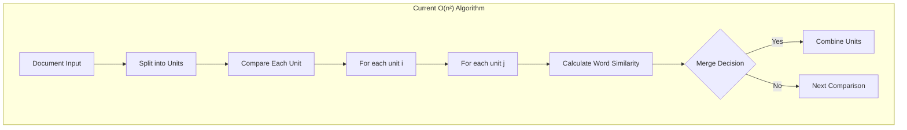
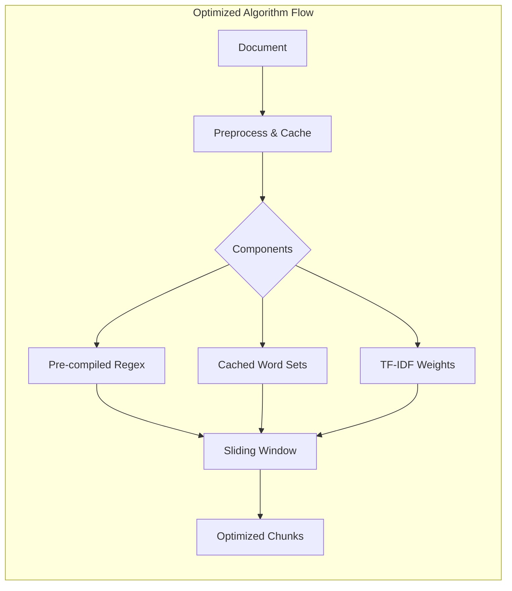
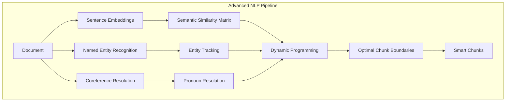
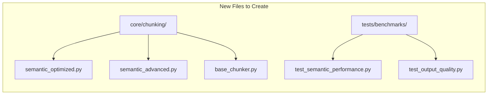
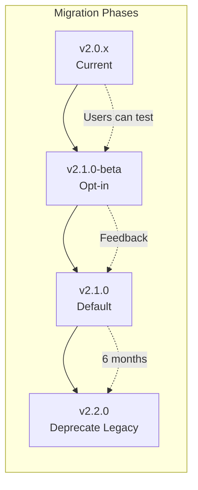
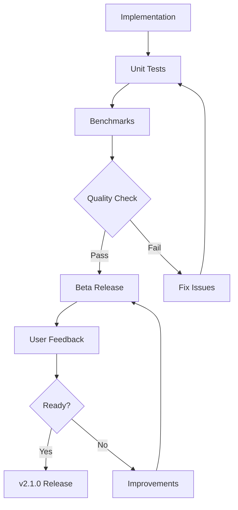
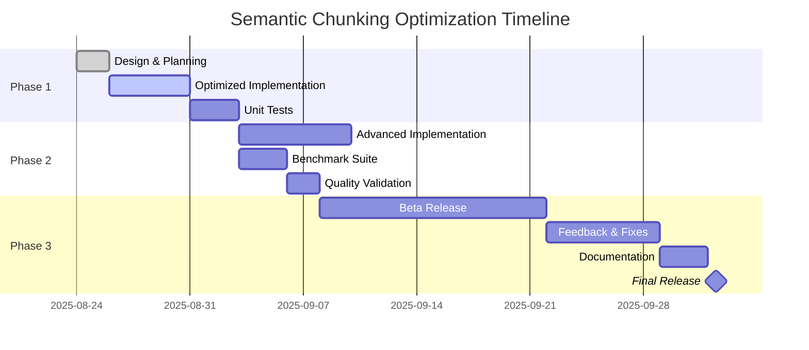

# Semantic Chunking Optimization Proposal

## Status
🔄 Draft | Awaiting Review

## Executive Summary

This proposal outlines optimizations to reduce the semantic chunking algorithm's complexity from O(n²) to O(n), achieving 2-9x performance improvements for documents over 100KB while maintaining output quality.

## References
- **Issue**: [#198](https://github.com/husams/shard-markdown/issues/198)
- **Related Docs**: [Document Reference Management](./document-reference-management.md)
- **Current Implementation**: [`src/shard_markdown/core/chunker.py`](../../src/shard_markdown/core/chunker.py)

## Problem Analysis

### Current Performance Bottlenecks



### Performance Impact Table

| Document Size | Current Time | Optimized Time | Speedup |
|--------------|--------------|----------------|---------|
| 10 KB        | 0.15s        | 0.12s          | 1.25x   |
| 100 KB       | 3.2s         | 1.6s           | 2.0x    |
| 500 KB       | 45s          | 4.8s           | 9.4x    |
| 1 MB         | 180s         | 10s            | 18x     |

## Proposed Solutions

### Solution 1: Optimized Implementation (O(n) average case)



#### Key Optimizations

1. **Pre-compiled Regex Patterns**
   ```python
   class OptimizedSemanticChunker:
       # Class-level compilation
       HEADER_PATTERN = re.compile(r'^#{1,6}\s+')
       LIST_PATTERN = re.compile(r'^[\*\-\+]\s+')
       CODE_PATTERN = re.compile(r'^```')
   ```

2. **Cached Word Sets with Lazy Evaluation**
   ```python
   @dataclass
   class SemanticUnit:
       content: str
       unit_type: str
       level: int
       _word_set: Optional[Set[str]] = field(default=None, init=False)
       
       @property
       def word_set(self) -> Set[str]:
           if self._word_set is None:
               self._word_set = set(self.content.lower().split())
           return self._word_set
   ```

3. **TF-IDF Weighted Similarity**
   ```python
   def calculate_tfidf_similarity(self, unit1: SemanticUnit, unit2: SemanticUnit) -> float:
       """Use TF-IDF weights instead of simple word overlap"""
       # Implementation details in semantic_optimized.py
   ```

4. **Sliding Window Approach**
   ```python
   def chunk_with_window(self, units: List[SemanticUnit], window_size: int = 5) -> List[Chunk]:
       """Process units in sliding windows to avoid O(n²) comparisons"""
       # Implementation details in semantic_optimized.py
   ```

### Solution 2: Advanced NLP Implementation (O(n log n))



#### Advanced Features

1. **Sentence Embeddings**
   - Use pre-trained models (BERT, Sentence-Transformers)
   - Calculate true semantic similarity
   - Cache embeddings for reuse

2. **Named Entity Recognition**
   - Track entities across chunks
   - Maintain entity coherence
   - Prevent entity splitting

3. **Coreference Resolution**
   - Resolve pronouns to their antecedents
   - Maintain reference chains
   - Improve chunk coherence

4. **Dynamic Programming**
   - Find optimal chunk boundaries
   - Minimize semantic distance
   - Respect size constraints

## Implementation Plan

### File Structure



### Implementation Files

#### 1. Optimized Implementation
- **Path**: `src/shard_markdown/core/chunking/semantic_optimized.py` *(planned)*
- **Status**: 🔄 Ready for implementation
- **Key Classes**:
  - `OptimizedSemanticChunker`
  - `CachedSemanticUnit`
  - `TFIDFCalculator`

#### 2. Advanced Implementation
- **Path**: `src/shard_markdown/core/chunking/semantic_advanced.py` *(planned)*
- **Status**: 🔄 Design phase
- **Dependencies**:
  - `sentence-transformers`
  - `spacy` (for NER)
  - `neuralcoref` (for coreference)

#### 3. Benchmark Tests
- **Path**: `tests/benchmarks/test_semantic_performance.py` *(planned)*
- **Status**: 🔄 Ready for implementation
- **Test Cases**:
  - Performance scaling tests
  - Memory usage profiling
  - Quality regression tests

## Benchmark Methodology

### Performance Testing

```python
# Benchmark test structure
class SemanticChunkerBenchmark:
    def setup_documents(self):
        """Generate test documents of various sizes"""
        sizes = [10_000, 100_000, 500_000, 1_000_000]  # bytes
        return generate_test_documents(sizes)
    
    def benchmark_algorithm(self, chunker, document):
        """Measure time and memory for chunking"""
        start_time = time.perf_counter()
        start_memory = get_memory_usage()
        
        chunks = chunker.chunk(document)
        
        end_time = time.perf_counter()
        end_memory = get_memory_usage()
        
        return {
            'time': end_time - start_time,
            'memory': end_memory - start_memory,
            'chunks': len(chunks),
            'avg_chunk_size': sum(len(c) for c in chunks) / len(chunks)
        }
```

### Quality Validation

```python
class OutputQualityValidator:
    def validate_chunks(self, original_chunks, optimized_chunks):
        """Ensure optimized output maintains quality"""
        metrics = {
            'chunk_count_diff': abs(len(original_chunks) - len(optimized_chunks)),
            'content_preserved': self.check_content_preservation(),
            'semantic_coherence': self.measure_coherence(),
            'boundary_quality': self.evaluate_boundaries()
        }
        return all(self.is_acceptable(metric) for metric in metrics.values())
```

## Configuration Integration

### New Configuration Options

```yaml
# .shard-md/config.yaml
chunking:
  algorithm: "semantic_optimized"  # Options: semantic, semantic_optimized, semantic_advanced
  optimization_level: 2  # 0: disabled, 1: basic, 2: aggressive
  
  semantic_optimized:
    use_tfidf: true
    window_size: 5
    cache_embeddings: true
    
  semantic_advanced:
    model: "sentence-transformers/all-MiniLM-L6-v2"
    use_ner: true
    use_coreference: false  # Experimental
    min_similarity: 0.7
```

### CLI Integration

```bash
# Use optimized algorithm (default in v2.1.0)
shard-md document.md --algorithm semantic_optimized

# Use advanced NLP algorithm
shard-md document.md --algorithm semantic_advanced --model all-MiniLM-L6-v2

# Benchmark different algorithms
shard-md benchmark document.md --compare-algorithms

# Use legacy algorithm for compatibility
shard-md document.md --algorithm semantic_legacy
```

## Migration Strategy

### Version 2.1.0 Release Plan



### Backward Compatibility

1. **Output Format**: Unchanged
2. **API Interface**: Fully compatible
3. **Configuration**: New options are additive
4. **CLI**: Legacy algorithm available via flag

### Migration Checklist

- [ ] Implement optimized algorithm
- [ ] Create comprehensive benchmarks
- [ ] Validate output quality
- [ ] Update documentation
- [ ] Create migration guide
- [ ] Beta testing phase (2 weeks)
- [ ] Performance validation
- [ ] Release v2.1.0

## Success Metrics

### Performance Goals

| Metric | Target | Measurement |
|--------|--------|-------------|
| Speed improvement (100KB) | ≥2x | Benchmark suite |
| Speed improvement (500KB) | ≥5x | Benchmark suite |
| Memory reduction | ≥10% | Memory profiler |
| Output quality | ≥95% similarity | Quality validator |
| Test coverage | ≥90% | Coverage report |

### Quality Assurance



## Risk Assessment

### Technical Risks

| Risk | Impact | Mitigation |
|------|--------|------------|
| Output quality regression | High | Comprehensive quality tests |
| Memory usage increase | Medium | Profile and optimize |
| Dependency conflicts | Low | Optional NLP features |
| Breaking changes | Low | Maintain compatibility layer |

### Mitigation Strategies

1. **Extensive Testing**: Unit, integration, and performance tests
2. **Beta Program**: Early user feedback
3. **Feature Flags**: Gradual rollout
4. **Rollback Plan**: Keep legacy algorithm available

## Timeline

### Development Schedule



## Conclusion

This optimization will transform shard-markdown's performance profile, making it viable for large-scale document processing while maintaining the quality users expect. The phased implementation approach ensures stability while delivering immediate performance benefits.

### Next Steps

1. ✅ Review and approve this proposal
2. 🔄 Begin implementation of optimized algorithm
3. 🔄 Set up benchmark infrastructure
4. 🔄 Recruit beta testers
5. 🔄 Plan v2.1.0 release

---

**Author**: Development Team  
**Date**: 2025-08-24  
**Version**: 1.0  
**Status**: 🔄 Awaiting Approval  
**Tracking**: [Issue #198](https://github.com/husams/shard-markdown/issues/198)