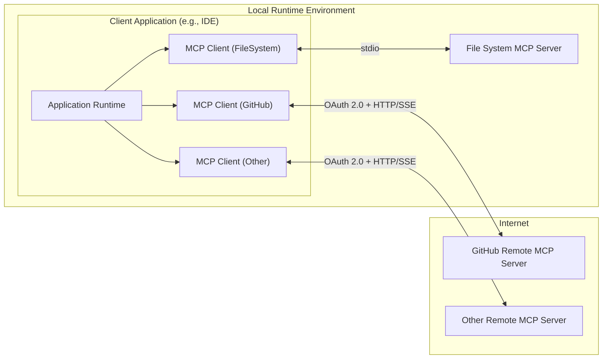
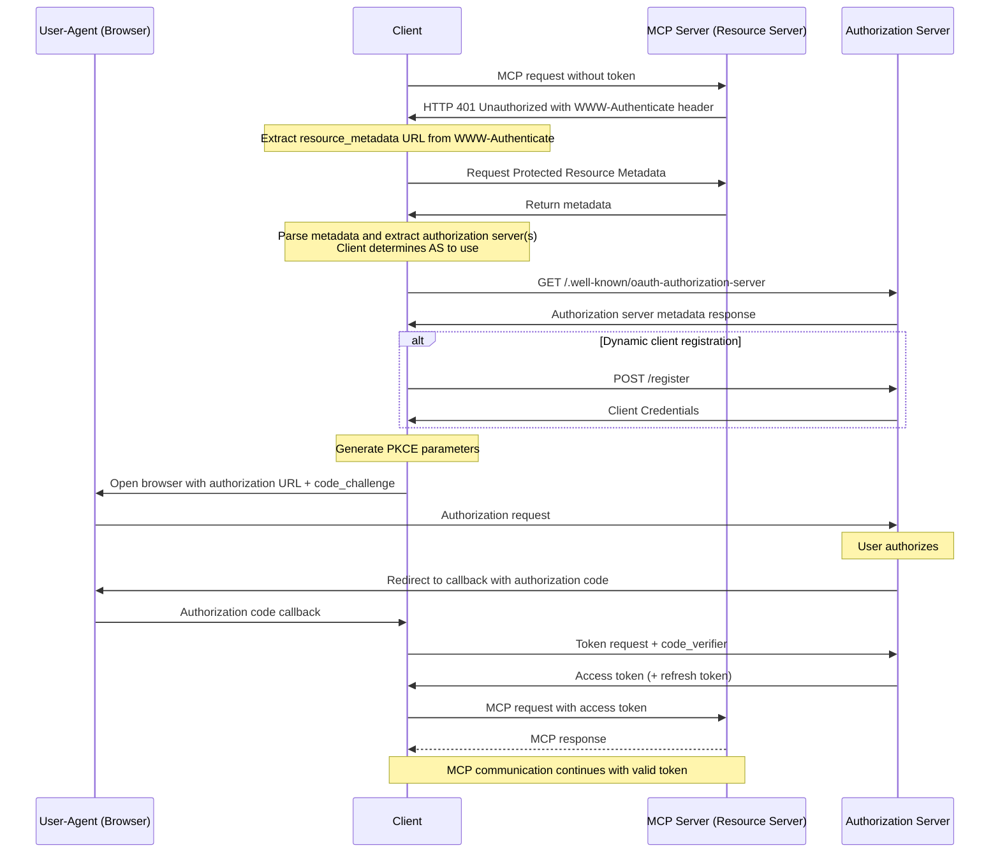

================================================
FILE: README.md
================================================
# GitHub MCP Server

The GitHub MCP Server connects AI tools directly to GitHub's platform. This gives AI agents, assistants, and chatbots the ability to read repositories and code files, manage issues and PRs, analyze code, and automate workflows. All through natural language interactions.

### Use Cases

- Repository Management: Browse and query code, search files, analyze commits, and understand project structure across any repository you have access to.
- Issue & PR Automation: Create, update, and manage issues and pull requests. Let AI help triage bugs, review code changes, and maintain project boards.
- CI/CD & Workflow Intelligence: Monitor GitHub Actions workflow runs, analyze build failures, manage releases, and get insights into your development pipeline.
- Code Analysis: Examine security findings, review Dependabot alerts, understand code patterns, and get comprehensive insights into your codebase.
- Team Collaboration: Access discussions, manage notifications, analyze team activity, and streamline processes for your team.

Built for developers who want to connect their AI tools to GitHub context and capabilities, from simple natural language queries to complex multi-step agent workflows.

---

## Remote GitHub MCP Server

[](https://insiders.vscode.dev/redirect/mcp/install?name=github&config=%7B%22type%22%3A%20%22http%22%2C%22url%22%3A%20%22https%3A%2F%2Fapi.githubcopilot.com%2Fmcp%2F%22%7D) [](https://insiders.vscode.dev/redirect/mcp/install?name=github&config=%7B%22type%22%3A%20%22http%22%2C%22url%22%3A%20%22https%3A%2F%2Fapi.githubcopilot.com%2Fmcp%2F%22%7D&quality=insiders)

The remote GitHub MCP Server is hosted by GitHub and provides the easiest method for getting up and running. If your MCP host does not support remote MCP servers, don't worry! You can use the [local version of the GitHub MCP Server](https://github.com/github/github-mcp-server?tab=readme-ov-file#local-github-mcp-server) instead.

### Prerequisites

1. A compatible MCP host with remote server support (VS Code 1.101+, Claude Desktop, Cursor, Windsurf, etc.)
2. Any applicable [policies enabled](https://github.com/github/github-mcp-server/blob/main/docs/policies-and-governance.md)

### Install in VS Code

For quick installation, use one of the one-click install buttons above. Once you complete that flow, toggle Agent mode (located by the Copilot Chat text input) and the server will start. Make sure you're using [VS Code 1.101](https://code.visualstudio.com/updates/v1_101) or [later](https://code.visualstudio.com/updates) for remote MCP and OAuth support.

Alternatively, to manually configure VS Code, choose the appropriate JSON block from the examples below and add it to your host configuration:

<table>
<tr><th>Using OAuth</th><th>Using a GitHub PAT</th></tr>
<tr><th align=left colspan=2>VS Code (version 1.101 or greater)</th></tr>
<tr valign=top>
<td>

```json
{
  "servers": {
    "github": {
      "type": "http",
      "url": "https://api.githubcopilot.com/mcp/"
    }
  }
}
```

</td>
<td>

```json
{
  "servers": {
    "github": {
      "type": "http",
      "url": "https://api.githubcopilot.com/mcp/",
      "headers": {
        "Authorization": "Bearer ${input:github_mcp_pat}"
      }
    }
  },
  "inputs": [
    {
      "type": "promptString",
      "id": "github_mcp_pat",
      "description": "GitHub Personal Access Token",
      "password": true
    }
  ]
}
```

</td>
</tr>
</table>

### Install in other MCP hosts
- **[GitHub Copilot in other IDEs](/docs/installation-guides/install-other-copilot-ides.md)** - Installation for JetBrains, Visual Studio, Eclipse, and Xcode with GitHub Copilot
- **[Claude Applications](/docs/installation-guides/install-claude.md)** - Installation guide for Claude Web, Claude Desktop and Claude Code CLI
- **[Cursor](/docs/installation-guides/install-cursor.md)** - Installation guide for Cursor IDE
- **[Windsurf](/docs/installation-guides/install-windsurf.md)** - Installation guide for Windsurf IDE

> **Note:** Each MCP host application needs to configure a GitHub App or OAuth App to support remote access via OAuth. Any host application that supports remote MCP servers should support the remote GitHub server with PAT authentication. Configuration details and support levels vary by host. Make sure to refer to the host application's documentation for more info.

> ⚠️ **Public Preview Status:** The **remote** GitHub MCP Server is currently in Public Preview. During preview, access may be gated depending on authentication type and surface:
> - OAuth: Subject to GitHub Copilot Editor Preview Policy until GA
> - PAT: Controlled via your organization's PAT policies
> - MCP Servers in Copilot policy: Enables/disables access to all MCP servers in VS Code, with other Copilot editors migrating to this policy in the coming months.

### Configuration
See [Remote Server Documentation](/docs/remote-server.md) on how to pass additional configuration settings to the remote GitHub MCP Server.

---

## Local GitHub MCP Server

[](https://insiders.vscode.dev/redirect/mcp/install?name=github&inputs=%5B%7B%22id%22%3A%22github_token%22%2C%22type%22%3A%22promptString%22%2C%22description%22%3A%22GitHub%20Personal%20Access%20Token%22%2C%22password%22%3Atrue%7D%5D&config=%7B%22command%22%3A%22docker%22%2C%22args%22%3A%5B%22run%22%2C%22-i%22%2C%22--rm%22%2C%22-e%22%2C%22GITHUB_PERSONAL_ACCESS_TOKEN%22%2C%22ghcr.io%2Fgithub%2Fgithub-mcp-server%22%5D%2C%22env%22%3A%7B%22GITHUB_PERSONAL_ACCESS_TOKEN%22%3A%22%24%7Binput%3Agithub_token%7D%22%7D%7D) [](https://insiders.vscode.dev/redirect/mcp/install?name=github&inputs=%5B%7B%22id%22%3A%22github_token%22%2C%22type%22%3A%22promptString%22%2C%22description%22%3A%22GitHub%20Personal%20Access%20Token%22%2C%22password%22%3Atrue%7D%5D&config=%7B%22command%22%3A%22docker%22%2C%22args%22%3A%5B%22run%22%2C%22-i%22%2C%22--rm%22%2C%22-e%22%2C%22GITHUB_PERSONAL_ACCESS_TOKEN%22%2C%22ghcr.io%2Fgithub%2Fgithub-mcp-server%22%5D%2C%22env%22%3A%7B%22GITHUB_PERSONAL_ACCESS_TOKEN%22%3A%22%24%7Binput%3Agithub_token%7D%22%7D%7D&quality=insiders)

### Prerequisites

1. To run the server in a container, you will need to have [Docker](https://www.docker.com/) installed.
2. Once Docker is installed, you will also need to ensure Docker is running. The image is public; if you get errors on pull, you may have an expired token and need to `docker logout ghcr.io`.
3. Lastly you will need to [Create a GitHub Personal Access Token](https://github.com/settings/personal-access-tokens/new).
The MCP server can use many of the GitHub APIs, so enable the permissions that you feel comfortable granting your AI tools (to learn more about access tokens, please check out the [documentation](https://docs.github.com/en/authentication/keeping-your-account-and-data-secure/managing-your-personal-access-tokens)).

<details><summary><b>Handling PATs Securely</b></summary>

### Environment Variables (Recommended)
To keep your GitHub PAT secure and reusable across different MCP hosts:

1. **Store your PAT in environment variables**
   ```bash
   export GITHUB_PAT=your_token_here
   ```
   Or create a `.env` file:
   ```env
   GITHUB_PAT=your_token_here
   ```

2. **Protect your `.env` file**
   ```bash
   # Add to .gitignore to prevent accidental commits
   echo ".env" >> .gitignore
   ```

3. **Reference the token in configurations**
   ```bash
   # CLI usage
   claude mcp update github -e GITHUB_PERSONAL_ACCESS_TOKEN=$GITHUB_PAT

   # In config files (where supported)
   "env": {
     "GITHUB_PERSONAL_ACCESS_TOKEN": "$GITHUB_PAT"
   }
   ```

> **Note**: Environment variable support varies by host app and IDE. Some applications (like Windsurf) require hardcoded tokens in config files.

### Token Security Best Practices

- **Minimum scopes**: Only grant necessary permissions
  - `repo` - Repository operations
  - `read:packages` - Docker image access
- **Separate tokens**: Use different PATs for different projects/environments
- **Regular rotation**: Update tokens periodically
- **Never commit**: Keep tokens out of version control
- **File permissions**: Restrict access to config files containing tokens
  ```bash
  chmod 600 ~/.your-app/config.json
  ```

</details>

## Installation

### Install in GitHub Copilot on VS Code

For quick installation, use one of the one-click install buttons above. Once you complete that flow, toggle Agent mode (located by the Copilot Chat text input) and the server will start.

More about using MCP server tools in VS Code's [agent mode documentation](https://code.visualstudio.com/docs/copilot/chat/mcp-servers).

Install in GitHub Copilot on other IDEs (JetBrains, Visual Studio, Eclipse, etc.)

Add the following JSON block to your IDE's MCP settings.

```json
{
  "mcp": {
    "inputs": [
      {
        "type": "promptString",
        "id": "github_token",
        "description": "GitHub Personal Access Token",
        "password": true
      }
    ],
    "servers": {
      "github": {
        "command": "docker",
        "args": [
          "run",
          "-i",
          "--rm",
          "-e",
          "GITHUB_PERSONAL_ACCESS_TOKEN",
          "ghcr.io/github/github-mcp-server"
        ],
        "env": {
          "GITHUB_PERSONAL_ACCESS_TOKEN": "${input:github_token}"
        }
      }
    }
  }
}
```

Optionally, you can add a similar example (i.e. without the mcp key) to a file called `.vscode/mcp.json` in your workspace. This will allow you to share the configuration with other host applications that accept the same format.

<details>
<summary><b>Example JSON block without the MCP key included</b></summary>
<br>

```json
{
  "inputs": [
    {
      "type": "promptString",
      "id": "github_token",
      "description": "GitHub Personal Access Token",
      "password": true
    }
  ],
  "servers": {
    "github": {
      "command": "docker",
      "args": [
        "run",
        "-i",
        "--rm",
        "-e",
        "GITHUB_PERSONAL_ACCESS_TOKEN",
        "ghcr.io/github/github-mcp-server"
      ],
      "env": {
        "GITHUB_PERSONAL_ACCESS_TOKEN": "${input:github_token}"
      }
    }
  }
}
```

</details>

### Install in Other MCP Hosts

For other MCP host applications, please refer to our installation guides:

- **[GitHub Copilot in other IDEs](/docs/installation-guides/install-other-copilot-ides.md)** - Installation for JetBrains, Visual Studio, Eclipse, and Xcode with GitHub Copilot
- **[Claude Code & Claude Desktop](docs/installation-guides/install-claude.md)** - Installation guide for Claude Code and Claude Desktop
- **[Cursor](docs/installation-guides/install-cursor.md)** - Installation guide for Cursor IDE
- **[Windsurf](docs/installation-guides/install-windsurf.md)** - Installation guide for Windsurf IDE

For a complete overview of all installation options, see our **[Installation Guides Index](docs/installation-guides/installation-guides.md)**.

> **Note:** Any host application that supports local MCP servers should be able to access the local GitHub MCP server. However, the specific configuration process, syntax and stability of the integration will vary by host application. While many may follow a similar format to the examples above, this is not guaranteed. Please refer to your host application's documentation for the correct MCP configuration syntax and setup process.

### Build from source

If you don't have Docker, you can use `go build` to build the binary in the
`cmd/github-mcp-server` directory, and use the `github-mcp-server stdio` command with the `GITHUB_PERSONAL_ACCESS_TOKEN` environment variable set to your token. To specify the output location of the build, use the `-o` flag. You should configure your server to use the built executable as its `command`. For example:

```JSON
{
  "mcp": {
    "servers": {
      "github": {
        "command": "/path/to/github-mcp-server",
        "args": ["stdio"],
        "env": {
          "GITHUB_PERSONAL_ACCESS_TOKEN": "<YOUR_TOKEN>"
        }
      }
    }
  }
}
```

## Tool Configuration

The GitHub MCP Server supports enabling or disabling specific groups of functionalities via the `--toolsets` flag. This allows you to control which GitHub API capabilities are available to your AI tools. Enabling only the toolsets that you need can help the LLM with tool choice and reduce the context size.

_Toolsets are not limited to Tools. Relevant MCP Resources and Prompts are also included where applicable._

### Available Toolsets

The following sets of tools are available (all are on by default):

<!-- START AUTOMATED TOOLSETS -->
| Toolset                 | Description                                                   |
| ----------------------- | ------------------------------------------------------------- |
| `context`               | **Strongly recommended**: Tools that provide context about the current user and GitHub context you are operating in |
| `actions` | GitHub Actions workflows and CI/CD operations |
| `code_security` | Code security related tools, such as GitHub Code Scanning |
| `dependabot` | Dependabot tools |
| `discussions` | GitHub Discussions related tools |
| `experiments` | Experimental features that are not considered stable yet |
| `gists` | GitHub Gist related tools |
| `issues` | GitHub Issues related tools |
| `notifications` | GitHub Notifications related tools |
| `orgs` | GitHub Organization related tools |
| `pull_requests` | GitHub Pull Request related tools |
| `repos` | GitHub Repository related tools |
| `secret_protection` | Secret protection related tools, such as GitHub Secret Scanning |
| `users` | GitHub User related tools |
<!-- END AUTOMATED TOOLSETS -->

## Tools


<!-- START AUTOMATED TOOLS -->
<details>

<summary>Actions</summary>

- **cancel_workflow_run** - Cancel workflow run
  - `owner`: Repository owner (string, required)
  - `repo`: Repository name (string, required)
  - `run_id`: The unique identifier of the workflow run (number, required)

- **delete_workflow_run_logs** - Delete workflow logs
  - `owner`: Repository owner (string, required)
  - `repo`: Repository name (string, required)
  - `run_id`: The unique identifier of the workflow run (number, required)

- **download_workflow_run_artifact** - Download workflow artifact
  - `artifact_id`: The unique identifier of the artifact (number, required)
  - `owner`: Repository owner (string, required)
  - `repo`: Repository name (string, required)

- **get_job_logs** - Get job logs
  - `failed_only`: When true, gets logs for all failed jobs in run_id (boolean, optional)
  - `job_id`: The unique identifier of the workflow job (required for single job logs) (number, optional)
  - `owner`: Repository owner (string, required)
  - `repo`: Repository name (string, required)
  - `return_content`: Returns actual log content instead of URLs (boolean, optional)
  - `run_id`: Workflow run ID (required when using failed_only) (number, optional)
  - `tail_lines`: Number of lines to return from the end of the log (number, optional)

- **get_workflow_run** - Get workflow run
  - `owner`: Repository owner (string, required)
  - `repo`: Repository name (string, required)
  - `run_id`: The unique identifier of the workflow run (number, required)

- **get_workflow_run_logs** - Get workflow run logs
  - `owner`: Repository owner (string, required)
  - `repo`: Repository name (string, required)
  - `run_id`: The unique identifier of the workflow run (number, required)

- **get_workflow_run_usage** - Get workflow usage
  - `owner`: Repository owner (string, required)
  - `repo`: Repository name (string, required)
  - `run_id`: The unique identifier of the workflow run (number, required)

- **list_workflow_jobs** - List workflow jobs
  - `filter`: Filters jobs by their completed_at timestamp (string, optional)
  - `owner`: Repository owner (string, required)
  - `page`: Page number for pagination (min 1) (number, optional)
  - `perPage`: Results per page for pagination (min 1, max 100) (number, optional)
  - `repo`: Repository name (string, required)
  - `run_id`: The unique identifier of the workflow run (number, required)

- **list_workflow_run_artifacts** - List workflow artifacts
  - `owner`: Repository owner (string, required)
  - `page`: Page number for pagination (min 1) (number, optional)
  - `perPage`: Results per page for pagination (min 1, max 100) (number, optional)
  - `repo`: Repository name (string, required)
  - `run_id`: The unique identifier of the workflow run (number, required)

- **list_workflow_runs** - List workflow runs
  - `actor`: Returns someone's workflow runs. Use the login for the user who created the workflow run. (string, optional)
  - `branch`: Returns workflow runs associated with a branch. Use the name of the branch. (string, optional)
  - `event`: Returns workflow runs for a specific event type (string, optional)
  - `owner`: Repository owner (string, required)
  - `page`: Page number for pagination (min 1) (number, optional)
  - `perPage`: Results per page for pagination (min 1, max 100) (number, optional)
  - `repo`: Repository name (string, required)
  - `status`: Returns workflow runs with the check run status (string, optional)
  - `workflow_id`: The workflow ID or workflow file name (string, required)

- **list_workflows** - List workflows
  - `owner`: Repository owner (string, required)
  - `page`: Page number for pagination (min 1) (number, optional)
  - `perPage`: Results per page for pagination (min 1, max 100) (number, optional)
  - `repo`: Repository name (string, required)

- **rerun_failed_jobs** - Rerun failed jobs
  - `owner`: Repository owner (string, required)
  - `repo`: Repository name (string, required)
  - `run_id`: The unique identifier of the workflow run (number, required)

- **rerun_workflow_run** - Rerun workflow run
  - `owner`: Repository owner (string, required)
  - `repo`: Repository name (string, required)
  - `run_id`: The unique identifier of the workflow run (number, required)

- **run_workflow** - Run workflow
  - `inputs`: Inputs the workflow accepts (object, optional)
  - `owner`: Repository owner (string, required)
  - `ref`: The git reference for the workflow. The reference can be a branch or tag name. (string, required)
  - `repo`: Repository name (string, required)
  - `workflow_id`: The workflow ID (numeric) or workflow file name (e.g., main.yml, ci.yaml) (string, required)

</details>

<details>

<summary>Code Security</summary>

- **get_code_scanning_alert** - Get code scanning alert
  - `alertNumber`: The number of the alert. (number, required)
  - `owner`: The owner of the repository. (string, required)
  - `repo`: The name of the repository. (string, required)

- **list_code_scanning_alerts** - List code scanning alerts
  - `owner`: The owner of the repository. (string, required)
  - `ref`: The Git reference for the results you want to list. (string, optional)
  - `repo`: The name of the repository. (string, required)
  - `severity`: Filter code scanning alerts by severity (string, optional)
  - `state`: Filter code scanning alerts by state. Defaults to open (string, optional)
  - `tool_name`: The name of the tool used for code scanning. (string, optional)

</details>

<details>

<summary>Context</summary>

- **get_me** - Get my user profile
  - No parameters required

</details>

<details>

<summary>Dependabot</summary>

- **get_dependabot_alert** - Get dependabot alert
  - `alertNumber`: The number of the alert. (number, required)
  - `owner`: The owner of the repository. (string, required)
  - `repo`: The name of the repository. (string, required)

- **list_dependabot_alerts** - List dependabot alerts
  - `owner`: The owner of the repository. (string, required)
  - `repo`: The name of the repository. (string, required)
  - `severity`: Filter dependabot alerts by severity (string, optional)
  - `state`: Filter dependabot alerts by state. Defaults to open (string, optional)

</details>

<details>

<summary>Discussions</summary>

- **get_discussion** - Get discussion
  - `discussionNumber`: Discussion Number (number, required)
  - `owner`: Repository owner (string, required)
  - `repo`: Repository name (string, required)

- **get_discussion_comments** - Get discussion comments
  - `after`: Cursor for pagination. Use the endCursor from the previous page's PageInfo for GraphQL APIs. (string, optional)
  - `discussionNumber`: Discussion Number (number, required)
  - `owner`: Repository owner (string, required)
  - `perPage`: Results per page for pagination (min 1, max 100) (number, optional)
  - `repo`: Repository name (string, required)

- **list_discussion_categories** - List discussion categories
  - `owner`: Repository owner (string, required)
  - `repo`: Repository name. If not provided, discussion categories will be queried at the organisation level. (string, optional)

- **list_discussions** - List discussions
  - `after`: Cursor for pagination. Use the endCursor from the previous page's PageInfo for GraphQL APIs. (string, optional)
  - `category`: Optional filter by discussion category ID. If provided, only discussions with this category are listed. (string, optional)
  - `direction`: Order direction. (string, optional)
  - `orderBy`: Order discussions by field. If provided, the 'direction' also needs to be provided. (string, optional)
  - `owner`: Repository owner (string, required)
  - `perPage`: Results per page for pagination (min 1, max 100) (number, optional)
  - `repo`: Repository name. If not provided, discussions will be queried at the organisation level. (string, optional)

</details>

<details>

<summary>Gists</summary>

- **create_gist** - Create Gist
  - `content`: Content for simple single-file gist creation (string, required)
  - `description`: Description of the gist (string, optional)
  - `filename`: Filename for simple single-file gist creation (string, required)
  - `public`: Whether the gist is public (boolean, optional)

- **list_gists** - List Gists
  - `page`: Page number for pagination (min 1) (number, optional)
  - `perPage`: Results per page for pagination (min 1, max 100) (number, optional)
  - `since`: Only gists updated after this time (ISO 8601 timestamp) (string, optional)
  - `username`: GitHub username (omit for authenticated user's gists) (string, optional)

- **update_gist** - Update Gist
  - `content`: Content for the file (string, required)
  - `description`: Updated description of the gist (string, optional)
  - `filename`: Filename to update or create (string, required)
  - `gist_id`: ID of the gist to update (string, required)

</details>

<details>

<summary>Issues</summary>

- **add_issue_comment** - Add comment to issue
  - `body`: Comment content (string, required)
  - `issue_number`: Issue number to comment on (number, required)
  - `owner`: Repository owner (string, required)
  - `repo`: Repository name (string, required)

- **add_sub_issue** - Add sub-issue
  - `issue_number`: The number of the parent issue (number, required)
  - `owner`: Repository owner (string, required)
  - `replace_parent`: When true, replaces the sub-issue's current parent issue (boolean, optional)
  - `repo`: Repository name (string, required)
  - `sub_issue_id`: The ID of the sub-issue to add. ID is not the same as issue number (number, required)

- **assign_copilot_to_issue** - Assign Copilot to issue
  - `issueNumber`: Issue number (number, required)
  - `owner`: Repository owner (string, required)
  - `repo`: Repository name (string, required)

- **create_issue** - Open new issue
  - `assignees`: Usernames to assign to this issue (string[], optional)
  - `body`: Issue body content (string, optional)
  - `labels`: Labels to apply to this issue (string[], optional)
  - `milestone`: Milestone number (number, optional)
  - `owner`: Repository owner (string, required)
  - `repo`: Repository name (string, required)
  - `title`: Issue title (string, required)

- **get_issue** - Get issue details
  - `issue_number`: The number of the issue (number, required)
  - `owner`: The owner of the repository (string, required)
  - `repo`: The name of the repository (string, required)

- **get_issue_comments** - Get issue comments
  - `issue_number`: Issue number (number, required)
  - `owner`: Repository owner (string, required)
  - `page`: Page number for pagination (min 1) (number, optional)
  - `perPage`: Results per page for pagination (min 1, max 100) (number, optional)
  - `repo`: Repository name (string, required)

- **list_issues** - List issues
  - `direction`: Sort direction (string, optional)
  - `labels`: Filter by labels (string[], optional)
  - `owner`: Repository owner (string, required)
  - `page`: Page number for pagination (min 1) (number, optional)
  - `perPage`: Results per page for pagination (min 1, max 100) (number, optional)
  - `repo`: Repository name (string, required)
  - `since`: Filter by date (ISO 8601 timestamp) (string, optional)
  - `sort`: Sort order (string, optional)
  - `state`: Filter by state (string, optional)

- **list_sub_issues** - List sub-issues
  - `issue_number`: Issue number (number, required)
  - `owner`: Repository owner (string, required)
  - `page`: Page number for pagination (default: 1) (number, optional)
  - `per_page`: Number of results per page (max 100, default: 30) (number, optional)
  - `repo`: Repository name (string, required)

- **remove_sub_issue** - Remove sub-issue
  - `issue_number`: The number of the parent issue (number, required)
  - `owner`: Repository owner (string, required)
  - `repo`: Repository name (string, required)
  - `sub_issue_id`: The ID of the sub-issue to remove. ID is not the same as issue number (number, required)

- **reprioritize_sub_issue** - Reprioritize sub-issue
  - `after_id`: The ID of the sub-issue to be prioritized after (either after_id OR before_id should be specified) (number, optional)
  - `before_id`: The ID of the sub-issue to be prioritized before (either after_id OR before_id should be specified) (number, optional)
  - `issue_number`: The number of the parent issue (number, required)
  - `owner`: Repository owner (string, required)
  - `repo`: Repository name (string, required)
  - `sub_issue_id`: The ID of the sub-issue to reprioritize. ID is not the same as issue number (number, required)

- **search_issues** - Search issues
  - `order`: Sort order (string, optional)
  - `owner`: Optional repository owner. If provided with repo, only notifications for this repository are listed. (string, optional)
  - `page`: Page number for pagination (min 1) (number, optional)
  - `perPage`: Results per page for pagination (min 1, max 100) (number, optional)
  - `query`: Search query using GitHub issues search syntax (string, required)
  - `repo`: Optional repository name. If provided with owner, only notifications for this repository are listed. (string, optional)
  - `sort`: Sort field by number of matches of categories, defaults to best match (string, optional)

- **update_issue** - Edit issue
  - `assignees`: New assignees (string[], optional)
  - `body`: New description (string, optional)
  - `issue_number`: Issue number to update (number, required)
  - `labels`: New labels (string[], optional)
  - `milestone`: New milestone number (number, optional)
  - `owner`: Repository owner (string, required)
  - `repo`: Repository name (string, required)
  - `state`: New state (string, optional)
  - `title`: New title (string, optional)

</details>

<details>

<summary>Notifications</summary>

- **dismiss_notification** - Dismiss notification
  - `state`: The new state of the notification (read/done) (string, optional)
  - `threadID`: The ID of the notification thread (string, required)

- **get_notification_details** - Get notification details
  - `notificationID`: The ID of the notification (string, required)

- **list_notifications** - List notifications
  - `before`: Only show notifications updated before the given time (ISO 8601 format) (string, optional)
  - `filter`: Filter notifications to, use default unless specified. Read notifications are ones that have already been acknowledged by the user. Participating notifications are those that the user is directly involved in, such as issues or pull requests they have commented on or created. (string, optional)
  - `owner`: Optional repository owner. If provided with repo, only notifications for this repository are listed. (string, optional)
  - `page`: Page number for pagination (min 1) (number, optional)
  - `perPage`: Results per page for pagination (min 1, max 100) (number, optional)
  - `repo`: Optional repository name. If provided with owner, only notifications for this repository are listed. (string, optional)
  - `since`: Only show notifications updated after the given time (ISO 8601 format) (string, optional)

- **manage_notification_subscription** - Manage notification subscription
  - `action`: Action to perform: ignore, watch, or delete the notification subscription. (string, required)
  - `notificationID`: The ID of the notification thread. (string, required)

- **manage_repository_notification_subscription** - Manage repository notification subscription
  - `action`: Action to perform: ignore, watch, or delete the repository notification subscription. (string, required)
  - `owner`: The account owner of the repository. (string, required)
  - `repo`: The name of the repository. (string, required)

- **mark_all_notifications_read** - Mark all notifications as read
  - `lastReadAt`: Describes the last point that notifications were checked (optional). Default: Now (string, optional)
  - `owner`: Optional repository owner. If provided with repo, only notifications for this repository are marked as read. (string, optional)
  - `repo`: Optional repository name. If provided with owner, only notifications for this repository are marked as read. (string, optional)

</details>

<details>

<summary>Organizations</summary>

- **search_orgs** - Search organizations
  - `order`: Sort order (string, optional)
  - `page`: Page number for pagination (min 1) (number, optional)
  - `perPage`: Results per page for pagination (min 1, max 100) (number, optional)
  - `query`: Organization search query. Examples: 'microsoft', 'location:california', 'created:>=2025-01-01'. Search is automatically scoped to type:org. (string, required)
  - `sort`: Sort field by category (string, optional)

</details>

<details>

<summary>Pull Requests</summary>

- **add_comment_to_pending_review** - Add review comment to the requester's latest pending pull request review
  - `body`: The text of the review comment (string, required)
  - `line`: The line of the blob in the pull request diff that the comment applies to. For multi-line comments, the last line of the range (number, optional)
  - `owner`: Repository owner (string, required)
  - `path`: The relative path to the file that necessitates a comment (string, required)
  - `pullNumber`: Pull request number (number, required)
  - `repo`: Repository name (string, required)
  - `side`: The side of the diff to comment on. LEFT indicates the previous state, RIGHT indicates the new state (string, optional)
  - `startLine`: For multi-line comments, the first line of the range that the comment applies to (number, optional)
  - `startSide`: For multi-line comments, the starting side of the diff that the comment applies to. LEFT indicates the previous state, RIGHT indicates the new state (string, optional)
  - `subjectType`: The level at which the comment is targeted (string, required)

- **create_and_submit_pull_request_review** - Create and submit a pull request review without comments
  - `body`: Review comment text (string, required)
  - `commitID`: SHA of commit to review (string, optional)
  - `event`: Review action to perform (string, required)
  - `owner`: Repository owner (string, required)
  - `pullNumber`: Pull request number (number, required)
  - `repo`: Repository name (string, required)

- **create_pending_pull_request_review** - Create pending pull request review
  - `commitID`: SHA of commit to review (string, optional)
  - `owner`: Repository owner (string, required)
  - `pullNumber`: Pull request number (number, required)
  - `repo`: Repository name (string, required)

- **create_pull_request** - Open new pull request
  - `base`: Branch to merge into (string, required)
  - `body`: PR description (string, optional)
  - `draft`: Create as draft PR (boolean, optional)
  - `head`: Branch containing changes (string, required)
  - `maintainer_can_modify`: Allow maintainer edits (boolean, optional)
  - `owner`: Repository owner (string, required)
  - `repo`: Repository name (string, required)
  - `title`: PR title (string, required)

- **delete_pending_pull_request_review** - Delete the requester's latest pending pull request review
  - `owner`: Repository owner (string, required)
  - `pullNumber`: Pull request number (number, required)
  - `repo`: Repository name (string, required)

- **get_pull_request** - Get pull request details
  - `owner`: Repository owner (string, required)
  - `pullNumber`: Pull request number (number, required)
  - `repo`: Repository name (string, required)

- **get_pull_request_comments** - Get pull request comments
  - `owner`: Repository owner (string, required)
  - `pullNumber`: Pull request number (number, required)
  - `repo`: Repository name (string, required)

- **get_pull_request_diff** - Get pull request diff
  - `owner`: Repository owner (string, required)
  - `pullNumber`: Pull request number (number, required)
  - `repo`: Repository name (string, required)

- **get_pull_request_files** - Get pull request files
  - `owner`: Repository owner (string, required)
  - `page`: Page number for pagination (min 1) (number, optional)
  - `perPage`: Results per page for pagination (min 1, max 100) (number, optional)
  - `pullNumber`: Pull request number (number, required)
  - `repo`: Repository name (string, required)

- **get_pull_request_reviews** - Get pull request reviews
  - `owner`: Repository owner (string, required)
  - `pullNumber`: Pull request number (number, required)
  - `repo`: Repository name (string, required)

- **get_pull_request_status** - Get pull request status checks
  - `owner`: Repository owner (string, required)
  - `pullNumber`: Pull request number (number, required)
  - `repo`: Repository name (string, required)

- **list_pull_requests** - List pull requests
  - `base`: Filter by base branch (string, optional)
  - `direction`: Sort direction (string, optional)
  - `head`: Filter by head user/org and branch (string, optional)
  - `owner`: Repository owner (string, required)
  - `page`: Page number for pagination (min 1) (number, optional)
  - `perPage`: Results per page for pagination (min 1, max 100) (number, optional)
  - `repo`: Repository name (string, required)
  - `sort`: Sort by (string, optional)
  - `state`: Filter by state (string, optional)

- **merge_pull_request** - Merge pull request
  - `commit_message`: Extra detail for merge commit (string, optional)
  - `commit_title`: Title for merge commit (string, optional)
  - `merge_method`: Merge method (string, optional)
  - `owner`: Repository owner (string, required)
  - `pullNumber`: Pull request number (number, required)
  - `repo`: Repository name (string, required)

- **request_copilot_review** - Request Copilot review
  - `owner`: Repository owner (string, required)
  - `pullNumber`: Pull request number (number, required)
  - `repo`: Repository name (string, required)

- **search_pull_requests** - Search pull requests
  - `order`: Sort order (string, optional)
  - `owner`: Optional repository owner. If provided with repo, only notifications for this repository are listed. (string, optional)
  - `page`: Page number for pagination (min 1) (number, optional)
  - `perPage`: Results per page for pagination (min 1, max 100) (number, optional)
  - `query`: Search query using GitHub pull request search syntax (string, required)
  - `repo`: Optional repository name. If provided with owner, only notifications for this repository are listed. (string, optional)
  - `sort`: Sort field by number of matches of categories, defaults to best match (string, optional)

- **submit_pending_pull_request_review** - Submit the requester's latest pending pull request review
  - `body`: The text of the review comment (string, optional)
  - `event`: The event to perform (string, required)
  - `owner`: Repository owner (string, required)
  - `pullNumber`: Pull request number (number, required)
  - `repo`: Repository name (string, required)

- **update_pull_request** - Edit pull request
  - `base`: New base branch name (string, optional)
  - `body`: New description (string, optional)
  - `draft`: Mark pull request as draft (true) or ready for review (false) (boolean, optional)
  - `maintainer_can_modify`: Allow maintainer edits (boolean, optional)
  - `owner`: Repository owner (string, required)
  - `pullNumber`: Pull request number to update (number, required)
  - `repo`: Repository name (string, required)
  - `reviewers`: GitHub usernames to request reviews from (string[], optional)
  - `state`: New state (string, optional)
  - `title`: New title (string, optional)

- **update_pull_request_branch** - Update pull request branch
  - `expectedHeadSha`: The expected SHA of the pull request's HEAD ref (string, optional)
  - `owner`: Repository owner (string, required)
  - `pullNumber`: Pull request number (number, required)
  - `repo`: Repository name (string, required)

</details>

<details>

<summary>Repositories</summary>

- **create_branch** - Create branch
  - `branch`: Name for new branch (string, required)
  - `from_branch`: Source branch (defaults to repo default) (string, optional)
  - `owner`: Repository owner (string, required)
  - `repo`: Repository name (string, required)

- **create_or_update_file** - Create or update file
  - `branch`: Branch to create/update the file in (string, required)
  - `content`: Content of the file (string, required)
  - `message`: Commit message (string, required)
  - `owner`: Repository owner (username or organization) (string, required)
  - `path`: Path where to create/update the file (string, required)
  - `repo`: Repository name (string, required)
  - `sha`: Required if updating an existing file. The blob SHA of the file being replaced. (string, optional)

- **create_repository** - Create repository
  - `autoInit`: Initialize with README (boolean, optional)
  - `description`: Repository description (string, optional)
  - `name`: Repository name (string, required)
  - `private`: Whether repo should be private (boolean, optional)

- **delete_file** - Delete file
  - `branch`: Branch to delete the file from (string, required)
  - `message`: Commit message (string, required)
  - `owner`: Repository owner (username or organization) (string, required)
  - `path`: Path to the file to delete (string, required)
  - `repo`: Repository name (string, required)

- **fork_repository** - Fork repository
  - `organization`: Organization to fork to (string, optional)
  - `owner`: Repository owner (string, required)
  - `repo`: Repository name (string, required)

- **get_commit** - Get commit details
  - `owner`: Repository owner (string, required)
  - `page`: Page number for pagination (min 1) (number, optional)
  - `perPage`: Results per page for pagination (min 1, max 100) (number, optional)
  - `repo`: Repository name (string, required)
  - `sha`: Commit SHA, branch name, or tag name (string, required)

- **get_file_contents** - Get file or directory contents
  - `owner`: Repository owner (username or organization) (string, required)
  - `path`: Path to file/directory (directories must end with a slash '/') (string, optional)
  - `ref`: Accepts optional git refs such as `refs/tags/{tag}`, `refs/heads/{branch}` or `refs/pull/{pr_number}/head` (string, optional)
  - `repo`: Repository name (string, required)
  - `sha`: Accepts optional commit SHA. If specified, it will be used instead of ref (string, optional)

- **get_tag** - Get tag details
  - `owner`: Repository owner (string, required)
  - `repo`: Repository name (string, required)
  - `tag`: Tag name (string, required)

- **list_branches** - List branches
  - `owner`: Repository owner (string, required)
  - `page`: Page number for pagination (min 1) (number, optional)
  - `perPage`: Results per page for pagination (min 1, max 100) (number, optional)
  - `repo`: Repository name (string, required)

- **list_commits** - List commits
  - `author`: Author username or email address to filter commits by (string, optional)
  - `owner`: Repository owner (string, required)
  - `page`: Page number for pagination (min 1) (number, optional)
  - `perPage`: Results per page for pagination (min 1, max 100) (number, optional)
  - `repo`: Repository name (string, required)
  - `sha`: Commit SHA, branch or tag name to list commits of. If not provided, uses the default branch of the repository. If a commit SHA is provided, will list commits up to that SHA. (string, optional)

- **list_tags** - List tags
  - `owner`: Repository owner (string, required)
  - `page`: Page number for pagination (min 1) (number, optional)
  - `perPage`: Results per page for pagination (min 1, max 100) (number, optional)
  - `repo`: Repository name (string, required)

- **push_files** - Push files to repository
  - `branch`: Branch to push to (string, required)
  - `files`: Array of file objects to push, each object with path (string) and content (string) (object[], required)
  - `message`: Commit message (string, required)
  - `owner`: Repository owner (string, required)
  - `repo`: Repository name (string, required)

- **search_code** - Search code
  - `order`: Sort order for results (string, optional)
  - `page`: Page number for pagination (min 1) (number, optional)
  - `perPage`: Results per page for pagination (min 1, max 100) (number, optional)
  - `query`: Search query using GitHub's powerful code search syntax. Examples: 'content:Skill language:Java org:github', 'NOT is:archived language:Python OR language:go', 'repo:github/github-mcp-server'. Supports exact matching, language filters, path filters, and more. (string, required)
  - `sort`: Sort field ('indexed' only) (string, optional)

- **search_repositories** - Search repositories
  - `page`: Page number for pagination (min 1) (number, optional)
  - `perPage`: Results per page for pagination (min 1, max 100) (number, optional)
  - `query`: Repository search query. Examples: 'machine learning in:name stars:>1000 language:python', 'topic:react', 'user:facebook'. Supports advanced search syntax for precise filtering. (string, required)

</details>

<details>

<summary>Secret Protection</summary>

- **get_secret_scanning_alert** - Get secret scanning alert
  - `alertNumber`: The number of the alert. (number, required)
  - `owner`: The owner of the repository. (string, required)
  - `repo`: The name of the repository. (string, required)

- **list_secret_scanning_alerts** - List secret scanning alerts
  - `owner`: The owner of the repository. (string, required)
  - `repo`: The name of the repository. (string, required)
  - `resolution`: Filter by resolution (string, optional)
  - `secret_type`: A comma-separated list of secret types to return. All default secret patterns are returned. To return generic patterns, pass the token name(s) in the parameter. (string, optional)
  - `state`: Filter by state (string, optional)

</details>

<details>

<summary>Users</summary>

- **search_users** - Search users
  - `order`: Sort order (string, optional)
  - `page`: Page number for pagination (min 1) (number, optional)
  - `perPage`: Results per page for pagination (min 1, max 100) (number, optional)
  - `query`: User search query. Examples: 'john smith', 'location:seattle', 'followers:>100'. Search is automatically scoped to type:user. (string, required)
  - `sort`: Sort users by number of followers or repositories, or when the person joined GitHub. (string, optional)

</details>
<!-- END AUTOMATED TOOLS -->

### Additional Tools in Remote Github MCP Server

<details>

<summary>Copilot coding agent</summary>

-   **create_pull_request_with_copilot** - Perform task with GitHub Copilot coding agent
    -   `owner`: Repository owner. You can guess the owner, but confirm it with the user before proceeding. (string, required)
    -   `repo`: Repository name. You can guess the repository name, but confirm it with the user before proceeding. (string, required)
    -   `problem_statement`: Detailed description of the task to be performed (e.g., 'Implement a feature that does X', 'Fix bug Y', etc.) (string, required)
    -   `title`: Title for the pull request that will be created (string, required)
    -   `base_ref`: Git reference (e.g., branch) that the agent will start its work from. If not specified, defaults to the repository's default branch (string, optional)

</details>

#### Specifying Toolsets

To specify toolsets you want available to the LLM, you can pass an allow-list in two ways:

1. **Using Command Line Argument**:

   ```bash
   github-mcp-server --toolsets repos,issues,pull_requests,actions,code_security
   ```

2. **Using Environment Variable**:
   ```bash
   GITHUB_TOOLSETS="repos,issues,pull_requests,actions,code_security" ./github-mcp-server
   ```

The environment variable `GITHUB_TOOLSETS` takes precedence over the command line argument if both are provided.

### Using Toolsets With Docker

When using Docker, you can pass the toolsets as environment variables:

```bash
docker run -i --rm \
  -e GITHUB_PERSONAL_ACCESS_TOKEN=<your-token> \
  -e GITHUB_TOOLSETS="repos,issues,pull_requests,actions,code_security,experiments" \
  ghcr.io/github/github-mcp-server
```

### The "all" Toolset

The special toolset `all` can be provided to enable all available toolsets regardless of any other configuration:

```bash
./github-mcp-server --toolsets all
```

Or using the environment variable:

```bash
GITHUB_TOOLSETS="all" ./github-mcp-server
```

## Dynamic Tool Discovery

**Note**: This feature is currently in beta and may not be available in all environments. Please test it out and let us know if you encounter any issues.

Instead of starting with all tools enabled, you can turn on dynamic toolset discovery. Dynamic toolsets allow the MCP host to list and enable toolsets in response to a user prompt. This should help to avoid situations where the model gets confused by the sheer number of tools available.

### Using Dynamic Tool Discovery

When using the binary, you can pass the `--dynamic-toolsets` flag.

```bash
./github-mcp-server --dynamic-toolsets
```

When using Docker, you can pass the toolsets as environment variables:

```bash
docker run -i --rm \
  -e GITHUB_PERSONAL_ACCESS_TOKEN=<your-token> \
  -e GITHUB_DYNAMIC_TOOLSETS=1 \
  ghcr.io/github/github-mcp-server
```

## Read-Only Mode

To run the server in read-only mode, you can use the `--read-only` flag. This will only offer read-only tools, preventing any modifications to repositories, issues, pull requests, etc.

```bash
./github-mcp-server --read-only
```

When using Docker, you can pass the read-only mode as an environment variable:

```bash
docker run -i --rm \
  -e GITHUB_PERSONAL_ACCESS_TOKEN=<your-token> \
  -e GITHUB_READ_ONLY=1 \
  ghcr.io/github/github-mcp-server
```

## GitHub Enterprise Server and Enterprise Cloud with data residency (ghe.com)

The flag `--gh-host` and the environment variable `GITHUB_HOST` can be used to set
the hostname for GitHub Enterprise Server or GitHub Enterprise Cloud with data residency.

- For GitHub Enterprise Server, prefix the hostname with the `https://` URI scheme, as it otherwise defaults to `http://`, which GitHub Enterprise Server does not support.
- For GitHub Enterprise Cloud with data residency, use `https://YOURSUBDOMAIN.ghe.com` as the hostname.
``` json
"github": {
    "command": "docker",
    "args": [
    "run",
    "-i",
    "--rm",
    "-e",
    "GITHUB_PERSONAL_ACCESS_TOKEN",
    "-e",
    "GITHUB_HOST",
    "ghcr.io/github/github-mcp-server"
    ],
    "env": {
        "GITHUB_PERSONAL_ACCESS_TOKEN": "${input:github_token}",
        "GITHUB_HOST": "https://<your GHES or ghe.com domain name>"
    }
}
```

## i18n / Overriding Descriptions

The descriptions of the tools can be overridden by creating a
`github-mcp-server-config.json` file in the same directory as the binary.

The file should contain a JSON object with the tool names as keys and the new
descriptions as values. For example:

```json
{
  "TOOL_ADD_ISSUE_COMMENT_DESCRIPTION": "an alternative description",
  "TOOL_CREATE_BRANCH_DESCRIPTION": "Create a new branch in a GitHub repository"
}
```

You can create an export of the current translations by running the binary with
the `--export-translations` flag.

This flag will preserve any translations/overrides you have made, while adding
any new translations that have been added to the binary since the last time you
exported.

```sh
./github-mcp-server --export-translations
cat github-mcp-server-config.json
```

You can also use ENV vars to override the descriptions. The environment
variable names are the same as the keys in the JSON file, prefixed with
`GITHUB_MCP_` and all uppercase.

For example, to override the `TOOL_ADD_ISSUE_COMMENT_DESCRIPTION` tool, you can
set the following environment variable:

```sh
export GITHUB_MCP_TOOL_ADD_ISSUE_COMMENT_DESCRIPTION="an alternative description"
```

## Library Usage

The exported Go API of this module should currently be considered unstable, and subject to breaking changes. In the future, we may offer stability; please file an issue if there is a use case where this would be valuable.

## License

This project is licensed under the terms of the MIT open source license. Please refer to [MIT](./LICENSE) for the full terms.


================================================
FILE: CODE_OF_CONDUCT.md
================================================
# Contributor Covenant Code of Conduct

## Our Pledge

We as members, contributors, and leaders pledge to make participation in our
community a harassment-free experience for everyone, regardless of age, body
size, visible or invisible disability, ethnicity, sex characteristics, gender
identity and expression, level of experience, education, socio-economic status,
nationality, personal appearance, race, religion, or sexual identity
and orientation.

We pledge to act and interact in ways that contribute to an open, welcoming,
diverse, inclusive, and healthy community.

## Our Standards

Examples of behavior that contributes to a positive environment for our
community include:

* Demonstrating empathy and kindness toward other people
* Being respectful of differing opinions, viewpoints, and experiences
* Giving and gracefully accepting constructive feedback
* Accepting responsibility and apologizing to those affected by our mistakes,
  and learning from the experience
* Focusing on what is best not just for us as individuals, but for the
  overall community

Examples of unacceptable behavior include:

* The use of sexualized language or imagery, and sexual attention or
  advances of any kind
* Trolling, insulting or derogatory comments, and personal or political attacks
* Public or private harassment
* Publishing others' private information, such as a physical or email
  address, without their explicit permission
* Other conduct which could reasonably be considered inappropriate in a
  professional setting

## Enforcement Responsibilities

Community leaders are responsible for clarifying and enforcing our standards of
acceptable behavior and will take appropriate and fair corrective action in
response to any behavior that they deem inappropriate, threatening, offensive,
or harmful.

Community leaders have the right and responsibility to remove, edit, or reject
comments, commits, code, wiki edits, issues, and other contributions that are
not aligned to this Code of Conduct, and will communicate reasons for moderation
decisions when appropriate.

## Scope

This Code of Conduct applies within all community spaces, and also applies when
an individual is officially representing the community in public spaces.
Examples of representing our community include using an official e-mail address,
posting via an official social media account, or acting as an appointed
representative at an online or offline event.

## Enforcement

Instances of abusive, harassing, or otherwise unacceptable behavior may be
reported to the community leaders responsible for enforcement at
GitHub.
All complaints will be reviewed and investigated promptly and fairly.

All community leaders are obligated to respect the privacy and security of the
reporter of any incident.

## Enforcement Guidelines

Community leaders will follow these Community Impact Guidelines in determining
the consequences for any action they deem in violation of this Code of Conduct:

### 1. Correction

**Community Impact**: Use of inappropriate language or other behavior deemed
unprofessional or unwelcome in the community.

**Consequence**: A private, written warning from community leaders, providing
clarity around the nature of the violation and an explanation of why the
behavior was inappropriate. A public apology may be requested.

### 2. Warning

**Community Impact**: A violation through a single incident or series
of actions.

**Consequence**: A warning with consequences for continued behavior. No
interaction with the people involved, including unsolicited interaction with
those enforcing the Code of Conduct, for a specified period of time. This
includes avoiding interactions in community spaces as well as external channels
like social media. Violating these terms may lead to a temporary or
permanent ban.

### 3. Temporary Ban

**Community Impact**: A serious violation of community standards, including
sustained inappropriate behavior.

**Consequence**: A temporary ban from any sort of interaction or public
communication with the community for a specified period of time. No public or
private interaction with the people involved, including unsolicited interaction
with those enforcing the Code of Conduct, is allowed during this period.
Violating these terms may lead to a permanent ban.

### 4. Permanent Ban

**Community Impact**: Demonstrating a pattern of violation of community
standards, including sustained inappropriate behavior,  harassment of an
individual, or aggression toward or disparagement of classes of individuals.

**Consequence**: A permanent ban from any sort of public interaction within
the community.

## Attribution

This Code of Conduct is adapted from the [Contributor Covenant][homepage],
version 2.0, available at
https://www.contributor-covenant.org/version/2/0/code_of_conduct.html.

Community Impact Guidelines were inspired by [Mozilla's code of conduct
enforcement ladder](https://github.com/mozilla/diversity).

[homepage]: https://www.contributor-covenant.org

For answers to common questions about this code of conduct, see the FAQ at
https://www.contributor-covenant.org/faq. Translations are available at
https://www.contributor-covenant.org/translations.


================================================
FILE: CONTRIBUTING.md
================================================
## Contributing

[fork]: https://github.com/github/github-mcp-server/fork
[pr]: https://github.com/github/github-mcp-server/compare
[style]: https://github.com/github/github-mcp-server/blob/main/.golangci.yml

Hi there! We're thrilled that you'd like to contribute to this project. Your help is essential for keeping it great.

Contributions to this project are [released](https://help.github.com/articles/github-terms-of-service/#6-contributions-under-repository-license) to the public under the [project's open source license](LICENSE).

Please note that this project is released with a [Contributor Code of Conduct](CODE_OF_CONDUCT.md). By participating in this project you agree to abide by its terms.

## What we're looking for

We can't guarantee that every tool, feature, or pull request will be approved or merged. Our focus is on supporting high-quality, high-impact capabilities that advance agentic workflows and deliver clear value to developers.

To increase the chances your request is accepted:
* Include real use cases or examples that demonstrate practical value
* If your request stalls, you can open a Discussion post and link to your issue or PR
* We actively revisit requests that gain strong community engagement (👍s, comments, or evidence of real-world use)

Thanks for contributing and for helping us build toolsets that are truly valuable!

## Prerequisites for running and testing code

These are one time installations required to be able to test your changes locally as part of the pull request (PR) submission process.

1. Install Go [through download](https://go.dev/doc/install) | [through Homebrew](https://formulae.brew.sh/formula/go)
2. [Install golangci-lint v2](https://golangci-lint.run/welcome/install/#local-installation)

## Submitting a pull request

1. [Fork][fork] and clone the repository
2. Make sure the tests pass on your machine: `go test -v ./...`
3. Make sure linter passes on your machine: `golangci-lint run`
4. Create a new branch: `git checkout -b my-branch-name`
5. Add your changes and tests, and make sure the Action workflows still pass
    - Run linter: `script/lint`
    - Update snapshots and run tests: `UPDATE_TOOLSNAPS=true go test ./...`
    - Update readme documentation: `script/generate-docs`
6. Push to your fork and [submit a pull request][pr] targeting the `main` branch
7. Pat yourself on the back and wait for your pull request to be reviewed and merged.

Here are a few things you can do that will increase the likelihood of your pull request being accepted:

- Follow the [style guide][style].
- Write tests.
- Keep your change as focused as possible. If there are multiple changes you would like to make that are not dependent upon each other, consider submitting them as separate pull requests.
- Write a [good commit message](http://tbaggery.com/2008/04/19/a-note-about-git-commit-messages.html).

## Resources

- [How to Contribute to Open Source](https://opensource.guide/how-to-contribute/)
- [Using Pull Requests](https://help.github.com/articles/about-pull-requests/)
- [GitHub Help](https://help.github.com)


================================================
FILE: Dockerfile
================================================
FROM golang:1.24.4-alpine AS build
ARG VERSION="dev"

# Set the working directory
WORKDIR /build

# Install git
RUN --mount=type=cache,target=/var/cache/apk \
    apk add git

# Build the server
# go build automatically download required module dependencies to /go/pkg/mod
RUN --mount=type=cache,target=/go/pkg/mod \
    --mount=type=cache,target=/root/.cache/go-build \
    --mount=type=bind,target=. \
    CGO_ENABLED=0 go build -ldflags="-s -w -X main.version=${VERSION} -X main.commit=$(git rev-parse HEAD) -X main.date=$(date -u +%Y-%m-%dT%H:%M:%SZ)" \
    -o /bin/github-mcp-server cmd/github-mcp-server/main.go

# Make a stage to run the app
FROM gcr.io/distroless/base-debian12
# Set the working directory
WORKDIR /server
# Copy the binary from the build stage
COPY --from=build /bin/github-mcp-server .
# Set the entrypoint to the server binary
ENTRYPOINT ["/server/github-mcp-server"]
# Default arguments for ENTRYPOINT
CMD ["stdio"]


================================================
FILE: go.mod
================================================
module github.com/github/github-mcp-server

go 1.23.7

require (
	github.com/google/go-github/v74 v74.0.0
	github.com/josephburnett/jd v1.9.2
	github.com/mark3labs/mcp-go v0.32.0
	github.com/migueleliasweb/go-github-mock v1.3.0
	github.com/sirupsen/logrus v1.9.3
	github.com/spf13/cobra v1.9.1
	github.com/spf13/viper v1.20.1
	github.com/stretchr/testify v1.10.0
)

require (
	github.com/go-openapi/jsonpointer v0.19.5 // indirect
	github.com/go-openapi/swag v0.21.1 // indirect
	github.com/josharian/intern v1.0.0 // indirect
	github.com/mailru/easyjson v0.7.7 // indirect
	github.com/yudai/golcs v0.0.0-20170316035057-ecda9a501e82 // indirect
	golang.org/x/exp v0.0.0-20240719175910-8a7402abbf56 // indirect
	gopkg.in/yaml.v2 v2.4.0 // indirect
)

require (
	github.com/davecgh/go-spew v1.1.2-0.20180830191138-d8f796af33cc // indirect
	github.com/fsnotify/fsnotify v1.8.0 // indirect
	github.com/go-viper/mapstructure/v2 v2.3.0
	github.com/google/go-github/v71 v71.0.0 // indirect
	github.com/google/go-querystring v1.1.0 // indirect
	github.com/google/uuid v1.6.0 // indirect
	github.com/gorilla/mux v1.8.0 // indirect
	github.com/inconshreveable/mousetrap v1.1.0 // indirect
	github.com/pelletier/go-toml/v2 v2.2.3 // indirect
	github.com/pmezard/go-difflib v1.0.1-0.20181226105442-5d4384ee4fb2 // indirect
	github.com/rogpeppe/go-internal v1.13.1 // indirect
	github.com/sagikazarmark/locafero v0.9.0 // indirect
	github.com/shurcooL/githubv4 v0.0.0-20240727222349-48295856cce7
	github.com/shurcooL/graphql v0.0.0-20230722043721-ed46e5a46466
	github.com/sourcegraph/conc v0.3.0 // indirect
	github.com/spf13/afero v1.14.0 // indirect
	github.com/spf13/cast v1.7.1 // indirect
	github.com/spf13/pflag v1.0.6
	github.com/subosito/gotenv v1.6.0 // indirect
	github.com/yosida95/uritemplate/v3 v3.0.2 // indirect
	go.uber.org/multierr v1.11.0 // indirect
	golang.org/x/oauth2 v0.29.0 // indirect
	golang.org/x/sys v0.31.0 // indirect
	golang.org/x/text v0.23.0 // indirect
	golang.org/x/time v0.5.0 // indirect
	gopkg.in/check.v1 v1.0.0-20201130134442-10cb98267c6c // indirect
	gopkg.in/yaml.v3 v3.0.1 // indirect
)


================================================
FILE: go.sum
================================================
github.com/cpuguy83/go-md2man/v2 v2.0.6/go.mod h1:oOW0eioCTA6cOiMLiUPZOpcVxMig6NIQQ7OS05n1F4g=
github.com/creack/pty v1.1.9/go.mod h1:oKZEueFk5CKHvIhNR5MUki03XCEU+Q6VDXinZuGJ33E=
github.com/davecgh/go-spew v1.1.0/go.mod h1:J7Y8YcW2NihsgmVo/mv3lAwl/skON4iLHjSsI+c5H38=
github.com/davecgh/go-spew v1.1.1/go.mod h1:J7Y8YcW2NihsgmVo/mv3lAwl/skON4iLHjSsI+c5H38=
github.com/davecgh/go-spew v1.1.2-0.20180830191138-d8f796af33cc h1:U9qPSI2PIWSS1VwoXQT9A3Wy9MM3WgvqSxFWenqJduM=
github.com/davecgh/go-spew v1.1.2-0.20180830191138-d8f796af33cc/go.mod h1:J7Y8YcW2NihsgmVo/mv3lAwl/skON4iLHjSsI+c5H38=
github.com/frankban/quicktest v1.14.6 h1:7Xjx+VpznH+oBnejlPUj8oUpdxnVs4f8XU8WnHkI4W8=
github.com/frankban/quicktest v1.14.6/go.mod h1:4ptaffx2x8+WTWXmUCuVU6aPUX1/Mz7zb5vbUoiM6w0=
github.com/fsnotify/fsnotify v1.8.0 h1:dAwr6QBTBZIkG8roQaJjGof0pp0EeF+tNV7YBP3F/8M=
github.com/fsnotify/fsnotify v1.8.0/go.mod h1:8jBTzvmWwFyi3Pb8djgCCO5IBqzKJ/Jwo8TRcHyHii0=
github.com/go-openapi/jsonpointer v0.19.5 h1:gZr+CIYByUqjcgeLXnQu2gHYQC9o73G2XUeOFYEICuY=
github.com/go-openapi/jsonpointer v0.19.5/go.mod h1:Pl9vOtqEWErmShwVjC8pYs9cog34VGT37dQOVbmoatg=
github.com/go-openapi/swag v0.19.5/go.mod h1:POnQmlKehdgb5mhVOsnJFsivZCEZ/vjK9gh66Z9tfKk=
github.com/go-openapi/swag v0.21.1 h1:wm0rhTb5z7qpJRHBdPOMuY4QjVUMbF6/kwoYeRAOrKU=
github.com/go-openapi/swag v0.21.1/go.mod h1:QYRuS/SOXUCsnplDa677K7+DxSOj6IPNl/eQntq43wQ=
github.com/go-viper/mapstructure/v2 v2.3.0 h1:27XbWsHIqhbdR5TIC911OfYvgSaW93HM+dX7970Q7jk=
github.com/go-viper/mapstructure/v2 v2.3.0/go.mod h1:oJDH3BJKyqBA2TXFhDsKDGDTlndYOZ6rGS0BRZIxGhM=
github.com/google/go-cmp v0.5.2/go.mod h1:v8dTdLbMG2kIc/vJvl+f65V22dbkXbowE6jgT/gNBxE=
github.com/google/go-cmp v0.7.0 h1:wk8382ETsv4JYUZwIsn6YpYiWiBsYLSJiTsyBybVuN8=
github.com/google/go-cmp v0.7.0/go.mod h1:pXiqmnSA92OHEEa9HXL2W4E7lf9JzCmGVUdgjX3N/iU=
github.com/google/go-github/v71 v71.0.0 h1:Zi16OymGKZZMm8ZliffVVJ/Q9YZreDKONCr+WUd0Z30=
github.com/google/go-github/v71 v71.0.0/go.mod h1:URZXObp2BLlMjwu0O8g4y6VBneUj2bCHgnI8FfgZ51M=
github.com/google/go-github/v74 v74.0.0 h1:yZcddTUn8DPbj11GxnMrNiAnXH14gNs559AsUpNpPgM=
github.com/google/go-github/v74 v74.0.0/go.mod h1:ubn/YdyftV80VPSI26nSJvaEsTOnsjrxG3o9kJhcyak=
github.com/google/go-querystring v1.1.0 h1:AnCroh3fv4ZBgVIf1Iwtovgjaw/GiKJo8M8yD/fhyJ8=
github.com/google/go-querystring v1.1.0/go.mod h1:Kcdr2DB4koayq7X8pmAG4sNG59So17icRSOU623lUBU=
github.com/google/uuid v1.6.0 h1:NIvaJDMOsjHA8n1jAhLSgzrAzy1Hgr+hNrb57e+94F0=
github.com/google/uuid v1.6.0/go.mod h1:TIyPZe4MgqvfeYDBFedMoGGpEw/LqOeaOT+nhxU+yHo=
github.com/gorilla/mux v1.8.0 h1:i40aqfkR1h2SlN9hojwV5ZA91wcXFOvkdNIeFDP5koI=
github.com/gorilla/mux v1.8.0/go.mod h1:DVbg23sWSpFRCP0SfiEN6jmj59UnW/n46BH5rLB71So=
github.com/inconshreveable/mousetrap v1.1.0 h1:wN+x4NVGpMsO7ErUn/mUI3vEoE6Jt13X2s0bqwp9tc8=
github.com/inconshreveable/mousetrap v1.1.0/go.mod h1:vpF70FUmC8bwa3OWnCshd2FqLfsEA9PFc4w1p2J65bw=
github.com/josephburnett/jd v1.9.2 h1:ECJRRFXCCqbtidkAHckHGSZm/JIaAxS1gygHLF8MI5Y=
github.com/josephburnett/jd v1.9.2/go.mod h1:bImDr8QXpxMb3SD+w1cDRHp97xP6UwI88xUAuxwDQfM=
github.com/josharian/intern v1.0.0 h1:vlS4z54oSdjm0bgjRigI+G1HpF+tI+9rE5LLzOg8HmY=
github.com/josharian/intern v1.0.0/go.mod h1:5DoeVV0s6jJacbCEi61lwdGj/aVlrQvzHFFd8Hwg//Y=
github.com/kr/pretty v0.1.0/go.mod h1:dAy3ld7l9f0ibDNOQOHHMYYIIbhfbHSm3C4ZsoJORNo=
github.com/kr/pretty v0.2.1/go.mod h1:ipq/a2n7PKx3OHsz4KJII5eveXtPO4qwEXGdVfWzfnI=
github.com/kr/pretty v0.3.1 h1:flRD4NNwYAUpkphVc1HcthR4KEIFJ65n8Mw5qdRn3LE=
github.com/kr/pretty v0.3.1/go.mod h1:hoEshYVHaxMs3cyo3Yncou5ZscifuDolrwPKZanG3xk=
github.com/kr/pty v1.1.1/go.mod h1:pFQYn66WHrOpPYNljwOMqo10TkYh1fy3cYio2l3bCsQ=
github.com/kr/text v0.1.0/go.mod h1:4Jbv+DJW3UT/LiOwJeYQe1efqtUx/iVham/4vfdArNI=
github.com/kr/text v0.2.0 h1:5Nx0Ya0ZqY2ygV366QzturHI13Jq95ApcVaJBhpS+AY=
github.com/kr/text v0.2.0/go.mod h1:eLer722TekiGuMkidMxC/pM04lWEeraHUUmBw8l2grE=
github.com/mailru/easyjson v0.0.0-20190614124828-94de47d64c63/go.mod h1:C1wdFJiN94OJF2b5HbByQZoLdCWB1Yqtg26g4irojpc=
github.com/mailru/easyjson v0.0.0-20190626092158-b2ccc519800e/go.mod h1:C1wdFJiN94OJF2b5HbByQZoLdCWB1Yqtg26g4irojpc=
github.com/mailru/easyjson v0.7.6/go.mod h1:xzfreul335JAWq5oZzymOObrkdz5UnU4kGfJJLY9Nlc=
github.com/mailru/easyjson v0.7.7 h1:UGYAvKxe3sBsEDzO8ZeWOSlIQfWFlxbzLZe7hwFURr0=
github.com/mailru/easyjson v0.7.7/go.mod h1:xzfreul335JAWq5oZzymOObrkdz5UnU4kGfJJLY9Nlc=
github.com/mark3labs/mcp-go v0.32.0 h1:fgwmbfL2gbd67obg57OfV2Dnrhs1HtSdlY/i5fn7MU8=
github.com/mark3labs/mcp-go v0.32.0/go.mod h1:rXqOudj/djTORU/ThxYx8fqEVj/5pvTuuebQ2RC7uk4=
github.com/migueleliasweb/go-github-mock v1.3.0 h1:2sVP9JEMB2ubQw1IKto3/fzF51oFC6eVWOOFDgQoq88=
github.com/migueleliasweb/go-github-mock v1.3.0/go.mod h1:ipQhV8fTcj/G6m7BKzin08GaJ/3B5/SonRAkgrk0zCY=
github.com/niemeyer/pretty v0.0.0-20200227124842-a10e7caefd8e/go.mod h1:zD1mROLANZcx1PVRCS0qkT7pwLkGfwJo4zjcN/Tysno=
github.com/pelletier/go-toml/v2 v2.2.3 h1:YmeHyLY8mFWbdkNWwpr+qIL2bEqT0o95WSdkNHvL12M=
github.com/pelletier/go-toml/v2 v2.2.3/go.mod h1:MfCQTFTvCcUyyvvwm1+G6H/jORL20Xlb6rzQu9GuUkc=
github.com/pmezard/go-difflib v1.0.0/go.mod h1:iKH77koFhYxTK1pcRnkKkqfTogsbg7gZNVY4sRDYZ/4=
github.com/pmezard/go-difflib v1.0.1-0.20181226105442-5d4384ee4fb2 h1:Jamvg5psRIccs7FGNTlIRMkT8wgtp5eCXdBlqhYGL6U=
github.com/pmezard/go-difflib v1.0.1-0.20181226105442-5d4384ee4fb2/go.mod h1:iKH77koFhYxTK1pcRnkKkqfTogsbg7gZNVY4sRDYZ/4=
github.com/rogpeppe/go-internal v1.13.1 h1:KvO1DLK/DRN07sQ1LQKScxyZJuNnedQ5/wKSR38lUII=
github.com/rogpeppe/go-internal v1.13.1/go.mod h1:uMEvuHeurkdAXX61udpOXGD/AzZDWNMNyH2VO9fmH0o=
github.com/russross/blackfriday/v2 v2.1.0/go.mod h1:+Rmxgy9KzJVeS9/2gXHxylqXiyQDYRxCVz55jmeOWTM=
github.com/sagikazarmark/locafero v0.9.0 h1:GbgQGNtTrEmddYDSAH9QLRyfAHY12md+8YFTqyMTC9k=
github.com/sagikazarmark/locafero v0.9.0/go.mod h1:UBUyz37V+EdMS3hDF3QWIiVr/2dPrx49OMO0Bn0hJqk=
github.com/shurcooL/githubv4 v0.0.0-20240727222349-48295856cce7 h1:cYCy18SHPKRkvclm+pWm1Lk4YrREb4IOIb/YdFO0p2M=
github.com/shurcooL/githubv4 v0.0.0-20240727222349-48295856cce7/go.mod h1:zqMwyHmnN/eDOZOdiTohqIUKUrTFX62PNlu7IJdu0q8=
github.com/shurcooL/graphql v0.0.0-20230722043721-ed46e5a46466 h1:17JxqqJY66GmZVHkmAsGEkcIu0oCe3AM420QDgGwZx0=
github.com/shurcooL/graphql v0.0.0-20230722043721-ed46e5a46466/go.mod h1:9dIRpgIY7hVhoqfe0/FcYp0bpInZaT7dc3BYOprrIUE=
github.com/sirupsen/logrus v1.9.3 h1:dueUQJ1C2q9oE3F7wvmSGAaVtTmUizReu6fjN8uqzbQ=
github.com/sirupsen/logrus v1.9.3/go.mod h1:naHLuLoDiP4jHNo9R0sCBMtWGeIprob74mVsIT4qYEQ=
github.com/sourcegraph/conc v0.3.0 h1:OQTbbt6P72L20UqAkXXuLOj79LfEanQ+YQFNpLA9ySo=
github.com/sourcegraph/conc v0.3.0/go.mod h1:Sdozi7LEKbFPqYX2/J+iBAM6HpqSLTASQIKqDmF7Mt0=
github.com/spf13/afero v1.14.0 h1:9tH6MapGnn/j0eb0yIXiLjERO8RB6xIVZRDCX7PtqWA=
github.com/spf13/afero v1.14.0/go.mod h1:acJQ8t0ohCGuMN3O+Pv0V0hgMxNYDlvdk+VTfyZmbYo=
github.com/spf13/cast v1.7.1 h1:cuNEagBQEHWN1FnbGEjCXL2szYEXqfJPbP2HNUaca9Y=
github.com/spf13/cast v1.7.1/go.mod h1:ancEpBxwJDODSW/UG4rDrAqiKolqNNh2DX3mk86cAdo=
github.com/spf13/cobra v1.9.1 h1:CXSaggrXdbHK9CF+8ywj8Amf7PBRmPCOJugH954Nnlo=
github.com/spf13/cobra v1.9.1/go.mod h1:nDyEzZ8ogv936Cinf6g1RU9MRY64Ir93oCnqb9wxYW0=
github.com/spf13/pflag v1.0.6 h1:jFzHGLGAlb3ruxLB8MhbI6A8+AQX/2eW4qeyNZXNp2o=
github.com/spf13/pflag v1.0.6/go.mod h1:McXfInJRrz4CZXVZOBLb0bTZqETkiAhM9Iw0y3An2Bg=
github.com/spf13/viper v1.20.1 h1:ZMi+z/lvLyPSCoNtFCpqjy0S4kPbirhpTMwl8BkW9X4=
github.com/spf13/viper v1.20.1/go.mod h1:P9Mdzt1zoHIG8m2eZQinpiBjo6kCmZSKBClNNqjJvu4=
github.com/stretchr/objx v0.1.0/go.mod h1:HFkY916IF+rwdDfMAkV7OtwuqBVzrE8GR6GFx+wExME=
github.com/stretchr/testify v1.3.0/go.mod h1:M5WIy9Dh21IEIfnGCwXGc5bZfKNJtfHm1UVUgZn+9EI=
github.com/stretchr/testify v1.6.1/go.mod h1:6Fq8oRcR53rry900zMqJjRRixrwX3KX962/h/Wwjteg=
github.com/stretchr/testify v1.7.0/go.mod h1:6Fq8oRcR53rry900zMqJjRRixrwX3KX962/h/Wwjteg=
github.com/stretchr/testify v1.10.0 h1:Xv5erBjTwe/5IxqUQTdXv5kgmIvbHo3QQyRwhJsOfJA=
github.com/stretchr/testify v1.10.0/go.mod h1:r2ic/lqez/lEtzL7wO/rwa5dbSLXVDPFyf8C91i36aY=
github.com/subosito/gotenv v1.6.0 h1:9NlTDc1FTs4qu0DDq7AEtTPNw6SVm7uBMsUCUjABIf8=
github.com/subosito/gotenv v1.6.0/go.mod h1:Dk4QP5c2W3ibzajGcXpNraDfq2IrhjMIvMSWPKKo0FU=
github.com/yosida95/uritemplate/v3 v3.0.2 h1:Ed3Oyj9yrmi9087+NczuL5BwkIc4wvTb5zIM+UJPGz4=
github.com/yosida95/uritemplate/v3 v3.0.2/go.mod h1:ILOh0sOhIJR3+L/8afwt/kE++YT040gmv5BQTMR2HP4=
github.com/yudai/golcs v0.0.0-20170316035057-ecda9a501e82 h1:BHyfKlQyqbsFN5p3IfnEUduWvb9is428/nNb5L3U01M=
github.com/yudai/golcs v0.0.0-20170316035057-ecda9a501e82/go.mod h1:lgjkn3NuSvDfVJdfcVVdX+jpBxNmX4rDAzaS45IcYoM=
go.uber.org/multierr v1.11.0 h1:blXXJkSxSSfBVBlC76pxqeO+LN3aDfLQo+309xJstO0=
go.uber.org/multierr v1.11.0/go.mod h1:20+QtiLqy0Nd6FdQB9TLXag12DsQkrbs3htMFfDN80Y=
golang.org/x/exp v0.0.0-20240719175910-8a7402abbf56 h1:2dVuKD2vS7b0QIHQbpyTISPd0LeHDbnYEryqj5Q1ug8=
golang.org/x/exp v0.0.0-20240719175910-8a7402abbf56/go.mod h1:M4RDyNAINzryxdtnbRXRL/OHtkFuWGRjvuhBJpk2IlY=
golang.org/x/oauth2 v0.29.0 h1:WdYw2tdTK1S8olAzWHdgeqfy+Mtm9XNhv/xJsY65d98=
golang.org/x/oauth2 v0.29.0/go.mod h1:onh5ek6nERTohokkhCD/y2cV4Do3fxFHFuAejCkRWT8=
golang.org/x/sys v0.0.0-20220715151400-c0bba94af5f8/go.mod h1:oPkhp1MJrh7nUepCBck5+mAzfO9JrbApNNgaTdGDITg=
golang.org/x/sys v0.31.0 h1:ioabZlmFYtWhL+TRYpcnNlLwhyxaM9kWTDEmfnprqik=
golang.org/x/sys v0.31.0/go.mod h1:BJP2sWEmIv4KK5OTEluFJCKSidICx8ciO85XgH3Ak8k=
golang.org/x/text v0.23.0 h1:D71I7dUrlY+VX0gQShAThNGHFxZ13dGLBHQLVl1mJlY=
golang.org/x/text v0.23.0/go.mod h1:/BLNzu4aZCJ1+kcD0DNRotWKage4q2rGVAg4o22unh4=
golang.org/x/time v0.5.0 h1:o7cqy6amK/52YcAKIPlM3a+Fpj35zvRj2TP+e1xFSfk=
golang.org/x/time v0.5.0/go.mod h1:3BpzKBy/shNhVucY/MWOyx10tF3SFh9QdLuxbVysPQM=
golang.org/x/xerrors v0.0.0-20191204190536-9bdfabe68543/go.mod h1:I/5z698sn9Ka8TeJc9MKroUUfqBBauWjQqLJ2OPfmY0=
gopkg.in/check.v1 v0.0.0-20161208181325-20d25e280405/go.mod h1:Co6ibVJAznAaIkqp8huTwlJQCZ016jof/cbN4VW5Yz0=
gopkg.in/check.v1 v1.0.0-20180628173108-788fd7840127/go.mod h1:Co6ibVJAznAaIkqp8huTwlJQCZ016jof/cbN4VW5Yz0=
gopkg.in/check.v1 v1.0.0-20200227125254-8fa46927fb4f/go.mod h1:Co6ibVJAznAaIkqp8huTwlJQCZ016jof/cbN4VW5Yz0=
gopkg.in/check.v1 v1.0.0-20201130134442-10cb98267c6c h1:Hei/4ADfdWqJk1ZMxUNpqntNwaWcugrBjAiHlqqRiVk=
gopkg.in/check.v1 v1.0.0-20201130134442-10cb98267c6c/go.mod h1:JHkPIbrfpd72SG/EVd6muEfDQjcINNoR0C8j2r3qZ4Q=
gopkg.in/yaml.v2 v2.2.2/go.mod h1:hI93XBmqTisBFMUTm0b8Fm+jr3Dg1NNxqwp+5A1VGuI=
gopkg.in/yaml.v2 v2.4.0 h1:D8xgwECY7CYvx+Y2n4sBz93Jn9JRvxdiyyo8CTfuKaY=
gopkg.in/yaml.v2 v2.4.0/go.mod h1:RDklbk79AGWmwhnvt/jBztapEOGDOx6ZbXqjP6csGnQ=
gopkg.in/yaml.v3 v3.0.0-20200313102051-9f266ea9e77c/go.mod h1:K4uyk7z7BCEPqu6E+C64Yfv1cQ7kz7rIZviUmN+EgEM=
gopkg.in/yaml.v3 v3.0.0-20200615113413-eeeca48fe776/go.mod h1:K4uyk7z7BCEPqu6E+C64Yfv1cQ7kz7rIZviUmN+EgEM=
gopkg.in/yaml.v3 v3.0.1 h1:fxVm/GzAzEWqLHuvctI91KS9hhNmmWOoWu0XTYJS7CA=
gopkg.in/yaml.v3 v3.0.1/go.mod h1:K4uyk7z7BCEPqu6E+C64Yfv1cQ7kz7rIZviUmN+EgEM=


================================================
FILE: LICENSE
================================================
MIT License

Copyright (c) 2025 GitHub

Permission is hereby granted, free of charge, to any person obtaining a copy
of this software and associated documentation files (the "Software"), to deal
in the Software without restriction, including without limitation the rights
to use, copy, modify, merge, publish, distribute, sublicense, and/or sell
copies of the Software, and to permit persons to whom the Software is
furnished to do so, subject to the following conditions:

The above copyright notice and this permission notice shall be included in all
copies or substantial portions of the Software.

THE SOFTWARE IS PROVIDED "AS IS", WITHOUT WARRANTY OF ANY KIND, EXPRESS OR
IMPLIED, INCLUDING BUT NOT LIMITED TO THE WARRANTIES OF MERCHANTABILITY,
FITNESS FOR A PARTICULAR PURPOSE AND NONINFRINGEMENT. IN NO EVENT SHALL THE
AUTHORS OR COPYRIGHT HOLDERS BE LIABLE FOR ANY CLAIM, DAMAGES OR OTHER
LIABILITY, WHETHER IN AN ACTION OF CONTRACT, TORT OR OTHERWISE, ARISING FROM,
OUT OF OR IN CONNECTION WITH THE SOFTWARE OR THE USE OR OTHER DEALINGS IN THE
SOFTWARE.


================================================
FILE: SECURITY.md
================================================
Thanks for helping make GitHub safe for everyone.

# Security

GitHub takes the security of our software products and services seriously, including all of the open source code repositories managed through our GitHub organizations, such as [GitHub](https://github.com/GitHub).

Even though [open source repositories are outside of the scope of our bug bounty program](https://bounty.github.com/index.html#scope) and therefore not eligible for bounty rewards, we will ensure that your finding gets passed along to the appropriate maintainers for remediation.

## Reporting Security Issues

If you believe you have found a security vulnerability in any GitHub-owned repository, please report it to us through coordinated disclosure.

**Please do not report security vulnerabilities through public GitHub issues, discussions, or pull requests.**

Instead, please send an email to opensource-security[@]github.com.

Please include as much of the information listed below as you can to help us better understand and resolve the issue:

  * The type of issue (e.g., buffer overflow, SQL injection, or cross-site scripting)
  * Full paths of source file(s) related to the manifestation of the issue
  * The location of the affected source code (tag/branch/commit or direct URL)
  * Any special configuration required to reproduce the issue
  * Step-by-step instructions to reproduce the issue
  * Proof-of-concept or exploit code (if possible)
  * Impact of the issue, including how an attacker might exploit the issue

This information will help us triage your report more quickly.

## Policy

See [GitHub's Safe Harbor Policy](https://docs.github.com/en/site-policy/security-policies/github-bug-bounty-program-legal-safe-harbor#1-safe-harbor-terms)


================================================
FILE: SUPPORT.md
================================================
# Support

## How to file issues and get help

This project uses GitHub issues to track bugs and feature requests. Please search the existing issues before filing new issues to avoid duplicates. For new issues, file your bug or feature request as a new issue.

For help or questions about using this project, please open an issue.

- The `github-mcp-server` is under active development and maintained by GitHub staff **AND THE COMMUNITY**. We will do our best to respond to support, feature requests, and community questions in a timely manner.

## GitHub Support Policy

Support for this project is limited to the resources listed above.


================================================
FILE: third-party-licenses.darwin.md
================================================
# GitHub MCP Server dependencies

The following open source dependencies are used to build the [github/github-mcp-server][] GitHub Model Context Protocol Server.

## Go Packages

Some packages may only be included on certain architectures or operating systems.


 - [github.com/fsnotify/fsnotify](https://pkg.go.dev/github.com/fsnotify/fsnotify) ([BSD-3-Clause](https://github.com/fsnotify/fsnotify/blob/v1.8.0/LICENSE))
 - [github.com/github/github-mcp-server](https://pkg.go.dev/github.com/github/github-mcp-server) ([MIT](https://github.com/github/github-mcp-server/blob/HEAD/LICENSE))
 - [github.com/go-openapi/jsonpointer](https://pkg.go.dev/github.com/go-openapi/jsonpointer) ([Apache-2.0](https://github.com/go-openapi/jsonpointer/blob/v0.19.5/LICENSE))
 - [github.com/go-openapi/swag](https://pkg.go.dev/github.com/go-openapi/swag) ([Apache-2.0](https://github.com/go-openapi/swag/blob/v0.21.1/LICENSE))
 - [github.com/go-viper/mapstructure/v2](https://pkg.go.dev/github.com/go-viper/mapstructure/v2) ([MIT](https://github.com/go-viper/mapstructure/blob/v2.3.0/LICENSE))
 - [github.com/google/go-github/v71/github](https://pkg.go.dev/github.com/google/go-github/v71/github) ([BSD-3-Clause](https://github.com/google/go-github/blob/v71.0.0/LICENSE))
 - [github.com/google/go-github/v74/github](https://pkg.go.dev/github.com/google/go-github/v74/github) ([BSD-3-Clause](https://github.com/google/go-github/blob/v74.0.0/LICENSE))
 - [github.com/google/go-querystring/query](https://pkg.go.dev/github.com/google/go-querystring/query) ([BSD-3-Clause](https://github.com/google/go-querystring/blob/v1.1.0/LICENSE))
 - [github.com/google/uuid](https://pkg.go.dev/github.com/google/uuid) ([BSD-3-Clause](https://github.com/google/uuid/blob/v1.6.0/LICENSE))
 - [github.com/gorilla/mux](https://pkg.go.dev/github.com/gorilla/mux) ([BSD-3-Clause](https://github.com/gorilla/mux/blob/v1.8.0/LICENSE))
 - [github.com/josephburnett/jd/v2](https://pkg.go.dev/github.com/josephburnett/jd/v2) ([MIT](https://github.com/josephburnett/jd/blob/v1.9.2/LICENSE))
 - [github.com/josharian/intern](https://pkg.go.dev/github.com/josharian/intern) ([MIT](https://github.com/josharian/intern/blob/v1.0.0/license.md))
 - [github.com/mailru/easyjson](https://pkg.go.dev/github.com/mailru/easyjson) ([MIT](https://github.com/mailru/easyjson/blob/v0.7.7/LICENSE))
 - [github.com/mark3labs/mcp-go](https://pkg.go.dev/github.com/mark3labs/mcp-go) ([MIT](https://github.com/mark3labs/mcp-go/blob/v0.32.0/LICENSE))
 - [github.com/migueleliasweb/go-github-mock/src/mock](https://pkg.go.dev/github.com/migueleliasweb/go-github-mock/src/mock) ([MIT](https://github.com/migueleliasweb/go-github-mock/blob/v1.3.0/LICENSE))
 - [github.com/pelletier/go-toml/v2](https://pkg.go.dev/github.com/pelletier/go-toml/v2) ([MIT](https://github.com/pelletier/go-toml/blob/v2.2.3/LICENSE))
 - [github.com/sagikazarmark/locafero](https://pkg.go.dev/github.com/sagikazarmark/locafero) ([MIT](https://github.com/sagikazarmark/locafero/blob/v0.9.0/LICENSE))
 - [github.com/shurcooL/githubv4](https://pkg.go.dev/github.com/shurcooL/githubv4) ([MIT](https://github.com/shurcooL/githubv4/blob/48295856cce7/LICENSE))
 - [github.com/shurcooL/graphql](https://pkg.go.dev/github.com/shurcooL/graphql) ([MIT](https://github.com/shurcooL/graphql/blob/ed46e5a46466/LICENSE))
 - [github.com/sirupsen/logrus](https://pkg.go.dev/github.com/sirupsen/logrus) ([MIT](https://github.com/sirupsen/logrus/blob/v1.9.3/LICENSE))
 - [github.com/sourcegraph/conc](https://pkg.go.dev/github.com/sourcegraph/conc) ([MIT](https://github.com/sourcegraph/conc/blob/v0.3.0/LICENSE))
 - [github.com/spf13/afero](https://pkg.go.dev/github.com/spf13/afero) ([Apache-2.0](https://github.com/spf13/afero/blob/v1.14.0/LICENSE.txt))
 - [github.com/spf13/cast](https://pkg.go.dev/github.com/spf13/cast) ([MIT](https://github.com/spf13/cast/blob/v1.7.1/LICENSE))
 - [github.com/spf13/cobra](https://pkg.go.dev/github.com/spf13/cobra) ([Apache-2.0](https://github.com/spf13/cobra/blob/v1.9.1/LICENSE.txt))
 - [github.com/spf13/pflag](https://pkg.go.dev/github.com/spf13/pflag) ([BSD-3-Clause](https://github.com/spf13/pflag/blob/v1.0.6/LICENSE))
 - [github.com/spf13/viper](https://pkg.go.dev/github.com/spf13/viper) ([MIT](https://github.com/spf13/viper/blob/v1.20.1/LICENSE))
 - [github.com/subosito/gotenv](https://pkg.go.dev/github.com/subosito/gotenv) ([MIT](https://github.com/subosito/gotenv/blob/v1.6.0/LICENSE))
 - [github.com/yosida95/uritemplate/v3](https://pkg.go.dev/github.com/yosida95/uritemplate/v3) ([BSD-3-Clause](https://github.com/yosida95/uritemplate/blob/v3.0.2/LICENSE))
 - [github.com/yudai/golcs](https://pkg.go.dev/github.com/yudai/golcs) ([MIT](https://github.com/yudai/golcs/blob/ecda9a501e82/LICENSE))
 - [golang.org/x/exp](https://pkg.go.dev/golang.org/x/exp) ([BSD-3-Clause](https://cs.opensource.google/go/x/exp/+/8a7402ab:LICENSE))
 - [golang.org/x/sys/unix](https://pkg.go.dev/golang.org/x/sys/unix) ([BSD-3-Clause](https://cs.opensource.google/go/x/sys/+/v0.31.0:LICENSE))
 - [golang.org/x/text](https://pkg.go.dev/golang.org/x/text) ([BSD-3-Clause](https://cs.opensource.google/go/x/text/+/v0.23.0:LICENSE))
 - [golang.org/x/time/rate](https://pkg.go.dev/golang.org/x/time/rate) ([BSD-3-Clause](https://cs.opensource.google/go/x/time/+/v0.5.0:LICENSE))
 - [gopkg.in/yaml.v2](https://pkg.go.dev/gopkg.in/yaml.v2) ([Apache-2.0](https://github.com/go-yaml/yaml/blob/v2.4.0/LICENSE))
 - [gopkg.in/yaml.v3](https://pkg.go.dev/gopkg.in/yaml.v3) ([MIT](https://github.com/go-yaml/yaml/blob/v3.0.1/LICENSE))

[github/github-mcp-server]: https://github.com/github/github-mcp-server


================================================
FILE: third-party-licenses.linux.md
================================================
# GitHub MCP Server dependencies

The following open source dependencies are used to build the [github/github-mcp-server][] GitHub Model Context Protocol Server.

## Go Packages

Some packages may only be included on certain architectures or operating systems.


 - [github.com/fsnotify/fsnotify](https://pkg.go.dev/github.com/fsnotify/fsnotify) ([BSD-3-Clause](https://github.com/fsnotify/fsnotify/blob/v1.8.0/LICENSE))
 - [github.com/github/github-mcp-server](https://pkg.go.dev/github.com/github/github-mcp-server) ([MIT](https://github.com/github/github-mcp-server/blob/HEAD/LICENSE))
 - [github.com/go-openapi/jsonpointer](https://pkg.go.dev/github.com/go-openapi/jsonpointer) ([Apache-2.0](https://github.com/go-openapi/jsonpointer/blob/v0.19.5/LICENSE))
 - [github.com/go-openapi/swag](https://pkg.go.dev/github.com/go-openapi/swag) ([Apache-2.0](https://github.com/go-openapi/swag/blob/v0.21.1/LICENSE))
 - [github.com/go-viper/mapstructure/v2](https://pkg.go.dev/github.com/go-viper/mapstructure/v2) ([MIT](https://github.com/go-viper/mapstructure/blob/v2.3.0/LICENSE))
 - [github.com/google/go-github/v71/github](https://pkg.go.dev/github.com/google/go-github/v71/github) ([BSD-3-Clause](https://github.com/google/go-github/blob/v71.0.0/LICENSE))
 - [github.com/google/go-github/v74/github](https://pkg.go.dev/github.com/google/go-github/v74/github) ([BSD-3-Clause](https://github.com/google/go-github/blob/v74.0.0/LICENSE))
 - [github.com/google/go-querystring/query](https://pkg.go.dev/github.com/google/go-querystring/query) ([BSD-3-Clause](https://github.com/google/go-querystring/blob/v1.1.0/LICENSE))
 - [github.com/google/uuid](https://pkg.go.dev/github.com/google/uuid) ([BSD-3-Clause](https://github.com/google/uuid/blob/v1.6.0/LICENSE))
 - [github.com/gorilla/mux](https://pkg.go.dev/github.com/gorilla/mux) ([BSD-3-Clause](https://github.com/gorilla/mux/blob/v1.8.0/LICENSE))
 - [github.com/josephburnett/jd/v2](https://pkg.go.dev/github.com/josephburnett/jd/v2) ([MIT](https://github.com/josephburnett/jd/blob/v1.9.2/LICENSE))
 - [github.com/josharian/intern](https://pkg.go.dev/github.com/josharian/intern) ([MIT](https://github.com/josharian/intern/blob/v1.0.0/license.md))
 - [github.com/mailru/easyjson](https://pkg.go.dev/github.com/mailru/easyjson) ([MIT](https://github.com/mailru/easyjson/blob/v0.7.7/LICENSE))
 - [github.com/mark3labs/mcp-go](https://pkg.go.dev/github.com/mark3labs/mcp-go) ([MIT](https://github.com/mark3labs/mcp-go/blob/v0.32.0/LICENSE))
 - [github.com/migueleliasweb/go-github-mock/src/mock](https://pkg.go.dev/github.com/migueleliasweb/go-github-mock/src/mock) ([MIT](https://github.com/migueleliasweb/go-github-mock/blob/v1.3.0/LICENSE))
 - [github.com/pelletier/go-toml/v2](https://pkg.go.dev/github.com/pelletier/go-toml/v2) ([MIT](https://github.com/pelletier/go-toml/blob/v2.2.3/LICENSE))
 - [github.com/sagikazarmark/locafero](https://pkg.go.dev/github.com/sagikazarmark/locafero) ([MIT](https://github.com/sagikazarmark/locafero/blob/v0.9.0/LICENSE))
 - [github.com/shurcooL/githubv4](https://pkg.go.dev/github.com/shurcooL/githubv4) ([MIT](https://github.com/shurcooL/githubv4/blob/48295856cce7/LICENSE))
 - [github.com/shurcooL/graphql](https://pkg.go.dev/github.com/shurcooL/graphql) ([MIT](https://github.com/shurcooL/graphql/blob/ed46e5a46466/LICENSE))
 - [github.com/sirupsen/logrus](https://pkg.go.dev/github.com/sirupsen/logrus) ([MIT](https://github.com/sirupsen/logrus/blob/v1.9.3/LICENSE))
 - [github.com/sourcegraph/conc](https://pkg.go.dev/github.com/sourcegraph/conc) ([MIT](https://github.com/sourcegraph/conc/blob/v0.3.0/LICENSE))
 - [github.com/spf13/afero](https://pkg.go.dev/github.com/spf13/afero) ([Apache-2.0](https://github.com/spf13/afero/blob/v1.14.0/LICENSE.txt))
 - [github.com/spf13/cast](https://pkg.go.dev/github.com/spf13/cast) ([MIT](https://github.com/spf13/cast/blob/v1.7.1/LICENSE))
 - [github.com/spf13/cobra](https://pkg.go.dev/github.com/spf13/cobra) ([Apache-2.0](https://github.com/spf13/cobra/blob/v1.9.1/LICENSE.txt))
 - [github.com/spf13/pflag](https://pkg.go.dev/github.com/spf13/pflag) ([BSD-3-Clause](https://github.com/spf13/pflag/blob/v1.0.6/LICENSE))
 - [github.com/spf13/viper](https://pkg.go.dev/github.com/spf13/viper) ([MIT](https://github.com/spf13/viper/blob/v1.20.1/LICENSE))
 - [github.com/subosito/gotenv](https://pkg.go.dev/github.com/subosito/gotenv) ([MIT](https://github.com/subosito/gotenv/blob/v1.6.0/LICENSE))
 - [github.com/yosida95/uritemplate/v3](https://pkg.go.dev/github.com/yosida95/uritemplate/v3) ([BSD-3-Clause](https://github.com/yosida95/uritemplate/blob/v3.0.2/LICENSE))
 - [github.com/yudai/golcs](https://pkg.go.dev/github.com/yudai/golcs) ([MIT](https://github.com/yudai/golcs/blob/ecda9a501e82/LICENSE))
 - [golang.org/x/exp](https://pkg.go.dev/golang.org/x/exp) ([BSD-3-Clause](https://cs.opensource.google/go/x/exp/+/8a7402ab:LICENSE))
 - [golang.org/x/sys/unix](https://pkg.go.dev/golang.org/x/sys/unix) ([BSD-3-Clause](https://cs.opensource.google/go/x/sys/+/v0.31.0:LICENSE))
 - [golang.org/x/text](https://pkg.go.dev/golang.org/x/text) ([BSD-3-Clause](https://cs.opensource.google/go/x/text/+/v0.23.0:LICENSE))
 - [golang.org/x/time/rate](https://pkg.go.dev/golang.org/x/time/rate) ([BSD-3-Clause](https://cs.opensource.google/go/x/time/+/v0.5.0:LICENSE))
 - [gopkg.in/yaml.v2](https://pkg.go.dev/gopkg.in/yaml.v2) ([Apache-2.0](https://github.com/go-yaml/yaml/blob/v2.4.0/LICENSE))
 - [gopkg.in/yaml.v3](https://pkg.go.dev/gopkg.in/yaml.v3) ([MIT](https://github.com/go-yaml/yaml/blob/v3.0.1/LICENSE))

[github/github-mcp-server]: https://github.com/github/github-mcp-server


================================================
FILE: third-party-licenses.windows.md
================================================
# GitHub MCP Server dependencies

The following open source dependencies are used to build the [github/github-mcp-server][] GitHub Model Context Protocol Server.

## Go Packages

Some packages may only be included on certain architectures or operating systems.


 - [github.com/fsnotify/fsnotify](https://pkg.go.dev/github.com/fsnotify/fsnotify) ([BSD-3-Clause](https://github.com/fsnotify/fsnotify/blob/v1.8.0/LICENSE))
 - [github.com/github/github-mcp-server](https://pkg.go.dev/github.com/github/github-mcp-server) ([MIT](https://github.com/github/github-mcp-server/blob/HEAD/LICENSE))
 - [github.com/go-openapi/jsonpointer](https://pkg.go.dev/github.com/go-openapi/jsonpointer) ([Apache-2.0](https://github.com/go-openapi/jsonpointer/blob/v0.19.5/LICENSE))
 - [github.com/go-openapi/swag](https://pkg.go.dev/github.com/go-openapi/swag) ([Apache-2.0](https://github.com/go-openapi/swag/blob/v0.21.1/LICENSE))
 - [github.com/go-viper/mapstructure/v2](https://pkg.go.dev/github.com/go-viper/mapstructure/v2) ([MIT](https://github.com/go-viper/mapstructure/blob/v2.3.0/LICENSE))
 - [github.com/google/go-github/v71/github](https://pkg.go.dev/github.com/google/go-github/v71/github) ([BSD-3-Clause](https://github.com/google/go-github/blob/v71.0.0/LICENSE))
 - [github.com/google/go-github/v74/github](https://pkg.go.dev/github.com/google/go-github/v74/github) ([BSD-3-Clause](https://github.com/google/go-github/blob/v74.0.0/LICENSE))
 - [github.com/google/go-querystring/query](https://pkg.go.dev/github.com/google/go-querystring/query) ([BSD-3-Clause](https://github.com/google/go-querystring/blob/v1.1.0/LICENSE))
 - [github.com/google/uuid](https://pkg.go.dev/github.com/google/uuid) ([BSD-3-Clause](https://github.com/google/uuid/blob/v1.6.0/LICENSE))
 - [github.com/gorilla/mux](https://pkg.go.dev/github.com/gorilla/mux) ([BSD-3-Clause](https://github.com/gorilla/mux/blob/v1.8.0/LICENSE))
 - [github.com/inconshreveable/mousetrap](https://pkg.go.dev/github.com/inconshreveable/mousetrap) ([Apache-2.0](https://github.com/inconshreveable/mousetrap/blob/v1.1.0/LICENSE))
 - [github.com/josephburnett/jd/v2](https://pkg.go.dev/github.com/josephburnett/jd/v2) ([MIT](https://github.com/josephburnett/jd/blob/v1.9.2/LICENSE))
 - [github.com/josharian/intern](https://pkg.go.dev/github.com/josharian/intern) ([MIT](https://github.com/josharian/intern/blob/v1.0.0/license.md))
 - [github.com/mailru/easyjson](https://pkg.go.dev/github.com/mailru/easyjson) ([MIT](https://github.com/mailru/easyjson/blob/v0.7.7/LICENSE))
 - [github.com/mark3labs/mcp-go](https://pkg.go.dev/github.com/mark3labs/mcp-go) ([MIT](https://github.com/mark3labs/mcp-go/blob/v0.32.0/LICENSE))
 - [github.com/migueleliasweb/go-github-mock/src/mock](https://pkg.go.dev/github.com/migueleliasweb/go-github-mock/src/mock) ([MIT](https://github.com/migueleliasweb/go-github-mock/blob/v1.3.0/LICENSE))
 - [github.com/pelletier/go-toml/v2](https://pkg.go.dev/github.com/pelletier/go-toml/v2) ([MIT](https://github.com/pelletier/go-toml/blob/v2.2.3/LICENSE))
 - [github.com/sagikazarmark/locafero](https://pkg.go.dev/github.com/sagikazarmark/locafero) ([MIT](https://github.com/sagikazarmark/locafero/blob/v0.9.0/LICENSE))
 - [github.com/shurcooL/githubv4](https://pkg.go.dev/github.com/shurcooL/githubv4) ([MIT](https://github.com/shurcooL/githubv4/blob/48295856cce7/LICENSE))
 - [github.com/shurcooL/graphql](https://pkg.go.dev/github.com/shurcooL/graphql) ([MIT](https://github.com/shurcooL/graphql/blob/ed46e5a46466/LICENSE))
 - [github.com/sirupsen/logrus](https://pkg.go.dev/github.com/sirupsen/logrus) ([MIT](https://github.com/sirupsen/logrus/blob/v1.9.3/LICENSE))
 - [github.com/sourcegraph/conc](https://pkg.go.dev/github.com/sourcegraph/conc) ([MIT](https://github.com/sourcegraph/conc/blob/v0.3.0/LICENSE))
 - [github.com/spf13/afero](https://pkg.go.dev/github.com/spf13/afero) ([Apache-2.0](https://github.com/spf13/afero/blob/v1.14.0/LICENSE.txt))
 - [github.com/spf13/cast](https://pkg.go.dev/github.com/spf13/cast) ([MIT](https://github.com/spf13/cast/blob/v1.7.1/LICENSE))
 - [github.com/spf13/cobra](https://pkg.go.dev/github.com/spf13/cobra) ([Apache-2.0](https://github.com/spf13/cobra/blob/v1.9.1/LICENSE.txt))
 - [github.com/spf13/pflag](https://pkg.go.dev/github.com/spf13/pflag) ([BSD-3-Clause](https://github.com/spf13/pflag/blob/v1.0.6/LICENSE))
 - [github.com/spf13/viper](https://pkg.go.dev/github.com/spf13/viper) ([MIT](https://github.com/spf13/viper/blob/v1.20.1/LICENSE))
 - [github.com/subosito/gotenv](https://pkg.go.dev/github.com/subosito/gotenv) ([MIT](https://github.com/subosito/gotenv/blob/v1.6.0/LICENSE))
 - [github.com/yosida95/uritemplate/v3](https://pkg.go.dev/github.com/yosida95/uritemplate/v3) ([BSD-3-Clause](https://github.com/yosida95/uritemplate/blob/v3.0.2/LICENSE))
 - [github.com/yudai/golcs](https://pkg.go.dev/github.com/yudai/golcs) ([MIT](https://github.com/yudai/golcs/blob/ecda9a501e82/LICENSE))
 - [golang.org/x/exp](https://pkg.go.dev/golang.org/x/exp) ([BSD-3-Clause](https://cs.opensource.google/go/x/exp/+/8a7402ab:LICENSE))
 - [golang.org/x/sys/windows](https://pkg.go.dev/golang.org/x/sys/windows) ([BSD-3-Clause](https://cs.opensource.google/go/x/sys/+/v0.31.0:LICENSE))
 - [golang.org/x/text](https://pkg.go.dev/golang.org/x/text) ([BSD-3-Clause](https://cs.opensource.google/go/x/text/+/v0.23.0:LICENSE))
 - [golang.org/x/time/rate](https://pkg.go.dev/golang.org/x/time/rate) ([BSD-3-Clause](https://cs.opensource.google/go/x/time/+/v0.5.0:LICENSE))
 - [gopkg.in/yaml.v2](https://pkg.go.dev/gopkg.in/yaml.v2) ([Apache-2.0](https://github.com/go-yaml/yaml/blob/v2.4.0/LICENSE))
 - [gopkg.in/yaml.v3](https://pkg.go.dev/gopkg.in/yaml.v3) ([MIT](https://github.com/go-yaml/yaml/blob/v3.0.1/LICENSE))

[github/github-mcp-server]: https://github.com/github/github-mcp-server


================================================
FILE: .dockerignore
================================================
.github
.vscode
script
third-party
.dockerignore
.gitignore
**/*.yml
**/*.yaml
**/*.md
**/*_test.go
LICENSE


================================================
FILE: .golangci.yml
================================================
version: "2"
run:
  concurrency: 4
  tests: true
linters:
  enable:
    - bodyclose
    - gocritic
    - gosec
    - makezero
    - misspell
    - nakedret
    - revive
  exclusions:
    generated: lax
    presets:
      - comments
      - common-false-positives
      - legacy
      - std-error-handling
    paths:
      - third_party$
      - builtin$
      - examples$
  settings:
    staticcheck:
      checks:
        - "all"
        - -QF1008
        - -ST1000
formatters:
  exclusions:
    generated: lax
    paths:
      - third_party$
      - builtin$
      - examples$


================================================
FILE: .goreleaser.yaml
================================================
version: 2
project_name: github-mcp-server
before:
  hooks:
    - go mod tidy
    - go generate ./...

builds:
  - env:
      - CGO_ENABLED=0
    ldflags:
      - -s -w -X main.version={{.Version}} -X main.commit={{.Commit}} -X main.date={{.Date}}
    goos:
      - linux
      - windows
      - darwin
    main: ./cmd/github-mcp-server

archives:
  - formats: tar.gz
    # this name template makes the OS and Arch compatible with the results of `uname`.
    name_template: >-
      {{ .ProjectName }}_
      {{- title .Os }}_
      {{- if eq .Arch "amd64" }}x86_64
      {{- else if eq .Arch "386" }}i386
      {{- else }}{{ .Arch }}{{ end }}
      {{- if .Arm }}v{{ .Arm }}{{ end }}
    # use zip for windows archives
    format_overrides:
      - goos: windows
        formats: zip

changelog:
  sort: asc
  filters:
    exclude:
      - "^docs:"
      - "^test:"

release:
  draft: true
  prerelease: auto
  name_template: "GitHub MCP Server {{.Version}}"


================================================
FILE: cmd/github-mcp-server/generate_docs.go
================================================
package main

import (
	"context"
	"fmt"
	"net/url"
	"os"
	"regexp"
	"sort"
	"strings"

	"github.com/github/github-mcp-server/pkg/github"
	"github.com/github/github-mcp-server/pkg/raw"
	"github.com/github/github-mcp-server/pkg/toolsets"
	"github.com/github/github-mcp-server/pkg/translations"
	gogithub "github.com/google/go-github/v74/github"
	"github.com/mark3labs/mcp-go/mcp"
	"github.com/shurcooL/githubv4"
	"github.com/spf13/cobra"
)

var generateDocsCmd = &cobra.Command{
	Use:   "generate-docs",
	Short: "Generate documentation for tools and toolsets",
	Long:  `Generate the automated sections of README.md and docs/remote-server.md with current tool and toolset information.`,
	RunE: func(_ *cobra.Command, _ []string) error {
		return generateAllDocs()
	},
}

func init() {
	rootCmd.AddCommand(generateDocsCmd)
}

// mockGetClient returns a mock GitHub client for documentation generation
func mockGetClient(_ context.Context) (*gogithub.Client, error) {
	return gogithub.NewClient(nil), nil
}

// mockGetGQLClient returns a mock GraphQL client for documentation generation
func mockGetGQLClient(_ context.Context) (*githubv4.Client, error) {
	return githubv4.NewClient(nil), nil
}

// mockGetRawClient returns a mock raw client for documentation generation
func mockGetRawClient(_ context.Context) (*raw.Client, error) {
	return nil, nil
}

func generateAllDocs() error {
	if err := generateReadmeDocs("README.md"); err != nil {
		return fmt.Errorf("failed to generate README docs: %w", err)
	}

	if err := generateRemoteServerDocs("docs/remote-server.md"); err != nil {
		return fmt.Errorf("failed to generate remote-server docs: %w", err)
	}

	return nil
}

func generateReadmeDocs(readmePath string) error {
	// Create translation helper
	t, _ := translations.TranslationHelper()

	// Create toolset group with mock clients
	tsg := github.DefaultToolsetGroup(false, mockGetClient, mockGetGQLClient, mockGetRawClient, t)

	// Generate toolsets documentation
	toolsetsDoc := generateToolsetsDoc(tsg)

	// Generate tools documentation
	toolsDoc := generateToolsDoc(tsg)

	// Read the current README.md
	// #nosec G304 - readmePath is controlled by command line flag, not user input
	content, err := os.ReadFile(readmePath)
	if err != nil {
		return fmt.Errorf("failed to read README.md: %w", err)
	}

	// Replace toolsets section
	updatedContent := replaceSection(string(content), "START AUTOMATED TOOLSETS", "END AUTOMATED TOOLSETS", toolsetsDoc)

	// Replace tools section
	updatedContent = replaceSection(updatedContent, "START AUTOMATED TOOLS", "END AUTOMATED TOOLS", toolsDoc)

	// Write back to file
	err = os.WriteFile(readmePath, []byte(updatedContent), 0600)
	if err != nil {
		return fmt.Errorf("failed to write README.md: %w", err)
	}

	fmt.Println("Successfully updated README.md with automated documentation")
	return nil
}

func generateRemoteServerDocs(docsPath string) error {
	content, err := os.ReadFile(docsPath) //#nosec G304
	if err != nil {
		return fmt.Errorf("failed to read docs file: %w", err)
	}

	toolsetsDoc := generateRemoteToolsetsDoc()

	// Replace content between markers
	startMarker := "<!-- START AUTOMATED TOOLSETS -->"
	endMarker := "<!-- END AUTOMATED TOOLSETS -->"

	contentStr := string(content)
	startIndex := strings.Index(contentStr, startMarker)
	endIndex := strings.Index(contentStr, endMarker)

	if startIndex == -1 || endIndex == -1 {
		return fmt.Errorf("automation markers not found in %s", docsPath)
	}

	newContent := contentStr[:startIndex] + startMarker + "\n" + toolsetsDoc + "\n" + endMarker + contentStr[endIndex+len(endMarker):]

	return os.WriteFile(docsPath, []byte(newContent), 0600) //#nosec G306
}

func generateToolsetsDoc(tsg *toolsets.ToolsetGroup) string {
	var lines []string

	// Add table header and separator
	lines = append(lines, "| Toolset                 | Description                                                   |")
	lines = append(lines, "| ----------------------- | ------------------------------------------------------------- |")

	// Add the context toolset row (handled separately in README)
	lines = append(lines, "| `context`               | **Strongly recommended**: Tools that provide context about the current user and GitHub context you are operating in |")

	// Get all toolsets except context (which is handled separately above)
	var toolsetNames []string
	for name := range tsg.Toolsets {
		if name != "context" && name != "dynamic" { // Skip context and dynamic toolsets as they're handled separately
			toolsetNames = append(toolsetNames, name)
		}
	}

	// Sort toolset names for consistent output
	sort.Strings(toolsetNames)

	for _, name := range toolsetNames {
		toolset := tsg.Toolsets[name]
		lines = append(lines, fmt.Sprintf("| `%s` | %s |", name, toolset.Description))
	}

	return strings.Join(lines, "\n")
}

func generateToolsDoc(tsg *toolsets.ToolsetGroup) string {
	var sections []string

	// Get all toolset names and sort them alphabetically for deterministic order
	var toolsetNames []string
	for name := range tsg.Toolsets {
		if name != "dynamic" { // Skip dynamic toolset as it's handled separately
			toolsetNames = append(toolsetNames, name)
		}
	}
	sort.Strings(toolsetNames)

	for _, toolsetName := range toolsetNames {
		toolset := tsg.Toolsets[toolsetName]

		tools := toolset.GetAvailableTools()
		if len(tools) == 0 {
			continue
		}

		// Sort tools by name for deterministic order
		sort.Slice(tools, func(i, j int) bool {
			return tools[i].Tool.Name < tools[j].Tool.Name
		})

		// Generate section header - capitalize first letter and replace underscores
		sectionName := formatToolsetName(toolsetName)

		var toolDocs []string
		for _, serverTool := range tools {
			toolDoc := generateToolDoc(serverTool.Tool)
			toolDocs = append(toolDocs, toolDoc)
		}

		if len(toolDocs) > 0 {
			section := fmt.Sprintf("<details>\n\n<summary>%s</summary>\n\n%s\n\n</details>",
				sectionName, strings.Join(toolDocs, "\n\n"))
			sections = append(sections, section)
		}
	}

	return strings.Join(sections, "\n\n")
}

func formatToolsetName(name string) string {
	switch name {
	case "pull_requests":
		return "Pull Requests"
	case "repos":
		return "Repositories"
	case "code_security":
		return "Code Security"
	case "secret_protection":
		return "Secret Protection"
	case "orgs":
		return "Organizations"
	default:
		// Fallback: capitalize first letter and replace underscores with spaces
		parts := strings.Split(name, "_")
		for i, part := range parts {
			if len(part) > 0 {
				parts[i] = strings.ToUpper(string(part[0])) + part[1:]
			}
		}
		return strings.Join(parts, " ")
	}
}

func generateToolDoc(tool mcp.Tool) string {
	var lines []string

	// Tool name only (using annotation name instead of verbose description)
	lines = append(lines, fmt.Sprintf("- **%s** - %s", tool.Name, tool.Annotations.Title))

	// Parameters
	schema := tool.InputSchema
	if len(schema.Properties) > 0 {
		// Get parameter names and sort them for deterministic order
		var paramNames []string
		for propName := range schema.Properties {
			paramNames = append(paramNames, propName)
		}
		sort.Strings(paramNames)

		for _, propName := range paramNames {
			prop := schema.Properties[propName]
			required := contains(schema.Required, propName)
			requiredStr := "optional"
			if required {
				requiredStr = "required"
			}

			// Get the type and description
			typeStr := "unknown"
			description := ""

			if propMap, ok := prop.(map[string]interface{}); ok {
				if typeVal, ok := propMap["type"].(string); ok {
					if typeVal == "array" {
						if items, ok := propMap["items"].(map[string]interface{}); ok {
							if itemType, ok := items["type"].(string); ok {
								typeStr = itemType + "[]"
							}
						} else {
							typeStr = "array"
						}
					} else {
						typeStr = typeVal
					}
				}

				if desc, ok := propMap["description"].(string); ok {
					description = desc
				}
			}

			paramLine := fmt.Sprintf("  - `%s`: %s (%s, %s)", propName, description, typeStr, requiredStr)
			lines = append(lines, paramLine)
		}
	} else {
		lines = append(lines, "  - No parameters required")
	}

	return strings.Join(lines, "\n")
}

func contains(slice []string, item string) bool {
	for _, s := range slice {
		if s == item {
			return true
		}
	}
	return false
}

func replaceSection(content, startMarker, endMarker, newContent string) string {
	startPattern := fmt.Sprintf(`<!-- %s -->`, regexp.QuoteMeta(startMarker))
	endPattern := fmt.Sprintf(`<!-- %s -->`, regexp.QuoteMeta(endMarker))

	re := regexp.MustCompile(fmt.Sprintf(`(?s)%s.*?%s`, startPattern, endPattern))

	replacement := fmt.Sprintf("<!-- %s -->\n%s\n<!-- %s -->", startMarker, newContent, endMarker)

	return re.ReplaceAllString(content, replacement)
}

func generateRemoteToolsetsDoc() string {
	var buf strings.Builder

	// Create translation helper
	t, _ := translations.TranslationHelper()

	// Create toolset group with mock clients
	tsg := github.DefaultToolsetGroup(false, mockGetClient, mockGetGQLClient, mockGetRawClient, t)

	// Generate table header
	buf.WriteString("| Name           | Description                                      | API URL                                               | 1-Click Install (VS Code)                                                                                                                                                                                                 | Read-only Link                                                                                                 | 1-Click Read-only Install (VS Code)                                                                                                                                                                                                 |\n")
	buf.WriteString("|----------------|--------------------------------------------------|-------------------------------------------------------|----------------------------------------------------------------------------------------------------------------------------------------------------------------------------------------------------------------------------|---------------------------------------------------------------------------------------------------------------|-----------------------------------------------------------------------------------------------------------------------------------------------------------------------------------------------------------------------------|\n")

	// Get all toolsets
	toolsetNames := make([]string, 0, len(tsg.Toolsets))
	for name := range tsg.Toolsets {
		if name != "context" && name != "dynamic" { // Skip context and dynamic toolsets as they're handled separately
			toolsetNames = append(toolsetNames, name)
		}
	}
	sort.Strings(toolsetNames)

	// Add "all" toolset first (special case)
	buf.WriteString("| all            | All available GitHub MCP tools                    | https://api.githubcopilot.com/mcp/                    | [Install](https://insiders.vscode.dev/redirect/mcp/install?name=github&config=%7B%22type%22%3A%20%22http%22%2C%22url%22%3A%20%22https%3A%2F%2Fapi.githubcopilot.com%2Fmcp%2F%22%7D)                                      | [read-only](https://api.githubcopilot.com/mcp/readonly)                                                      | [Install read-only](https://insiders.vscode.dev/redirect/mcp/install?name=github&config=%7B%22type%22%3A%20%22http%22%2C%22url%22%3A%20%22https%3A%2F%2Fapi.githubcopilot.com%2Fmcp%2Freadonly%22%7D) |\n")

	// Add individual toolsets
	for _, name := range toolsetNames {
		toolset := tsg.Toolsets[name]

		formattedName := formatToolsetName(name)
		description := toolset.Description
		apiURL := fmt.Sprintf("https://api.githubcopilot.com/mcp/x/%s", name)
		readonlyURL := fmt.Sprintf("https://api.githubcopilot.com/mcp/x/%s/readonly", name)

		// Create install config JSON (URL encoded)
		installConfig := url.QueryEscape(fmt.Sprintf(`{"type": "http","url": "%s"}`, apiURL))
		readonlyConfig := url.QueryEscape(fmt.Sprintf(`{"type": "http","url": "%s"}`, readonlyURL))

		// Fix URL encoding to use %20 instead of + for spaces
		installConfig = strings.ReplaceAll(installConfig, "+", "%20")
		readonlyConfig = strings.ReplaceAll(readonlyConfig, "+", "%20")

		installLink := fmt.Sprintf("[Install](https://insiders.vscode.dev/redirect/mcp/install?name=gh-%s&config=%s)", name, installConfig)
		readonlyInstallLink := fmt.Sprintf("[Install read-only](https://insiders.vscode.dev/redirect/mcp/install?name=gh-%s&config=%s)", name, readonlyConfig)

		buf.WriteString(fmt.Sprintf("| %-14s | %-48s | %-53s | %-218s | %-110s | %-288s |\n",
			formattedName,
			description,
			apiURL,
			installLink,
			fmt.Sprintf("[read-only](%s)", readonlyURL),
			readonlyInstallLink,
		))
	}

	return buf.String()
}


================================================
FILE: cmd/github-mcp-server/main.go
================================================
package main

import (
	"errors"
	"fmt"
	"os"
	"strings"

	"github.com/github/github-mcp-server/internal/ghmcp"
	"github.com/github/github-mcp-server/pkg/github"
	"github.com/spf13/cobra"
	"github.com/spf13/pflag"
	"github.com/spf13/viper"
)

// These variables are set by the build process using ldflags.
var version = "version"
var commit = "commit"
var date = "date"

var (
	rootCmd = &cobra.Command{
		Use:     "server",
		Short:   "GitHub MCP Server",
		Long:    `A GitHub MCP server that handles various tools and resources.`,
		Version: fmt.Sprintf("Version: %s\nCommit: %s\nBuild Date: %s", version, commit, date),
	}

	stdioCmd = &cobra.Command{
		Use:   "stdio",
		Short: "Start stdio server",
		Long:  `Start a server that communicates via standard input/output streams using JSON-RPC messages.`,
		RunE: func(_ *cobra.Command, _ []string) error {
			token := viper.GetString("personal_access_token")
			if token == "" {
				return errors.New("GITHUB_PERSONAL_ACCESS_TOKEN not set")
			}

			// If you're wondering why we're not using viper.GetStringSlice("toolsets"),
			// it's because viper doesn't handle comma-separated values correctly for env
			// vars when using GetStringSlice.
			// https://github.com/spf13/viper/issues/380
			var enabledToolsets []string
			if err := viper.UnmarshalKey("toolsets", &enabledToolsets); err != nil {
				return fmt.Errorf("failed to unmarshal toolsets: %w", err)
			}

			stdioServerConfig := ghmcp.StdioServerConfig{
				Version:              version,
				Host:                 viper.GetString("host"),
				Token:                token,
				EnabledToolsets:      enabledToolsets,
				DynamicToolsets:      viper.GetBool("dynamic_toolsets"),
				ReadOnly:             viper.GetBool("read-only"),
				ExportTranslations:   viper.GetBool("export-translations"),
				EnableCommandLogging: viper.GetBool("enable-command-logging"),
				LogFilePath:          viper.GetString("log-file"),
			}
			return ghmcp.RunStdioServer(stdioServerConfig)
		},
	}
)

func init() {
	cobra.OnInitialize(initConfig)
	rootCmd.SetGlobalNormalizationFunc(wordSepNormalizeFunc)

	rootCmd.SetVersionTemplate("{{.Short}}\n{{.Version}}\n")

	// Add global flags that will be shared by all commands
	rootCmd.PersistentFlags().StringSlice("toolsets", github.DefaultTools, "An optional comma separated list of groups of tools to allow, defaults to enabling all")
	rootCmd.PersistentFlags().Bool("dynamic-toolsets", false, "Enable dynamic toolsets")
	rootCmd.PersistentFlags().Bool("read-only", false, "Restrict the server to read-only operations")
	rootCmd.PersistentFlags().String("log-file", "", "Path to log file")
	rootCmd.PersistentFlags().Bool("enable-command-logging", false, "When enabled, the server will log all command requests and responses to the log file")
	rootCmd.PersistentFlags().Bool("export-translations", false, "Save translations to a JSON file")
	rootCmd.PersistentFlags().String("gh-host", "", "Specify the GitHub hostname (for GitHub Enterprise etc.)")

	// Bind flag to viper
	_ = viper.BindPFlag("toolsets", rootCmd.PersistentFlags().Lookup("toolsets"))
	_ = viper.BindPFlag("dynamic_toolsets", rootCmd.PersistentFlags().Lookup("dynamic-toolsets"))
	_ = viper.BindPFlag("read-only", rootCmd.PersistentFlags().Lookup("read-only"))
	_ = viper.BindPFlag("log-file", rootCmd.PersistentFlags().Lookup("log-file"))
	_ = viper.BindPFlag("enable-command-logging", rootCmd.PersistentFlags().Lookup("enable-command-logging"))
	_ = viper.BindPFlag("export-translations", rootCmd.PersistentFlags().Lookup("export-translations"))
	_ = viper.BindPFlag("host", rootCmd.PersistentFlags().Lookup("gh-host"))

	// Add subcommands
	rootCmd.AddCommand(stdioCmd)
}

func initConfig() {
	// Initialize Viper configuration
	viper.SetEnvPrefix("github")
	viper.AutomaticEnv()

}

func main() {
	if err := rootCmd.Execute(); err != nil {
		fmt.Fprintf(os.Stderr, "%v\n", err)
		os.Exit(1)
	}
}

func wordSepNormalizeFunc(_ *pflag.FlagSet, name string) pflag.NormalizedName {
	from := []string{"_"}
	to := "-"
	for _, sep := range from {
		name = strings.ReplaceAll(name, sep, to)
	}
	return pflag.NormalizedName(name)
}


================================================
FILE: cmd/mcpcurl/README.md
================================================
# mcpcurl

A CLI tool that dynamically builds commands based on schemas retrieved from MCP servers that can
be executed against the configured MCP server.

## Overview

`mcpcurl` is a command-line interface that:

1. Connects to an MCP server via stdio
2. Dynamically retrieves the available tools schema
3. Generates CLI commands corresponding to each tool
4. Handles parameter validation based on the schema
5. Executes commands and displays responses

## Installation

### Prerequisites
- Go 1.21 or later
- Access to the GitHub MCP Server from either Docker or local build

### Build from Source
```bash
cd cmd/mcpcurl
go build -o mcpcurl
```

### Using Go Install
```bash
go install github.com/github/github-mcp-server/cmd/mcpcurl@latest
```

### Verify Installation
```bash
./mcpcurl --help
```

## Usage

```console
mcpcurl --stdio-server-cmd="<command to start MCP server>" <command> [flags]
```

The `--stdio-server-cmd` flag is required for all commands and specifies the command to run the MCP server.

### Available Commands

- `tools`: Contains all dynamically generated tool commands from the schema
- `schema`: Fetches and displays the raw schema from the MCP server
- `help`: Shows help for any command

### Examples

List available tools in Github's MCP server:

```console
% ./mcpcurl --stdio-server-cmd "docker run -i --rm -e GITHUB_PERSONAL_ACCESS_TOKEN mcp/github" tools --help
Contains all dynamically generated tool commands from the schema

Usage:
  mcpcurl tools [command]

Available Commands:
  add_issue_comment     Add a comment to an existing issue
  create_branch         Create a new branch in a GitHub repository
  create_issue          Create a new issue in a GitHub repository
  create_or_update_file Create or update a single file in a GitHub repository
  create_pull_request   Create a new pull request in a GitHub repository
  create_repository     Create a new GitHub repository in your account
  fork_repository       Fork a GitHub repository to your account or specified organization
  get_file_contents     Get the contents of a file or directory from a GitHub repository
  get_issue             Get details of a specific issue in a GitHub repository
  get_issue_comments    Get comments for a GitHub issue
  list_commits          Get list of commits of a branch in a GitHub repository
  list_issues           List issues in a GitHub repository with filtering options
  push_files            Push multiple files to a GitHub repository in a single commit
  search_code           Search for code across GitHub repositories
  search_issues         Search for issues and pull requests across GitHub repositories
  search_repositories   Search for GitHub repositories
  search_users          Search for users on GitHub
  update_issue          Update an existing issue in a GitHub repository

Flags:
  -h, --help   help for tools

Global Flags:
      --pretty                    Pretty print MCP response (only for JSON responses) (default true)
      --stdio-server-cmd string   Shell command to invoke MCP server via stdio (required)

Use "mcpcurl tools [command] --help" for more information about a command.
```

Get help for a specific tool:

```console
 % ./mcpcurl --stdio-server-cmd "docker run -i --rm -e GITHUB_PERSONAL_ACCESS_TOKEN mcp/github" tools get_issue --help
Get details of a specific issue in a GitHub repository

Usage:
  mcpcurl tools get_issue [flags]

Flags:
  -h, --help                 help for get_issue
      --issue_number float
      --owner string
      --repo string

Global Flags:
      --pretty                    Pretty print MCP response (only for JSON responses) (default true)
      --stdio-server-cmd string   Shell command to invoke MCP server via stdio (required)

```

Use one of the tools:

```console
 % ./mcpcurl --stdio-server-cmd "docker run -i --rm -e GITHUB_PERSONAL_ACCESS_TOKEN mcp/github" tools get_issue --owner golang --repo go --issue_number 1
{
  "active_lock_reason": null,
  "assignee": null,
  "assignees": [],
  "author_association": "CONTRIBUTOR",
  "body": "by **rsc+personal@swtch.com**:\n\n\u003cpre\u003eWhat steps will reproduce the problem?\n1. Run build on Ubuntu 9.10, which uses gcc 4.4.1\n\nWhat is the expected output? What do you see instead?\n\nCgo fails with the following error:\n\n{{{\ngo/misc/cgo/stdio$ make\ncgo  file.go\ncould not determine kind of name for C.CString\ncould not determine kind of name for C.puts\ncould not determine kind of name for C.fflushstdout\ncould not determine kind of name for C.free\nthrow: sys·mapaccess1: key not in map\n\npanic PC=0x2b01c2b96a08\nthrow+0x33 /media/scratch/workspace/go/src/pkg/runtime/runtime.c:71\n    throw(0x4d2daf, 0x0)\nsys·mapaccess1+0x74 \n/media/scratch/workspace/go/src/pkg/runtime/hashmap.c:769\n    sys·mapaccess1(0xc2b51930, 0x2b01)\nmain·*Prog·loadDebugInfo+0xa67 \n/media/scratch/workspace/go/src/cmd/cgo/gcc.go:164\n    main·*Prog·loadDebugInfo(0xc2bc0000, 0x2b01)\nmain·main+0x352 \n/media/scratch/workspace/go/src/cmd/cgo/main.go:68\n    main·main()\nmainstart+0xf \n/media/scratch/workspace/go/src/pkg/runtime/amd64/asm.s:55\n    mainstart()\ngoexit /media/scratch/workspace/go/src/pkg/runtime/proc.c:133\n    goexit()\nmake: *** [file.cgo1.go] Error 2\n}}}\n\nPlease use labels and text to provide additional information.\u003c/pre\u003e\n",
  "closed_at": "2014-12-08T10:02:16Z",
  "closed_by": null,
  "comments": 12,
  "comments_url": "https://api.github.com/repos/golang/go/issues/1/comments",
  "created_at": "2009-10-22T06:07:26Z",
  "events_url": "https://api.github.com/repos/golang/go/issues/1/events",
  [...]
}
```

## Dynamic Commands

All tools provided by the MCP server are automatically available as subcommands under the `tools` command. Each generated command has:

- Appropriate flags matching the tool's input schema
- Validation for required parameters
- Type validation
- Enum validation (for string parameters with allowable values)
- Help text generated from the tool's description

## How It Works

1. `mcpcurl` makes a JSON-RPC request to the server using the `tools/list` method
2. The server responds with a schema describing all available tools
3. `mcpcurl` dynamically builds a command structure based on this schema
4. When a command is executed, arguments are converted to a JSON-RPC request
5. The request is sent to the server via stdin, and the response is printed to stdout


================================================
FILE: cmd/mcpcurl/main.go
================================================
package main

import (
	"bytes"
	"crypto/rand"
	"encoding/json"
	"fmt"
	"io"
	"math/big"
	"os"
	"os/exec"
	"slices"
	"strings"

	"github.com/spf13/cobra"
	"github.com/spf13/viper"
)

type (
	// SchemaResponse represents the top-level response containing tools
	SchemaResponse struct {
		Result  Result `json:"result"`
		JSONRPC string `json:"jsonrpc"`
		ID      int    `json:"id"`
	}

	// Result contains the list of available tools
	Result struct {
		Tools []Tool `json:"tools"`
	}

	// Tool represents a single command with its schema
	Tool struct {
		Name        string      `json:"name"`
		Description string      `json:"description"`
		InputSchema InputSchema `json:"inputSchema"`
	}

	// InputSchema defines the structure of a tool's input parameters
	InputSchema struct {
		Type                 string              `json:"type"`
		Properties           map[string]Property `json:"properties"`
		Required             []string            `json:"required"`
		AdditionalProperties bool                `json:"additionalProperties"`
		Schema               string              `json:"$schema"`
	}

	// Property defines a single parameter's type and constraints
	Property struct {
		Type        string        `json:"type"`
		Description string        `json:"description"`
		Enum        []string      `json:"enum,omitempty"`
		Minimum     *float64      `json:"minimum,omitempty"`
		Maximum     *float64      `json:"maximum,omitempty"`
		Items       *PropertyItem `json:"items,omitempty"`
	}

	// PropertyItem defines the type of items in an array property
	PropertyItem struct {
		Type                 string              `json:"type"`
		Properties           map[string]Property `json:"properties,omitempty"`
		Required             []string            `json:"required,omitempty"`
		AdditionalProperties bool                `json:"additionalProperties,omitempty"`
	}

	// JSONRPCRequest represents a JSON-RPC 2.0 request
	JSONRPCRequest struct {
		JSONRPC string        `json:"jsonrpc"`
		ID      int           `json:"id"`
		Method  string        `json:"method"`
		Params  RequestParams `json:"params"`
	}

	// RequestParams contains the tool name and arguments
	RequestParams struct {
		Name      string                 `json:"name"`
		Arguments map[string]interface{} `json:"arguments"`
	}

	// Content matches the response format of a text content response
	Content struct {
		Type string `json:"type"`
		Text string `json:"text"`
	}

	ResponseResult struct {
		Content []Content `json:"content"`
	}

	Response struct {
		Result  ResponseResult `json:"result"`
		JSONRPC string         `json:"jsonrpc"`
		ID      int            `json:"id"`
	}
)

var (
	// Create root command
	rootCmd = &cobra.Command{
		Use:   "mcpcurl",
		Short: "CLI tool with dynamically generated commands",
		Long:  "A CLI tool for interacting with MCP API based on dynamically loaded schemas",
		PersistentPreRunE: func(cmd *cobra.Command, _ []string) error {
			// Skip validation for help and completion commands
			if cmd.Name() == "help" || cmd.Name() == "completion" {
				return nil
			}

			// Check if the required global flag is provided
			serverCmd, _ := cmd.Flags().GetString("stdio-server-cmd")
			if serverCmd == "" {
				return fmt.Errorf("--stdio-server-cmd is required")
			}
			return nil
		},
	}

	// Add schema command
	schemaCmd = &cobra.Command{
		Use:   "schema",
		Short: "Fetch schema from MCP server",
		Long:  "Fetches the tools schema from the MCP server specified by --stdio-server-cmd",
		RunE: func(cmd *cobra.Command, _ []string) error {
			serverCmd, _ := cmd.Flags().GetString("stdio-server-cmd")
			if serverCmd == "" {
				return fmt.Errorf("--stdio-server-cmd is required")
			}

			// Build the JSON-RPC request for tools/list
			jsonRequest, err := buildJSONRPCRequest("tools/list", "", nil)
			if err != nil {
				return fmt.Errorf("failed to build JSON-RPC request: %w", err)
			}

			// Execute the server command and pass the JSON-RPC request
			response, err := executeServerCommand(serverCmd, jsonRequest)
			if err != nil {
				return fmt.Errorf("error executing server command: %w", err)
			}

			// Output the response
			fmt.Println(response)
			return nil
		},
	}

	// Create the tools command
	toolsCmd = &cobra.Command{
		Use:   "tools",
		Short: "Access available tools",
		Long:  "Contains all dynamically generated tool commands from the schema",
	}
)

func main() {
	rootCmd.AddCommand(schemaCmd)

	// Add global flag for stdio server command
	rootCmd.PersistentFlags().String("stdio-server-cmd", "", "Shell command to invoke MCP server via stdio (required)")
	_ = rootCmd.MarkPersistentFlagRequired("stdio-server-cmd")

	// Add global flag for pretty printing
	rootCmd.PersistentFlags().Bool("pretty", true, "Pretty print MCP response (only for JSON or JSONL responses)")

	// Add the tools command to the root command
	rootCmd.AddCommand(toolsCmd)

	// Execute the root command once to parse flags
	_ = rootCmd.ParseFlags(os.Args[1:])

	// Get pretty flag
	prettyPrint, err := rootCmd.Flags().GetBool("pretty")
	if err != nil {
		_, _ = fmt.Fprintf(os.Stderr, "Error getting pretty flag: %v\n", err)
		os.Exit(1)
	}
	// Get server command
	serverCmd, err := rootCmd.Flags().GetString("stdio-server-cmd")
	if err == nil && serverCmd != "" {
		// Fetch schema from server
		jsonRequest, err := buildJSONRPCRequest("tools/list", "", nil)
		if err == nil {
			response, err := executeServerCommand(serverCmd, jsonRequest)
			if err == nil {
				// Parse the schema response
				var schemaResp SchemaResponse
				if err := json.Unmarshal([]byte(response), &schemaResp); err == nil {
					// Add all the generated commands as subcommands of tools
					for _, tool := range schemaResp.Result.Tools {
						addCommandFromTool(toolsCmd, &tool, prettyPrint)
					}
				}
			}
		}
	}

	// Execute
	if err := rootCmd.Execute(); err != nil {
		_, _ = fmt.Fprintf(os.Stderr, "Error executing command: %v\n", err)
		os.Exit(1)
	}
}

// addCommandFromTool creates a cobra command from a tool schema
func addCommandFromTool(toolsCmd *cobra.Command, tool *Tool, prettyPrint bool) {
	// Create command from tool
	cmd := &cobra.Command{
		Use:   tool.Name,
		Short: tool.Description,
		Run: func(cmd *cobra.Command, _ []string) {
			// Build a map of arguments from flags
			arguments, err := buildArgumentsMap(cmd, tool)
			if err != nil {
				_, _ = fmt.Fprintf(os.Stderr, "failed to build arguments map: %v\n", err)
				return
			}

			jsonData, err := buildJSONRPCRequest("tools/call", tool.Name, arguments)
			if err != nil {
				_, _ = fmt.Fprintf(os.Stderr, "failed to build JSONRPC request: %v\n", err)
				return
			}

			// Execute the server command
			serverCmd, err := cmd.Flags().GetString("stdio-server-cmd")
			if err != nil {
				_, _ = fmt.Fprintf(os.Stderr, "failed to get stdio-server-cmd: %v\n", err)
				return
			}
			response, err := executeServerCommand(serverCmd, jsonData)
			if err != nil {
				_, _ = fmt.Fprintf(os.Stderr, "error executing server command: %v\n", err)
				return
			}
			if err := printResponse(response, prettyPrint); err != nil {
				_, _ = fmt.Fprintf(os.Stderr, "error printing response: %v\n", err)
				return
			}
		},
	}

	// Initialize viper for this command
	viperInit := func() {
		viper.Reset()
		viper.AutomaticEnv()
		viper.SetEnvPrefix(strings.ToUpper(tool.Name))
		viper.SetEnvKeyReplacer(strings.NewReplacer("-", "_"))
	}

	// We'll call the init function directly instead of with cobra.OnInitialize
	// to avoid conflicts between commands
	viperInit()

	// Add flags based on schema properties
	for name, prop := range tool.InputSchema.Properties {
		isRequired := slices.Contains(tool.InputSchema.Required, name)

		// Enhance description to indicate if parameter is optional
		description := prop.Description
		if !isRequired {
			description += " (optional)"
		}

		switch prop.Type {
		case "string":
			cmd.Flags().String(name, "", description)
			if len(prop.Enum) > 0 {
				// Add validation in PreRun for enum values
				cmd.PreRunE = func(cmd *cobra.Command, _ []string) error {
					for flagName, property := range tool.InputSchema.Properties {
						if len(property.Enum) > 0 {
							value, _ := cmd.Flags().GetString(flagName)
							if value != "" && !slices.Contains(property.Enum, value) {
								return fmt.Errorf("%s must be one of: %s", flagName, strings.Join(property.Enum, ", "))
							}
						}
					}
					return nil
				}
			}
		case "number":
			cmd.Flags().Float64(name, 0, description)
		case "integer":
			cmd.Flags().Int64(name, 0, description)
		case "boolean":
			cmd.Flags().Bool(name, false, description)
		case "array":
			if prop.Items != nil {
				switch prop.Items.Type {
				case "string":
					cmd.Flags().StringSlice(name, []string{}, description)
				case "object":
					cmd.Flags().String(name+"-json", "", description+" (provide as JSON array)")
				}
			}
		}

		if isRequired {
			_ = cmd.MarkFlagRequired(name)
		}

		// Bind flag to viper
		_ = viper.BindPFlag(name, cmd.Flags().Lookup(name))
	}

	// Add command to root
	toolsCmd.AddCommand(cmd)
}

// buildArgumentsMap extracts flag values into a map of arguments
func buildArgumentsMap(cmd *cobra.Command, tool *Tool) (map[string]interface{}, error) {
	arguments := make(map[string]interface{})

	for name, prop := range tool.InputSchema.Properties {
		switch prop.Type {
		case "string":
			if value, _ := cmd.Flags().GetString(name); value != "" {
				arguments[name] = value
			}
		case "number":
			if value, _ := cmd.Flags().GetFloat64(name); value != 0 {
				arguments[name] = value
			}
		case "integer":
			if value, _ := cmd.Flags().GetInt64(name); value != 0 {
				arguments[name] = value
			}
		case "boolean":
			// For boolean, we need to check if it was explicitly set
			if cmd.Flags().Changed(name) {
				value, _ := cmd.Flags().GetBool(name)
				arguments[name] = value
			}
		case "array":
			if prop.Items != nil {
				switch prop.Items.Type {
				case "string":
					if values, _ := cmd.Flags().GetStringSlice(name); len(values) > 0 {
						arguments[name] = values
					}
				case "object":
					if jsonStr, _ := cmd.Flags().GetString(name + "-json"); jsonStr != "" {
						var jsonArray []interface{}
						if err := json.Unmarshal([]byte(jsonStr), &jsonArray); err != nil {
							return nil, fmt.Errorf("error parsing JSON for %s: %w", name, err)
						}
						arguments[name] = jsonArray
					}
				}
			}
		}
	}

	return arguments, nil
}

// buildJSONRPCRequest creates a JSON-RPC request with the given tool name and arguments
func buildJSONRPCRequest(method, toolName string, arguments map[string]interface{}) (string, error) {
	id, err := rand.Int(rand.Reader, big.NewInt(10000))
	if err != nil {
		return "", fmt.Errorf("failed to generate random ID: %w", err)
	}
	request := JSONRPCRequest{
		JSONRPC: "2.0",
		ID:      int(id.Int64()), // Random ID between 0 and 9999
		Method:  method,
		Params: RequestParams{
			Name:      toolName,
			Arguments: arguments,
		},
	}
	jsonData, err := json.Marshal(request)
	if err != nil {
		return "", fmt.Errorf("failed to marshal JSON request: %w", err)
	}
	return string(jsonData), nil
}

// executeServerCommand runs the specified command, sends the JSON request to stdin,
// and returns the response from stdout
func executeServerCommand(cmdStr, jsonRequest string) (string, error) {
	// Split the command string into command and arguments
	cmdParts := strings.Fields(cmdStr)
	if len(cmdParts) == 0 {
		return "", fmt.Errorf("empty command")
	}

	cmd := exec.Command(cmdParts[0], cmdParts[1:]...) //nolint:gosec //mcpcurl is a test command that needs to execute arbitrary shell commands

	// Setup stdin pipe
	stdin, err := cmd.StdinPipe()
	if err != nil {
		return "", fmt.Errorf("failed to create stdin pipe: %w", err)
	}

	// Setup stdout and stderr pipes
	var stdout, stderr bytes.Buffer
	cmd.Stdout = &stdout
	cmd.Stderr = &stderr

	// Start the command
	if err := cmd.Start(); err != nil {
		return "", fmt.Errorf("failed to start command: %w", err)
	}

	// Write the JSON request to stdin
	if _, err := io.WriteString(stdin, jsonRequest+"\n"); err != nil {
		return "", fmt.Errorf("failed to write to stdin: %w", err)
	}
	_ = stdin.Close()

	// Wait for the command to complete
	if err := cmd.Wait(); err != nil {
		return "", fmt.Errorf("command failed: %w, stderr: %s", err, stderr.String())
	}

	return stdout.String(), nil
}

func printResponse(response string, prettyPrint bool) error {
	if !prettyPrint {
		fmt.Println(response)
		return nil
	}

	// Parse the JSON response
	var resp Response
	if err := json.Unmarshal([]byte(response), &resp); err != nil {
		return fmt.Errorf("failed to parse JSON: %w", err)
	}

	// Extract text from content items of type "text"
	for _, content := range resp.Result.Content {
		if content.Type == "text" {
			var textContentObj map[string]interface{}
			err := json.Unmarshal([]byte(content.Text), &textContentObj)

			if err == nil {
				prettyText, err := json.MarshalIndent(textContentObj, "", "  ")
				if err != nil {
					return fmt.Errorf("failed to pretty print text content: %w", err)
				}
				fmt.Println(string(prettyText))
				continue
			}

			// Fallback parsing as JSONL
			var textContentList []map[string]interface{}
			if err := json.Unmarshal([]byte(content.Text), &textContentList); err != nil {
				return fmt.Errorf("failed to parse text content as a list: %w", err)
			}
			prettyText, err := json.MarshalIndent(textContentList, "", "  ")
			if err != nil {
				return fmt.Errorf("failed to pretty print array content: %w", err)
			}
			fmt.Println(string(prettyText))
		}
	}

	// If no text content found, print the original response
	if len(resp.Result.Content) == 0 {
		fmt.Println(response)
	}

	return nil
}


================================================
FILE: docs/error-handling.md
================================================
# Error Handling

This document describes the error handling patterns used in the GitHub MCP Server, specifically how we handle GitHub API errors and avoid direct use of mcp-go error types.

## Overview

The GitHub MCP Server implements a custom error handling approach that serves two primary purposes:

1. **Tool Response Generation**: Return appropriate MCP tool error responses to clients
2. **Middleware Inspection**: Store detailed error information in the request context for middleware analysis

This dual approach enables better observability and debugging capabilities, particularly for remote server deployments where understanding the nature of failures (rate limiting, authentication, 404s, 500s, etc.) is crucial for validation and monitoring.

## Error Types

### GitHubAPIError

Used for REST API errors from the GitHub API:

```go
type GitHubAPIError struct {
    Message  string           `json:"message"`
    Response *github.Response `json:"-"`
    Err      error            `json:"-"`
}
```

### GitHubGraphQLError

Used for GraphQL API errors from the GitHub API:

```go
type GitHubGraphQLError struct {
    Message string `json:"message"`
    Err     error  `json:"-"`
}
```

## Usage Patterns

### For GitHub REST API Errors

Instead of directly returning `mcp.NewToolResultError()`, use:

```go
return ghErrors.NewGitHubAPIErrorResponse(ctx, message, response, err), nil
```

This function:
- Creates a `GitHubAPIError` with the provided message, response, and error
- Stores the error in the context for middleware inspection
- Returns an appropriate MCP tool error response

### For GitHub GraphQL API Errors

```go
return ghErrors.NewGitHubGraphQLErrorResponse(ctx, message, err), nil
```

### Context Management

The error handling system uses context to store errors for later inspection:

```go
// Initialize context with error tracking
ctx = errors.ContextWithGitHubErrors(ctx)

// Retrieve errors for inspection (typically in middleware)
apiErrors, err := errors.GetGitHubAPIErrors(ctx)
graphqlErrors, err := errors.GetGitHubGraphQLErrors(ctx)
```

## Design Principles

### User-Actionable vs. Developer Errors

- **User-actionable errors** (authentication failures, rate limits, 404s) should be returned as failed tool calls using the error response functions
- **Developer errors** (JSON marshaling failures, internal logic errors) should be returned as actual Go errors that bubble up through the MCP framework

### Context Limitations

This approach was designed to work around current limitations in mcp-go where context is not propagated through each step of request processing. By storing errors in context values, middleware can inspect them without requiring context propagation.

### Graceful Error Handling

Error storage operations in context are designed to fail gracefully - if context storage fails, the tool will still return an appropriate error response to the client.

## Benefits

1. **Observability**: Middleware can inspect the specific types of GitHub API errors occurring
2. **Debugging**: Detailed error information is preserved without exposing potentially sensitive data in logs
3. **Validation**: Remote servers can use error types and HTTP status codes to validate that changes don't break functionality
4. **Privacy**: Error inspection can be done programmatically using `errors.Is` checks without logging PII

## Example Implementation

```go
func GetIssue(getClient GetClientFn, t translations.TranslationHelperFunc) (tool mcp.Tool, handler server.ToolHandlerFunc) {
    return mcp.NewTool("get_issue", /* ... */),
        func(ctx context.Context, request mcp.CallToolRequest) (*mcp.CallToolResult, error) {
            owner, err := RequiredParam[string](request, "owner")
            if err != nil {
                return mcp.NewToolResultError(err.Error()), nil
            }

            client, err := getClient(ctx)
            if err != nil {
                return nil, fmt.Errorf("failed to get GitHub client: %w", err)
            }

            issue, resp, err := client.Issues.Get(ctx, owner, repo, issueNumber)
            if err != nil {
                return ghErrors.NewGitHubAPIErrorResponse(ctx,
                    "failed to get issue",
                    resp,
                    err,
                ), nil
            }

            return MarshalledTextResult(issue), nil
        }
}
```

This approach ensures that both the client receives an appropriate error response and any middleware can inspect the underlying GitHub API error for monitoring and debugging purposes.


================================================
FILE: docs/host-integration.md
================================================
# GitHub Remote MCP Integration Guide for MCP Host Authors

This guide outlines high-level considerations for MCP Host authors who want to allow installation of the Remote GitHub MCP server.

The goal is to explain the architecture at a high-level, define key requirements, and provide guidance to get you started, while pointing to official documentation for deeper implementation details.

---

## Table of Contents

- [Understanding MCP Architecture](#understanding-mcp-architecture)
- [Connecting to the Remote GitHub MCP Server](#connecting-to-the-remote-github-mcp-server)
  - [Authentication and Authorization](#authentication-and-authorization)
  - [OAuth Support on GitHub](#oauth-support-on-github)
  - [Create an OAuth-enabled App Using the GitHub UI](#create-an-oauth-enabled-app-using-the-github-ui)
  - [Things to Consider](#things-to-consider)
  - [Initiating the OAuth Flow from your Client Application](#initiating-the-oauth-flow-from-your-client-application)
- [Handling Organization Access Restrictions](#handling-organization-access-restrictions)
- [Essential Security Considerations](#essential-security-considerations)
- [Additional Resources](#additional-resources)

---

## Understanding MCP Architecture

The Model Context Protocol (MCP) enables seamless communication between your application and various external tools through an architecture defined by the [MCP Standard](https://modelcontextprotocol.io/).

### High-level Architecture

The diagram below illustrates how a single client application can connect to multiple MCP Servers, each providing access to a unique set of resources.  Notice that some MCP Servers are running locally (side-by-side with the client application) while others are hosted remotely.  GitHub's MCP offerings are available to run either locally or remotely.



### Runtime Environment

- **Application**: The user-facing application you are building. It instantiates one or more MCP clients and orchestrates tool calls.
- **MCP Client**: A component within your client application that maintains a 1:1 connection with a single MCP server.
- **MCP Server**: A service that provides access to a specific set of tools.
  - **Local MCP Server**: An MCP Server running locally, side-by-side with the Application.
  - **Remote MCP Server**: An MCP Server running remotely, accessed via the internet.  Most Remote MCP Servers require authentication via OAuth.

For more detail, see the [official MCP specification](https://modelcontextprotocol.io/specification/2025-06-18).

> [!NOTE]
> GitHub offers both a Local MCP Server and a Remote MCP Server.

---

## Connecting to the Remote GitHub MCP Server

### Authentication and Authorization

GitHub MCP Servers require a valid access token in the `Authorization` header.  This is true for both the Local GitHub MCP Server and the Remote GitHub MCP Server.

For the Remote GitHub MCP Server, the recommended way to obtain a valid access token is to ensure your client application supports [OAuth 2.1](https://datatracker.ietf.org/doc/html/draft-ietf-oauth-v2-1-13).  It should be noted, however, that you may also supply any valid access token. For example, you may supply a pre-generated Personal Access Token (PAT).


> [!IMPORTANT]
> The Remote GitHub MCP Server itself does not provide Authentication services.
> Your client application must obtain valid GitHub access tokens through one of the supported methods.

The expected flow for obtaining a valid access token via OAuth is depicted in the [MCP Specification](https://modelcontextprotocol.io/specification/2025-06-18/basic/authorization#authorization-flow-steps).  For convenience, we've embedded a copy of the authorization flow below.  Please study it carefully as the remainder of this document is written with this flow in mind.



> [!NOTE]
> Dynamic Client Registration is NOT supported by Remote GitHub MCP Server at this time.


#### OAuth Support on GitHub

GitHub offers two solutions for obtaining access tokens via OAuth:  [**GitHub Apps**](https://docs.github.com/en/apps/using-github-apps/about-using-github-apps#about-github-apps) and [**OAuth Apps**](https://docs.github.com/en/apps/oauth-apps).  These solutions are typically created, administered, and maintained by GitHub Organization administrators.  Collaborate with a GitHub Organization administrator to configure either a **GitHub App** or an **OAuth App** to allow your client application to utilize GitHub OAuth support.  Furthermore, be aware that it may be necessary for users of your client application to register your **GitHub App** or **OAuth App** within their own GitHub Organization in order to generate authorization tokens capable of accessing Organization's GitHub resources.

> [!TIP]
> Before proceeding, check whether your organization already supports one of these solutions.  Administrators of your GitHub Organization can help you determine what **GitHub Apps** or **OAuth Apps** are already registered.  If there's an existing **GitHub App** or **OAuth App** that fits your use case, consider reusing it for Remote MCP Authorization.  That said, be sure to take heed of the following warning.

> [!WARNING]
> Both **GitHub Apps** and **OAuth Apps** require the client application to pass a "client secret" in order to initiate the OAuth flow.  If your client application is designed to run in an uncontrolled environment (i.e. customer-provided hardware), end users will be able to discover your "client secret" and potentially exploit it for other purposes.  In such cases, our recommendation is to register a new **GitHub App** (or **OAuth App**) exclusively dedicated to servicing OAuth requests from your client application.

#### Create an OAuth-enabled App Using the GitHub UI

Detailed instructions for creating a **GitHub App** can be found at ["Creating GitHub Apps"](https://docs.github.com/en/apps/creating-github-apps/about-creating-github-apps/about-creating-github-apps#building-a-github-app). (RECOMMENDED)<br/>
Detailed instructions for creating an **OAuth App** can be found ["Creating an OAuth App"](https://docs.github.com/en/apps/oauth-apps/building-oauth-apps/creating-an-oauth-app).

For guidance on which type of app to choose, see ["Differences Between GitHub Apps and OAuth Apps"](https://docs.github.com/en/apps/oauth-apps/building-oauth-apps/differences-between-github-apps-and-oauth-apps).

#### Things to Consider:
- Tokens provided by **GitHub Apps** are generally more secure because they:
  - include an expiration
  - include support for fine-grained permissions
- **GitHub Apps** must be installed on a GitHub Organization before they can be used.<br/>In general, installation must be approved by someone in the Organization with administrator permissions.  For more details, see [this explanation](https://docs.github.com/en/apps/oauth-apps/building-oauth-apps/differences-between-github-apps-and-oauth-apps#who-can-install-github-apps-and-authorize-oauth-apps).<br/>By contrast, **OAuth Apps** don't require installation and, typically, can be used immediately.
- Members of an Organization may use the GitHub UI to [request that a GitHub App be installed](https://docs.github.com/en/apps/using-github-apps/requesting-a-github-app-from-your-organization-owner) organization-wide.
- While not strictly necessary, if you expect that a wide range of users will use your MCP Server, consider publishing its corresponding **GitHub App** or **OAuth App** on the [GitHub App Marketplace](https://github.com/marketplace?type=apps) to ensure that it's discoverable by your audience.


#### Initiating the OAuth Flow from your Client Application

For **GitHub Apps**, details on initiating the OAuth flow from a client application are described in detail [here](https://docs.github.com/en/apps/creating-github-apps/authenticating-with-a-github-app/generating-a-user-access-token-for-a-github-app#using-the-web-application-flow-to-generate-a-user-access-token).

For **OAuth Apps**, details on initiating the OAuth flow from a client application are described in detail [here](https://docs.github.com/en/apps/oauth-apps/building-oauth-apps/authorizing-oauth-apps#web-application-flow).

> [!IMPORTANT]
> For endpoint discovery, be sure to honor the [`WWW-Authenticate` information provided](https://modelcontextprotocol.io/specification/draft/basic/authorization#authorization-server-location) by the Remote GitHub MCP Server rather than relying on hard-coded endpoints like `https://github.com/login/oauth/authorize`.


### Handling Organization Access Restrictions
Organizations may block **GitHub Apps** and **OAuth Apps** until explicitly approved. Within your client application code, you can provide actionable next steps for a smooth user experience in the event that OAuth-related calls fail due to your **GitHub App** or **OAuth App** being unavailable (i.e. not registered within the user's organization).

1. Detect the specific error.
2. Notify the user clearly.
3. Depending on their GitHub organization privileges:
    - Org Members: Prompt them to request approval from a GitHub organization admin, within the organization where access has not been approved.
    - Org Admins: Link them to the corresponding GitHub organization’s App approval settings at `https://github.com/organizations/[ORG_NAME]/settings/oauth_application_policy`


## Essential Security Considerations
- **Token Storage**: Use secure platform APIs (e.g. keytar for Node.js).
- **Input Validation**: Sanitize all tool arguments.
- **HTTPS Only**: Never send requests over plaintext HTTP. Always use HTTPS in production.
- **PKCE:** We strongly recommend implementing [PKCE](https://datatracker.ietf.org/doc/html/rfc7636) for all OAuth flows to prevent code interception, to prepare for upcoming PKCE support.

## Additional Resources
- [MCP Official Spec](https://modelcontextprotocol.io/specification/draft)
- [MCP SDKs](https://modelcontextprotocol.io/sdk/java/mcp-overview)
- [GitHub Docs on Creating GitHub Apps](https://docs.github.com/en/apps/creating-github-apps)
- [GitHub Docs on Using GitHub Apps](https://docs.github.com/en/apps/using-github-apps/about-using-github-apps)
- [GitHub Docs on Creating OAuth Apps](https://docs.github.com/en/apps/oauth-apps)
- GitHub Docs on Installing OAuth Apps into a [Personal Account](https://docs.github.com/en/apps/oauth-apps/using-oauth-apps/installing-an-oauth-app-in-your-personal-account) and [Organization](https://docs.github.com/en/apps/oauth-apps/using-oauth-apps/installing-an-oauth-app-in-your-organization)
- [Managing OAuth Apps at the Organization Level](https://docs.github.com/en/organizations/managing-oauth-access-to-your-organizations-data)
- [Managing Programmatic Access at the GitHub Organization Level](https://docs.github.com/en/organizations/managing-programmatic-access-to-your-organization)
- [Building Copilot Extensions](https://docs.github.com/en/copilot/building-copilot-extensions)
- [Managing App/Extension Visibility](https://docs.github.com/en/copilot/building-copilot-extensions/managing-the-availability-of-your-copilot-extension) (including GitHub Marketplace information)
- [Example Implementation in VS Code Repository](https://github.com/microsoft/vscode/blob/main/src/vs/workbench/api/common/extHostMcp.ts#L313)


================================================
FILE: docs/policies-and-governance.md
================================================
# Policies & Governance for the GitHub MCP Server

Organizations and enterprises have several existing control mechanisms for the GitHub MCP server on GitHub.com:
- MCP servers in Copilot Policy
- Copilot Editor Preview Policy (temporary)
- OAuth App Access Policies
- GitHub App Installation
- Personal Access Token (PAT) policies
- SSO Enforcement

This document outlines how these policies apply to different deployment modes, authentication methods, and host applications – while providing guidance for managing GitHub MCP Server access across your organization.

## How the GitHub MCP Server Works

The GitHub MCP Server provides access to GitHub resources and capabilities through a standardized protocol, with flexible deployment and authentication options tailored to different use cases. It supports two deployment modes, both built on the same underlying codebase.

### 1. Local GitHub MCP Server
* **Runs:** Locally alongside your IDE or application
* **Authentication & Controls:** Requires Personal Access Tokens (PATs). Users must generate and configure a PAT to connect. Managed via [PAT policies](https://docs.github.com/organizations/managing-programmatic-access-to-your-organization/setting-a-personal-access-token-policy-for-your-organization#restricting-access-by-personal-access-tokens).
  * Can optionally use GitHub App installation tokens when embedded in a GitHub App-based tool (rare).

**Supported SKUs:** Can be used with GitHub Enterprise Server (GHES) and GitHub Enterprise Cloud (GHEC).

### 2. Remote GitHub MCP Server
* **Runs:** As a hosted service accessed over the internet
* **Authentication & Controls:** (determined by the chosen authentication method)
  * **GitHub App Installation Tokens:** Uses a signed JWT to request installation access tokens (similar to the OAuth 2.0 client credentials flow) to operate as the application itself. Provides granular control via [installation](https://docs.github.com/apps/using-github-apps/installing-a-github-app-from-a-third-party#requirements-to-install-a-github-app), [permissions](https://docs.github.com/apps/creating-github-apps/registering-a-github-app/choosing-permissions-for-a-github-app) and [repository access controls](https://docs.github.com/apps/using-github-apps/reviewing-and-modifying-installed-github-apps#modifying-repository-access).
  * **OAuth Authorization Code Flow:** Uses the standard OAuth 2.0 Authorization Code flow. Controlled via [OAuth App access policies](https://docs.github.com/organizations/managing-oauth-access-to-your-organizations-data/about-oauth-app-access-restrictions) for OAuth apps. For GitHub Apps that sign in ([are authorized by](https://docs.github.com/apps/using-github-apps/authorizing-github-apps)) a user, control access to your organization via [installation](https://docs.github.com/apps/using-github-apps/installing-a-github-app-from-a-third-party#requirements-to-install-a-github-app).
  * **Personal Access Tokens (PATs):** Managed via [PAT policies](https://docs.github.com/organizations/managing-programmatic-access-to-your-organization/setting-a-personal-access-token-policy-for-your-organization#restricting-access-by-personal-access-tokens).
  * **SSO enforcement:** Applies when using OAuth Apps, GitHub Apps, and PATs to access resources in organizations and enterprises with SSO enabled. Acts as an overlay control. Users must have a valid SSO session for your organization or enterprise when signing into the app or creating the token in order for the token to access your resources. Learn more in the [SSO documentation](https://docs.github.com/enterprise-cloud@latest/authentication/authenticating-with-single-sign-on/about-authentication-with-single-sign-on#about-oauth-apps-github-apps-and-sso).

**Supported Platforms:** Currently available only on GitHub Enterprise Cloud (GHEC). Remote hosting for GHES is not supported at this time.

> **Note:** This does not apply to the Local GitHub MCP Server, which uses PATs and does not rely on GitHub App installations.

#### Enterprise Install Considerations

- When using the Remote GitHub MCP Server, if authenticating with OAuth instead of PAT, each host application must have a registered GitHub App (or OAuth App) to authenticate on behalf of the user.
- Enterprises may choose to install these apps in multiple organizations (e.g., per team or department) to scope access narrowly, or at the enterprise level to centralize access control across all child organizations.
- Enterprise installation is only supported for GitHub Apps. OAuth Apps can only be installed on a per organization basis in multi-org enterprises.

### Security Principles for Both Modes
* **Authentication:** Required for all operations, no anonymous access
* **Authorization:** Access enforced by GitHub's native permission model. Users and apps cannot use an MCP server to access more resources than they could otherwise access normally via the API.
* **Communication:** All data transmitted over HTTPS with optional SSE for real-time updates
* **Rate Limiting:** Subject to GitHub API rate limits based on authentication method
* **Token Storage:** Tokens should be stored securely using platform-appropriate credential storage
* **Audit Trail:** All underlying API calls are logged in GitHub's audit log when available

For integration architecture and implementation details, see the [Host Integration Guide](https://github.com/github/github-mcp-server/blob/main/docs/host-integration.md).

## Where It's Used

The GitHub MCP server can be accessed in various environments (referred to as "host" applications):
* **First-party Hosts:** GitHub Copilot in VS Code, Visual Studio, JetBrains, Eclipse, and Xcode with integrated MCP support, as well as Copilot Coding Agent.
* **Third-party Hosts:** Editors outside the GitHub ecosystem, such as Claude, Cursor, Windsurf, and Cline, that support connecting to MCP servers, as well as AI chat applications like Claude Desktop and other AI assistants that connect to MCP servers to fetch GitHub context or execute write actions.

## What It Can Access

The MCP server accesses GitHub resources based on the permissions granted through the chosen authentication method (PAT, OAuth, or GitHub App). These may include:
* Repository contents (files, branches, commits)
* Issues and pull requests
* Organization and team metadata
* User profile information
* Actions workflow runs, logs, and statuses
* Security and vulnerability alerts (if explicitly granted)

Access is always constrained by GitHub's public API permission model and the authenticated user's privileges.

## Control Mechanisms

### 1. Copilot Editors (first-party) → MCP Servers in Copilot Policy

* **Policy:** MCP servers in Copilot
* **Location:** Enterprise/Org → Policies → Copilot
* **What it controls:** When disabled, **completely blocks all GitHub MCP Server access** (both remote and local) for affected Copilot editors. Currently applies to VS Code and Copilot Coding Agent, with more Copilot editors expected to migrate to this policy over time.
* **Impact when disabled:** Host applications governed by this policy cannot connect to the GitHub MCP Server through any authentication method (OAuth, PAT, or GitHub App).
* **What it does NOT affect:**
  * MCP support in Copilot on IDEs that are still in public preview (Visual Studio, JetBrains, Xcode, Eclipse)
  * Third-party IDE or host apps (like Claude, Cursor, Windsurf) not governed by GitHub's Copilot policies
  * Community-authored MCP servers using GitHub's public APIs

> **Important:** This policy provides comprehensive control over GitHub MCP Server access in Copilot editors. When disabled, users in affected applications will not be able to use the GitHub MCP Server regardless of deployment mode (remote or local) or authentication method.

#### Temporary: Copilot Editor Preview Policy

* **Policy:** Editor Preview Features
* **Status:** Being phased out as editors migrate to the "MCP servers in Copilot" policy above, and once the Remote GitHub MCP server goes GA
* **What it controls:** When disabled, prevents remaining Copilot editors from using the Remote GitHub MCP Server through OAuth connections in all first-party and third-party host applications (does not affect local deployments or PAT authentication)

> **Note:** As Copilot editors migrate from the "Copilot Editor Preview" policy to the "MCP servers in Copilot" policy, the scope of control becomes more centralized, blocking both remote and local GitHub MCP Server access when disabled. Access in third-party hosts is governed separately by OAuth App, GitHub App, and PAT policies.

### 2. Third-Party Host Apps (e.g., Claude, Cursor, Windsurf) → OAuth App or GitHub App Controls

#### a. OAuth App Access Policies
* **Control Mechanism:** OAuth App access restrictions
* **Location:** Org → Settings → Third-party Access → OAuth app policy
* **How it works:**
  * Organization admins must approve OAuth App requests before host apps can access organization data
  * Only applies when the host registers an OAuth App AND the user connects via OAuth 2.0 flow

#### b. GitHub App Installation
* **Control Mechanism:** GitHub App installation and permissions
* **Location:** Org → Settings → Third-party Access → GitHub Apps
* **What it controls:** Organization admins must install the app, select repositories, and grant permissions before the app can access organization-owned data or resources through the Remote GitHub Server.
* **How it works:**
  * Organization admins must install the app, specify repositories, and approve permissions
  * Only applies when the host registers a GitHub App AND the user authenticates through that flow

> **Note:** The authentication methods available depend on what your host application supports. While PATs work with any remote MCP-compatible host, OAuth and GitHub App authentication are only available if the host has registered an app with GitHub. Check your host application's documentation or support for more info.

### 3. PAT Access from Any Host → PAT Restrictions

* **Types:** Fine-grained PATs (recommended) and Classic tokens (legacy)
* **Location:**
  * User level: [Personal Settings → Developer Settings → Personal Access Tokens](https://docs.github.com/authentication/keeping-your-account-and-data-secure/managing-your-personal-access-tokens#fine-grained-personal-access-tokens)
  * Enterprise/Organization level: [Enterprise/Organization → Settings → Personal Access Tokens](https://docs.github.com/organizations/managing-programmatic-access-to-your-organization/setting-a-personal-access-token-policy-for-your-organization) (to control PAT creation/access policies)
* **What it controls:** Applies to all host apps and both local & remote GitHub MCP servers when users authenticate via PAT.
* **How it works:** Access limited to the repositories and scopes selected on the token.
* **Limitations:** PATs do not adhere to OAuth App policies and GitHub App installation controls. They are user-scoped and not recommended for production automation.
* **Organization controls:**
  * Classic PATs: Can be completely disabled organization-wide
  * Fine-grained PATs: Cannot be disabled but require explicit approval for organization access

> **Recommendation:** We recommend using fine-grained PATs over classic tokens. Classic tokens have broader scopes and can be disabled in organization settings.

### 4. SSO Enforcement (overlay control)

* **Location:** Enterprise/Organization → SSO settings
* **What it controls:** OAuth tokens and PATs must map to a recent SSO login to access SSO-protected organization data.
* **How it works:** Applies to ALL host apps when using OAuth or PATs.

> **Exception:** Does NOT apply to GitHub App installation tokens (these are installation-scoped, not user-scoped)

## Current Limitations

While the GitHub MCP Server provides dynamic tooling and capabilities, the following enterprise governance features are not yet available:

### Single Enterprise/Organization-Level Toggle

GitHub does not provide a single toggle that blocks all GitHub MCP server traffic for every user. Admins can achieve equivalent coverage by combining the controls shown here:
* **First-party Copilot Editors (GitHub Copilot in VS Code, Visual Studio, JetBrains, Eclipse):**
  * Disable the "MCP servers in Copilot" policy for comprehensive control
  * Or disable the Editor Preview Features policy (for editors still using the legacy policy)
* **Third-party Host Applications:**
  * Configure OAuth app restrictions
  * Manage GitHub App installations
* **PAT Access in All Host Applications:**
  * Implement fine-grained PAT policies (applies to both remote and local deployments)

### MCP-Specific Audit Logging

At present, MCP traffic appears in standard GitHub audit logs as normal API calls. Purpose-built logging for MCP is on the roadmap, but the following views are not yet available:
* Real-time list of active MCP connections
* Dashboards showing granular MCP usage data, like tools or host apps
* Granular, action-by-action audit logs

Until those arrive, teams can continue to monitor MCP activity through existing API log entries and OAuth/GitHub App events.

## Security Best Practices

### For Organizations

**GitHub App Management**
* Review [GitHub App installations](https://docs.github.com/apps/using-github-apps/reviewing-and-modifying-installed-github-apps) regularly
* Audit permissions and repository access
* Monitor installation events in audit logs
* Document approved GitHub Apps and their business purposes

**OAuth App Governance**
* Manage [OAuth App access policies](https://docs.github.com/organizations/managing-oauth-access-to-your-organizations-data/about-oauth-app-access-restrictions)
* Establish review processes for approved applications
* Monitor which third-party applications are requesting access
* Maintain an allowlist of approved OAuth applications

**Token Management**
* Mandate fine-grained Personal Access Tokens over classic tokens
* Establish token expiration policies (90 days maximum recommended)
* Implement automated token rotation reminders
* Review and enforce [PAT restrictions](https://docs.github.com/organizations/managing-programmatic-access-to-your-organization/setting-a-personal-access-token-policy-for-your-organization) at the appropriate level

### For Developers and Users

**Authentication Security**
* Prioritize OAuth 2.0 flows over long-lived tokens
* Prefer fine-grained PATs to PATs (Classic)
* Store tokens securely using platform-appropriate credential management
* Store credentials in secret management systems, not source code

**Scope Minimization**
* Request only the minimum required scopes for your use case
* Regularly review and revoke unused token permissions
* Use repository-specific access instead of organization-wide access
* Document why each permission is needed for your integration

## Resources

**MCP:**
* [Model Context Protocol Specification](https://modelcontextprotocol.io/specification/2025-03-26)
* [Model Context Protocol Authorization](https://modelcontextprotocol.io/specification/draft/basic/authorization)

**GitHub Governance & Controls:**
* [Managing OAuth App Access](https://docs.github.com/organizations/managing-oauth-access-to-your-organizations-data/about-oauth-app-access-restrictions)
* [GitHub App Permissions](https://docs.github.com/apps/creating-github-apps/registering-a-github-app/choosing-permissions-for-a-github-app)
* [Updating permissions for a GitHub App](https://docs.github.com/apps/using-github-apps/approving-updated-permissions-for-a-github-app)
* [PAT Policies](https://docs.github.com/organizations/managing-programmatic-access-to-your-organization/setting-a-personal-access-token-policy-for-your-organization)
* [Fine-grained PATs](https://docs.github.com/authentication/keeping-your-account-and-data-secure/managing-your-personal-access-tokens#fine-grained-personal-access-tokens)
* [Setting a PAT policy for your organization](https://docs.github.com/organizations/managing-oauth-access-to-your-organizations-data/about-oauth-app-access-restrictions)

---

**Questions or Feedback?**

Open an [issue in the github-mcp-server repository](https://github.com/github/github-mcp-server/issues) with the label "policies & governance" attached.

This document reflects GitHub MCP Server policies as of July 2025. Policies and capabilities continue to evolve based on customer feedback and security best practices.


================================================
FILE: docs/remote-server.md
================================================
# Remote GitHub MCP Server 🚀

[](https://insiders.vscode.dev/redirect/mcp/install?name=github&config=%7B%22type%22%3A%20%22http%22%2C%22url%22%3A%20%22https%3A%2F%2Fapi.githubcopilot.com%2Fmcp%2F%22%7D) [](https://insiders.vscode.dev/redirect/mcp/install?name=github&config=%7B%22type%22%3A%20%22http%22%2C%22url%22%3A%20%22https%3A%2F%2Fapi.githubcopilot.com%2Fmcp%2F%22%7D&quality=insiders)

Easily connect to the GitHub MCP Server using the hosted version – no local setup or runtime required.

**URL:** https://api.githubcopilot.com/mcp/

## About

The remote GitHub MCP server is built using this repository as a library, and binding it into GitHub server infrastructure with an internal repository. You can open issues and propose changes in this repository, and we regularly update the remote server to include the latest version of this code.

The remote server has [additional tools](#toolsets-only-available-in-the-remote-mcp-server) that are not available in the local MCP server, such as the `create_pull_request_with_copilot` tool for invoking Copilot coding agent.

## Remote MCP Toolsets

Below is a table of available toolsets for the remote GitHub MCP Server. Each toolset is provided as a distinct URL so you can mix and match to create the perfect combination of tools for your use-case. Add `/readonly` to the end of any URL to restrict the tools in the toolset to only those that enable read access. We also provide the option to use [headers](#headers) instead.

<!-- START AUTOMATED TOOLSETS -->
| Name           | Description                                      | API URL                                               | 1-Click Install (VS Code)                                                                                                                                                                                                 | Read-only Link                                                                                                 | 1-Click Read-only Install (VS Code)                                                                                                                                                                                                 |
|----------------|--------------------------------------------------|-------------------------------------------------------|----------------------------------------------------------------------------------------------------------------------------------------------------------------------------------------------------------------------------|---------------------------------------------------------------------------------------------------------------|-----------------------------------------------------------------------------------------------------------------------------------------------------------------------------------------------------------------------------|
| all            | All available GitHub MCP tools                    | https://api.githubcopilot.com/mcp/                    | [Install](https://insiders.vscode.dev/redirect/mcp/install?name=github&config=%7B%22type%22%3A%20%22http%22%2C%22url%22%3A%20%22https%3A%2F%2Fapi.githubcopilot.com%2Fmcp%2F%22%7D)                                      | [read-only](https://api.githubcopilot.com/mcp/readonly)                                                      | [Install read-only](https://insiders.vscode.dev/redirect/mcp/install?name=github&config=%7B%22type%22%3A%20%22http%22%2C%22url%22%3A%20%22https%3A%2F%2Fapi.githubcopilot.com%2Fmcp%2Freadonly%22%7D) |
| Actions        | GitHub Actions workflows and CI/CD operations    | https://api.githubcopilot.com/mcp/x/actions           | [Install](https://insiders.vscode.dev/redirect/mcp/install?name=gh-actions&config=%7B%22type%22%3A%20%22http%22%2C%22url%22%3A%20%22https%3A%2F%2Fapi.githubcopilot.com%2Fmcp%2Fx%2Factions%22%7D)                         | [read-only](https://api.githubcopilot.com/mcp/x/actions/readonly)                                              | [Install read-only](https://insiders.vscode.dev/redirect/mcp/install?name=gh-actions&config=%7B%22type%22%3A%20%22http%22%2C%22url%22%3A%20%22https%3A%2F%2Fapi.githubcopilot.com%2Fmcp%2Fx%2Factions%2Freadonly%22%7D)                                                                          |
| Code Security  | Code security related tools, such as GitHub Code Scanning | https://api.githubcopilot.com/mcp/x/code_security     | [Install](https://insiders.vscode.dev/redirect/mcp/install?name=gh-code_security&config=%7B%22type%22%3A%20%22http%22%2C%22url%22%3A%20%22https%3A%2F%2Fapi.githubcopilot.com%2Fmcp%2Fx%2Fcode_security%22%7D)             | [read-only](https://api.githubcopilot.com/mcp/x/code_security/readonly)                                        | [Install read-only](https://insiders.vscode.dev/redirect/mcp/install?name=gh-code_security&config=%7B%22type%22%3A%20%22http%22%2C%22url%22%3A%20%22https%3A%2F%2Fapi.githubcopilot.com%2Fmcp%2Fx%2Fcode_security%2Freadonly%22%7D)                                                              |
| Dependabot     | Dependabot tools                                 | https://api.githubcopilot.com/mcp/x/dependabot        | [Install](https://insiders.vscode.dev/redirect/mcp/install?name=gh-dependabot&config=%7B%22type%22%3A%20%22http%22%2C%22url%22%3A%20%22https%3A%2F%2Fapi.githubcopilot.com%2Fmcp%2Fx%2Fdependabot%22%7D)                   | [read-only](https://api.githubcopilot.com/mcp/x/dependabot/readonly)                                           | [Install read-only](https://insiders.vscode.dev/redirect/mcp/install?name=gh-dependabot&config=%7B%22type%22%3A%20%22http%22%2C%22url%22%3A%20%22https%3A%2F%2Fapi.githubcopilot.com%2Fmcp%2Fx%2Fdependabot%2Freadonly%22%7D)                                                                    |
| Discussions    | GitHub Discussions related tools                 | https://api.githubcopilot.com/mcp/x/discussions       | [Install](https://insiders.vscode.dev/redirect/mcp/install?name=gh-discussions&config=%7B%22type%22%3A%20%22http%22%2C%22url%22%3A%20%22https%3A%2F%2Fapi.githubcopilot.com%2Fmcp%2Fx%2Fdiscussions%22%7D)                 | [read-only](https://api.githubcopilot.com/mcp/x/discussions/readonly)                                          | [Install read-only](https://insiders.vscode.dev/redirect/mcp/install?name=gh-discussions&config=%7B%22type%22%3A%20%22http%22%2C%22url%22%3A%20%22https%3A%2F%2Fapi.githubcopilot.com%2Fmcp%2Fx%2Fdiscussions%2Freadonly%22%7D)                                                                  |
| Experiments    | Experimental features that are not considered stable yet | https://api.githubcopilot.com/mcp/x/experiments       | [Install](https://insiders.vscode.dev/redirect/mcp/install?name=gh-experiments&config=%7B%22type%22%3A%20%22http%22%2C%22url%22%3A%20%22https%3A%2F%2Fapi.githubcopilot.com%2Fmcp%2Fx%2Fexperiments%22%7D)                 | [read-only](https://api.githubcopilot.com/mcp/x/experiments/readonly)                                          | [Install read-only](https://insiders.vscode.dev/redirect/mcp/install?name=gh-experiments&config=%7B%22type%22%3A%20%22http%22%2C%22url%22%3A%20%22https%3A%2F%2Fapi.githubcopilot.com%2Fmcp%2Fx%2Fexperiments%2Freadonly%22%7D)                                                                  |
| Gists          | GitHub Gist related tools                        | https://api.githubcopilot.com/mcp/x/gists             | [Install](https://insiders.vscode.dev/redirect/mcp/install?name=gh-gists&config=%7B%22type%22%3A%20%22http%22%2C%22url%22%3A%20%22https%3A%2F%2Fapi.githubcopilot.com%2Fmcp%2Fx%2Fgists%22%7D)                             | [read-only](https://api.githubcopilot.com/mcp/x/gists/readonly)                                                | [Install read-only](https://insiders.vscode.dev/redirect/mcp/install?name=gh-gists&config=%7B%22type%22%3A%20%22http%22%2C%22url%22%3A%20%22https%3A%2F%2Fapi.githubcopilot.com%2Fmcp%2Fx%2Fgists%2Freadonly%22%7D)                                                                              |
| Issues         | GitHub Issues related tools                      | https://api.githubcopilot.com/mcp/x/issues            | [Install](https://insiders.vscode.dev/redirect/mcp/install?name=gh-issues&config=%7B%22type%22%3A%20%22http%22%2C%22url%22%3A%20%22https%3A%2F%2Fapi.githubcopilot.com%2Fmcp%2Fx%2Fissues%22%7D)                           | [read-only](https://api.githubcopilot.com/mcp/x/issues/readonly)                                               | [Install read-only](https://insiders.vscode.dev/redirect/mcp/install?name=gh-issues&config=%7B%22type%22%3A%20%22http%22%2C%22url%22%3A%20%22https%3A%2F%2Fapi.githubcopilot.com%2Fmcp%2Fx%2Fissues%2Freadonly%22%7D)                                                                            |
| Notifications  | GitHub Notifications related tools               | https://api.githubcopilot.com/mcp/x/notifications     | [Install](https://insiders.vscode.dev/redirect/mcp/install?name=gh-notifications&config=%7B%22type%22%3A%20%22http%22%2C%22url%22%3A%20%22https%3A%2F%2Fapi.githubcopilot.com%2Fmcp%2Fx%2Fnotifications%22%7D)             | [read-only](https://api.githubcopilot.com/mcp/x/notifications/readonly)                                        | [Install read-only](https://insiders.vscode.dev/redirect/mcp/install?name=gh-notifications&config=%7B%22type%22%3A%20%22http%22%2C%22url%22%3A%20%22https%3A%2F%2Fapi.githubcopilot.com%2Fmcp%2Fx%2Fnotifications%2Freadonly%22%7D)                                                              |
| Organizations  | GitHub Organization related tools                | https://api.githubcopilot.com/mcp/x/orgs              | [Install](https://insiders.vscode.dev/redirect/mcp/install?name=gh-orgs&config=%7B%22type%22%3A%20%22http%22%2C%22url%22%3A%20%22https%3A%2F%2Fapi.githubcopilot.com%2Fmcp%2Fx%2Forgs%22%7D)                               | [read-only](https://api.githubcopilot.com/mcp/x/orgs/readonly)                                                 | [Install read-only](https://insiders.vscode.dev/redirect/mcp/install?name=gh-orgs&config=%7B%22type%22%3A%20%22http%22%2C%22url%22%3A%20%22https%3A%2F%2Fapi.githubcopilot.com%2Fmcp%2Fx%2Forgs%2Freadonly%22%7D)                                                                                |
| Pull Requests  | GitHub Pull Request related tools                | https://api.githubcopilot.com/mcp/x/pull_requests     | [Install](https://insiders.vscode.dev/redirect/mcp/install?name=gh-pull_requests&config=%7B%22type%22%3A%20%22http%22%2C%22url%22%3A%20%22https%3A%2F%2Fapi.githubcopilot.com%2Fmcp%2Fx%2Fpull_requests%22%7D)             | [read-only](https://api.githubcopilot.com/mcp/x/pull_requests/readonly)                                        | [Install read-only](https://insiders.vscode.dev/redirect/mcp/install?name=gh-pull_requests&config=%7B%22type%22%3A%20%22http%22%2C%22url%22%3A%20%22https%3A%2F%2Fapi.githubcopilot.com%2Fmcp%2Fx%2Fpull_requests%2Freadonly%22%7D)                                                              |
| Repositories   | GitHub Repository related tools                  | https://api.githubcopilot.com/mcp/x/repos             | [Install](https://insiders.vscode.dev/redirect/mcp/install?name=gh-repos&config=%7B%22type%22%3A%20%22http%22%2C%22url%22%3A%20%22https%3A%2F%2Fapi.githubcopilot.com%2Fmcp%2Fx%2Frepos%22%7D)                             | [read-only](https://api.githubcopilot.com/mcp/x/repos/readonly)                                                | [Install read-only](https://insiders.vscode.dev/redirect/mcp/install?name=gh-repos&config=%7B%22type%22%3A%20%22http%22%2C%22url%22%3A%20%22https%3A%2F%2Fapi.githubcopilot.com%2Fmcp%2Fx%2Frepos%2Freadonly%22%7D)                                                                              |
| Secret Protection | Secret protection related tools, such as GitHub Secret Scanning | https://api.githubcopilot.com/mcp/x/secret_protection | [Install](https://insiders.vscode.dev/redirect/mcp/install?name=gh-secret_protection&config=%7B%22type%22%3A%20%22http%22%2C%22url%22%3A%20%22https%3A%2F%2Fapi.githubcopilot.com%2Fmcp%2Fx%2Fsecret_protection%22%7D)     | [read-only](https://api.githubcopilot.com/mcp/x/secret_protection/readonly)                                    | [Install read-only](https://insiders.vscode.dev/redirect/mcp/install?name=gh-secret_protection&config=%7B%22type%22%3A%20%22http%22%2C%22url%22%3A%20%22https%3A%2F%2Fapi.githubcopilot.com%2Fmcp%2Fx%2Fsecret_protection%2Freadonly%22%7D)                                                      |
| Users          | GitHub User related tools                        | https://api.githubcopilot.com/mcp/x/users             | [Install](https://insiders.vscode.dev/redirect/mcp/install?name=gh-users&config=%7B%22type%22%3A%20%22http%22%2C%22url%22%3A%20%22https%3A%2F%2Fapi.githubcopilot.com%2Fmcp%2Fx%2Fusers%22%7D)                             | [read-only](https://api.githubcopilot.com/mcp/x/users/readonly)                                                | [Install read-only](https://insiders.vscode.dev/redirect/mcp/install?name=gh-users&config=%7B%22type%22%3A%20%22http%22%2C%22url%22%3A%20%22https%3A%2F%2Fapi.githubcopilot.com%2Fmcp%2Fx%2Fusers%2Freadonly%22%7D)                                                                              |

<!-- END AUTOMATED TOOLSETS -->

### Additional _Remote_ Server Toolsets

These toolsets are only available in the remote GitHub MCP Server and are not included in the local MCP server.

| Name                 | Description                                   | API URL                                     | 1-Click Install (VS Code)                                                                                                                                                                          | Read-only Link                                                    | 1-Click Read-only Install (VS Code)                                                                                                                                                                                     |
| -------------------- | --------------------------------------------- | ------------------------------------------- | -------------------------------------------------------------------------------------------------------------------------------------------------------------------------------------------------- | ----------------------------------------------------------------- | ----------------------------------------------------------------------------------------------------------------------------------------------------------------------------------------------------------------------- |
| Copilot coding agent | Perform task with GitHub Copilot coding agent | https://api.githubcopilot.com/mcp/x/copilot | [Install](https://insiders.vscode.dev/redirect/mcp/install?name=gh-copilot&config=%7B%22type%22%3A%20%22http%22%2C%22url%22%3A%20%22https%3A%2F%2Fapi.githubcopilot.com%2Fmcp%2Fx%2Fcopilot%22%7D) | [read-only](https://api.githubcopilot.com/mcp/x/copilot/readonly) | [Install read-only](https://insiders.vscode.dev/redirect/mcp/install?name=gh-copilot&config=%7B%22type%22%3A%20%22http%22%2C%22url%22%3A%20%22https%3A%2F%2Fapi.githubcopilot.com%2Fmcp%2Fx%2Fcopilot%2Freadonly%22%7D) |

### Headers

You can configure toolsets and readonly mode by providing HTTP headers in your server configuration.

The headers are:
- `X-MCP-Toolsets=<toolset>,<toolset>...`
- `X-MCP-Readonly=true`


================================================
FILE: docs/testing.md
================================================
# Testing

This project uses a combination of unit tests and end-to-end (e2e) tests to ensure correctness and stability.

## Unit Testing Patterns

- Unit tests are located alongside implementation, with filenames ending in `_test.go`.
- Currently the preference is to use internal tests i.e. test files do not have `_test` package suffix.
- Tests use [testify](https://github.com/stretchr/testify) for assertions and require statements. Use `require` when continuing the test is not meaningful, for example it is almost never correct to continue after an error expectation.
- Mocking is performed using [go-github-mock](https://github.com/migueleliasweb/go-github-mock) or `githubv4mock` for simulating GitHub rest and GQL API responses.
- Each tool's schema is snapshotted and checked for changes using the `toolsnaps` utility (see below).
- Tests are designed to be explicit and verbose to aid maintainability and clarity.
- Handler unit tests should take the form of:
    1. Test tool snapshot
    1. Very important expectations against the schema (e.g. `ReadOnly` annotation)
    1. Behavioural tests in table-driven form

## End-to-End (e2e) Tests

- E2E tests are located in the [`e2e/`](../e2e/) directory. See the [e2e/README.md](../e2e/README.md) for full details on running and debugging these tests.

## toolsnaps: Tool Schema Snapshots

- The `toolsnaps` utility ensures that the JSON schema for each tool does not change unexpectedly.
- Snapshots are stored in `__toolsnaps__/*.snap` files, where `*` represents the name of the tool
- When running tests, the current tool schema is compared to the snapshot. If there is a difference, the test will fail and show a diff.
- If you intentionally change a tool's schema, update the snapshots by running tests with the environment variable: `UPDATE_TOOLSNAPS=true go test ./...`
- In CI (when `GITHUB_ACTIONS=true`), missing snapshots will cause a test failure to ensure snapshots are always
committed.

## Notes

- Some tools that mutate global state (e.g., marking all notifications as read) are tested primarily with unit tests, not e2e, to avoid side effects.
- For more on the limitations and philosophy of the e2e suite, see the [e2e/README.md](../e2e/README.md).


================================================
FILE: docs/installation-guides/README.md
================================================
# GitHub MCP Server Installation Guides

This directory contains detailed installation instructions for the GitHub MCP Server across different host applications and IDEs. Choose the guide that matches your development environment.

## Installation Guides by Host Application
- **[GitHub Copilot in other IDEs](install-other-copilot-ides.md)** - Installation for JetBrains, Visual Studio, Eclipse, and Xcode with GitHub Copilot
- **[Claude Applications](install-claude.md)** - Installation guide for Claude Web, Claude Desktop and Claude Code CLI
- **[Cursor](install-cursor.md)** - Installation guide for Cursor IDE
- **[Windsurf](install-windsurf.md)** - Installation guide for Windsurf IDE

## Support by Host Application

| Host Application | Local GitHub MCP Support | Remote GitHub MCP Support | Prerequisites | Difficulty |
|-----------------|---------------|----------------|---------------|------------|
| Copilot in VS Code | ✅ | ✅ Full (OAuth + PAT) | Local: Docker or Go build, GitHub PAT<br>Remote: VS Code 1.101+ | Easy |
| Copilot Coding Agent | ✅ | ✅ Full (on by default; no auth needed) | Any _paid_ copilot license | Default on |
| Copilot in Visual Studio | ✅ | ✅ PAT + ❌ No OAuth | Local: Docker or Go build, GitHub PAT<br>Remote: Visual Studio 17.14+ | Easy |
| Copilot in JetBrains | ✅ | ✅ PAT + ❌ No OAuth | Local: Docker or Go build, GitHub PAT<br>Remote: JetBrains Copilot Extension v1.5.35+ | Easy |
| Claude Code | ✅ | ✅ PAT + ❌ No OAuth| GitHub MCP Server binary or remote URL, GitHub PAT | Easy |
| Claude Desktop | ✅ | ✅ PAT + ❌ No OAuth | Docker or Go build, GitHub PAT | Moderate |
| Cursor | ✅ | ✅ PAT + ❌ No OAuth | Docker or Go build, GitHub PAT | Easy |
| Windsurf | ✅ | ✅ PAT + ❌ No OAuth | Docker or Go build, GitHub PAT | Easy |
| Copilot in Xcode | ✅ | ✅ PAT + ❌ No OAuth | Local: Docker or Go build, GitHub PAT<br>Remote: Copilot for Xcode latest version | Easy |
| Copilot in Eclipse | ✅ | ✅ PAT + ❌ No OAuth | Local: Docker or Go build, GitHub PAT<br>Remote: TBD | Easy |

**Legend:**
- ✅ = Fully supported
- ❌ = Not yet supported

**Note:** Remote MCP support requires host applications to register a GitHub App or OAuth app for OAuth flow support – even if the new OAuth spec is supported by that host app. Currently, only VS Code has full remote GitHub server support.

## Installation Methods

The GitHub MCP Server can be installed using several methods. **Docker is the most popular and recommended approach** for most users, but alternatives are available depending on your needs:

### 🐳 Docker (Most Common & Recommended)
- **Pros**: No local build required, consistent environment, easy updates, works across all platforms
- **Cons**: Requires Docker installed and running
- **Best for**: Most users, especially those already using Docker or wanting the simplest setup
- **Used by**: Claude Desktop, Copilot in VS Code, Cursor, Windsurf, etc.

### 📦 Pre-built Binary (Lightweight Alternative)
- **Pros**: No Docker required, direct execution via stdio, minimal setup
- **Cons**: Need to manually download and manage updates, platform-specific binaries
- **Best for**: Minimal environments, users who prefer not to use Docker
- **Used by**: Claude Code CLI, lightweight setups

### 🔨 Build from Source (Advanced Users)
- **Pros**: Latest features, full customization, no external dependencies
- **Cons**: Requires Go development environment, more complex setup
- **Prerequisites**: [Go 1.24+](https://go.dev/doc/install)
- **Build command**: `go build -o github-mcp-server cmd/github-mcp-server/main.go`
- **Best for**: Developers who want the latest features or need custom modifications

### Important Notes on the GitHub MCP Server

- **Docker Image**: The official Docker image is now `ghcr.io/github/github-mcp-server`
- **npm Package**: The npm package @modelcontextprotocol/server-github is no longer supported as of April 2025
- **Remote Server**: The remote server URL is `https://api.githubcopilot.com/mcp/`

## General Prerequisites

All installations with Personal Access Tokens (PAT) require:
- **GitHub Personal Access Token (PAT)**: [Create one here](https://github.com/settings/personal-access-tokens/new)

Optional (depending on installation method):
- **Docker** (for Docker-based installations): [Download Docker](https://www.docker.com/)
- **Go 1.24+** (for building from source): [Install Go](https://go.dev/doc/install)

## Security Best Practices

Regardless of which installation method you choose, follow these security guidelines:

1. **Secure Token Storage**: Never commit your GitHub PAT to version control
2. **Limit Token Scope**: Only grant necessary permissions to your GitHub PAT
3. **File Permissions**: Restrict access to configuration files containing tokens
4. **Regular Rotation**: Periodically rotate your GitHub Personal Access Tokens
5. **Environment Variables**: Use environment variables when supported by your host

## Getting Help

If you encounter issues:
1. Check the troubleshooting section in your specific installation guide
2. Verify your GitHub PAT has the required permissions
3. Ensure Docker is running (for local installations)
4. Review your host application's logs for error messages
5. Consult the main [README.md](README.md) for additional configuration options

## Configuration Options

After installation, you may want to explore:
- **Toolsets**: Enable/disable specific GitHub API capabilities
- **Read-Only Mode**: Restrict to read-only operations
- **Dynamic Tool Discovery**: Enable tools on-demand


================================================
FILE: docs/installation-guides/install-claude.md
================================================
# Install GitHub MCP Server in Claude Applications

This guide covers installation of the GitHub MCP server for Claude Code CLI, Claude Desktop, and Claude Web applications.

## Claude Web (claude.ai)

Claude Web supports remote MCP servers through the Integrations built-in feature.

### Prerequisites

1. Claude Pro, Team, or Enterprise account (Integrations not available on free plan)
2. [GitHub Personal Access Token](https://github.com/settings/personal-access-tokens/new)

### Installation

**Note**: As of July 2025, the remote GitHub MCP Server has known compatibility issues with Claude Web. While Claude Web supports remote MCP servers from other providers (like Atlassian, Zapier, Notion), the GitHub MCP Server integration may not work reliably.

For other remote MCP servers that do work with Claude Web:

1. Go to [claude.ai](https://claude.ai) and log in
2. Click your profile icon → **Settings**
3. Navigate to **Integrations** section
4. Click **+ Add integration** or **Add More**
5. Enter the remote server URL
6. Follow the OAuth authentication flow when prompted

**Alternative**: Use Claude Desktop or Claude Code CLI for reliable GitHub MCP Server integration.

---

## Claude Code CLI

Claude Code CLI provides command-line access to Claude with MCP server integration.

### Prerequisites

1. Claude Code CLI installed
2. [GitHub Personal Access Token](https://github.com/settings/personal-access-tokens/new)
3. [Docker](https://www.docker.com/) installed and running

### Installation

Run the following command to add the GitHub MCP server using Docker:

```bash
claude mcp add github -- docker run -i --rm -e GITHUB_PERSONAL_ACCESS_TOKEN ghcr.io/github/github-mcp-server
```

Then set the environment variable:
```bash
claude mcp update github -e GITHUB_PERSONAL_ACCESS_TOKEN=your_github_pat
```

Or as a single command with the token inline:
```bash
claude mcp add-json github '{"command": "docker", "args": ["run", "-i", "--rm", "-e", "GITHUB_PERSONAL_ACCESS_TOKEN", "ghcr.io/github/github-mcp-server"], "env": {"GITHUB_PERSONAL_ACCESS_TOKEN": "your_github_pat"}}'
```

**Important**: The npm package `@modelcontextprotocol/server-github` is no longer supported as of April 2025. Use the official Docker image `ghcr.io/github/github-mcp-server` instead.

### Configuration Options

- Use `-s user` to add the server to your user configuration (available across all projects)
- Use `-s project` to add the server to project-specific configuration (shared via `.mcp.json`)
- Default scope is `local` (available only to you in the current project)

### Verification

Run the following command to verify the installation:
```bash
claude mcp list
```

---

## Claude Desktop

Claude Desktop provides a graphical interface for interacting with the GitHub MCP Server.

### Prerequisites

1. Claude Desktop installed
2. [GitHub Personal Access Token](https://github.com/settings/personal-access-tokens/new)
3. [Docker](https://www.docker.com/) installed and running

### Configuration File Location

- **macOS**: `~/Library/Application Support/Claude/claude_desktop_config.json`
- **Windows**: `%APPDATA%\Claude\claude_desktop_config.json`
- **Linux**: `~/.config/Claude/claude_desktop_config.json` (unofficial support)

### Installation

Add the following to your `claude_desktop_config.json`:

```json
{
  "mcpServers": {
    "github": {
      "command": "docker",
      "args": [
        "run",
        "-i",
        "--rm",
        "-e",
        "GITHUB_PERSONAL_ACCESS_TOKEN",
        "ghcr.io/github/github-mcp-server"
      ],
      "env": {
        "GITHUB_PERSONAL_ACCESS_TOKEN": "your_github_pat"
      }
    }
  }
}
```

**Important**: The npm package `@modelcontextprotocol/server-github` is no longer supported as of April 2025. Use the official Docker image `ghcr.io/github/github-mcp-server` instead.

### Using Environment Variables

Claude Desktop supports environment variable references. You can use:

```json
{
  "mcpServers": {
    "github": {
      "command": "docker",
      "args": [
        "run",
        "-i",
        "--rm",
        "-e",
        "GITHUB_PERSONAL_ACCESS_TOKEN",
        "ghcr.io/github/github-mcp-server"
      ],
      "env": {
        "GITHUB_PERSONAL_ACCESS_TOKEN": "$GITHUB_PAT"
      }
    }
  }
}
```

Then set the environment variable in your system before starting Claude Desktop.

### Installation Steps

1. Open Claude Desktop
2. Go to Settings (from the Claude menu) → Developer → Edit Config
3. Add your chosen configuration
4. Save the file
5. Restart Claude Desktop

### Verification

After restarting, you should see:
- An MCP icon in the Claude Desktop interface
- The GitHub server listed as "running" in Developer settings

---

## Troubleshooting

### Claude Web
- Currently experiencing compatibility issues with the GitHub MCP Server
- Try other remote MCP servers (Atlassian, Zapier, Notion) which work reliably
- Use Claude Desktop or Claude Code CLI as alternatives for GitHub integration

### Claude Code CLI
- Verify the command syntax is correct (note the single quotes around the JSON)
- Ensure Docker is running: `docker --version`
- Use `/mcp` command within Claude Code to check server status

### Claude Desktop
- Check logs at:
  - **macOS**: `~/Library/Logs/Claude/`
  - **Windows**: `%APPDATA%\Claude\logs\`
- Look for `mcp-server-github.log` for server-specific errors
- Ensure configuration file is valid JSON
- Try running the Docker command manually in terminal to diagnose issues

### Common Issues
- **Invalid JSON**: Validate your configuration at [jsonlint.com](https://jsonlint.com)
- **PAT issues**: Ensure your GitHub PAT has required scopes
- **Docker not found**: Install Docker Desktop and ensure it's running
- **Docker image pull fails**: Try `docker logout ghcr.io` then retry

---

## Security Best Practices

- **Protect configuration files**: Set appropriate file permissions
- **Use environment variables** when possible instead of hardcoding tokens
- **Limit PAT scope** to only necessary permissions
- **Regularly rotate** your GitHub Personal Access Tokens
- **Never commit** configuration files containing tokens to version control

---

## Additional Resources

- [Model Context Protocol Documentation](https://modelcontextprotocol.io)
- [Claude Code MCP Documentation](https://docs.anthropic.com/en/docs/claude-code/mcp)
- [Claude Web Integrations Support](https://support.anthropic.com/en/articles/11175166-about-custom-integrations-using-remote-mcp)


================================================
FILE: docs/installation-guides/install-cursor.md
================================================
# Install GitHub MCP Server in Cursor

## Prerequisites
1. Cursor IDE installed (latest version)
2. [GitHub Personal Access Token](https://github.com/settings/personal-access-tokens/new) with appropriate scopes
3. For local installation: [Docker](https://www.docker.com/) installed and running

## Remote Server Setup (Recommended)

[](https://cursor.com/install-mcp?name=github&config=eyJ1cmwiOiJodHRwczovL2FwaS5naXRodWJjb3BpbG90LmNvbS9tY3AvIiwiaGVhZGVycyI6eyJBdXRob3JpemF0aW9uIjoiQmVhcmVyIFlPVVJfR0lUSFVCX1BBVCJ9LCJ0eXBlIjoiaHR0cCJ9)

Uses GitHub's hosted server at https://api.githubcopilot.com/mcp/. Requires Cursor v0.48.0+ for Streamable HTTP support. While Cursor supports OAuth for some MCP servers, the GitHub server currently requires a Personal Access Token.

### Install steps
1. Click the install button above and follow the flow, or go directly to your global MCP configuration file at `~/.cursor/mcp.json` and enter the code block below
2. In Tools & Integrations > MCP tools, click the pencil icon next to "github"
3. Replace `YOUR_GITHUB_PAT` with your actual [GitHub Personal Access Token](https://github.com/settings/tokens)
4. Save the file
5. Restart Cursor

### Streamable HTTP Configuration

```json
{
  "mcpServers": {
    "github": {
      "url": "https://api.githubcopilot.com/mcp/",
      "headers": {
        "Authorization": "Bearer YOUR_GITHUB_PAT"
      }
    }
  }
}
```

## Local Server Setup

[](https://cursor.com/install-mcp?name=github&config=eyJjb21tYW5kIjoiZG9ja2VyIiwiYXJncyI6WyJydW4iLCItaSIsIi0tcm0iLCItZSIsIkdJVEhVQl9QRVJTT05BTF9BQ0NFU1NfVE9LRU4iLCJnaGNyLmlvL2dpdGh1Yi9naXRodWItbWNwLXNlcnZlciJdLCJlbnYiOnsiR0lUSFVCX1BFUlNPTkFMX0FDQ0VTU19UT0tFTiI6IllPVVJfR0lUSFVCX1BHVCJ9fQ==)

The local GitHub MCP server runs via Docker and requires Docker Desktop to be installed and running.

### Install steps
1. Click the install button above and follow the flow, or go directly to your global MCP configuration file at `~/.cursor/mcp.json` and enter the code block below
2. In Tools & Integrations > MCP tools, click the pencil icon next to "github"
3. Replace `YOUR_GITHUB_PAT` with your actual [GitHub Personal Access Token](https://github.com/settings/tokens)
4. Save the file
5. Restart Cursor

### Docker Configuration

```json
{
  "mcpServers": {
    "github": {
      "command": "docker",
      "args": [
        "run",
        "-i",
        "--rm",
        "-e",
        "GITHUB_PERSONAL_ACCESS_TOKEN",
        "ghcr.io/github/github-mcp-server"
      ],
      "env": {
        "GITHUB_PERSONAL_ACCESS_TOKEN": "YOUR_GITHUB_PAT"
      }
    }
  }
}
```

> **Important**: The npm package `@modelcontextprotocol/server-github` is no longer supported as of April 2025. Use the official Docker image `ghcr.io/github/github-mcp-server` instead.

## Configuration Files

- **Global (all projects)**: `~/.cursor/mcp.json`
- **Project-specific**: `.cursor/mcp.json` in project root

## Verify Installation
1. Restart Cursor completely
2. Check for green dot in Settings → Tools & Integrations → MCP Tools
3. In chat/composer, check "Available Tools"
4. Test with: "List my GitHub repositories"

## Troubleshooting

### Remote Server Issues
- **Streamable HTTP not working**: Ensure you're using Cursor v0.48.0 or later
- **Authentication failures**: Verify PAT has correct scopes
- **Connection errors**: Check firewall/proxy settings

### Local Server Issues
- **Docker errors**: Ensure Docker Desktop is running
- **Image pull failures**: Try `docker logout ghcr.io` then retry
- **Docker not found**: Install Docker Desktop and ensure it's running

### General Issues
- **MCP not loading**: Restart Cursor completely after configuration
- **Invalid JSON**: Validate that json format is correct
- **Tools not appearing**: Check server shows green dot in MCP settings
- **Check logs**: Look for MCP-related errors in Cursor logs

## Important Notes

- **Docker image**: `ghcr.io/github/github-mcp-server` (official and supported)
- **npm package**: `@modelcontextprotocol/server-github` (deprecated as of April 2025 - no longer functional)
- **Cursor specifics**: Supports both project and global configurations, uses `mcpServers` key


================================================
FILE: docs/installation-guides/install-other-copilot-ides.md
================================================
# Install GitHub MCP Server in Copilot IDEs

Quick setup guide for the GitHub MCP server in GitHub Copilot across different IDEs. For VS Code instructions, refer to the [VS Code install guide in the README](/README.md#installation-in-vs-code)

### Requirements:
- **GitHub Copilot License**: Any Copilot plan (Free, Pro, Pro+, Business, Enterprise) for Copilot access
- **GitHub Account**: Individual GitHub account (organization/enterprise membership optional) for GitHub MCP server access
- **MCP Servers in Copilot Policy**: Organizations assigning Copilot seats must enable this policy for all MCP access in Copilot for VS Code and Copilot Coding Agent – all other Copilot IDEs will migrate to this policy in the coming months
- **Editor Preview Policy**: Organizations assigning Copilot seats must enable this policy for OAuth access while the Remote GitHub MCP Server is in public preview

> **Note:** All Copilot IDEs now support the remote GitHub MCP server. VS Code offers OAuth authentication, while Visual Studio, JetBrains IDEs, Xcode, and Eclipse currently use PAT authentication with OAuth support coming soon.

## Visual Studio

Requires Visual Studio 2022 version 17.14 or later.

### Remote Server (Recommended)

The remote GitHub MCP server is hosted by GitHub and provides automatic updates with no local setup required.

#### Configuration
1. Go to **Tools** → **Options** → **GitHub** → **Copilot** → **MCP Servers**
2. Add this configuration:
```json
{
  "servers": {
    "github": {
      "url": "https://api.githubcopilot.com/mcp/",
      "authorization_token": "Bearer YOUR_GITHUB_PAT"
    }
  }
}
```
3. Restart Visual Studio

### Local Server

For users who prefer to run the GitHub MCP server locally. Requires Docker installed and running.

#### Configuration
1. Create an `.mcp.json` file in your solution directory
2. Add this configuration:
```json
{
  "inputs": [
    {
      "id": "github_pat",
      "description": "GitHub personal access token",
      "type": "promptString",
      "password": true
    }
  ],
  "servers": {
    "github": {
      "type": "stdio",
      "command": "docker",
      "args": [
        "run", "-i", "--rm", "-e", "GITHUB_PERSONAL_ACCESS_TOKEN",
        "ghcr.io/github/github-mcp-server"
      ],
      "env": {
        "GITHUB_PERSONAL_ACCESS_TOKEN": "${input:github_pat}"
      }
    }
  }
}
```
3. Save the file and restart Visual Studio

**Documentation:** [Visual Studio MCP Guide](https://learn.microsoft.com/en-us/visualstudio/ide/mcp-servers?view=vs-2022)

---

## JetBrains IDEs

Agent mode and MCP support available in public preview across IntelliJ IDEA, PyCharm, WebStorm, and other JetBrains IDEs.

### Remote Server (Recommended)

The remote GitHub MCP server is hosted by GitHub and provides automatic updates with no local setup required.

> **Note**: OAuth authentication for the remote GitHub server is not yet supported in JetBrains IDEs. You must use a Personal Access Token (PAT).

#### Configuration Steps
1. Install/update the GitHub Copilot plugin
2. Click **GitHub Copilot icon in the status bar** → **Edit Settings** → **Model Context Protocol** → **Configure**
3. Add configuration:
```json
{
  "servers": {
    "github": {
      "url": "https://api.githubcopilot.com/mcp/",
      "requestInit": {
        "headers": {
          "Authorization": "Bearer YOUR_GITHUB_PAT"
        }
      }
    }
  }
}
```
4. Press `Ctrl + S` or `Command + S` to save, or close the `mcp.json` file. The configuration should take effect immediately and restart all the MCP servers defined. You can restart the IDE if needed.

### Local Server

For users who prefer to run the GitHub MCP server locally. Requires Docker installed and running.

#### Configuration
```json
{
  "servers": {
    "github": {
      "command": "docker",
      "args": [
        "run", "-i", "--rm",
        "-e", "GITHUB_PERSONAL_ACCESS_TOKEN",
        "ghcr.io/github/github-mcp-server"
      ],
      "env": {
        "GITHUB_PERSONAL_ACCESS_TOKEN": "YOUR_GITHUB_PAT"
      }
    }
  }
}
```

**Documentation:** [JetBrains Copilot Guide](https://plugins.jetbrains.com/plugin/17718-github-copilot)

---

## Xcode

Agent mode and MCP support now available in public preview for Xcode.

### Remote Server (Recommended)

The remote GitHub MCP server is hosted by GitHub and provides automatic updates with no local setup required.

> **Note**: OAuth authentication for the remote GitHub server is not yet supported in Xcode. You must use a Personal Access Token (PAT).

#### Configuration Steps
1. Install/update [GitHub Copilot for Xcode](https://github.com/github/CopilotForXcode)
2. Open **GitHub Copilot for Xcode app** → **Agent Mode** → **🛠️ Tool Picker** → **Edit Config**
3. Configure your MCP servers:
```json
{
  "servers": {
    "github": {
      "url": "https://api.githubcopilot.com/mcp/",
      "requestInit": {
        "headers": {
          "Authorization": "Bearer YOUR_GITHUB_PAT"
        }
      }
    }
  }
}
```

### Local Server

For users who prefer to run the GitHub MCP server locally. Requires Docker installed and running.

#### Configuration
```json
{
  "servers": {
    "github": {
      "command": "docker",
      "args": [
        "run", "-i", "--rm",
        "-e", "GITHUB_PERSONAL_ACCESS_TOKEN",
        "ghcr.io/github/github-mcp-server"
      ],
      "env": {
        "GITHUB_PERSONAL_ACCESS_TOKEN": "YOUR_GITHUB_PAT"
      }
    }
  }
}
```

**Documentation:** [Xcode Copilot Guide](https://devblogs.microsoft.com/xcode/github-copilot-exploring-agent-mode-and-mcp-support-in-public-preview-for-xcode/)

---

## Eclipse

MCP support available with Eclipse 2024-03+ and latest version of the GitHub Copilot plugin.

### Remote Server (Recommended)

The remote GitHub MCP server is hosted by GitHub and provides automatic updates with no local setup required.

> **Note**: OAuth authentication for the remote GitHub server is not yet supported in Eclipse. You must use a Personal Access Token (PAT).

#### Configuration Steps
1. Install GitHub Copilot extension from Eclipse Marketplace
2. Click the **GitHub Copilot icon** → **Edit Preferences** → **MCP** (under **GitHub Copilot**)
3. Add GitHub MCP server configuration:
```json
{
  "servers": {
    "github": {
      "url": "https://api.githubcopilot.com/mcp/",
      "requestInit": {
        "headers": {
          "Authorization": "Bearer YOUR_GITHUB_PAT"
        }
      }
    }
  }
}
```
4. Click the "Apply and Close" button in the preference dialog and the configuration will take effect automatically.

### Local Server

For users who prefer to run the GitHub MCP server locally. Requires Docker installed and running.

#### Configuration
```json
{
  "servers": {
    "github": {
      "command": "docker",
      "args": [
        "run", "-i", "--rm",
        "-e", "GITHUB_PERSONAL_ACCESS_TOKEN",
        "ghcr.io/github/github-mcp-server"
      ],
      "env": {
        "GITHUB_PERSONAL_ACCESS_TOKEN": "YOUR_GITHUB_PAT"
      }
    }
  }
}
```

**Documentation:** [Eclipse Copilot plugin](https://marketplace.eclipse.org/content/github-copilot)

---

## GitHub Personal Access Token

For PAT authentication, see our [Personal Access Token documentation](https://docs.github.com/en/authentication/keeping-your-account-and-data-secure/managing-your-personal-access-tokens) for setup instructions.

---

## Usage

After setup:
1. Restart your IDE completely
2. Open Agent mode in Copilot Chat
3. Try: *"List recent issues in this repository"*
4. Copilot can now access GitHub data and perform repository operations

---

## Troubleshooting

- **Connection issues**: Verify GitHub PAT permissions and IDE version compatibility
- **Authentication errors**: Check if your organization has enabled the MCP policy for Copilot
- **Tools not appearing**: Restart IDE after configuration changes and check error logs
- **Local server issues**: Ensure Docker is running for Docker-based setups


================================================
FILE: docs/installation-guides/install-windsurf.md
================================================
# Install GitHub MCP Server in Windsurf

## Prerequisites
1. Windsurf IDE installed (latest version)
2. [GitHub Personal Access Token](https://github.com/settings/personal-access-tokens/new) with appropriate scopes
3. For local installation: [Docker](https://www.docker.com/) installed and running

## Remote Server Setup (Recommended)

The remote GitHub MCP server is hosted by GitHub at `https://api.githubcopilot.com/mcp/` and supports Streamable HTTP protocol. Windsurf currently supports PAT authentication only.

### Streamable HTTP Configuration
Windsurf supports Streamable HTTP servers with a `serverUrl` field:

```json
{
  "mcpServers": {
    "github": {
      "serverUrl": "https://api.githubcopilot.com/mcp/",
      "headers": {
        "Authorization": "Bearer YOUR_GITHUB_PAT"
      }
    }
  }
}
```

## Local Server Setup

### Docker Installation (Required)
**Important**: The npm package `@modelcontextprotocol/server-github` is no longer supported as of April 2025. Use the official Docker image `ghcr.io/github/github-mcp-server` instead.

```json
{
  "mcpServers": {
    "github": {
      "command": "docker",
      "args": [
        "run",
        "-i",
        "--rm",
        "-e",
        "GITHUB_PERSONAL_ACCESS_TOKEN",
        "ghcr.io/github/github-mcp-server"
      ],
      "env": {
        "GITHUB_PERSONAL_ACCESS_TOKEN": "YOUR_GITHUB_PAT"
      }
    }
  }
}
```

## Installation Steps

### Via Plugin Store
1. Open Windsurf and navigate to Cascade
2. Click the **Plugins** icon or **hammer icon** (🔨)
3. Search for "GitHub MCP Server"
4. Click **Install** and enter your PAT when prompted
5. Click **Refresh** (🔄)

### Manual Configuration
1. Click the hammer icon (🔨) in Cascade
2. Click **Configure** to open `~/.codeium/windsurf/mcp_config.json`
3. Add your chosen configuration from above
4. Save the file
5. Click **Refresh** (🔄) in the MCP toolbar

## Configuration Details

- **File path**: `~/.codeium/windsurf/mcp_config.json`
- **Scope**: Global configuration only (no per-project support)
- **Format**: Must be valid JSON (use a linter to verify)

## Verification

After installation:
1. Look for "1 available MCP server" in the MCP toolbar
2. Click the hammer icon to see available GitHub tools
3. Test with: "List my GitHub repositories"
4. Check for green dot next to the server name

## Troubleshooting

### Remote Server Issues
- **Authentication failures**: Verify PAT has correct scopes and hasn't expired
- **Connection errors**: Check firewall/proxy settings for HTTPS connections
- **Streamable HTTP not working**: Ensure you're using the correct `serverUrl` field format

### Local Server Issues
- **Docker errors**: Ensure Docker Desktop is running
- **Image pull failures**: Try `docker logout ghcr.io` then retry
- **Docker not found**: Install Docker Desktop and ensure it's running

### General Issues
- **Invalid JSON**: Validate with [jsonlint.com](https://jsonlint.com)
- **Tools not appearing**: Restart Windsurf completely
- **Check logs**: `~/.codeium/windsurf/logs/`

## Important Notes

- **Official repository**: [github/github-mcp-server](https://github.com/github/github-mcp-server)
- **Remote server URL**: `https://api.githubcopilot.com/mcp/`
- **Docker image**: `ghcr.io/github/github-mcp-server` (official and supported)
- **npm package**: `@modelcontextprotocol/server-github` (deprecated as of April 2025 - no longer functional)
- **Windsurf limitations**: No environment variable interpolation, global config only


================================================
FILE: e2e/README.md
================================================
# End To End (e2e) Tests

The purpose of the E2E tests is to have a simple (currently) test that gives maintainers some confidence in the black box behavior of our artifacts. It does this by:
 * Building the `github-mcp-server` docker image
 * Running the image
 * Interacting with the server via stdio
 * Issuing requests that interact with the live GitHub API

## Running the Tests

A service must be running that supports image building and container creation via the `docker` CLI.

Since these tests require a token to interact with real resources on the GitHub API, it is gated behind the `e2e` build flag.

```
GITHUB_MCP_SERVER_E2E_TOKEN=<YOUR TOKEN> go test -v --tags e2e ./e2e
```

The `GITHUB_MCP_SERVER_E2E_TOKEN` environment variable is mapped to `GITHUB_PERSONAL_ACCESS_TOKEN` internally, but separated to avoid accidental reuse of credentials.

## Example

The following diff adjusts the `get_me` tool to return `foobar` as the user login.

```diff
diff --git a/pkg/github/context_tools.go b/pkg/github/context_tools.go
index 1c91d70..ac4ef2b 100644
--- a/pkg/github/context_tools.go
+++ b/pkg/github/context_tools.go
@@ -39,6 +39,8 @@ func GetMe(getClient GetClientFn, t translations.TranslationHelperFunc) (tool mc
                                return mcp.NewToolResultError(fmt.Sprintf("failed to get user: %s", string(body))), nil
                        }

+                       user.Login = sPtr("foobar")
+
                        r, err := json.Marshal(user)
                        if err != nil {
                                return nil, fmt.Errorf("failed to marshal user: %w", err)
@@ -47,3 +49,7 @@ func GetMe(getClient GetClientFn, t translations.TranslationHelperFunc) (tool mc
                        return mcp.NewToolResultText(string(r)), nil
                }
 }
+
+func sPtr(s string) *string {
+       return &s
+}
```

Running the tests:

```
➜ GITHUB_MCP_SERVER_E2E_TOKEN=$(gh auth token) go test -v --tags e2e ./e2e
=== RUN   TestE2E
    e2e_test.go:92: Building Docker image for e2e tests...
    e2e_test.go:36: Starting Stdio MCP client...
=== RUN   TestE2E/Initialize
=== RUN   TestE2E/CallTool_get_me
    e2e_test.go:85:
                Error Trace:    /Users/williammartin/workspace/github-mcp-server/e2e/e2e_test.go:85
                Error:          Not equal:
                                expected: "foobar"
                                actual  : "williammartin"

                                Diff:
                                --- Expected
                                +++ Actual
                                @@ -1 +1 @@
                                -foobar
                                +williammartin
                Test:           TestE2E/CallTool_get_me
                Messages:       expected login to match
--- FAIL: TestE2E (1.05s)
    --- PASS: TestE2E/Initialize (0.09s)
    --- FAIL: TestE2E/CallTool_get_me (0.46s)
FAIL
FAIL    github.com/github/github-mcp-server/e2e 1.433s
FAIL
```

## Debugging the Tests

It is possible to provide `GITHUB_MCP_SERVER_E2E_DEBUG=true` to run the e2e tests with an in-process version of the MCP server. This has slightly reduced coverage as it doesn't integrate with Docker, or make use of the cobra/viper configuration parsing. However, it allows for placing breakpoints in the MCP Server internals, supporting much better debugging flows than the fully black-box tests.

One might argue that the lack of visibility into failures for the black box tests also indicates a product need, but this solves for the immediate pain point felt as a maintainer.

## Limitations

The current test suite is intentionally very limited in scope. This is because the maintenance costs on e2e tests tend to increase significantly over time. To read about some challenges with GitHub integration tests, see [go-github integration tests README](https://github.com/google/go-github/blob/5b75aa86dba5cf4af2923afa0938774f37fa0a67/test/README.md). We will expand this suite circumspectly!

The tests are quite repetitive and verbose. This is intentional as we want to see them develop more before committing to abstractions.

Currently, visibility into failures is not particularly good. We're hoping that we can pull apart the mcp-go client and have it hook into streams representing stdio without requiring an exec. This way we can get breakpoints in the debugger easily.

### Global State Mutation Tests

Some tools (such as those that mark all notifications as read) would change the global state for the tester, and are also not idempotent, so they offer little value for end to end tests and instead should rely on unit testing and manual verifications.


================================================
FILE: internal/ghmcp/server.go
================================================
package ghmcp

import (
	"context"
	"fmt"
	"io"
	"log"
	"net/http"
	"net/url"
	"os"
	"os/signal"
	"strings"
	"syscall"

	"github.com/github/github-mcp-server/pkg/errors"
	"github.com/github/github-mcp-server/pkg/github"
	mcplog "github.com/github/github-mcp-server/pkg/log"
	"github.com/github/github-mcp-server/pkg/raw"
	"github.com/github/github-mcp-server/pkg/translations"
	gogithub "github.com/google/go-github/v74/github"
	"github.com/mark3labs/mcp-go/mcp"
	"github.com/mark3labs/mcp-go/server"
	"github.com/shurcooL/githubv4"
	"github.com/sirupsen/logrus"
)

type MCPServerConfig struct {
	// Version of the server
	Version string

	// GitHub Host to target for API requests (e.g. github.com or github.enterprise.com)
	Host string

	// GitHub Token to authenticate with the GitHub API
	Token string

	// EnabledToolsets is a list of toolsets to enable
	// See: https://github.com/github/github-mcp-server?tab=readme-ov-file#tool-configuration
	EnabledToolsets []string

	// Whether to enable dynamic toolsets
	// See: https://github.com/github/github-mcp-server?tab=readme-ov-file#dynamic-tool-discovery
	DynamicToolsets bool

	// ReadOnly indicates if we should only offer read-only tools
	ReadOnly bool

	// Translator provides translated text for the server tooling
	Translator translations.TranslationHelperFunc
}

func NewMCPServer(cfg MCPServerConfig) (*server.MCPServer, error) {
	apiHost, err := parseAPIHost(cfg.Host)
	if err != nil {
		return nil, fmt.Errorf("failed to parse API host: %w", err)
	}

	// Construct our REST client
	restClient := gogithub.NewClient(nil).WithAuthToken(cfg.Token)
	restClient.UserAgent = fmt.Sprintf("github-mcp-server/%s", cfg.Version)
	restClient.BaseURL = apiHost.baseRESTURL
	restClient.UploadURL = apiHost.uploadURL

	// Construct our GraphQL client
	// We're using NewEnterpriseClient here unconditionally as opposed to NewClient because we already
	// did the necessary API host parsing so that github.com will return the correct URL anyway.
	gqlHTTPClient := &http.Client{
		Transport: &bearerAuthTransport{
			transport: http.DefaultTransport,
			token:     cfg.Token,
		},
	} // We're going to wrap the Transport later in beforeInit
	gqlClient := githubv4.NewEnterpriseClient(apiHost.graphqlURL.String(), gqlHTTPClient)

	// When a client send an initialize request, update the user agent to include the client info.
	beforeInit := func(_ context.Context, _ any, message *mcp.InitializeRequest) {
		userAgent := fmt.Sprintf(
			"github-mcp-server/%s (%s/%s)",
			cfg.Version,
			message.Params.ClientInfo.Name,
			message.Params.ClientInfo.Version,
		)

		restClient.UserAgent = userAgent

		gqlHTTPClient.Transport = &userAgentTransport{
			transport: gqlHTTPClient.Transport,
			agent:     userAgent,
		}
	}

	hooks := &server.Hooks{
		OnBeforeInitialize: []server.OnBeforeInitializeFunc{beforeInit},
		OnBeforeAny: []server.BeforeAnyHookFunc{
			func(ctx context.Context, _ any, _ mcp.MCPMethod, _ any) {
				// Ensure the context is cleared of any previous errors
				// as context isn't propagated through middleware
				errors.ContextWithGitHubErrors(ctx)
			},
		},
	}

	ghServer := github.NewServer(cfg.Version, server.WithHooks(hooks))

	enabledToolsets := cfg.EnabledToolsets
	if cfg.DynamicToolsets {
		// filter "all" from the enabled toolsets
		enabledToolsets = make([]string, 0, len(cfg.EnabledToolsets))
		for _, toolset := range cfg.EnabledToolsets {
			if toolset != "all" {
				enabledToolsets = append(enabledToolsets, toolset)
			}
		}
	}

	getClient := func(_ context.Context) (*gogithub.Client, error) {
		return restClient, nil // closing over client
	}

	getGQLClient := func(_ context.Context) (*githubv4.Client, error) {
		return gqlClient, nil // closing over client
	}

	getRawClient := func(ctx context.Context) (*raw.Client, error) {
		client, err := getClient(ctx)
		if err != nil {
			return nil, fmt.Errorf("failed to get GitHub client: %w", err)
		}
		return raw.NewClient(client, apiHost.rawURL), nil // closing over client
	}

	// Create default toolsets
	tsg := github.DefaultToolsetGroup(cfg.ReadOnly, getClient, getGQLClient, getRawClient, cfg.Translator)
	err = tsg.EnableToolsets(enabledToolsets)

	if err != nil {
		return nil, fmt.Errorf("failed to enable toolsets: %w", err)
	}

	// Register all mcp functionality with the server
	tsg.RegisterAll(ghServer)

	if cfg.DynamicToolsets {
		dynamic := github.InitDynamicToolset(ghServer, tsg, cfg.Translator)
		dynamic.RegisterTools(ghServer)
	}

	return ghServer, nil
}

type StdioServerConfig struct {
	// Version of the server
	Version string

	// GitHub Host to target for API requests (e.g. github.com or github.enterprise.com)
	Host string

	// GitHub Token to authenticate with the GitHub API
	Token string

	// EnabledToolsets is a list of toolsets to enable
	// See: https://github.com/github/github-mcp-server?tab=readme-ov-file#tool-configuration
	EnabledToolsets []string

	// Whether to enable dynamic toolsets
	// See: https://github.com/github/github-mcp-server?tab=readme-ov-file#dynamic-tool-discovery
	DynamicToolsets bool

	// ReadOnly indicates if we should only register read-only tools
	ReadOnly bool

	// ExportTranslations indicates if we should export translations
	// See: https://github.com/github/github-mcp-server?tab=readme-ov-file#i18n--overriding-descriptions
	ExportTranslations bool

	// EnableCommandLogging indicates if we should log commands
	EnableCommandLogging bool

	// Path to the log file if not stderr
	LogFilePath string
}

// RunStdioServer is not concurrent safe.
func RunStdioServer(cfg StdioServerConfig) error {
	// Create app context
	ctx, stop := signal.NotifyContext(context.Background(), os.Interrupt, syscall.SIGTERM)
	defer stop()

	t, dumpTranslations := translations.TranslationHelper()

	ghServer, err := NewMCPServer(MCPServerConfig{
		Version:         cfg.Version,
		Host:            cfg.Host,
		Token:           cfg.Token,
		EnabledToolsets: cfg.EnabledToolsets,
		DynamicToolsets: cfg.DynamicToolsets,
		ReadOnly:        cfg.ReadOnly,
		Translator:      t,
	})
	if err != nil {
		return fmt.Errorf("failed to create MCP server: %w", err)
	}

	stdioServer := server.NewStdioServer(ghServer)

	logrusLogger := logrus.New()
	if cfg.LogFilePath != "" {
		file, err := os.OpenFile(cfg.LogFilePath, os.O_CREATE|os.O_WRONLY|os.O_APPEND, 0600)
		if err != nil {
			return fmt.Errorf("failed to open log file: %w", err)
		}

		logrusLogger.SetLevel(logrus.DebugLevel)
		logrusLogger.SetOutput(file)
	}
	stdLogger := log.New(logrusLogger.Writer(), "stdioserver", 0)
	stdioServer.SetErrorLogger(stdLogger)

	if cfg.ExportTranslations {
		// Once server is initialized, all translations are loaded
		dumpTranslations()
	}

	// Start listening for messages
	errC := make(chan error, 1)
	go func() {
		in, out := io.Reader(os.Stdin), io.Writer(os.Stdout)

		if cfg.EnableCommandLogging {
			loggedIO := mcplog.NewIOLogger(in, out, logrusLogger)
			in, out = loggedIO, loggedIO
		}
		// enable GitHub errors in the context
		ctx := errors.ContextWithGitHubErrors(ctx)
		errC <- stdioServer.Listen(ctx, in, out)
	}()

	// Output github-mcp-server string
	_, _ = fmt.Fprintf(os.Stderr, "GitHub MCP Server running on stdio\n")

	// Wait for shutdown signal
	select {
	case <-ctx.Done():
		logrusLogger.Infof("shutting down server...")
	case err := <-errC:
		if err != nil {
			return fmt.Errorf("error running server: %w", err)
		}
	}

	return nil
}

type apiHost struct {
	baseRESTURL *url.URL
	graphqlURL  *url.URL
	uploadURL   *url.URL
	rawURL      *url.URL
}

func newDotcomHost() (apiHost, error) {
	baseRestURL, err := url.Parse("https://api.github.com/")
	if err != nil {
		return apiHost{}, fmt.Errorf("failed to parse dotcom REST URL: %w", err)
	}

	gqlURL, err := url.Parse("https://api.github.com/graphql")
	if err != nil {
		return apiHost{}, fmt.Errorf("failed to parse dotcom GraphQL URL: %w", err)
	}

	uploadURL, err := url.Parse("https://uploads.github.com")
	if err != nil {
		return apiHost{}, fmt.Errorf("failed to parse dotcom Upload URL: %w", err)
	}

	rawURL, err := url.Parse("https://raw.githubusercontent.com/")
	if err != nil {
		return apiHost{}, fmt.Errorf("failed to parse dotcom Raw URL: %w", err)
	}

	return apiHost{
		baseRESTURL: baseRestURL,
		graphqlURL:  gqlURL,
		uploadURL:   uploadURL,
		rawURL:      rawURL,
	}, nil
}

func newGHECHost(hostname string) (apiHost, error) {
	u, err := url.Parse(hostname)
	if err != nil {
		return apiHost{}, fmt.Errorf("failed to parse GHEC URL: %w", err)
	}

	// Unsecured GHEC would be an error
	if u.Scheme == "http" {
		return apiHost{}, fmt.Errorf("GHEC URL must be HTTPS")
	}

	restURL, err := url.Parse(fmt.Sprintf("https://api.%s/", u.Hostname()))
	if err != nil {
		return apiHost{}, fmt.Errorf("failed to parse GHEC REST URL: %w", err)
	}

	gqlURL, err := url.Parse(fmt.Sprintf("https://api.%s/graphql", u.Hostname()))
	if err != nil {
		return apiHost{}, fmt.Errorf("failed to parse GHEC GraphQL URL: %w", err)
	}

	uploadURL, err := url.Parse(fmt.Sprintf("https://uploads.%s", u.Hostname()))
	if err != nil {
		return apiHost{}, fmt.Errorf("failed to parse GHEC Upload URL: %w", err)
	}

	rawURL, err := url.Parse(fmt.Sprintf("https://raw.%s/", u.Hostname()))
	if err != nil {
		return apiHost{}, fmt.Errorf("failed to parse GHEC Raw URL: %w", err)
	}

	return apiHost{
		baseRESTURL: restURL,
		graphqlURL:  gqlURL,
		uploadURL:   uploadURL,
		rawURL:      rawURL,
	}, nil
}

func newGHESHost(hostname string) (apiHost, error) {
	u, err := url.Parse(hostname)
	if err != nil {
		return apiHost{}, fmt.Errorf("failed to parse GHES URL: %w", err)
	}

	restURL, err := url.Parse(fmt.Sprintf("%s://%s/api/v3/", u.Scheme, u.Hostname()))
	if err != nil {
		return apiHost{}, fmt.Errorf("failed to parse GHES REST URL: %w", err)
	}

	gqlURL, err := url.Parse(fmt.Sprintf("%s://%s/api/graphql", u.Scheme, u.Hostname()))
	if err != nil {
		return apiHost{}, fmt.Errorf("failed to parse GHES GraphQL URL: %w", err)
	}

	uploadURL, err := url.Parse(fmt.Sprintf("%s://%s/api/uploads/", u.Scheme, u.Hostname()))
	if err != nil {
		return apiHost{}, fmt.Errorf("failed to parse GHES Upload URL: %w", err)
	}
	rawURL, err := url.Parse(fmt.Sprintf("%s://%s/raw/", u.Scheme, u.Hostname()))
	if err != nil {
		return apiHost{}, fmt.Errorf("failed to parse GHES Raw URL: %w", err)
	}

	return apiHost{
		baseRESTURL: restURL,
		graphqlURL:  gqlURL,
		uploadURL:   uploadURL,
		rawURL:      rawURL,
	}, nil
}

// Note that this does not handle ports yet, so development environments are out.
func parseAPIHost(s string) (apiHost, error) {
	if s == "" {
		return newDotcomHost()
	}

	u, err := url.Parse(s)
	if err != nil {
		return apiHost{}, fmt.Errorf("could not parse host as URL: %s", s)
	}

	if u.Scheme == "" {
		return apiHost{}, fmt.Errorf("host must have a scheme (http or https): %s", s)
	}

	if strings.HasSuffix(u.Hostname(), "github.com") {
		return newDotcomHost()
	}

	if strings.HasSuffix(u.Hostname(), "ghe.com") {
		return newGHECHost(s)
	}

	return newGHESHost(s)
}

type userAgentTransport struct {
	transport http.RoundTripper
	agent     string
}

func (t *userAgentTransport) RoundTrip(req *http.Request) (*http.Response, error) {
	req = req.Clone(req.Context())
	req.Header.Set("User-Agent", t.agent)
	return t.transport.RoundTrip(req)
}

type bearerAuthTransport struct {
	transport http.RoundTripper
	token     string
}

func (t *bearerAuthTransport) RoundTrip(req *http.Request) (*http.Response, error) {
	req = req.Clone(req.Context())
	req.Header.Set("Authorization", "Bearer "+t.token)
	return t.transport.RoundTrip(req)
}


================================================
FILE: internal/githubv4mock/githubv4mock.go
================================================
// githubv4mock package provides a mock GraphQL server used for testing queries produced via
// shurcooL/githubv4 or shurcooL/graphql modules.
package githubv4mock

import (
	"encoding/json"
	"fmt"
	"io"
	"net/http"
)

type Matcher struct {
	Request   string
	Variables map[string]any

	Response GQLResponse
}

// NewQueryMatcher constructs a new matcher for the provided query and variables.
// If the provided query is a string, it will be used-as-is, otherwise it will be
// converted to a string using the constructQuery function taken from shurcooL/graphql.
func NewQueryMatcher(query any, variables map[string]any, response GQLResponse) Matcher {
	queryString, ok := query.(string)
	if !ok {
		queryString = constructQuery(query, variables)
	}

	return Matcher{
		Request:   queryString,
		Variables: variables,
		Response:  response,
	}
}

// NewMutationMatcher constructs a new matcher for the provided mutation and variables.
// If the provided mutation is a string, it will be used-as-is, otherwise it will be
// converted to a string using the constructMutation function taken from shurcooL/graphql.
//
// The input parameter is a special form of variable, matching the usage in shurcooL/githubv4. It will be added
// to the query as a variable called `input`. Furthermore, it will be converted to a map[string]any
// to be used for later equality comparison, as when the http handler is called, the request body will no longer
// contain the input struct type information.
func NewMutationMatcher(mutation any, input any, variables map[string]any, response GQLResponse) Matcher {
	mutationString, ok := mutation.(string)
	if !ok {
		// Matching shurcooL/githubv4 mutation behaviour found in https://github.com/shurcooL/githubv4/blob/48295856cce734663ddbd790ff54800f784f3193/githubv4.go#L45-L56
		if variables == nil {
			variables = map[string]any{"input": input}
		} else {
			variables["input"] = input
		}

		mutationString = constructMutation(mutation, variables)
		m, _ := githubv4InputStructToMap(input)
		variables["input"] = m
	}

	return Matcher{
		Request:   mutationString,
		Variables: variables,
		Response:  response,
	}
}

type GQLResponse struct {
	Data   map[string]any `json:"data"`
	Errors []struct {
		Message string `json:"message"`
	} `json:"errors,omitempty"`
}

// DataResponse is the happy path response constructor for a mocked GraphQL request.
func DataResponse(data map[string]any) GQLResponse {
	return GQLResponse{
		Data: data,
	}
}

// ErrorResponse is the unhappy path response constructor for a mocked GraphQL request.\
// Note that for the moment it is only possible to return a single error message.
func ErrorResponse(errorMsg string) GQLResponse {
	return GQLResponse{
		Errors: []struct {
			Message string `json:"message"`
		}{
			{
				Message: errorMsg,
			},
		},
	}
}

// githubv4InputStructToMap converts a struct to a map[string]any, it uses JSON marshalling rather than reflection
// to do so, because the json struct tags are used in the real implementation to produce the variable key names,
// and we need to ensure that when variable matching occurs in the http handler, the keys correctly match.
func githubv4InputStructToMap(s any) (map[string]any, error) {
	jsonBytes, err := json.Marshal(s)
	if err != nil {
		return nil, err
	}

	var result map[string]any
	err = json.Unmarshal(jsonBytes, &result)
	return result, err
}

// NewMockedHTTPClient creates a new HTTP client that registers a handler for /graphql POST requests.
// For each request, an attempt will be be made to match the request body against the provided matchers.
// If a match is found, the corresponding response will be returned with StatusOK.
//
// Note that query and variable matching can be slightly fickle. The client expects an EXACT match on the query,
// which in most cases will have been constructed from a type with graphql tags. The query construction code in
// shurcooL/githubv4 uses the field types to derive the query string, thus a go string is not the same as a graphql.ID,
// even though `type ID string`. It is therefore expected that matching variables have the right type for example:
//
//	githubv4mock.NewQueryMatcher(
//	    struct {
//	        Repository struct {
//	            PullRequest struct {
//	                 ID githubv4.ID
//	            } `graphql:"pullRequest(number: $prNum)"`
//	        } `graphql:"repository(owner: $owner, name: $repo)"`
//	    }{},
//	    map[string]any{
//	        "owner": githubv4.String("owner"),
//	        "repo":  githubv4.String("repo"),
//	        "prNum": githubv4.Int(42),
//	    },
//	    githubv4mock.DataResponse(
//	        map[string]any{
//	            "repository": map[string]any{
//	                "pullRequest": map[string]any{
//	                     "id": "PR_kwDODKw3uc6WYN1T",
//	                 },
//	            },
//	        },
//	    ),
//	)
//
// To aid in variable equality checks, values are considered equal if they approximate to the same type. This is
// required because when the http handler is called, the request body no longer has the type information. This manifests
// particularly when using the githubv4.Input types which have type deffed fields in their structs. For example:
//
//	type CloseIssueInput struct {
//	  IssueID ID `json:"issueId"`
//	  StateReason *IssueClosedStateReason `json:"stateReason,omitempty"`
//	}
//
// This client does not currently provide a mechanism for out-of-band errors e.g. returning a 500,
// and errors are constrained to GQL errors returned in the response body with a 200 status code.
func NewMockedHTTPClient(ms ...Matcher) *http.Client {
	matchers := make(map[string]Matcher, len(ms))
	for _, m := range ms {
		matchers[m.Request] = m
	}

	mux := http.NewServeMux()
	mux.HandleFunc("/graphql", func(w http.ResponseWriter, r *http.Request) {
		if r.Method != http.MethodPost {
			http.Error(w, "method not allowed", http.StatusMethodNotAllowed)
			return
		}

		gqlRequest, err := parseBody(r.Body)
		if err != nil {
			http.Error(w, "invalid request body", http.StatusBadRequest)
			return
		}
		defer func() { _ = r.Body.Close() }()

		matcher, ok := matchers[gqlRequest.Query]
		if !ok {
			http.Error(w, fmt.Sprintf("no matcher found for query %s", gqlRequest.Query), http.StatusNotFound)
			return
		}

		if len(gqlRequest.Variables) > 0 {
			if len(gqlRequest.Variables) != len(matcher.Variables) {
				http.Error(w, "variables do not have the same length", http.StatusBadRequest)
				return
			}

			for k, v := range matcher.Variables {
				if !objectsAreEqualValues(v, gqlRequest.Variables[k]) {
					http.Error(w, "variable does not match", http.StatusBadRequest)
					return
				}
			}
		}

		responseBody, err := json.Marshal(matcher.Response)
		if err != nil {
			http.Error(w, "error marshalling response", http.StatusInternalServerError)
			return
		}

		w.Header().Set("Content-Type", "application/json")
		w.WriteHeader(http.StatusOK)
		_, _ = w.Write(responseBody)
	})

	return &http.Client{Transport: &localRoundTripper{
		handler: mux,
	}}
}

type gqlRequest struct {
	Query     string         `json:"query"`
	Variables map[string]any `json:"variables,omitempty"`
}

func parseBody(r io.Reader) (gqlRequest, error) {
	var req gqlRequest
	err := json.NewDecoder(r).Decode(&req)
	return req, err
}

func Ptr[T any](v T) *T { return &v }


================================================
FILE: internal/githubv4mock/local_round_tripper.go
================================================
// Ths contents of this file are taken from https://github.com/shurcooL/graphql/blob/ed46e5a4646634fc16cb07c3b8db389542cc8847/graphql_test.go#L155-L165
// because they are not exported by the module, and we would like to use them in building the githubv4mock test utility.
//
// The original license, copied from https://github.com/shurcooL/graphql/blob/ed46e5a4646634fc16cb07c3b8db389542cc8847/LICENSE
//
// MIT License

// Copyright (c) 2017 Dmitri Shuralyov

// Permission is hereby granted, free of charge, to any person obtaining a copy
// of this software and associated documentation files (the "Software"), to deal
// in the Software without restriction, including without limitation the rights
// to use, copy, modify, merge, publish, distribute, sublicense, and/or sell
// copies of the Software, and to permit persons to whom the Software is
// furnished to do so, subject to the following conditions:

// The above copyright notice and this permission notice shall be included in all
// copies or substantial portions of the Software.

// THE SOFTWARE IS PROVIDED "AS IS", WITHOUT WARRANTY OF ANY KIND, EXPRESS OR
// IMPLIED, INCLUDING BUT NOT LIMITED TO THE WARRANTIES OF MERCHANTABILITY,
// FITNESS FOR A PARTICULAR PURPOSE AND NONINFRINGEMENT. IN NO EVENT SHALL THE
// AUTHORS OR COPYRIGHT HOLDERS BE LIABLE FOR ANY CLAIM, DAMAGES OR OTHER
// LIABILITY, WHETHER IN AN ACTION OF CONTRACT, TORT OR OTHERWISE, ARISING FROM,
// OUT OF OR IN CONNECTION WITH THE SOFTWARE OR THE USE OR OTHER DEALINGS IN THE
// SOFTWARE.
package githubv4mock

import (
	"net/http"
	"net/http/httptest"
)

// localRoundTripper is an http.RoundTripper that executes HTTP transactions
// by using handler directly, instead of going over an HTTP connection.
type localRoundTripper struct {
	handler http.Handler
}

func (l localRoundTripper) RoundTrip(req *http.Request) (*http.Response, error) {
	w := httptest.NewRecorder()
	l.handler.ServeHTTP(w, req)
	return w.Result(), nil
}


================================================
FILE: internal/githubv4mock/objects_are_equal_values.go
================================================
// The contents of this file are taken from https://github.com/stretchr/testify/blob/016e2e9c269209287f33ec203f340a9a723fe22c/assert/assertions.go#L166
// because I do not want to take a dependency on the entire testify module just to use this equality check.
//
// There is a modification in objectsAreEqual to check that typed nils are equal, even if their types are different.
//
// The original license, copied from https://github.com/stretchr/testify/blob/016e2e9c269209287f33ec203f340a9a723fe22c/LICENSE
//
// MIT License
//
// Copyright (c) 2012-2020 Mat Ryer, Tyler Bunnell and contributors.

// Permission is hereby granted, free of charge, to any person obtaining a copy
// of this software and associated documentation files (the "Software"), to deal
// in the Software without restriction, including without limitation the rights
// to use, copy, modify, merge, publish, distribute, sublicense, and/or sell
// copies of the Software, and to permit persons to whom the Software is
// furnished to do so, subject to the following conditions:

// The above copyright notice and this permission notice shall be included in all
// copies or substantial portions of the Software.

// THE SOFTWARE IS PROVIDED "AS IS", WITHOUT WARRANTY OF ANY KIND, EXPRESS OR
// IMPLIED, INCLUDING BUT NOT LIMITED TO THE WARRANTIES OF MERCHANTABILITY,
// FITNESS FOR A PARTICULAR PURPOSE AND NONINFRINGEMENT. IN NO EVENT SHALL THE
// AUTHORS OR COPYRIGHT HOLDERS BE LIABLE FOR ANY CLAIM, DAMAGES OR OTHER
// LIABILITY, WHETHER IN AN ACTION OF CONTRACT, TORT OR OTHERWISE, ARISING FROM,
// OUT OF OR IN CONNECTION WITH THE SOFTWARE OR THE USE OR OTHER DEALINGS IN THE
// SOFTWARE.
package githubv4mock

import (
	"bytes"
	"reflect"
)

func objectsAreEqualValues(expected, actual any) bool {
	if objectsAreEqual(expected, actual) {
		return true
	}

	expectedValue := reflect.ValueOf(expected)
	actualValue := reflect.ValueOf(actual)
	if !expectedValue.IsValid() || !actualValue.IsValid() {
		return false
	}

	expectedType := expectedValue.Type()
	actualType := actualValue.Type()
	if !expectedType.ConvertibleTo(actualType) {
		return false
	}

	if !isNumericType(expectedType) || !isNumericType(actualType) {
		// Attempt comparison after type conversion
		return reflect.DeepEqual(
			expectedValue.Convert(actualType).Interface(), actual,
		)
	}

	// If BOTH values are numeric, there are chances of false positives due
	// to overflow or underflow. So, we need to make sure to always convert
	// the smaller type to a larger type before comparing.
	if expectedType.Size() >= actualType.Size() {
		return actualValue.Convert(expectedType).Interface() == expected
	}

	return expectedValue.Convert(actualType).Interface() == actual
}

// objectsAreEqual determines if two objects are considered equal.
//
// This function does no assertion of any kind.
func objectsAreEqual(expected, actual any) bool {
	// There is a modification in objectsAreEqual to check that typed nils are equal, even if their types are different.
	// This is required because when a nil is provided as a variable, the type is not known.
	if isNil(expected) && isNil(actual) {
		return true
	}

	exp, ok := expected.([]byte)
	if !ok {
		return reflect.DeepEqual(expected, actual)
	}

	act, ok := actual.([]byte)
	if !ok {
		return false
	}
	if exp == nil || act == nil {
		return exp == nil && act == nil
	}
	return bytes.Equal(exp, act)
}

// isNumericType returns true if the type is one of:
// int, int8, int16, int32, int64, uint, uint8, uint16, uint32, uint64,
// float32, float64, complex64, complex128
func isNumericType(t reflect.Type) bool {
	return t.Kind() >= reflect.Int && t.Kind() <= reflect.Complex128
}

func isNil(i any) bool {
	if i == nil {
		return true
	}
	v := reflect.ValueOf(i)
	switch v.Kind() {
	case reflect.Chan, reflect.Func, reflect.Interface, reflect.Map, reflect.Pointer, reflect.Slice:
		return v.IsNil()
	default:
		return false
	}
}


================================================
FILE: internal/githubv4mock/objects_are_equal_values_test.go
================================================
// The contents of this file are taken from https://github.com/stretchr/testify/blob/016e2e9c269209287f33ec203f340a9a723fe22c/assert/assertions_test.go#L140-L174
//
// There is a modification to test objectsAreEqualValues to check that typed nils are equal, even if their types are different.

// The original license, copied from https://github.com/stretchr/testify/blob/016e2e9c269209287f33ec203f340a9a723fe22c/LICENSE
//
// MIT License
//
// Copyright (c) 2012-2020 Mat Ryer, Tyler Bunnell and contributors.

// Permission is hereby granted, free of charge, to any person obtaining a copy
// of this software and associated documentation files (the "Software"), to deal
// in the Software without restriction, including without limitation the rights
// to use, copy, modify, merge, publish, distribute, sublicense, and/or sell
// copies of the Software, and to permit persons to whom the Software is
// furnished to do so, subject to the following conditions:

// The above copyright notice and this permission notice shall be included in all
// copies or substantial portions of the Software.

// THE SOFTWARE IS PROVIDED "AS IS", WITHOUT WARRANTY OF ANY KIND, EXPRESS OR
// IMPLIED, INCLUDING BUT NOT LIMITED TO THE WARRANTIES OF MERCHANTABILITY,
// FITNESS FOR A PARTICULAR PURPOSE AND NONINFRINGEMENT. IN NO EVENT SHALL THE
// AUTHORS OR COPYRIGHT HOLDERS BE LIABLE FOR ANY CLAIM, DAMAGES OR OTHER
// LIABILITY, WHETHER IN AN ACTION OF CONTRACT, TORT OR OTHERWISE, ARISING FROM,
// OUT OF OR IN CONNECTION WITH THE SOFTWARE OR THE USE OR OTHER DEALINGS IN THE
// SOFTWARE.
package githubv4mock

import (
	"fmt"
	"math"
	"testing"
	"time"
)

func TestObjectsAreEqualValues(t *testing.T) {
	now := time.Now()

	cases := []struct {
		expected interface{}
		actual   interface{}
		result   bool
	}{
		{uint32(10), int32(10), true},
		{0, nil, false},
		{nil, 0, false},
		{now, now.In(time.Local), false}, // should not be time zone independent
		{int(270), int8(14), false},      // should handle overflow/underflow
		{int8(14), int(270), false},
		{[]int{270, 270}, []int8{14, 14}, false},
		{complex128(1e+100 + 1e+100i), complex64(complex(math.Inf(0), math.Inf(0))), false},
		{complex64(complex(math.Inf(0), math.Inf(0))), complex128(1e+100 + 1e+100i), false},
		{complex128(1e+100 + 1e+100i), 270, false},
		{270, complex128(1e+100 + 1e+100i), false},
		{complex128(1e+100 + 1e+100i), 3.14, false},
		{3.14, complex128(1e+100 + 1e+100i), false},
		{complex128(1e+10 + 1e+10i), complex64(1e+10 + 1e+10i), true},
		{complex64(1e+10 + 1e+10i), complex128(1e+10 + 1e+10i), true},
		{(*string)(nil), nil, true},         // typed nil vs untyped nil
		{(*string)(nil), (*int)(nil), true}, // different typed nils
	}

	for _, c := range cases {
		t.Run(fmt.Sprintf("ObjectsAreEqualValues(%#v, %#v)", c.expected, c.actual), func(t *testing.T) {
			res := objectsAreEqualValues(c.expected, c.actual)

			if res != c.result {
				t.Errorf("ObjectsAreEqualValues(%#v, %#v) should return %#v", c.expected, c.actual, c.result)
			}
		})
	}
}


================================================
FILE: internal/githubv4mock/query.go
================================================
// Ths contents of this file are taken from https://github.com/shurcooL/graphql/blob/ed46e5a4646634fc16cb07c3b8db389542cc8847/query.go
// because they are not exported by the module, and we would like to use them in building the githubv4mock test utility.
//
// The original license, copied from https://github.com/shurcooL/graphql/blob/ed46e5a4646634fc16cb07c3b8db389542cc8847/LICENSE
//
// MIT License

// Copyright (c) 2017 Dmitri Shuralyov

// Permission is hereby granted, free of charge, to any person obtaining a copy
// of this software and associated documentation files (the "Software"), to deal
// in the Software without restriction, including without limitation the rights
// to use, copy, modify, merge, publish, distribute, sublicense, and/or sell
// copies of the Software, and to permit persons to whom the Software is
// furnished to do so, subject to the following conditions:

// The above copyright notice and this permission notice shall be included in all
// copies or substantial portions of the Software.

// THE SOFTWARE IS PROVIDED "AS IS", WITHOUT WARRANTY OF ANY KIND, EXPRESS OR
// IMPLIED, INCLUDING BUT NOT LIMITED TO THE WARRANTIES OF MERCHANTABILITY,
// FITNESS FOR A PARTICULAR PURPOSE AND NONINFRINGEMENT. IN NO EVENT SHALL THE
// AUTHORS OR COPYRIGHT HOLDERS BE LIABLE FOR ANY CLAIM, DAMAGES OR OTHER
// LIABILITY, WHETHER IN AN ACTION OF CONTRACT, TORT OR OTHERWISE, ARISING FROM,
// OUT OF OR IN CONNECTION WITH THE SOFTWARE OR THE USE OR OTHER DEALINGS IN THE
// SOFTWARE.
package githubv4mock

import (
	"bytes"
	"encoding/json"
	"io"
	"reflect"
	"sort"

	"github.com/shurcooL/graphql/ident"
)

func constructQuery(v any, variables map[string]any) string {
	query := query(v)
	if len(variables) > 0 {
		return "query(" + queryArguments(variables) + ")" + query
	}
	return query
}

func constructMutation(v any, variables map[string]any) string {
	query := query(v)
	if len(variables) > 0 {
		return "mutation(" + queryArguments(variables) + ")" + query
	}
	return "mutation" + query
}

// queryArguments constructs a minified arguments string for variables.
//
// E.g., map[string]any{"a": Int(123), "b": NewBoolean(true)} -> "$a:Int!$b:Boolean".
func queryArguments(variables map[string]any) string {
	// Sort keys in order to produce deterministic output for testing purposes.
	// TODO: If tests can be made to work with non-deterministic output, then no need to sort.
	keys := make([]string, 0, len(variables))
	for k := range variables {
		keys = append(keys, k)
	}
	sort.Strings(keys)

	var buf bytes.Buffer
	for _, k := range keys {
		_, _ = io.WriteString(&buf, "$")
		_, _ = io.WriteString(&buf, k)
		_, _ = io.WriteString(&buf, ":")
		writeArgumentType(&buf, reflect.TypeOf(variables[k]), true)
		// Don't insert a comma here.
		// Commas in GraphQL are insignificant, and we want minified output.
		// See https://spec.graphql.org/October2021/#sec-Insignificant-Commas.
	}
	return buf.String()
}

// writeArgumentType writes a minified GraphQL type for t to w.
// value indicates whether t is a value (required) type or pointer (optional) type.
// If value is true, then "!" is written at the end of t.
func writeArgumentType(w io.Writer, t reflect.Type, value bool) {
	if t.Kind() == reflect.Ptr {
		// Pointer is an optional type, so no "!" at the end of the pointer's underlying type.
		writeArgumentType(w, t.Elem(), false)
		return
	}

	switch t.Kind() {
	case reflect.Slice, reflect.Array:
		// List. E.g., "[Int]".
		_, _ = io.WriteString(w, "[")
		writeArgumentType(w, t.Elem(), true)
		_, _ = io.WriteString(w, "]")
	default:
		// Named type. E.g., "Int".
		name := t.Name()
		if name == "string" { // HACK: Workaround for https://github.com/shurcooL/githubv4/issues/12.
			name = "ID"
		}
		_, _ = io.WriteString(w, name)
	}

	if value {
		// Value is a required type, so add "!" to the end.
		_, _ = io.WriteString(w, "!")
	}
}

// query uses writeQuery to recursively construct
// a minified query string from the provided struct v.
//
// E.g., struct{Foo Int, BarBaz *Boolean} -> "{foo,barBaz}".
func query(v any) string {
	var buf bytes.Buffer
	writeQuery(&buf, reflect.TypeOf(v), false)
	return buf.String()
}

// writeQuery writes a minified query for t to w.
// If inline is true, the struct fields of t are inlined into parent struct.
func writeQuery(w io.Writer, t reflect.Type, inline bool) {
	switch t.Kind() {
	case reflect.Ptr, reflect.Slice:
		writeQuery(w, t.Elem(), false)
	case reflect.Struct:
		// If the type implements json.Unmarshaler, it's a scalar. Don't expand it.
		if reflect.PointerTo(t).Implements(jsonUnmarshaler) {
			return
		}
		if !inline {
			_, _ = io.WriteString(w, "{")
		}
		for i := 0; i < t.NumField(); i++ {
			if i != 0 {
				_, _ = io.WriteString(w, ",")
			}
			f := t.Field(i)
			value, ok := f.Tag.Lookup("graphql")
			inlineField := f.Anonymous && !ok
			if !inlineField {
				if ok {
					_, _ = io.WriteString(w, value)
				} else {
					_, _ = io.WriteString(w, ident.ParseMixedCaps(f.Name).ToLowerCamelCase())
				}
			}
			writeQuery(w, f.Type, inlineField)
		}
		if !inline {
			_, _ = io.WriteString(w, "}")
		}
	}
}

var jsonUnmarshaler = reflect.TypeOf((*json.Unmarshaler)(nil)).Elem()


================================================
FILE: internal/toolsnaps/toolsnaps.go
================================================
// Package toolsnaps provides test utilities for ensuring json schemas for tools
// have not changed unexpectedly.
package toolsnaps

import (
	"encoding/json"
	"fmt"
	"os"
	"path/filepath"

	"github.com/josephburnett/jd/v2"
)

// Test checks that the JSON schema for a tool has not changed unexpectedly.
// It compares the marshaled JSON of the provided tool against a stored snapshot file.
// If the UPDATE_TOOLSNAPS environment variable is set to "true", it updates the snapshot file instead.
// If the snapshot does not exist and not running in CI, it creates the snapshot file.
// If the snapshot does not exist and running in CI (GITHUB_ACTIONS="true"), it returns an error.
// If the snapshot exists, it compares the tool's JSON to the snapshot and returns an error if they differ.
// Returns an error if marshaling, reading, or comparing fails.
func Test(toolName string, tool any) error {
	toolJSON, err := json.MarshalIndent(tool, "", "  ")
	if err != nil {
		return fmt.Errorf("failed to marshal tool %s: %w", toolName, err)
	}

	snapPath := fmt.Sprintf("__toolsnaps__/%s.snap", toolName)

	// If UPDATE_TOOLSNAPS is set, then we write the tool JSON to the snapshot file and exit
	if os.Getenv("UPDATE_TOOLSNAPS") == "true" {
		return writeSnap(snapPath, toolJSON)
	}

	snapJSON, err := os.ReadFile(snapPath) //nolint:gosec // filepaths are controlled by the test suite, so this is safe.
	// If the snapshot file does not exist, this must be the first time this test is run.
	// We write the tool JSON to the snapshot file and exit.
	if os.IsNotExist(err) {
		// If we're running in CI, we will error if there is not snapshot because it's important that snapshots
		// are committed alongside the tests, rather than just being constructed and not committed during a CI run.
		if os.Getenv("GITHUB_ACTIONS") == "true" {
			return fmt.Errorf("tool snapshot does not exist for %s. Please run the tests with UPDATE_TOOLSNAPS=true to create it", toolName)
		}

		return writeSnap(snapPath, toolJSON)
	}

	// Otherwise we will compare the tool JSON to the snapshot JSON
	toolNode, err := jd.ReadJsonString(string(toolJSON))
	if err != nil {
		return fmt.Errorf("failed to parse tool JSON for %s: %w", toolName, err)
	}

	snapNode, err := jd.ReadJsonString(string(snapJSON))
	if err != nil {
		return fmt.Errorf("failed to parse snapshot JSON for %s: %w", toolName, err)
	}

	// jd.Set allows arrays to be compared without order sensitivity,
	// which is useful because we don't really care about this when exposing tool schemas.
	diff := toolNode.Diff(snapNode, jd.SET).Render()
	if diff != "" {
		// If there is a difference, we return an error with the diff
		return fmt.Errorf("tool schema for %s has changed unexpectedly:\n%s\nrun with `UPDATE_TOOLSNAPS=true` if this is expected", toolName, diff)
	}

	return nil
}

func writeSnap(snapPath string, contents []byte) error {
	// Ensure the directory exists
	if err := os.MkdirAll(filepath.Dir(snapPath), 0700); err != nil {
		return fmt.Errorf("failed to create snapshot directory: %w", err)
	}

	// Write the snapshot file
	if err := os.WriteFile(snapPath, contents, 0600); err != nil {
		return fmt.Errorf("failed to write snapshot file: %w", err)
	}

	return nil
}


================================================
FILE: internal/toolsnaps/toolsnaps_test.go
================================================
package toolsnaps

import (
	"encoding/json"
	"os"
	"path/filepath"
	"testing"

	"github.com/stretchr/testify/assert"
	"github.com/stretchr/testify/require"
)

type dummyTool struct {
	Name  string `json:"name"`
	Value int    `json:"value"`
}

// withIsolatedWorkingDir creates a temp dir, changes to it, and restores the original working dir after the test.
func withIsolatedWorkingDir(t *testing.T) {
	dir := t.TempDir()
	origDir, err := os.Getwd()
	require.NoError(t, err)
	t.Cleanup(func() { require.NoError(t, os.Chdir(origDir)) })
	require.NoError(t, os.Chdir(dir))
}

func TestSnapshotDoesNotExistNotInCI(t *testing.T) {
	withIsolatedWorkingDir(t)

	// Given we are not running in CI
	t.Setenv("GITHUB_ACTIONS", "false") // This REALLY is required because the tests run in CI
	tool := dummyTool{"foo", 42}

	// When we test the snapshot
	err := Test("dummy", tool)

	// Then it should succeed and write the snapshot file
	require.NoError(t, err)
	path := filepath.Join("__toolsnaps__", "dummy.snap")
	_, statErr := os.Stat(path)
	assert.NoError(t, statErr, "expected snapshot file to be written")
}

func TestSnapshotDoesNotExistInCI(t *testing.T) {
	withIsolatedWorkingDir(t)
	// Ensure that UPDATE_TOOLSNAPS is not set for this test, which it might be if someone is running
	// UPDATE_TOOLSNAPS=true go test ./...
	t.Setenv("UPDATE_TOOLSNAPS", "false")

	// Given we are running in CI
	t.Setenv("GITHUB_ACTIONS", "true")
	tool := dummyTool{"foo", 42}

	// When we test the snapshot
	err := Test("dummy", tool)

	// Then it should error about missing snapshot in CI
	require.Error(t, err)
	assert.Contains(t, err.Error(), "tool snapshot does not exist", "expected error about missing snapshot in CI")
}

func TestSnapshotExistsMatch(t *testing.T) {
	withIsolatedWorkingDir(t)

	// Given a matching snapshot file exists
	tool := dummyTool{"foo", 42}
	b, _ := json.MarshalIndent(tool, "", "  ")
	require.NoError(t, os.MkdirAll("__toolsnaps__", 0700))
	require.NoError(t, os.WriteFile(filepath.Join("__toolsnaps__", "dummy.snap"), b, 0600))

	// When we test the snapshot
	err := Test("dummy", tool)

	// Then it should succeed (no error)
	require.NoError(t, err)
}

func TestSnapshotExistsDiff(t *testing.T) {
	withIsolatedWorkingDir(t)
	// Ensure that UPDATE_TOOLSNAPS is not set for this test, which it might be if someone is running
	// UPDATE_TOOLSNAPS=true go test ./...
	t.Setenv("UPDATE_TOOLSNAPS", "false")

	// Given a non-matching snapshot file exists
	require.NoError(t, os.MkdirAll("__toolsnaps__", 0700))
	require.NoError(t, os.WriteFile(filepath.Join("__toolsnaps__", "dummy.snap"), []byte(`{"name":"foo","value":1}`), 0600))
	tool := dummyTool{"foo", 2}

	// When we test the snapshot
	err := Test("dummy", tool)

	// Then it should error about the schema diff
	require.Error(t, err)
	assert.Contains(t, err.Error(), "tool schema for dummy has changed unexpectedly", "expected error about diff")
}

func TestUpdateToolsnaps(t *testing.T) {
	withIsolatedWorkingDir(t)

	// Given UPDATE_TOOLSNAPS is set, regardless of whether a matching snapshot file exists
	t.Setenv("UPDATE_TOOLSNAPS", "true")
	require.NoError(t, os.MkdirAll("__toolsnaps__", 0700))
	require.NoError(t, os.WriteFile(filepath.Join("__toolsnaps__", "dummy.snap"), []byte(`{"name":"foo","value":1}`), 0600))
	tool := dummyTool{"foo", 42}

	// When we test the snapshot
	err := Test("dummy", tool)

	// Then it should succeed and write the snapshot file
	require.NoError(t, err)
	path := filepath.Join("__toolsnaps__", "dummy.snap")
	_, statErr := os.Stat(path)
	assert.NoError(t, statErr, "expected snapshot file to be written")
}

func TestMalformedSnapshotJSON(t *testing.T) {
	withIsolatedWorkingDir(t)
	// Ensure that UPDATE_TOOLSNAPS is not set for this test, which it might be if someone is running
	// UPDATE_TOOLSNAPS=true go test ./...
	t.Setenv("UPDATE_TOOLSNAPS", "false")

	// Given a malformed snapshot file exists
	require.NoError(t, os.MkdirAll("__toolsnaps__", 0700))
	require.NoError(t, os.WriteFile(filepath.Join("__toolsnaps__", "dummy.snap"), []byte(`not-json`), 0600))
	tool := dummyTool{"foo", 42}

	// When we test the snapshot
	err := Test("dummy", tool)

	// Then it should error about malformed snapshot JSON
	require.Error(t, err)
	assert.Contains(t, err.Error(), "failed to parse snapshot JSON for dummy", "expected error about malformed snapshot JSON")
}


================================================
FILE: script/generate-docs
================================================
#!/bin/bash

# This script generates documentation for the GitHub MCP server.
# It needs to be run after tool updates to ensure the latest changes are reflected in the documentation.
go run ./cmd/github-mcp-server generate-docs


================================================
FILE: script/get-discussions
================================================
#!/bin/bash

# echo '{"jsonrpc":"2.0","id":3,"params":{"name":"list_discussions","arguments": {"owner": "github", "repo": "securitylab", "first": 10, "since": "2025-04-01T00:00:00Z"}},"method":"tools/call"}' | go run  cmd/github-mcp-server/main.go stdio  | jq .
echo '{"jsonrpc":"2.0","id":3,"params":{"name":"list_discussions","arguments": {"owner": "github", "repo": "securitylab", "first": 10, "since": "2025-04-01T00:00:00Z", "sort": "CREATED_AT", "direction": "DESC"}},"method":"tools/call"}' | go run  cmd/github-mcp-server/main.go stdio  | jq .


================================================
FILE: script/get-me
================================================
#!/bin/bash

echo '{"jsonrpc":"2.0","id":3,"params":{"name":"get_me"},"method":"tools/call"}' | go run  cmd/github-mcp-server/main.go stdio  | jq .


================================================
FILE: script/licenses
================================================
#!/bin/bash

go install github.com/google/go-licenses@latest

rm -rf third-party
mkdir -p third-party
export TEMPDIR="$(mktemp -d)"

trap "rm -fr ${TEMPDIR}" EXIT

for goos in linux darwin windows ; do
    # Note: we ignore warnings because we want the command to succeed, however the output should be checked
    #       for any new warnings, and potentially we may need to add license information.
    #
    #       Normally these warnings are packages containing non go code, which may or may not require explicit attribution,
    #       depending on the license.
    GOOS="${goos}" go-licenses save ./... --save_path="${TEMPDIR}/${goos}" --force || echo "Ignore warnings"
    GOOS="${goos}" go-licenses report ./... --template .github/licenses.tmpl > third-party-licenses.${goos}.md || echo "Ignore warnings"
    cp -fR "${TEMPDIR}/${goos}"/* third-party/
done


================================================
FILE: script/licenses-check
================================================
#!/bin/bash

go install github.com/google/go-licenses@latest

for goos in linux darwin windows ; do
    # Note: we ignore warnings because we want the command to succeed, however the output should be checked
    #       for any new warnings, and potentially we may need to add license information.
    #
    #       Normally these warnings are packages containing non go code, which may or may not require explicit attribution,
    #       depending on the license.
    GOOS="${goos}" go-licenses report ./... --template .github/licenses.tmpl > third-party-licenses.${goos}.copy.md || echo "Ignore warnings"
    if ! diff -s third-party-licenses.${goos}.copy.md third-party-licenses.${goos}.md; then
        echo "License check failed.\n\nPlease update the license file by running \`.script/licenses\` and committing the output."
        rm -f third-party-licenses.${goos}.copy.md
        exit 1
    fi
    rm -f third-party-licenses.${goos}.copy.md
done


================================================
FILE: script/lint
================================================
set -eu

# first run go fmt
gofmt -s -w .

BINDIR="$(git rev-parse --show-toplevel)"/bin
BINARY=$BINDIR/golangci-lint
GOLANGCI_LINT_VERSION=v2.2.1

if [ ! -f "$BINARY" ]; then
    curl -sSfL https://raw.githubusercontent.com/golangci/golangci-lint/master/install.sh | sh -s "$GOLANGCI_LINT_VERSION"
fi

$BINARY run


================================================
FILE: script/prettyprint-log
================================================
#!/bin/bash

# Script to pretty print the output of the github-mcp-server
# log.
#
# It uses colored output when running on a terminal.

# show script help
show_help() {
  cat <<EOF
Usage: $(basename "$0") [file]

If [file] is provided, input is read from that file.
If no argument is given, input is read from stdin.

Options:
  -h, --help      Show this help message and exit
EOF
}

# choose color for stdin or stdout if we are printing to
# an actual terminal
color(){
  io="$1"
  if [[ "$io" == "stdin" ]]; then
    color="\033[0;32m" # green
  else
    color="\033[0;36m" # cyan
  fi
  if [ ! $is_terminal = "1" ]; then
    color=""
  fi
  echo -e "${color}[$io]"
}

# reset code if we are printing to an actual terminal
reset(){
  if [ ! $is_terminal = "1" ]; then
    return
  fi
  echo -e "\033[0m"
}


# Handle -h or --help
if [[ "$1" == "-h" || "$1" == "--help" ]]; then
  show_help
  exit 0
fi

# Determine input source
if [[ -n "$1" ]]; then
  if [[ ! -r "$1" ]]; then
    echo "Error: File '$1' not found or not readable." >&2
    exit 1
  fi
  input="$1"
else
  input="/dev/stdin"
fi

# check if we are in a terminal for showing colors
if test -t 1; then
  is_terminal="1"
else
  is_terminal="0"
fi

# Processs each log line, print whether is stdin or stdout, using different
# colors if we output to a terminal, and pretty print json data using jq
sed -nE 's/^.*\[(stdin|stdout)\]:.* ([0-9]+) bytes: (.*)\\n"$/\1 \2 \3/p' $input |
while read -r io bytes json; do
  # Unescape the JSON string safely
  unescaped=$(echo "$json" | awk '{ print "echo -e \"" $0 "\" | jq ." }' | bash)
  echo  "$(color $io)($bytes bytes):$(reset)"
  echo "$unescaped" | jq .
  echo
done


================================================
FILE: script/tag-release
================================================
#!/bin/bash

# Exit immediately if a command exits with a non-zero status.
set -e

# Initialize variables
TAG=""
DRY_RUN=false

# Parse arguments
for arg in "$@"; do
  case $arg in
    --dry-run)
      DRY_RUN=true
      ;;
    *)
      # The first non-flag argument is the tag
      if [[ ! $arg == --* ]]; then
        if [ -z "$TAG" ]; then
          TAG=$arg
        fi
      fi
      ;;
  esac
done

if [ "$DRY_RUN" = true ]; then
    echo "DRY RUN: No changes will be pushed to the remote repository."
    echo
fi

# 1. Validate input
if [ -z "$TAG" ]; then
  echo "Error: No tag specified."
  echo "Usage: ./script/tag-release vX.Y.Z [--dry-run]"
  exit 1
fi

# Regular expression for semantic versioning (vX.Y.Z or vX.Y.Z-suffix)
if [[ ! $TAG =~ ^v[0-9]+\.[0-9]+\.[0-9]+(-.*)?$ ]]; then
    echo "Error: Tag must be in format vX.Y.Z or vX.Y.Z-suffix (e.g., v1.0.0 or v1.0.0-rc1)"
    exit 1
fi

# 2. Check current branch
CURRENT_BRANCH=$(git rev-parse --abbrev-ref HEAD)
if [ "$CURRENT_BRANCH" != "main" ]; then
  echo "Error: You must be on the 'main' branch to create a release."
  echo "Current branch is '$CURRENT_BRANCH'."
  exit 1
fi

# 3. Fetch latest from origin
echo "Fetching latest changes from origin..."
git fetch origin main

# 4. Check if the working directory is clean
if ! git diff-index --quiet HEAD --; then
    echo "Error: Working directory is not clean. Please commit or stash your changes."
    exit 1
fi

# 5. Check if main is up-to-date with origin/main
LOCAL_SHA=$(git rev-parse @)
REMOTE_SHA=$(git rev-parse @{u})

if [ "$LOCAL_SHA" != "$REMOTE_SHA" ]; then
    echo "Error: Your local 'main' branch is not up-to-date with 'origin/main'. Please pull the latest changes."
    exit 1
fi
echo "✅ Local 'main' branch is up-to-date with 'origin/main'."

# 6. Check if tag already exists
if git tag -l | grep -q "^${TAG}$"; then
    echo "Error: Tag ${TAG} already exists locally."
    exit 1
fi
if git ls-remote --tags origin | grep -q "refs/tags/${TAG}$"; then
    echo "Error: Tag ${TAG} already exists on remote 'origin'."
    exit 1
fi

# 7. Confirm release with user
echo
LATEST_TAG=$(git tag --sort=-version:refname | head -n 1)
if [ -n "$LATEST_TAG" ]; then
    echo "Current latest release: $LATEST_TAG"
fi
echo "Proposed new release:   $TAG"
echo
read -p "Do you want to proceed with the release? (y/n) " -n 1 -r
echo # Move to a new line
if [[ ! $REPLY =~ ^[Yy]$ ]]; then
    echo "Release cancelled."
    exit 1
fi
echo

# 8. Create the new release tag
if [ "$DRY_RUN" = true ]; then
    echo "DRY RUN: Skipping creation of tag $TAG."
else
    echo "Creating new release tag: $TAG"
    git tag -a "$TAG" -m "Release $TAG"
fi

# 9. Push the new tag to the remote repository
if [ "$DRY_RUN" = true ]; then
    echo "DRY RUN: Skipping push of tag $TAG to origin."
else
    echo "Pushing tag $TAG to origin..."
    git push origin "$TAG"
fi

# 10. Update and push the 'latest-release' tag
if [ "$DRY_RUN" = true ]; then
    echo "DRY RUN: Skipping update and push of 'latest-release' tag."
else
    echo "Updating 'latest-release' tag to point to $TAG..."
    git tag -f latest-release "$TAG"
    echo "Pushing 'latest-release' tag to origin..."
    git push origin latest-release --force
fi

if [ "$DRY_RUN" = true ]; then
    echo "✅ DRY RUN complete. No tags were created or pushed."
else
    echo "✅ Successfully tagged and pushed release $TAG."
    echo "✅ 'latest-release' tag has been updated."
fi

# 11. Post-release instructions
REPO_URL=$(git remote get-url origin)
REPO_SLUG=$(echo "$REPO_URL" | sed -e 's/.*github.com[:\/]//' -e 's/\.git$//')

cat << EOF

## 🎉 Release $TAG has been initiated!

### Next steps:
1. 📋 Check https://github.com/$REPO_SLUG/releases and wait for the draft release to show up (after the goreleaser workflow completes)
2. ✏️  Edit the new release, delete the existing notes and click the auto-generate button GitHub provides
3. ✨ Add a section at the top calling out the main features
4. 🚀 Publish the release
5. 📢 Post message in #gh-mcp-releases channel in Slack and then share to the other mcp channels

### Resources:
- 📦 Draft Release: https://github.com/$REPO_SLUG/releases/tag/$TAG

The release process is now ready for your review and completion!
EOF


================================================
FILE: script/test
================================================
set -eu

go test -race ./...


================================================
FILE: third-party/github.com/fsnotify/fsnotify/LICENSE
================================================
Copyright © 2012 The Go Authors. All rights reserved.
Copyright © fsnotify Authors. All rights reserved.

Redistribution and use in source and binary forms, with or without modification,
are permitted provided that the following conditions are met:

* Redistributions of source code must retain the above copyright notice, this
  list of conditions and the following disclaimer.
* Redistributions in binary form must reproduce the above copyright notice, this
  list of conditions and the following disclaimer in the documentation and/or
  other materials provided with the distribution.
* Neither the name of Google Inc. nor the names of its contributors may be used
  to endorse or promote products derived from this software without specific
  prior written permission.

THIS SOFTWARE IS PROVIDED BY THE COPYRIGHT HOLDERS AND CONTRIBUTORS "AS IS" AND
ANY EXPRESS OR IMPLIED WARRANTIES, INCLUDING, BUT NOT LIMITED TO, THE IMPLIED
WARRANTIES OF MERCHANTABILITY AND FITNESS FOR A PARTICULAR PURPOSE ARE
DISCLAIMED. IN NO EVENT SHALL THE COPYRIGHT OWNER OR CONTRIBUTORS BE LIABLE FOR
ANY DIRECT, INDIRECT, INCIDENTAL, SPECIAL, EXEMPLARY, OR CONSEQUENTIAL DAMAGES
(INCLUDING, BUT NOT LIMITED TO, PROCUREMENT OF SUBSTITUTE GOODS OR SERVICES;
LOSS OF USE, DATA, OR PROFITS; OR BUSINESS INTERRUPTION) HOWEVER CAUSED AND ON
ANY THEORY OF LIABILITY, WHETHER IN CONTRACT, STRICT LIABILITY, OR TORT
(INCLUDING NEGLIGENCE OR OTHERWISE) ARISING IN ANY WAY OUT OF THE USE OF THIS
SOFTWARE, EVEN IF ADVISED OF THE POSSIBILITY OF SUCH DAMAGE.


================================================
FILE: third-party/github.com/github/github-mcp-server/LICENSE
================================================
MIT License

Copyright (c) 2025 GitHub

Permission is hereby granted, free of charge, to any person obtaining a copy
of this software and associated documentation files (the "Software"), to deal
in the Software without restriction, including without limitation the rights
to use, copy, modify, merge, publish, distribute, sublicense, and/or sell
copies of the Software, and to permit persons to whom the Software is
furnished to do so, subject to the following conditions:

The above copyright notice and this permission notice shall be included in all
copies or substantial portions of the Software.

THE SOFTWARE IS PROVIDED "AS IS", WITHOUT WARRANTY OF ANY KIND, EXPRESS OR
IMPLIED, INCLUDING BUT NOT LIMITED TO THE WARRANTIES OF MERCHANTABILITY,
FITNESS FOR A PARTICULAR PURPOSE AND NONINFRINGEMENT. IN NO EVENT SHALL THE
AUTHORS OR COPYRIGHT HOLDERS BE LIABLE FOR ANY CLAIM, DAMAGES OR OTHER
LIABILITY, WHETHER IN AN ACTION OF CONTRACT, TORT OR OTHERWISE, ARISING FROM,
OUT OF OR IN CONNECTION WITH THE SOFTWARE OR THE USE OR OTHER DEALINGS IN THE
SOFTWARE.


================================================
FILE: third-party/github.com/go-openapi/jsonpointer/LICENSE
================================================

                                 Apache License
                           Version 2.0, January 2004
                        http://www.apache.org/licenses/

   TERMS AND CONDITIONS FOR USE, REPRODUCTION, AND DISTRIBUTION

   1. Definitions.

      "License" shall mean the terms and conditions for use, reproduction,
      and distribution as defined by Sections 1 through 9 of this document.

      "Licensor" shall mean the copyright owner or entity authorized by
      the copyright owner that is granting the License.

      "Legal Entity" shall mean the union of the acting entity and all
      other entities that control, are controlled by, or are under common
      control with that entity. For the purposes of this definition,
      "control" means (i) the power, direct or indirect, to cause the
      direction or management of such entity, whether by contract or
      otherwise, or (ii) ownership of fifty percent (50%) or more of the
      outstanding shares, or (iii) beneficial ownership of such entity.

      "You" (or "Your") shall mean an individual or Legal Entity
      exercising permissions granted by this License.

      "Source" form shall mean the preferred form for making modifications,
      including but not limited to software source code, documentation
      source, and configuration files.

      "Object" form shall mean any form resulting from mechanical
      transformation or translation of a Source form, including but
      not limited to compiled object code, generated documentation,
      and conversions to other media types.

      "Work" shall mean the work of authorship, whether in Source or
      Object form, made available under the License, as indicated by a
      copyright notice that is included in or attached to the work
      (an example is provided in the Appendix below).

      "Derivative Works" shall mean any work, whether in Source or Object
      form, that is based on (or derived from) the Work and for which the
      editorial revisions, annotations, elaborations, or other modifications
      represent, as a whole, an original work of authorship. For the purposes
      of this License, Derivative Works shall not include works that remain
      separable from, or merely link (or bind by name) to the interfaces of,
      the Work and Derivative Works thereof.

      "Contribution" shall mean any work of authorship, including
      the original version of the Work and any modifications or additions
      to that Work or Derivative Works thereof, that is intentionally
      submitted to Licensor for inclusion in the Work by the copyright owner
      or by an individual or Legal Entity authorized to submit on behalf of
      the copyright owner. For the purposes of this definition, "submitted"
      means any form of electronic, verbal, or written communication sent
      to the Licensor or its representatives, including but not limited to
      communication on electronic mailing lists, source code control systems,
      and issue tracking systems that are managed by, or on behalf of, the
      Licensor for the purpose of discussing and improving the Work, but
      excluding communication that is conspicuously marked or otherwise
      designated in writing by the copyright owner as "Not a Contribution."

      "Contributor" shall mean Licensor and any individual or Legal Entity
      on behalf of whom a Contribution has been received by Licensor and
      subsequently incorporated within the Work.

   2. Grant of Copyright License. Subject to the terms and conditions of
      this License, each Contributor hereby grants to You a perpetual,
      worldwide, non-exclusive, no-charge, royalty-free, irrevocable
      copyright license to reproduce, prepare Derivative Works of,
      publicly display, publicly perform, sublicense, and distribute the
      Work and such Derivative Works in Source or Object form.

   3. Grant of Patent License. Subject to the terms and conditions of
      this License, each Contributor hereby grants to You a perpetual,
      worldwide, non-exclusive, no-charge, royalty-free, irrevocable
      (except as stated in this section) patent license to make, have made,
      use, offer to sell, sell, import, and otherwise transfer the Work,
      where such license applies only to those patent claims licensable
      by such Contributor that are necessarily infringed by their
      Contribution(s) alone or by combination of their Contribution(s)
      with the Work to which such Contribution(s) was submitted. If You
      institute patent litigation against any entity (including a
      cross-claim or counterclaim in a lawsuit) alleging that the Work
      or a Contribution incorporated within the Work constitutes direct
      or contributory patent infringement, then any patent licenses
      granted to You under this License for that Work shall terminate
      as of the date such litigation is filed.

   4. Redistribution. You may reproduce and distribute copies of the
      Work or Derivative Works thereof in any medium, with or without
      modifications, and in Source or Object form, provided that You
      meet the following conditions:

      (a) You must give any other recipients of the Work or
          Derivative Works a copy of this License; and

      (b) You must cause any modified files to carry prominent notices
          stating that You changed the files; and

      (c) You must retain, in the Source form of any Derivative Works
          that You distribute, all copyright, patent, trademark, and
          attribution notices from the Source form of the Work,
          excluding those notices that do not pertain to any part of
          the Derivative Works; and

      (d) If the Work includes a "NOTICE" text file as part of its
          distribution, then any Derivative Works that You distribute must
          include a readable copy of the attribution notices contained
          within such NOTICE file, excluding those notices that do not
          pertain to any part of the Derivative Works, in at least one
          of the following places: within a NOTICE text file distributed
          as part of the Derivative Works; within the Source form or
          documentation, if provided along with the Derivative Works; or,
          within a display generated by the Derivative Works, if and
          wherever such third-party notices normally appear. The contents
          of the NOTICE file are for informational purposes only and
          do not modify the License. You may add Your own attribution
          notices within Derivative Works that You distribute, alongside
          or as an addendum to the NOTICE text from the Work, provided
          that such additional attribution notices cannot be construed
          as modifying the License.

      You may add Your own copyright statement to Your modifications and
      may provide additional or different license terms and conditions
      for use, reproduction, or distribution of Your modifications, or
      for any such Derivative Works as a whole, provided Your use,
      reproduction, and distribution of the Work otherwise complies with
      the conditions stated in this License.

   5. Submission of Contributions. Unless You explicitly state otherwise,
      any Contribution intentionally submitted for inclusion in the Work
      by You to the Licensor shall be under the terms and conditions of
      this License, without any additional terms or conditions.
      Notwithstanding the above, nothing herein shall supersede or modify
      the terms of any separate license agreement you may have executed
      with Licensor regarding such Contributions.

   6. Trademarks. This License does not grant permission to use the trade
      names, trademarks, service marks, or product names of the Licensor,
      except as required for reasonable and customary use in describing the
      origin of the Work and reproducing the content of the NOTICE file.

   7. Disclaimer of Warranty. Unless required by applicable law or
      agreed to in writing, Licensor provides the Work (and each
      Contributor provides its Contributions) on an "AS IS" BASIS,
      WITHOUT WARRANTIES OR CONDITIONS OF ANY KIND, either express or
      implied, including, without limitation, any warranties or conditions
      of TITLE, NON-INFRINGEMENT, MERCHANTABILITY, or FITNESS FOR A
      PARTICULAR PURPOSE. You are solely responsible for determining the
      appropriateness of using or redistributing the Work and assume any
      risks associated with Your exercise of permissions under this License.

   8. Limitation of Liability. In no event and under no legal theory,
      whether in tort (including negligence), contract, or otherwise,
      unless required by applicable law (such as deliberate and grossly
      negligent acts) or agreed to in writing, shall any Contributor be
      liable to You for damages, including any direct, indirect, special,
      incidental, or consequential damages of any character arising as a
      result of this License or out of the use or inability to use the
      Work (including but not limited to damages for loss of goodwill,
      work stoppage, computer failure or malfunction, or any and all
      other commercial damages or losses), even if such Contributor
      has been advised of the possibility of such damages.

   9. Accepting Warranty or Additional Liability. While redistributing
      the Work or Derivative Works thereof, You may choose to offer,
      and charge a fee for, acceptance of support, warranty, indemnity,
      or other liability obligations and/or rights consistent with this
      License. However, in accepting such obligations, You may act only
      on Your own behalf and on Your sole responsibility, not on behalf
      of any other Contributor, and only if You agree to indemnify,
      defend, and hold each Contributor harmless for any liability
      incurred by, or claims asserted against, such Contributor by reason
      of your accepting any such warranty or additional liability.

   END OF TERMS AND CONDITIONS

   APPENDIX: How to apply the Apache License to your work.

      To apply the Apache License to your work, attach the following
      boilerplate notice, with the fields enclosed by brackets "[]"
      replaced with your own identifying information. (Don't include
      the brackets!)  The text should be enclosed in the appropriate
      comment syntax for the file format. We also recommend that a
      file or class name and description of purpose be included on the
      same "printed page" as the copyright notice for easier
      identification within third-party archives.

   Copyright [yyyy] [name of copyright owner]

   Licensed under the Apache License, Version 2.0 (the "License");
   you may not use this file except in compliance with the License.
   You may obtain a copy of the License at

       http://www.apache.org/licenses/LICENSE-2.0

   Unless required by applicable law or agreed to in writing, software
   distributed under the License is distributed on an "AS IS" BASIS,
   WITHOUT WARRANTIES OR CONDITIONS OF ANY KIND, either express or implied.
   See the License for the specific language governing permissions and
   limitations under the License.


================================================
FILE: third-party/github.com/go-openapi/swag/LICENSE
================================================

                                 Apache License
                           Version 2.0, January 2004
                        http://www.apache.org/licenses/

   TERMS AND CONDITIONS FOR USE, REPRODUCTION, AND DISTRIBUTION

   1. Definitions.

      "License" shall mean the terms and conditions for use, reproduction,
      and distribution as defined by Sections 1 through 9 of this document.

      "Licensor" shall mean the copyright owner or entity authorized by
      the copyright owner that is granting the License.

      "Legal Entity" shall mean the union of the acting entity and all
      other entities that control, are controlled by, or are under common
      control with that entity. For the purposes of this definition,
      "control" means (i) the power, direct or indirect, to cause the
      direction or management of such entity, whether by contract or
      otherwise, or (ii) ownership of fifty percent (50%) or more of the
      outstanding shares, or (iii) beneficial ownership of such entity.

      "You" (or "Your") shall mean an individual or Legal Entity
      exercising permissions granted by this License.

      "Source" form shall mean the preferred form for making modifications,
      including but not limited to software source code, documentation
      source, and configuration files.

      "Object" form shall mean any form resulting from mechanical
      transformation or translation of a Source form, including but
      not limited to compiled object code, generated documentation,
      and conversions to other media types.

      "Work" shall mean the work of authorship, whether in Source or
      Object form, made available under the License, as indicated by a
      copyright notice that is included in or attached to the work
      (an example is provided in the Appendix below).

      "Derivative Works" shall mean any work, whether in Source or Object
      form, that is based on (or derived from) the Work and for which the
      editorial revisions, annotations, elaborations, or other modifications
      represent, as a whole, an original work of authorship. For the purposes
      of this License, Derivative Works shall not include works that remain
      separable from, or merely link (or bind by name) to the interfaces of,
      the Work and Derivative Works thereof.

      "Contribution" shall mean any work of authorship, including
      the original version of the Work and any modifications or additions
      to that Work or Derivative Works thereof, that is intentionally
      submitted to Licensor for inclusion in the Work by the copyright owner
      or by an individual or Legal Entity authorized to submit on behalf of
      the copyright owner. For the purposes of this definition, "submitted"
      means any form of electronic, verbal, or written communication sent
      to the Licensor or its representatives, including but not limited to
      communication on electronic mailing lists, source code control systems,
      and issue tracking systems that are managed by, or on behalf of, the
      Licensor for the purpose of discussing and improving the Work, but
      excluding communication that is conspicuously marked or otherwise
      designated in writing by the copyright owner as "Not a Contribution."

      "Contributor" shall mean Licensor and any individual or Legal Entity
      on behalf of whom a Contribution has been received by Licensor and
      subsequently incorporated within the Work.

   2. Grant of Copyright License. Subject to the terms and conditions of
      this License, each Contributor hereby grants to You a perpetual,
      worldwide, non-exclusive, no-charge, royalty-free, irrevocable
      copyright license to reproduce, prepare Derivative Works of,
      publicly display, publicly perform, sublicense, and distribute the
      Work and such Derivative Works in Source or Object form.

   3. Grant of Patent License. Subject to the terms and conditions of
      this License, each Contributor hereby grants to You a perpetual,
      worldwide, non-exclusive, no-charge, royalty-free, irrevocable
      (except as stated in this section) patent license to make, have made,
      use, offer to sell, sell, import, and otherwise transfer the Work,
      where such license applies only to those patent claims licensable
      by such Contributor that are necessarily infringed by their
      Contribution(s) alone or by combination of their Contribution(s)
      with the Work to which such Contribution(s) was submitted. If You
      institute patent litigation against any entity (including a
      cross-claim or counterclaim in a lawsuit) alleging that the Work
      or a Contribution incorporated within the Work constitutes direct
      or contributory patent infringement, then any patent licenses
      granted to You under this License for that Work shall terminate
      as of the date such litigation is filed.

   4. Redistribution. You may reproduce and distribute copies of the
      Work or Derivative Works thereof in any medium, with or without
      modifications, and in Source or Object form, provided that You
      meet the following conditions:

      (a) You must give any other recipients of the Work or
          Derivative Works a copy of this License; and

      (b) You must cause any modified files to carry prominent notices
          stating that You changed the files; and

      (c) You must retain, in the Source form of any Derivative Works
          that You distribute, all copyright, patent, trademark, and
          attribution notices from the Source form of the Work,
          excluding those notices that do not pertain to any part of
          the Derivative Works; and

      (d) If the Work includes a "NOTICE" text file as part of its
          distribution, then any Derivative Works that You distribute must
          include a readable copy of the attribution notices contained
          within such NOTICE file, excluding those notices that do not
          pertain to any part of the Derivative Works, in at least one
          of the following places: within a NOTICE text file distributed
          as part of the Derivative Works; within the Source form or
          documentation, if provided along with the Derivative Works; or,
          within a display generated by the Derivative Works, if and
          wherever such third-party notices normally appear. The contents
          of the NOTICE file are for informational purposes only and
          do not modify the License. You may add Your own attribution
          notices within Derivative Works that You distribute, alongside
          or as an addendum to the NOTICE text from the Work, provided
          that such additional attribution notices cannot be construed
          as modifying the License.

      You may add Your own copyright statement to Your modifications and
      may provide additional or different license terms and conditions
      for use, reproduction, or distribution of Your modifications, or
      for any such Derivative Works as a whole, provided Your use,
      reproduction, and distribution of the Work otherwise complies with
      the conditions stated in this License.

   5. Submission of Contributions. Unless You explicitly state otherwise,
      any Contribution intentionally submitted for inclusion in the Work
      by You to the Licensor shall be under the terms and conditions of
      this License, without any additional terms or conditions.
      Notwithstanding the above, nothing herein shall supersede or modify
      the terms of any separate license agreement you may have executed
      with Licensor regarding such Contributions.

   6. Trademarks. This License does not grant permission to use the trade
      names, trademarks, service marks, or product names of the Licensor,
      except as required for reasonable and customary use in describing the
      origin of the Work and reproducing the content of the NOTICE file.

   7. Disclaimer of Warranty. Unless required by applicable law or
      agreed to in writing, Licensor provides the Work (and each
      Contributor provides its Contributions) on an "AS IS" BASIS,
      WITHOUT WARRANTIES OR CONDITIONS OF ANY KIND, either express or
      implied, including, without limitation, any warranties or conditions
      of TITLE, NON-INFRINGEMENT, MERCHANTABILITY, or FITNESS FOR A
      PARTICULAR PURPOSE. You are solely responsible for determining the
      appropriateness of using or redistributing the Work and assume any
      risks associated with Your exercise of permissions under this License.

   8. Limitation of Liability. In no event and under no legal theory,
      whether in tort (including negligence), contract, or otherwise,
      unless required by applicable law (such as deliberate and grossly
      negligent acts) or agreed to in writing, shall any Contributor be
      liable to You for damages, including any direct, indirect, special,
      incidental, or consequential damages of any character arising as a
      result of this License or out of the use or inability to use the
      Work (including but not limited to damages for loss of goodwill,
      work stoppage, computer failure or malfunction, or any and all
      other commercial damages or losses), even if such Contributor
      has been advised of the possibility of such damages.

   9. Accepting Warranty or Additional Liability. While redistributing
      the Work or Derivative Works thereof, You may choose to offer,
      and charge a fee for, acceptance of support, warranty, indemnity,
      or other liability obligations and/or rights consistent with this
      License. However, in accepting such obligations, You may act only
      on Your own behalf and on Your sole responsibility, not on behalf
      of any other Contributor, and only if You agree to indemnify,
      defend, and hold each Contributor harmless for any liability
      incurred by, or claims asserted against, such Contributor by reason
      of your accepting any such warranty or additional liability.

   END OF TERMS AND CONDITIONS

   APPENDIX: How to apply the Apache License to your work.

      To apply the Apache License to your work, attach the following
      boilerplate notice, with the fields enclosed by brackets "[]"
      replaced with your own identifying information. (Don't include
      the brackets!)  The text should be enclosed in the appropriate
      comment syntax for the file format. We also recommend that a
      file or class name and description of purpose be included on the
      same "printed page" as the copyright notice for easier
      identification within third-party archives.

   Copyright [yyyy] [name of copyright owner]

   Licensed under the Apache License, Version 2.0 (the "License");
   you may not use this file except in compliance with the License.
   You may obtain a copy of the License at

       http://www.apache.org/licenses/LICENSE-2.0

   Unless required by applicable law or agreed to in writing, software
   distributed under the License is distributed on an "AS IS" BASIS,
   WITHOUT WARRANTIES OR CONDITIONS OF ANY KIND, either express or implied.
   See the License for the specific language governing permissions and
   limitations under the License.


================================================
FILE: third-party/github.com/go-viper/mapstructure/v2/LICENSE
================================================
The MIT License (MIT)

Copyright (c) 2013 Mitchell Hashimoto

Permission is hereby granted, free of charge, to any person obtaining a copy
of this software and associated documentation files (the "Software"), to deal
in the Software without restriction, including without limitation the rights
to use, copy, modify, merge, publish, distribute, sublicense, and/or sell
copies of the Software, and to permit persons to whom the Software is
furnished to do so, subject to the following conditions:

The above copyright notice and this permission notice shall be included in
all copies or substantial portions of the Software.

THE SOFTWARE IS PROVIDED "AS IS", WITHOUT WARRANTY OF ANY KIND, EXPRESS OR
IMPLIED, INCLUDING BUT NOT LIMITED TO THE WARRANTIES OF MERCHANTABILITY,
FITNESS FOR A PARTICULAR PURPOSE AND NONINFRINGEMENT. IN NO EVENT SHALL THE
AUTHORS OR COPYRIGHT HOLDERS BE LIABLE FOR ANY CLAIM, DAMAGES OR OTHER
LIABILITY, WHETHER IN AN ACTION OF CONTRACT, TORT OR OTHERWISE, ARISING FROM,
OUT OF OR IN CONNECTION WITH THE SOFTWARE OR THE USE OR OTHER DEALINGS IN
THE SOFTWARE.


================================================
FILE: third-party/github.com/google/go-github/v71/github/LICENSE
================================================
Copyright (c) 2013 The go-github AUTHORS. All rights reserved.

Redistribution and use in source and binary forms, with or without
modification, are permitted provided that the following conditions are
met:

   * Redistributions of source code must retain the above copyright
notice, this list of conditions and the following disclaimer.
   * Redistributions in binary form must reproduce the above
copyright notice, this list of conditions and the following disclaimer
in the documentation and/or other materials provided with the
distribution.
   * Neither the name of Google Inc. nor the names of its
contributors may be used to endorse or promote products derived from
this software without specific prior written permission.

THIS SOFTWARE IS PROVIDED BY THE COPYRIGHT HOLDERS AND CONTRIBUTORS
"AS IS" AND ANY EXPRESS OR IMPLIED WARRANTIES, INCLUDING, BUT NOT
LIMITED TO, THE IMPLIED WARRANTIES OF MERCHANTABILITY AND FITNESS FOR
A PARTICULAR PURPOSE ARE DISCLAIMED. IN NO EVENT SHALL THE COPYRIGHT
OWNER OR CONTRIBUTORS BE LIABLE FOR ANY DIRECT, INDIRECT, INCIDENTAL,
SPECIAL, EXEMPLARY, OR CONSEQUENTIAL DAMAGES (INCLUDING, BUT NOT
LIMITED TO, PROCUREMENT OF SUBSTITUTE GOODS OR SERVICES; LOSS OF USE,
DATA, OR PROFITS; OR BUSINESS INTERRUPTION) HOWEVER CAUSED AND ON ANY
THEORY OF LIABILITY, WHETHER IN CONTRACT, STRICT LIABILITY, OR TORT
(INCLUDING NEGLIGENCE OR OTHERWISE) ARISING IN ANY WAY OUT OF THE USE
OF THIS SOFTWARE, EVEN IF ADVISED OF THE POSSIBILITY OF SUCH DAMAGE.


================================================
FILE: third-party/github.com/google/go-github/v74/github/LICENSE
================================================
Copyright (c) 2013 The go-github AUTHORS. All rights reserved.

Redistribution and use in source and binary forms, with or without
modification, are permitted provided that the following conditions are
met:

   * Redistributions of source code must retain the above copyright
notice, this list of conditions and the following disclaimer.
   * Redistributions in binary form must reproduce the above
copyright notice, this list of conditions and the following disclaimer
in the documentation and/or other materials provided with the
distribution.
   * Neither the name of Google Inc. nor the names of its
contributors may be used to endorse or promote products derived from
this software without specific prior written permission.

THIS SOFTWARE IS PROVIDED BY THE COPYRIGHT HOLDERS AND CONTRIBUTORS
"AS IS" AND ANY EXPRESS OR IMPLIED WARRANTIES, INCLUDING, BUT NOT
LIMITED TO, THE IMPLIED WARRANTIES OF MERCHANTABILITY AND FITNESS FOR
A PARTICULAR PURPOSE ARE DISCLAIMED. IN NO EVENT SHALL THE COPYRIGHT
OWNER OR CONTRIBUTORS BE LIABLE FOR ANY DIRECT, INDIRECT, INCIDENTAL,
SPECIAL, EXEMPLARY, OR CONSEQUENTIAL DAMAGES (INCLUDING, BUT NOT
LIMITED TO, PROCUREMENT OF SUBSTITUTE GOODS OR SERVICES; LOSS OF USE,
DATA, OR PROFITS; OR BUSINESS INTERRUPTION) HOWEVER CAUSED AND ON ANY
THEORY OF LIABILITY, WHETHER IN CONTRACT, STRICT LIABILITY, OR TORT
(INCLUDING NEGLIGENCE OR OTHERWISE) ARISING IN ANY WAY OUT OF THE USE
OF THIS SOFTWARE, EVEN IF ADVISED OF THE POSSIBILITY OF SUCH DAMAGE.


================================================
FILE: third-party/github.com/google/go-querystring/query/LICENSE
================================================
Copyright (c) 2013 Google. All rights reserved.

Redistribution and use in source and binary forms, with or without
modification, are permitted provided that the following conditions are
met:

   * Redistributions of source code must retain the above copyright
notice, this list of conditions and the following disclaimer.
   * Redistributions in binary form must reproduce the above
copyright notice, this list of conditions and the following disclaimer
in the documentation and/or other materials provided with the
distribution.
   * Neither the name of Google Inc. nor the names of its
contributors may be used to endorse or promote products derived from
this software without specific prior written permission.

THIS SOFTWARE IS PROVIDED BY THE COPYRIGHT HOLDERS AND CONTRIBUTORS
"AS IS" AND ANY EXPRESS OR IMPLIED WARRANTIES, INCLUDING, BUT NOT
LIMITED TO, THE IMPLIED WARRANTIES OF MERCHANTABILITY AND FITNESS FOR
A PARTICULAR PURPOSE ARE DISCLAIMED. IN NO EVENT SHALL THE COPYRIGHT
OWNER OR CONTRIBUTORS BE LIABLE FOR ANY DIRECT, INDIRECT, INCIDENTAL,
SPECIAL, EXEMPLARY, OR CONSEQUENTIAL DAMAGES (INCLUDING, BUT NOT
LIMITED TO, PROCUREMENT OF SUBSTITUTE GOODS OR SERVICES; LOSS OF USE,
DATA, OR PROFITS; OR BUSINESS INTERRUPTION) HOWEVER CAUSED AND ON ANY
THEORY OF LIABILITY, WHETHER IN CONTRACT, STRICT LIABILITY, OR TORT
(INCLUDING NEGLIGENCE OR OTHERWISE) ARISING IN ANY WAY OUT OF THE USE
OF THIS SOFTWARE, EVEN IF ADVISED OF THE POSSIBILITY OF SUCH DAMAGE.


================================================
FILE: third-party/github.com/google/uuid/LICENSE
================================================
Copyright (c) 2009,2014 Google Inc. All rights reserved.

Redistribution and use in source and binary forms, with or without
modification, are permitted provided that the following conditions are
met:

   * Redistributions of source code must retain the above copyright
notice, this list of conditions and the following disclaimer.
   * Redistributions in binary form must reproduce the above
copyright notice, this list of conditions and the following disclaimer
in the documentation and/or other materials provided with the
distribution.
   * Neither the name of Google Inc. nor the names of its
contributors may be used to endorse or promote products derived from
this software without specific prior written permission.

THIS SOFTWARE IS PROVIDED BY THE COPYRIGHT HOLDERS AND CONTRIBUTORS
"AS IS" AND ANY EXPRESS OR IMPLIED WARRANTIES, INCLUDING, BUT NOT
LIMITED TO, THE IMPLIED WARRANTIES OF MERCHANTABILITY AND FITNESS FOR
A PARTICULAR PURPOSE ARE DISCLAIMED. IN NO EVENT SHALL THE COPYRIGHT
OWNER OR CONTRIBUTORS BE LIABLE FOR ANY DIRECT, INDIRECT, INCIDENTAL,
SPECIAL, EXEMPLARY, OR CONSEQUENTIAL DAMAGES (INCLUDING, BUT NOT
LIMITED TO, PROCUREMENT OF SUBSTITUTE GOODS OR SERVICES; LOSS OF USE,
DATA, OR PROFITS; OR BUSINESS INTERRUPTION) HOWEVER CAUSED AND ON ANY
THEORY OF LIABILITY, WHETHER IN CONTRACT, STRICT LIABILITY, OR TORT
(INCLUDING NEGLIGENCE OR OTHERWISE) ARISING IN ANY WAY OUT OF THE USE
OF THIS SOFTWARE, EVEN IF ADVISED OF THE POSSIBILITY OF SUCH DAMAGE.


================================================
FILE: third-party/github.com/gorilla/mux/LICENSE
================================================
Copyright (c) 2012-2018 The Gorilla Authors. All rights reserved.

Redistribution and use in source and binary forms, with or without
modification, are permitted provided that the following conditions are
met:

	 * Redistributions of source code must retain the above copyright
notice, this list of conditions and the following disclaimer.
	 * Redistributions in binary form must reproduce the above
copyright notice, this list of conditions and the following disclaimer
in the documentation and/or other materials provided with the
distribution.
	 * Neither the name of Google Inc. nor the names of its
contributors may be used to endorse or promote products derived from
this software without specific prior written permission.

THIS SOFTWARE IS PROVIDED BY THE COPYRIGHT HOLDERS AND CONTRIBUTORS
"AS IS" AND ANY EXPRESS OR IMPLIED WARRANTIES, INCLUDING, BUT NOT
LIMITED TO, THE IMPLIED WARRANTIES OF MERCHANTABILITY AND FITNESS FOR
A PARTICULAR PURPOSE ARE DISCLAIMED. IN NO EVENT SHALL THE COPYRIGHT
OWNER OR CONTRIBUTORS BE LIABLE FOR ANY DIRECT, INDIRECT, INCIDENTAL,
SPECIAL, EXEMPLARY, OR CONSEQUENTIAL DAMAGES (INCLUDING, BUT NOT
LIMITED TO, PROCUREMENT OF SUBSTITUTE GOODS OR SERVICES; LOSS OF USE,
DATA, OR PROFITS; OR BUSINESS INTERRUPTION) HOWEVER CAUSED AND ON ANY
THEORY OF LIABILITY, WHETHER IN CONTRACT, STRICT LIABILITY, OR TORT
(INCLUDING NEGLIGENCE OR OTHERWISE) ARISING IN ANY WAY OUT OF THE USE
OF THIS SOFTWARE, EVEN IF ADVISED OF THE POSSIBILITY OF SUCH DAMAGE.


================================================
FILE: third-party/github.com/inconshreveable/mousetrap/LICENSE
================================================
                                 Apache License
                           Version 2.0, January 2004
                        http://www.apache.org/licenses/

   TERMS AND CONDITIONS FOR USE, REPRODUCTION, AND DISTRIBUTION

   1. Definitions.

      "License" shall mean the terms and conditions for use, reproduction,
      and distribution as defined by Sections 1 through 9 of this document.

      "Licensor" shall mean the copyright owner or entity authorized by
      the copyright owner that is granting the License.

      "Legal Entity" shall mean the union of the acting entity and all
      other entities that control, are controlled by, or are under common
      control with that entity. For the purposes of this definition,
      "control" means (i) the power, direct or indirect, to cause the
      direction or management of such entity, whether by contract or
      otherwise, or (ii) ownership of fifty percent (50%) or more of the
      outstanding shares, or (iii) beneficial ownership of such entity.

      "You" (or "Your") shall mean an individual or Legal Entity
      exercising permissions granted by this License.

      "Source" form shall mean the preferred form for making modifications,
      including but not limited to software source code, documentation
      source, and configuration files.

      "Object" form shall mean any form resulting from mechanical
      transformation or translation of a Source form, including but
      not limited to compiled object code, generated documentation,
      and conversions to other media types.

      "Work" shall mean the work of authorship, whether in Source or
      Object form, made available under the License, as indicated by a
      copyright notice that is included in or attached to the work
      (an example is provided in the Appendix below).

      "Derivative Works" shall mean any work, whether in Source or Object
      form, that is based on (or derived from) the Work and for which the
      editorial revisions, annotations, elaborations, or other modifications
      represent, as a whole, an original work of authorship. For the purposes
      of this License, Derivative Works shall not include works that remain
      separable from, or merely link (or bind by name) to the interfaces of,
      the Work and Derivative Works thereof.

      "Contribution" shall mean any work of authorship, including
      the original version of the Work and any modifications or additions
      to that Work or Derivative Works thereof, that is intentionally
      submitted to Licensor for inclusion in the Work by the copyright owner
      or by an individual or Legal Entity authorized to submit on behalf of
      the copyright owner. For the purposes of this definition, "submitted"
      means any form of electronic, verbal, or written communication sent
      to the Licensor or its representatives, including but not limited to
      communication on electronic mailing lists, source code control systems,
      and issue tracking systems that are managed by, or on behalf of, the
      Licensor for the purpose of discussing and improving the Work, but
      excluding communication that is conspicuously marked or otherwise
      designated in writing by the copyright owner as "Not a Contribution."

      "Contributor" shall mean Licensor and any individual or Legal Entity
      on behalf of whom a Contribution has been received by Licensor and
      subsequently incorporated within the Work.

   2. Grant of Copyright License. Subject to the terms and conditions of
      this License, each Contributor hereby grants to You a perpetual,
      worldwide, non-exclusive, no-charge, royalty-free, irrevocable
      copyright license to reproduce, prepare Derivative Works of,
      publicly display, publicly perform, sublicense, and distribute the
      Work and such Derivative Works in Source or Object form.

   3. Grant of Patent License. Subject to the terms and conditions of
      this License, each Contributor hereby grants to You a perpetual,
      worldwide, non-exclusive, no-charge, royalty-free, irrevocable
      (except as stated in this section) patent license to make, have made,
      use, offer to sell, sell, import, and otherwise transfer the Work,
      where such license applies only to those patent claims licensable
      by such Contributor that are necessarily infringed by their
      Contribution(s) alone or by combination of their Contribution(s)
      with the Work to which such Contribution(s) was submitted. If You
      institute patent litigation against any entity (including a
      cross-claim or counterclaim in a lawsuit) alleging that the Work
      or a Contribution incorporated within the Work constitutes direct
      or contributory patent infringement, then any patent licenses
      granted to You under this License for that Work shall terminate
      as of the date such litigation is filed.

   4. Redistribution. You may reproduce and distribute copies of the
      Work or Derivative Works thereof in any medium, with or without
      modifications, and in Source or Object form, provided that You
      meet the following conditions:

      (a) You must give any other recipients of the Work or
          Derivative Works a copy of this License; and

      (b) You must cause any modified files to carry prominent notices
          stating that You changed the files; and

      (c) You must retain, in the Source form of any Derivative Works
          that You distribute, all copyright, patent, trademark, and
          attribution notices from the Source form of the Work,
          excluding those notices that do not pertain to any part of
          the Derivative Works; and

      (d) If the Work includes a "NOTICE" text file as part of its
          distribution, then any Derivative Works that You distribute must
          include a readable copy of the attribution notices contained
          within such NOTICE file, excluding those notices that do not
          pertain to any part of the Derivative Works, in at least one
          of the following places: within a NOTICE text file distributed
          as part of the Derivative Works; within the Source form or
          documentation, if provided along with the Derivative Works; or,
          within a display generated by the Derivative Works, if and
          wherever such third-party notices normally appear. The contents
          of the NOTICE file are for informational purposes only and
          do not modify the License. You may add Your own attribution
          notices within Derivative Works that You distribute, alongside
          or as an addendum to the NOTICE text from the Work, provided
          that such additional attribution notices cannot be construed
          as modifying the License.

      You may add Your own copyright statement to Your modifications and
      may provide additional or different license terms and conditions
      for use, reproduction, or distribution of Your modifications, or
      for any such Derivative Works as a whole, provided Your use,
      reproduction, and distribution of the Work otherwise complies with
      the conditions stated in this License.

   5. Submission of Contributions. Unless You explicitly state otherwise,
      any Contribution intentionally submitted for inclusion in the Work
      by You to the Licensor shall be under the terms and conditions of
      this License, without any additional terms or conditions.
      Notwithstanding the above, nothing herein shall supersede or modify
      the terms of any separate license agreement you may have executed
      with Licensor regarding such Contributions.

   6. Trademarks. This License does not grant permission to use the trade
      names, trademarks, service marks, or product names of the Licensor,
      except as required for reasonable and customary use in describing the
      origin of the Work and reproducing the content of the NOTICE file.

   7. Disclaimer of Warranty. Unless required by applicable law or
      agreed to in writing, Licensor provides the Work (and each
      Contributor provides its Contributions) on an "AS IS" BASIS,
      WITHOUT WARRANTIES OR CONDITIONS OF ANY KIND, either express or
      implied, including, without limitation, any warranties or conditions
      of TITLE, NON-INFRINGEMENT, MERCHANTABILITY, or FITNESS FOR A
      PARTICULAR PURPOSE. You are solely responsible for determining the
      appropriateness of using or redistributing the Work and assume any
      risks associated with Your exercise of permissions under this License.

   8. Limitation of Liability. In no event and under no legal theory,
      whether in tort (including negligence), contract, or otherwise,
      unless required by applicable law (such as deliberate and grossly
      negligent acts) or agreed to in writing, shall any Contributor be
      liable to You for damages, including any direct, indirect, special,
      incidental, or consequential damages of any character arising as a
      result of this License or out of the use or inability to use the
      Work (including but not limited to damages for loss of goodwill,
      work stoppage, computer failure or malfunction, or any and all
      other commercial damages or losses), even if such Contributor
      has been advised of the possibility of such damages.

   9. Accepting Warranty or Additional Liability. While redistributing
      the Work or Derivative Works thereof, You may choose to offer,
      and charge a fee for, acceptance of support, warranty, indemnity,
      or other liability obligations and/or rights consistent with this
      License. However, in accepting such obligations, You may act only
      on Your own behalf and on Your sole responsibility, not on behalf
      of any other Contributor, and only if You agree to indemnify,
      defend, and hold each Contributor harmless for any liability
      incurred by, or claims asserted against, such Contributor by reason
      of your accepting any such warranty or additional liability.

   END OF TERMS AND CONDITIONS

   APPENDIX: How to apply the Apache License to your work.

      To apply the Apache License to your work, attach the following
      boilerplate notice, with the fields enclosed by brackets "[]"
      replaced with your own identifying information. (Don't include
      the brackets!)  The text should be enclosed in the appropriate
      comment syntax for the file format. We also recommend that a
      file or class name and description of purpose be included on the
      same "printed page" as the copyright notice for easier
      identification within third-party archives.

   Copyright 2022 Alan Shreve (@inconshreveable)

   Licensed under the Apache License, Version 2.0 (the "License");
   you may not use this file except in compliance with the License.
   You may obtain a copy of the License at

       http://www.apache.org/licenses/LICENSE-2.0

   Unless required by applicable law or agreed to in writing, software
   distributed under the License is distributed on an "AS IS" BASIS,
   WITHOUT WARRANTIES OR CONDITIONS OF ANY KIND, either express or implied.
   See the License for the specific language governing permissions and
   limitations under the License.


================================================
FILE: third-party/github.com/josephburnett/jd/v2/LICENSE
================================================
MIT License

Copyright (c) 2016 Joseph Burnett

Permission is hereby granted, free of charge, to any person obtaining a copy
of this software and associated documentation files (the "Software"), to deal
in the Software without restriction, including without limitation the rights
to use, copy, modify, merge, publish, distribute, sublicense, and/or sell
copies of the Software, and to permit persons to whom the Software is
furnished to do so, subject to the following conditions:

The above copyright notice and this permission notice shall be included in all
copies or substantial portions of the Software.

THE SOFTWARE IS PROVIDED "AS IS", WITHOUT WARRANTY OF ANY KIND, EXPRESS OR
IMPLIED, INCLUDING BUT NOT LIMITED TO THE WARRANTIES OF MERCHANTABILITY,
FITNESS FOR A PARTICULAR PURPOSE AND NONINFRINGEMENT. IN NO EVENT SHALL THE
AUTHORS OR COPYRIGHT HOLDERS BE LIABLE FOR ANY CLAIM, DAMAGES OR OTHER
LIABILITY, WHETHER IN AN ACTION OF CONTRACT, TORT OR OTHERWISE, ARISING FROM,
OUT OF OR IN CONNECTION WITH THE SOFTWARE OR THE USE OR OTHER DEALINGS IN THE
SOFTWARE.


================================================
FILE: third-party/github.com/josharian/intern/license.md
================================================
MIT License

Copyright (c) 2019 Josh Bleecher Snyder

Permission is hereby granted, free of charge, to any person obtaining a copy
of this software and associated documentation files (the "Software"), to deal
in the Software without restriction, including without limitation the rights
to use, copy, modify, merge, publish, distribute, sublicense, and/or sell
copies of the Software, and to permit persons to whom the Software is
furnished to do so, subject to the following conditions:

The above copyright notice and this permission notice shall be included in all
copies or substantial portions of the Software.

THE SOFTWARE IS PROVIDED "AS IS", WITHOUT WARRANTY OF ANY KIND, EXPRESS OR
IMPLIED, INCLUDING BUT NOT LIMITED TO THE WARRANTIES OF MERCHANTABILITY,
FITNESS FOR A PARTICULAR PURPOSE AND NONINFRINGEMENT. IN NO EVENT SHALL THE
AUTHORS OR COPYRIGHT HOLDERS BE LIABLE FOR ANY CLAIM, DAMAGES OR OTHER
LIABILITY, WHETHER IN AN ACTION OF CONTRACT, TORT OR OTHERWISE, ARISING FROM,
OUT OF OR IN CONNECTION WITH THE SOFTWARE OR THE USE OR OTHER DEALINGS IN THE
SOFTWARE.


================================================
FILE: third-party/github.com/mailru/easyjson/LICENSE
================================================
Copyright (c) 2016 Mail.Ru Group

Permission is hereby granted, free of charge, to any person obtaining a copy of this software and associated documentation files (the "Software"), to deal in the Software without restriction, including without limitation the rights to use, copy, modify, merge, publish, distribute, sublicense, and/or sell copies of the Software, and to permit persons to whom the Software is furnished to do so, subject to the following conditions:

The above copyright notice and this permission notice shall be included in all copies or substantial portions of the Software.

THE SOFTWARE IS PROVIDED "AS IS", WITHOUT WARRANTY OF ANY KIND, EXPRESS OR IMPLIED, INCLUDING BUT NOT LIMITED TO THE WARRANTIES OF MERCHANTABILITY, FITNESS FOR A PARTICULAR PURPOSE AND NONINFRINGEMENT. IN NO EVENT SHALL THE AUTHORS OR COPYRIGHT HOLDERS BE LIABLE FOR ANY CLAIM, DAMAGES OR OTHER LIABILITY, WHETHER IN AN ACTION OF CONTRACT, TORT OR OTHERWISE, ARISING FROM, OUT OF OR IN CONNECTION WITH THE SOFTWARE OR THE USE OR OTHER DEALINGS IN THE SOFTWARE.


================================================
FILE: third-party/github.com/mark3labs/mcp-go/LICENSE
================================================
MIT License

Copyright (c) 2024 Anthropic, PBC

Permission is hereby granted, free of charge, to any person obtaining a copy
of this software and associated documentation files (the "Software"), to deal
in the Software without restriction, including without limitation the rights
to use, copy, modify, merge, publish, distribute, sublicense, and/or sell
copies of the Software, and to permit persons to whom the Software is
furnished to do so, subject to the following conditions:

The above copyright notice and this permission notice shall be included in all
copies or substantial portions of the Software.

THE SOFTWARE IS PROVIDED "AS IS", WITHOUT WARRANTY OF ANY KIND, EXPRESS OR
IMPLIED, INCLUDING BUT NOT LIMITED TO THE WARRANTIES OF MERCHANTABILITY,
FITNESS FOR A PARTICULAR PURPOSE AND NONINFRINGEMENT. IN NO EVENT SHALL THE
AUTHORS OR COPYRIGHT HOLDERS BE LIABLE FOR ANY CLAIM, DAMAGES OR OTHER
LIABILITY, WHETHER IN AN ACTION OF CONTRACT, TORT OR OTHERWISE, ARISING FROM,
OUT OF OR IN CONNECTION WITH THE SOFTWARE OR THE USE OR OTHER DEALINGS IN THE
SOFTWARE.


================================================
FILE: third-party/github.com/migueleliasweb/go-github-mock/src/mock/LICENSE
================================================
MIT License

Copyright (c) 2021 Miguel Elias dos Santos

Permission is hereby granted, free of charge, to any person obtaining a copy
of this software and associated documentation files (the "Software"), to deal
in the Software without restriction, including without limitation the rights
to use, copy, modify, merge, publish, distribute, sublicense, and/or sell
copies of the Software, and to permit persons to whom the Software is
furnished to do so, subject to the following conditions:

The above copyright notice and this permission notice shall be included in all
copies or substantial portions of the Software.

THE SOFTWARE IS PROVIDED "AS IS", WITHOUT WARRANTY OF ANY KIND, EXPRESS OR
IMPLIED, INCLUDING BUT NOT LIMITED TO THE WARRANTIES OF MERCHANTABILITY,
FITNESS FOR A PARTICULAR PURPOSE AND NONINFRINGEMENT. IN NO EVENT SHALL THE
AUTHORS OR COPYRIGHT HOLDERS BE LIABLE FOR ANY CLAIM, DAMAGES OR OTHER
LIABILITY, WHETHER IN AN ACTION OF CONTRACT, TORT OR OTHERWISE, ARISING FROM,
OUT OF OR IN CONNECTION WITH THE SOFTWARE OR THE USE OR OTHER DEALINGS IN THE
SOFTWARE.


================================================
FILE: third-party/github.com/pelletier/go-toml/v2/LICENSE
================================================
The MIT License (MIT)

go-toml v2
Copyright (c) 2021 - 2023 Thomas Pelletier

Permission is hereby granted, free of charge, to any person obtaining a copy
of this software and associated documentation files (the "Software"), to deal
in the Software without restriction, including without limitation the rights
to use, copy, modify, merge, publish, distribute, sublicense, and/or sell
copies of the Software, and to permit persons to whom the Software is
furnished to do so, subject to the following conditions:

The above copyright notice and this permission notice shall be included in all
copies or substantial portions of the Software.

THE SOFTWARE IS PROVIDED "AS IS", WITHOUT WARRANTY OF ANY KIND, EXPRESS OR
IMPLIED, INCLUDING BUT NOT LIMITED TO THE WARRANTIES OF MERCHANTABILITY,
FITNESS FOR A PARTICULAR PURPOSE AND NONINFRINGEMENT. IN NO EVENT SHALL THE
AUTHORS OR COPYRIGHT HOLDERS BE LIABLE FOR ANY CLAIM, DAMAGES OR OTHER
LIABILITY, WHETHER IN AN ACTION OF CONTRACT, TORT OR OTHERWISE, ARISING FROM,
OUT OF OR IN CONNECTION WITH THE SOFTWARE OR THE USE OR OTHER DEALINGS IN THE
SOFTWARE.


================================================
FILE: third-party/github.com/sagikazarmark/locafero/LICENSE
================================================
Copyright (c) 2023 Márk Sági-Kazár <mark.sagikazar@gmail.com>

Permission is hereby granted, free of charge, to any person obtaining a copy
of this software and associated documentation files (the "Software"), to deal
in the Software without restriction, including without limitation the rights
to use, copy, modify, merge, publish, distribute, sublicense, and/or sell
copies of the Software, and to permit persons to whom the Software is furnished
to do so, subject to the following conditions:

The above copyright notice and this permission notice shall be included in all
copies or substantial portions of the Software.

THE SOFTWARE IS PROVIDED "AS IS", WITHOUT WARRANTY OF ANY KIND, EXPRESS OR
IMPLIED, INCLUDING BUT NOT LIMITED TO THE WARRANTIES OF MERCHANTABILITY,
FITNESS FOR A PARTICULAR PURPOSE AND NONINFRINGEMENT. IN NO EVENT SHALL THE
AUTHORS OR COPYRIGHT HOLDERS BE LIABLE FOR ANY CLAIM, DAMAGES OR OTHER
LIABILITY, WHETHER IN AN ACTION OF CONTRACT, TORT OR OTHERWISE, ARISING FROM,
OUT OF OR IN CONNECTION WITH THE SOFTWARE OR THE USE OR OTHER DEALINGS IN
THE SOFTWARE.


================================================
FILE: third-party/github.com/shurcooL/githubv4/LICENSE
================================================
MIT License

Copyright (c) 2017 Dmitri Shuralyov

Permission is hereby granted, free of charge, to any person obtaining a copy
of this software and associated documentation files (the "Software"), to deal
in the Software without restriction, including without limitation the rights
to use, copy, modify, merge, publish, distribute, sublicense, and/or sell
copies of the Software, and to permit persons to whom the Software is
furnished to do so, subject to the following conditions:

The above copyright notice and this permission notice shall be included in all
copies or substantial portions of the Software.

THE SOFTWARE IS PROVIDED "AS IS", WITHOUT WARRANTY OF ANY KIND, EXPRESS OR
IMPLIED, INCLUDING BUT NOT LIMITED TO THE WARRANTIES OF MERCHANTABILITY,
FITNESS FOR A PARTICULAR PURPOSE AND NONINFRINGEMENT. IN NO EVENT SHALL THE
AUTHORS OR COPYRIGHT HOLDERS BE LIABLE FOR ANY CLAIM, DAMAGES OR OTHER
LIABILITY, WHETHER IN AN ACTION OF CONTRACT, TORT OR OTHERWISE, ARISING FROM,
OUT OF OR IN CONNECTION WITH THE SOFTWARE OR THE USE OR OTHER DEALINGS IN THE
SOFTWARE.


================================================
FILE: third-party/github.com/shurcooL/graphql/LICENSE
================================================
MIT License

Copyright (c) 2017 Dmitri Shuralyov

Permission is hereby granted, free of charge, to any person obtaining a copy
of this software and associated documentation files (the "Software"), to deal
in the Software without restriction, including without limitation the rights
to use, copy, modify, merge, publish, distribute, sublicense, and/or sell
copies of the Software, and to permit persons to whom the Software is
furnished to do so, subject to the following conditions:

The above copyright notice and this permission notice shall be included in all
copies or substantial portions of the Software.

THE SOFTWARE IS PROVIDED "AS IS", WITHOUT WARRANTY OF ANY KIND, EXPRESS OR
IMPLIED, INCLUDING BUT NOT LIMITED TO THE WARRANTIES OF MERCHANTABILITY,
FITNESS FOR A PARTICULAR PURPOSE AND NONINFRINGEMENT. IN NO EVENT SHALL THE
AUTHORS OR COPYRIGHT HOLDERS BE LIABLE FOR ANY CLAIM, DAMAGES OR OTHER
LIABILITY, WHETHER IN AN ACTION OF CONTRACT, TORT OR OTHERWISE, ARISING FROM,
OUT OF OR IN CONNECTION WITH THE SOFTWARE OR THE USE OR OTHER DEALINGS IN THE
SOFTWARE.


================================================
FILE: third-party/github.com/sirupsen/logrus/LICENSE
================================================
The MIT License (MIT)

Copyright (c) 2014 Simon Eskildsen

Permission is hereby granted, free of charge, to any person obtaining a copy
of this software and associated documentation files (the "Software"), to deal
in the Software without restriction, including without limitation the rights
to use, copy, modify, merge, publish, distribute, sublicense, and/or sell
copies of the Software, and to permit persons to whom the Software is
furnished to do so, subject to the following conditions:

The above copyright notice and this permission notice shall be included in
all copies or substantial portions of the Software.

THE SOFTWARE IS PROVIDED "AS IS", WITHOUT WARRANTY OF ANY KIND, EXPRESS OR
IMPLIED, INCLUDING BUT NOT LIMITED TO THE WARRANTIES OF MERCHANTABILITY,
FITNESS FOR A PARTICULAR PURPOSE AND NONINFRINGEMENT. IN NO EVENT SHALL THE
AUTHORS OR COPYRIGHT HOLDERS BE LIABLE FOR ANY CLAIM, DAMAGES OR OTHER
LIABILITY, WHETHER IN AN ACTION OF CONTRACT, TORT OR OTHERWISE, ARISING FROM,
OUT OF OR IN CONNECTION WITH THE SOFTWARE OR THE USE OR OTHER DEALINGS IN
THE SOFTWARE.


================================================
FILE: third-party/github.com/sourcegraph/conc/LICENSE
================================================
MIT License

Copyright (c) 2023 Sourcegraph

Permission is hereby granted, free of charge, to any person obtaining a copy
of this software and associated documentation files (the "Software"), to deal
in the Software without restriction, including without limitation the rights
to use, copy, modify, merge, publish, distribute, sublicense, and/or sell
copies of the Software, and to permit persons to whom the Software is
furnished to do so, subject to the following conditions:

The above copyright notice and this permission notice shall be included in all
copies or substantial portions of the Software.

THE SOFTWARE IS PROVIDED "AS IS", WITHOUT WARRANTY OF ANY KIND, EXPRESS OR
IMPLIED, INCLUDING BUT NOT LIMITED TO THE WARRANTIES OF MERCHANTABILITY,
FITNESS FOR A PARTICULAR PURPOSE AND NONINFRINGEMENT. IN NO EVENT SHALL THE
AUTHORS OR COPYRIGHT HOLDERS BE LIABLE FOR ANY CLAIM, DAMAGES OR OTHER
LIABILITY, WHETHER IN AN ACTION OF CONTRACT, TORT OR OTHERWISE, ARISING FROM,
OUT OF OR IN CONNECTION WITH THE SOFTWARE OR THE USE OR OTHER DEALINGS IN THE
SOFTWARE.


================================================
FILE: third-party/github.com/spf13/afero/LICENSE.txt
================================================
                                Apache License
                           Version 2.0, January 2004
                        http://www.apache.org/licenses/

   TERMS AND CONDITIONS FOR USE, REPRODUCTION, AND DISTRIBUTION

   1. Definitions.

      "License" shall mean the terms and conditions for use, reproduction,
      and distribution as defined by Sections 1 through 9 of this document.

      "Licensor" shall mean the copyright owner or entity authorized by
      the copyright owner that is granting the License.

      "Legal Entity" shall mean the union of the acting entity and all
      other entities that control, are controlled by, or are under common
      control with that entity. For the purposes of this definition,
      "control" means (i) the power, direct or indirect, to cause the
      direction or management of such entity, whether by contract or
      otherwise, or (ii) ownership of fifty percent (50%) or more of the
      outstanding shares, or (iii) beneficial ownership of such entity.

      "You" (or "Your") shall mean an individual or Legal Entity
      exercising permissions granted by this License.

      "Source" form shall mean the preferred form for making modifications,
      including but not limited to software source code, documentation
      source, and configuration files.

      "Object" form shall mean any form resulting from mechanical
      transformation or translation of a Source form, including but
      not limited to compiled object code, generated documentation,
      and conversions to other media types.

      "Work" shall mean the work of authorship, whether in Source or
      Object form, made available under the License, as indicated by a
      copyright notice that is included in or attached to the work
      (an example is provided in the Appendix below).

      "Derivative Works" shall mean any work, whether in Source or Object
      form, that is based on (or derived from) the Work and for which the
      editorial revisions, annotations, elaborations, or other modifications
      represent, as a whole, an original work of authorship. For the purposes
      of this License, Derivative Works shall not include works that remain
      separable from, or merely link (or bind by name) to the interfaces of,
      the Work and Derivative Works thereof.

      "Contribution" shall mean any work of authorship, including
      the original version of the Work and any modifications or additions
      to that Work or Derivative Works thereof, that is intentionally
      submitted to Licensor for inclusion in the Work by the copyright owner
      or by an individual or Legal Entity authorized to submit on behalf of
      the copyright owner. For the purposes of this definition, "submitted"
      means any form of electronic, verbal, or written communication sent
      to the Licensor or its representatives, including but not limited to
      communication on electronic mailing lists, source code control systems,
      and issue tracking systems that are managed by, or on behalf of, the
      Licensor for the purpose of discussing and improving the Work, but
      excluding communication that is conspicuously marked or otherwise
      designated in writing by the copyright owner as "Not a Contribution."

      "Contributor" shall mean Licensor and any individual or Legal Entity
      on behalf of whom a Contribution has been received by Licensor and
      subsequently incorporated within the Work.

   2. Grant of Copyright License. Subject to the terms and conditions of
      this License, each Contributor hereby grants to You a perpetual,
      worldwide, non-exclusive, no-charge, royalty-free, irrevocable
      copyright license to reproduce, prepare Derivative Works of,
      publicly display, publicly perform, sublicense, and distribute the
      Work and such Derivative Works in Source or Object form.

   3. Grant of Patent License. Subject to the terms and conditions of
      this License, each Contributor hereby grants to You a perpetual,
      worldwide, non-exclusive, no-charge, royalty-free, irrevocable
      (except as stated in this section) patent license to make, have made,
      use, offer to sell, sell, import, and otherwise transfer the Work,
      where such license applies only to those patent claims licensable
      by such Contributor that are necessarily infringed by their
      Contribution(s) alone or by combination of their Contribution(s)
      with the Work to which such Contribution(s) was submitted. If You
      institute patent litigation against any entity (including a
      cross-claim or counterclaim in a lawsuit) alleging that the Work
      or a Contribution incorporated within the Work constitutes direct
      or contributory patent infringement, then any patent licenses
      granted to You under this License for that Work shall terminate
      as of the date such litigation is filed.

   4. Redistribution. You may reproduce and distribute copies of the
      Work or Derivative Works thereof in any medium, with or without
      modifications, and in Source or Object form, provided that You
      meet the following conditions:

      (a) You must give any other recipients of the Work or
          Derivative Works a copy of this License; and

      (b) You must cause any modified files to carry prominent notices
          stating that You changed the files; and

      (c) You must retain, in the Source form of any Derivative Works
          that You distribute, all copyright, patent, trademark, and
          attribution notices from the Source form of the Work,
          excluding those notices that do not pertain to any part of
          the Derivative Works; and

      (d) If the Work includes a "NOTICE" text file as part of its
          distribution, then any Derivative Works that You distribute must
          include a readable copy of the attribution notices contained
          within such NOTICE file, excluding those notices that do not
          pertain to any part of the Derivative Works, in at least one
          of the following places: within a NOTICE text file distributed
          as part of the Derivative Works; within the Source form or
          documentation, if provided along with the Derivative Works; or,
          within a display generated by the Derivative Works, if and
          wherever such third-party notices normally appear. The contents
          of the NOTICE file are for informational purposes only and
          do not modify the License. You may add Your own attribution
          notices within Derivative Works that You distribute, alongside
          or as an addendum to the NOTICE text from the Work, provided
          that such additional attribution notices cannot be construed
          as modifying the License.

      You may add Your own copyright statement to Your modifications and
      may provide additional or different license terms and conditions
      for use, reproduction, or distribution of Your modifications, or
      for any such Derivative Works as a whole, provided Your use,
      reproduction, and distribution of the Work otherwise complies with
      the conditions stated in this License.

   5. Submission of Contributions. Unless You explicitly state otherwise,
      any Contribution intentionally submitted for inclusion in the Work
      by You to the Licensor shall be under the terms and conditions of
      this License, without any additional terms or conditions.
      Notwithstanding the above, nothing herein shall supersede or modify
      the terms of any separate license agreement you may have executed
      with Licensor regarding such Contributions.

   6. Trademarks. This License does not grant permission to use the trade
      names, trademarks, service marks, or product names of the Licensor,
      except as required for reasonable and customary use in describing the
      origin of the Work and reproducing the content of the NOTICE file.

   7. Disclaimer of Warranty. Unless required by applicable law or
      agreed to in writing, Licensor provides the Work (and each
      Contributor provides its Contributions) on an "AS IS" BASIS,
      WITHOUT WARRANTIES OR CONDITIONS OF ANY KIND, either express or
      implied, including, without limitation, any warranties or conditions
      of TITLE, NON-INFRINGEMENT, MERCHANTABILITY, or FITNESS FOR A
      PARTICULAR PURPOSE. You are solely responsible for determining the
      appropriateness of using or redistributing the Work and assume any
      risks associated with Your exercise of permissions under this License.

   8. Limitation of Liability. In no event and under no legal theory,
      whether in tort (including negligence), contract, or otherwise,
      unless required by applicable law (such as deliberate and grossly
      negligent acts) or agreed to in writing, shall any Contributor be
      liable to You for damages, including any direct, indirect, special,
      incidental, or consequential damages of any character arising as a
      result of this License or out of the use or inability to use the
      Work (including but not limited to damages for loss of goodwill,
      work stoppage, computer failure or malfunction, or any and all
      other commercial damages or losses), even if such Contributor
      has been advised of the possibility of such damages.

   9. Accepting Warranty or Additional Liability. While redistributing
      the Work or Derivative Works thereof, You may choose to offer,
      and charge a fee for, acceptance of support, warranty, indemnity,
      or other liability obligations and/or rights consistent with this
      License. However, in accepting such obligations, You may act only
      on Your own behalf and on Your sole responsibility, not on behalf
      of any other Contributor, and only if You agree to indemnify,
      defend, and hold each Contributor harmless for any liability
      incurred by, or claims asserted against, such Contributor by reason
      of your accepting any such warranty or additional liability.


================================================
FILE: third-party/github.com/spf13/cast/LICENSE
================================================
The MIT License (MIT)

Copyright (c) 2014 Steve Francia

Permission is hereby granted, free of charge, to any person obtaining a copy
of this software and associated documentation files (the "Software"), to deal
in the Software without restriction, including without limitation the rights
to use, copy, modify, merge, publish, distribute, sublicense, and/or sell
copies of the Software, and to permit persons to whom the Software is
furnished to do so, subject to the following conditions:

The above copyright notice and this permission notice shall be included in all
copies or substantial portions of the Software.

THE SOFTWARE IS PROVIDED "AS IS", WITHOUT WARRANTY OF ANY KIND, EXPRESS OR
IMPLIED, INCLUDING BUT NOT LIMITED TO THE WARRANTIES OF MERCHANTABILITY,
FITNESS FOR A PARTICULAR PURPOSE AND NONINFRINGEMENT. IN NO EVENT SHALL THE
AUTHORS OR COPYRIGHT HOLDERS BE LIABLE FOR ANY CLAIM, DAMAGES OR OTHER
LIABILITY, WHETHER IN AN ACTION OF CONTRACT, TORT OR OTHERWISE, ARISING FROM,
OUT OF OR IN CONNECTION WITH THE SOFTWARE OR THE USE OR OTHER DEALINGS IN THE
SOFTWARE.


================================================
FILE: third-party/github.com/spf13/cobra/LICENSE.txt
================================================
                                Apache License
                           Version 2.0, January 2004
                        http://www.apache.org/licenses/

   TERMS AND CONDITIONS FOR USE, REPRODUCTION, AND DISTRIBUTION

   1. Definitions.

      "License" shall mean the terms and conditions for use, reproduction,
      and distribution as defined by Sections 1 through 9 of this document.

      "Licensor" shall mean the copyright owner or entity authorized by
      the copyright owner that is granting the License.

      "Legal Entity" shall mean the union of the acting entity and all
      other entities that control, are controlled by, or are under common
      control with that entity. For the purposes of this definition,
      "control" means (i) the power, direct or indirect, to cause the
      direction or management of such entity, whether by contract or
      otherwise, or (ii) ownership of fifty percent (50%) or more of the
      outstanding shares, or (iii) beneficial ownership of such entity.

      "You" (or "Your") shall mean an individual or Legal Entity
      exercising permissions granted by this License.

      "Source" form shall mean the preferred form for making modifications,
      including but not limited to software source code, documentation
      source, and configuration files.

      "Object" form shall mean any form resulting from mechanical
      transformation or translation of a Source form, including but
      not limited to compiled object code, generated documentation,
      and conversions to other media types.

      "Work" shall mean the work of authorship, whether in Source or
      Object form, made available under the License, as indicated by a
      copyright notice that is included in or attached to the work
      (an example is provided in the Appendix below).

      "Derivative Works" shall mean any work, whether in Source or Object
      form, that is based on (or derived from) the Work and for which the
      editorial revisions, annotations, elaborations, or other modifications
      represent, as a whole, an original work of authorship. For the purposes
      of this License, Derivative Works shall not include works that remain
      separable from, or merely link (or bind by name) to the interfaces of,
      the Work and Derivative Works thereof.

      "Contribution" shall mean any work of authorship, including
      the original version of the Work and any modifications or additions
      to that Work or Derivative Works thereof, that is intentionally
      submitted to Licensor for inclusion in the Work by the copyright owner
      or by an individual or Legal Entity authorized to submit on behalf of
      the copyright owner. For the purposes of this definition, "submitted"
      means any form of electronic, verbal, or written communication sent
      to the Licensor or its representatives, including but not limited to
      communication on electronic mailing lists, source code control systems,
      and issue tracking systems that are managed by, or on behalf of, the
      Licensor for the purpose of discussing and improving the Work, but
      excluding communication that is conspicuously marked or otherwise
      designated in writing by the copyright owner as "Not a Contribution."

      "Contributor" shall mean Licensor and any individual or Legal Entity
      on behalf of whom a Contribution has been received by Licensor and
      subsequently incorporated within the Work.

   2. Grant of Copyright License. Subject to the terms and conditions of
      this License, each Contributor hereby grants to You a perpetual,
      worldwide, non-exclusive, no-charge, royalty-free, irrevocable
      copyright license to reproduce, prepare Derivative Works of,
      publicly display, publicly perform, sublicense, and distribute the
      Work and such Derivative Works in Source or Object form.

   3. Grant of Patent License. Subject to the terms and conditions of
      this License, each Contributor hereby grants to You a perpetual,
      worldwide, non-exclusive, no-charge, royalty-free, irrevocable
      (except as stated in this section) patent license to make, have made,
      use, offer to sell, sell, import, and otherwise transfer the Work,
      where such license applies only to those patent claims licensable
      by such Contributor that are necessarily infringed by their
      Contribution(s) alone or by combination of their Contribution(s)
      with the Work to which such Contribution(s) was submitted. If You
      institute patent litigation against any entity (including a
      cross-claim or counterclaim in a lawsuit) alleging that the Work
      or a Contribution incorporated within the Work constitutes direct
      or contributory patent infringement, then any patent licenses
      granted to You under this License for that Work shall terminate
      as of the date such litigation is filed.

   4. Redistribution. You may reproduce and distribute copies of the
      Work or Derivative Works thereof in any medium, with or without
      modifications, and in Source or Object form, provided that You
      meet the following conditions:

      (a) You must give any other recipients of the Work or
          Derivative Works a copy of this License; and

      (b) You must cause any modified files to carry prominent notices
          stating that You changed the files; and

      (c) You must retain, in the Source form of any Derivative Works
          that You distribute, all copyright, patent, trademark, and
          attribution notices from the Source form of the Work,
          excluding those notices that do not pertain to any part of
          the Derivative Works; and

      (d) If the Work includes a "NOTICE" text file as part of its
          distribution, then any Derivative Works that You distribute must
          include a readable copy of the attribution notices contained
          within such NOTICE file, excluding those notices that do not
          pertain to any part of the Derivative Works, in at least one
          of the following places: within a NOTICE text file distributed
          as part of the Derivative Works; within the Source form or
          documentation, if provided along with the Derivative Works; or,
          within a display generated by the Derivative Works, if and
          wherever such third-party notices normally appear. The contents
          of the NOTICE file are for informational purposes only and
          do not modify the License. You may add Your own attribution
          notices within Derivative Works that You distribute, alongside
          or as an addendum to the NOTICE text from the Work, provided
          that such additional attribution notices cannot be construed
          as modifying the License.

      You may add Your own copyright statement to Your modifications and
      may provide additional or different license terms and conditions
      for use, reproduction, or distribution of Your modifications, or
      for any such Derivative Works as a whole, provided Your use,
      reproduction, and distribution of the Work otherwise complies with
      the conditions stated in this License.

   5. Submission of Contributions. Unless You explicitly state otherwise,
      any Contribution intentionally submitted for inclusion in the Work
      by You to the Licensor shall be under the terms and conditions of
      this License, without any additional terms or conditions.
      Notwithstanding the above, nothing herein shall supersede or modify
      the terms of any separate license agreement you may have executed
      with Licensor regarding such Contributions.

   6. Trademarks. This License does not grant permission to use the trade
      names, trademarks, service marks, or product names of the Licensor,
      except as required for reasonable and customary use in describing the
      origin of the Work and reproducing the content of the NOTICE file.

   7. Disclaimer of Warranty. Unless required by applicable law or
      agreed to in writing, Licensor provides the Work (and each
      Contributor provides its Contributions) on an "AS IS" BASIS,
      WITHOUT WARRANTIES OR CONDITIONS OF ANY KIND, either express or
      implied, including, without limitation, any warranties or conditions
      of TITLE, NON-INFRINGEMENT, MERCHANTABILITY, or FITNESS FOR A
      PARTICULAR PURPOSE. You are solely responsible for determining the
      appropriateness of using or redistributing the Work and assume any
      risks associated with Your exercise of permissions under this License.

   8. Limitation of Liability. In no event and under no legal theory,
      whether in tort (including negligence), contract, or otherwise,
      unless required by applicable law (such as deliberate and grossly
      negligent acts) or agreed to in writing, shall any Contributor be
      liable to You for damages, including any direct, indirect, special,
      incidental, or consequential damages of any character arising as a
      result of this License or out of the use or inability to use the
      Work (including but not limited to damages for loss of goodwill,
      work stoppage, computer failure or malfunction, or any and all
      other commercial damages or losses), even if such Contributor
      has been advised of the possibility of such damages.

   9. Accepting Warranty or Additional Liability. While redistributing
      the Work or Derivative Works thereof, You may choose to offer,
      and charge a fee for, acceptance of support, warranty, indemnity,
      or other liability obligations and/or rights consistent with this
      License. However, in accepting such obligations, You may act only
      on Your own behalf and on Your sole responsibility, not on behalf
      of any other Contributor, and only if You agree to indemnify,
      defend, and hold each Contributor harmless for any liability
      incurred by, or claims asserted against, such Contributor by reason
      of your accepting any such warranty or additional liability.


================================================
FILE: third-party/github.com/spf13/pflag/LICENSE
================================================
Copyright (c) 2012 Alex Ogier. All rights reserved.
Copyright (c) 2012 The Go Authors. All rights reserved.

Redistribution and use in source and binary forms, with or without
modification, are permitted provided that the following conditions are
met:

   * Redistributions of source code must retain the above copyright
notice, this list of conditions and the following disclaimer.
   * Redistributions in binary form must reproduce the above
copyright notice, this list of conditions and the following disclaimer
in the documentation and/or other materials provided with the
distribution.
   * Neither the name of Google Inc. nor the names of its
contributors may be used to endorse or promote products derived from
this software without specific prior written permission.

THIS SOFTWARE IS PROVIDED BY THE COPYRIGHT HOLDERS AND CONTRIBUTORS
"AS IS" AND ANY EXPRESS OR IMPLIED WARRANTIES, INCLUDING, BUT NOT
LIMITED TO, THE IMPLIED WARRANTIES OF MERCHANTABILITY AND FITNESS FOR
A PARTICULAR PURPOSE ARE DISCLAIMED. IN NO EVENT SHALL THE COPYRIGHT
OWNER OR CONTRIBUTORS BE LIABLE FOR ANY DIRECT, INDIRECT, INCIDENTAL,
SPECIAL, EXEMPLARY, OR CONSEQUENTIAL DAMAGES (INCLUDING, BUT NOT
LIMITED TO, PROCUREMENT OF SUBSTITUTE GOODS OR SERVICES; LOSS OF USE,
DATA, OR PROFITS; OR BUSINESS INTERRUPTION) HOWEVER CAUSED AND ON ANY
THEORY OF LIABILITY, WHETHER IN CONTRACT, STRICT LIABILITY, OR TORT
(INCLUDING NEGLIGENCE OR OTHERWISE) ARISING IN ANY WAY OUT OF THE USE
OF THIS SOFTWARE, EVEN IF ADVISED OF THE POSSIBILITY OF SUCH DAMAGE.


================================================
FILE: third-party/github.com/spf13/viper/LICENSE
================================================
The MIT License (MIT)

Copyright (c) 2014 Steve Francia

Permission is hereby granted, free of charge, to any person obtaining a copy
of this software and associated documentation files (the "Software"), to deal
in the Software without restriction, including without limitation the rights
to use, copy, modify, merge, publish, distribute, sublicense, and/or sell
copies of the Software, and to permit persons to whom the Software is
furnished to do so, subject to the following conditions:

The above copyright notice and this permission notice shall be included in all
copies or substantial portions of the Software.

THE SOFTWARE IS PROVIDED "AS IS", WITHOUT WARRANTY OF ANY KIND, EXPRESS OR
IMPLIED, INCLUDING BUT NOT LIMITED TO THE WARRANTIES OF MERCHANTABILITY,
FITNESS FOR A PARTICULAR PURPOSE AND NONINFRINGEMENT. IN NO EVENT SHALL THE
AUTHORS OR COPYRIGHT HOLDERS BE LIABLE FOR ANY CLAIM, DAMAGES OR OTHER
LIABILITY, WHETHER IN AN ACTION OF CONTRACT, TORT OR OTHERWISE, ARISING FROM,
OUT OF OR IN CONNECTION WITH THE SOFTWARE OR THE USE OR OTHER DEALINGS IN THE
SOFTWARE.


================================================
FILE: third-party/github.com/subosito/gotenv/LICENSE
================================================
The MIT License (MIT)

Copyright (c) 2013 Alif Rachmawadi

Permission is hereby granted, free of charge, to any person obtaining a copy
of this software and associated documentation files (the "Software"), to deal
in the Software without restriction, including without limitation the rights
to use, copy, modify, merge, publish, distribute, sublicense, and/or sell
copies of the Software, and to permit persons to whom the Software is
furnished to do so, subject to the following conditions:

The above copyright notice and this permission notice shall be included in
all copies or substantial portions of the Software.

THE SOFTWARE IS PROVIDED "AS IS", WITHOUT WARRANTY OF ANY KIND, EXPRESS OR
IMPLIED, INCLUDING BUT NOT LIMITED TO THE WARRANTIES OF MERCHANTABILITY,
FITNESS FOR A PARTICULAR PURPOSE AND NONINFRINGEMENT. IN NO EVENT SHALL THE
AUTHORS OR COPYRIGHT HOLDERS BE LIABLE FOR ANY CLAIM, DAMAGES OR OTHER
LIABILITY, WHETHER IN AN ACTION OF CONTRACT, TORT OR OTHERWISE, ARISING FROM,
OUT OF OR IN CONNECTION WITH THE SOFTWARE OR THE USE OR OTHER DEALINGS IN
THE SOFTWARE.


================================================
FILE: third-party/github.com/yosida95/uritemplate/v3/LICENSE
================================================
Copyright (C) 2016, Kohei YOSHIDA <https://yosida95.com/>. All rights reserved.

Redistribution and use in source and binary forms, with or without
modification, are permitted provided that the following conditions are met:

    * Redistributions of source code must retain the above copyright
      notice, this list of conditions and the following disclaimer.
    * Redistributions in binary form must reproduce the above copyright
      notice, this list of conditions and the following disclaimer in the
      documentation and/or other materials provided with the distribution.
    * Neither the name of the copyright holder nor the names of its
      contributors may be used to endorse or promote products derived from
      this software without specific prior written permission.

THIS SOFTWARE IS PROVIDED BY THE COPYRIGHT HOLDERS AND CONTRIBUTORS
"AS IS" AND ANY EXPRESS OR IMPLIED WARRANTIES, INCLUDING, BUT NOT
LIMITED TO, THE IMPLIED WARRANTIES OF MERCHANTABILITY AND FITNESS FOR
A PARTICULAR PURPOSE ARE DISCLAIMED. IN NO EVENT SHALL THE COPYRIGHT
HOLDER OR CONTRIBUTORS BE LIABLE FOR ANY DIRECT, INDIRECT, INCIDENTAL,
SPECIAL, EXEMPLARY, OR CONSEQUENTIAL DAMAGES (INCLUDING, BUT NOT
LIMITED TO, PROCUREMENT OF SUBSTITUTE GOODS OR SERVICES; LOSS OF USE,
DATA, OR PROFITS; OR BUSINESS INTERRUPTION) HOWEVER CAUSED AND ON ANY
THEORY OF LIABILITY, WHETHER IN CONTRACT, STRICT LIABILITY, OR TORT
(INCLUDING NEGLIGENCE OR OTHERWISE) ARISING IN ANY WAY OUT OF THE USE
OF THIS SOFTWARE, EVEN IF ADVISED OF THE POSSIBILITY OF SUCH DAMAGE.


================================================
FILE: third-party/github.com/yudai/golcs/LICENSE
================================================
The MIT License (MIT)

Copyright (c) 2015 Iwasaki Yudai

Permission is hereby granted, free of charge, to any person obtaining a copy
of this software and associated documentation files (the "Software"), to deal
in the Software without restriction, including without limitation the rights
to use, copy, modify, merge, publish, distribute, sublicense, and/or sell
copies of the Software, and to permit persons to whom the Software is
furnished to do so, subject to the following conditions:

The above copyright notice and this permission notice shall be included in
all copies or substantial portions of the Software.

THE SOFTWARE IS PROVIDED "AS IS", WITHOUT WARRANTY OF ANY KIND, EXPRESS OR
IMPLIED, INCLUDING BUT NOT LIMITED TO THE WARRANTIES OF MERCHANTABILITY,
FITNESS FOR A PARTICULAR PURPOSE AND NONINFRINGEMENT. IN NO EVENT SHALL THE
AUTHORS OR COPYRIGHT HOLDERS BE LIABLE FOR ANY CLAIM, DAMAGES OR OTHER
LIABILITY, WHETHER IN AN ACTION OF CONTRACT, TORT OR OTHERWISE, ARISING FROM,
OUT OF OR IN CONNECTION WITH THE SOFTWARE OR THE USE OR OTHER DEALINGS IN
THE SOFTWARE.


================================================
FILE: third-party/golang.org/x/exp/LICENSE
================================================
Copyright 2009 The Go Authors.

Redistribution and use in source and binary forms, with or without
modification, are permitted provided that the following conditions are
met:

   * Redistributions of source code must retain the above copyright
notice, this list of conditions and the following disclaimer.
   * Redistributions in binary form must reproduce the above
copyright notice, this list of conditions and the following disclaimer
in the documentation and/or other materials provided with the
distribution.
   * Neither the name of Google LLC nor the names of its
contributors may be used to endorse or promote products derived from
this software without specific prior written permission.

THIS SOFTWARE IS PROVIDED BY THE COPYRIGHT HOLDERS AND CONTRIBUTORS
"AS IS" AND ANY EXPRESS OR IMPLIED WARRANTIES, INCLUDING, BUT NOT
LIMITED TO, THE IMPLIED WARRANTIES OF MERCHANTABILITY AND FITNESS FOR
A PARTICULAR PURPOSE ARE DISCLAIMED. IN NO EVENT SHALL THE COPYRIGHT
OWNER OR CONTRIBUTORS BE LIABLE FOR ANY DIRECT, INDIRECT, INCIDENTAL,
SPECIAL, EXEMPLARY, OR CONSEQUENTIAL DAMAGES (INCLUDING, BUT NOT
LIMITED TO, PROCUREMENT OF SUBSTITUTE GOODS OR SERVICES; LOSS OF USE,
DATA, OR PROFITS; OR BUSINESS INTERRUPTION) HOWEVER CAUSED AND ON ANY
THEORY OF LIABILITY, WHETHER IN CONTRACT, STRICT LIABILITY, OR TORT
(INCLUDING NEGLIGENCE OR OTHERWISE) ARISING IN ANY WAY OUT OF THE USE
OF THIS SOFTWARE, EVEN IF ADVISED OF THE POSSIBILITY OF SUCH DAMAGE.


================================================
FILE: third-party/golang.org/x/sys/unix/LICENSE
================================================
Copyright 2009 The Go Authors.

Redistribution and use in source and binary forms, with or without
modification, are permitted provided that the following conditions are
met:

   * Redistributions of source code must retain the above copyright
notice, this list of conditions and the following disclaimer.
   * Redistributions in binary form must reproduce the above
copyright notice, this list of conditions and the following disclaimer
in the documentation and/or other materials provided with the
distribution.
   * Neither the name of Google LLC nor the names of its
contributors may be used to endorse or promote products derived from
this software without specific prior written permission.

THIS SOFTWARE IS PROVIDED BY THE COPYRIGHT HOLDERS AND CONTRIBUTORS
"AS IS" AND ANY EXPRESS OR IMPLIED WARRANTIES, INCLUDING, BUT NOT
LIMITED TO, THE IMPLIED WARRANTIES OF MERCHANTABILITY AND FITNESS FOR
A PARTICULAR PURPOSE ARE DISCLAIMED. IN NO EVENT SHALL THE COPYRIGHT
OWNER OR CONTRIBUTORS BE LIABLE FOR ANY DIRECT, INDIRECT, INCIDENTAL,
SPECIAL, EXEMPLARY, OR CONSEQUENTIAL DAMAGES (INCLUDING, BUT NOT
LIMITED TO, PROCUREMENT OF SUBSTITUTE GOODS OR SERVICES; LOSS OF USE,
DATA, OR PROFITS; OR BUSINESS INTERRUPTION) HOWEVER CAUSED AND ON ANY
THEORY OF LIABILITY, WHETHER IN CONTRACT, STRICT LIABILITY, OR TORT
(INCLUDING NEGLIGENCE OR OTHERWISE) ARISING IN ANY WAY OUT OF THE USE
OF THIS SOFTWARE, EVEN IF ADVISED OF THE POSSIBILITY OF SUCH DAMAGE.


================================================
FILE: third-party/golang.org/x/sys/windows/LICENSE
================================================
Copyright 2009 The Go Authors.

Redistribution and use in source and binary forms, with or without
modification, are permitted provided that the following conditions are
met:

   * Redistributions of source code must retain the above copyright
notice, this list of conditions and the following disclaimer.
   * Redistributions in binary form must reproduce the above
copyright notice, this list of conditions and the following disclaimer
in the documentation and/or other materials provided with the
distribution.
   * Neither the name of Google LLC nor the names of its
contributors may be used to endorse or promote products derived from
this software without specific prior written permission.

THIS SOFTWARE IS PROVIDED BY THE COPYRIGHT HOLDERS AND CONTRIBUTORS
"AS IS" AND ANY EXPRESS OR IMPLIED WARRANTIES, INCLUDING, BUT NOT
LIMITED TO, THE IMPLIED WARRANTIES OF MERCHANTABILITY AND FITNESS FOR
A PARTICULAR PURPOSE ARE DISCLAIMED. IN NO EVENT SHALL THE COPYRIGHT
OWNER OR CONTRIBUTORS BE LIABLE FOR ANY DIRECT, INDIRECT, INCIDENTAL,
SPECIAL, EXEMPLARY, OR CONSEQUENTIAL DAMAGES (INCLUDING, BUT NOT
LIMITED TO, PROCUREMENT OF SUBSTITUTE GOODS OR SERVICES; LOSS OF USE,
DATA, OR PROFITS; OR BUSINESS INTERRUPTION) HOWEVER CAUSED AND ON ANY
THEORY OF LIABILITY, WHETHER IN CONTRACT, STRICT LIABILITY, OR TORT
(INCLUDING NEGLIGENCE OR OTHERWISE) ARISING IN ANY WAY OUT OF THE USE
OF THIS SOFTWARE, EVEN IF ADVISED OF THE POSSIBILITY OF SUCH DAMAGE.


================================================
FILE: third-party/golang.org/x/text/LICENSE
================================================
Copyright 2009 The Go Authors.

Redistribution and use in source and binary forms, with or without
modification, are permitted provided that the following conditions are
met:

   * Redistributions of source code must retain the above copyright
notice, this list of conditions and the following disclaimer.
   * Redistributions in binary form must reproduce the above
copyright notice, this list of conditions and the following disclaimer
in the documentation and/or other materials provided with the
distribution.
   * Neither the name of Google LLC nor the names of its
contributors may be used to endorse or promote products derived from
this software without specific prior written permission.

THIS SOFTWARE IS PROVIDED BY THE COPYRIGHT HOLDERS AND CONTRIBUTORS
"AS IS" AND ANY EXPRESS OR IMPLIED WARRANTIES, INCLUDING, BUT NOT
LIMITED TO, THE IMPLIED WARRANTIES OF MERCHANTABILITY AND FITNESS FOR
A PARTICULAR PURPOSE ARE DISCLAIMED. IN NO EVENT SHALL THE COPYRIGHT
OWNER OR CONTRIBUTORS BE LIABLE FOR ANY DIRECT, INDIRECT, INCIDENTAL,
SPECIAL, EXEMPLARY, OR CONSEQUENTIAL DAMAGES (INCLUDING, BUT NOT
LIMITED TO, PROCUREMENT OF SUBSTITUTE GOODS OR SERVICES; LOSS OF USE,
DATA, OR PROFITS; OR BUSINESS INTERRUPTION) HOWEVER CAUSED AND ON ANY
THEORY OF LIABILITY, WHETHER IN CONTRACT, STRICT LIABILITY, OR TORT
(INCLUDING NEGLIGENCE OR OTHERWISE) ARISING IN ANY WAY OUT OF THE USE
OF THIS SOFTWARE, EVEN IF ADVISED OF THE POSSIBILITY OF SUCH DAMAGE.


================================================
FILE: third-party/golang.org/x/time/rate/LICENSE
================================================
Copyright (c) 2009 The Go Authors. All rights reserved.

Redistribution and use in source and binary forms, with or without
modification, are permitted provided that the following conditions are
met:

   * Redistributions of source code must retain the above copyright
notice, this list of conditions and the following disclaimer.
   * Redistributions in binary form must reproduce the above
copyright notice, this list of conditions and the following disclaimer
in the documentation and/or other materials provided with the
distribution.
   * Neither the name of Google Inc. nor the names of its
contributors may be used to endorse or promote products derived from
this software without specific prior written permission.

THIS SOFTWARE IS PROVIDED BY THE COPYRIGHT HOLDERS AND CONTRIBUTORS
"AS IS" AND ANY EXPRESS OR IMPLIED WARRANTIES, INCLUDING, BUT NOT
LIMITED TO, THE IMPLIED WARRANTIES OF MERCHANTABILITY AND FITNESS FOR
A PARTICULAR PURPOSE ARE DISCLAIMED. IN NO EVENT SHALL THE COPYRIGHT
OWNER OR CONTRIBUTORS BE LIABLE FOR ANY DIRECT, INDIRECT, INCIDENTAL,
SPECIAL, EXEMPLARY, OR CONSEQUENTIAL DAMAGES (INCLUDING, BUT NOT
LIMITED TO, PROCUREMENT OF SUBSTITUTE GOODS OR SERVICES; LOSS OF USE,
DATA, OR PROFITS; OR BUSINESS INTERRUPTION) HOWEVER CAUSED AND ON ANY
THEORY OF LIABILITY, WHETHER IN CONTRACT, STRICT LIABILITY, OR TORT
(INCLUDING NEGLIGENCE OR OTHERWISE) ARISING IN ANY WAY OUT OF THE USE
OF THIS SOFTWARE, EVEN IF ADVISED OF THE POSSIBILITY OF SUCH DAMAGE.


================================================
FILE: third-party/gopkg.in/yaml.v2/LICENSE
================================================
                                 Apache License
                           Version 2.0, January 2004
                        http://www.apache.org/licenses/

   TERMS AND CONDITIONS FOR USE, REPRODUCTION, AND DISTRIBUTION

   1. Definitions.

      "License" shall mean the terms and conditions for use, reproduction,
      and distribution as defined by Sections 1 through 9 of this document.

      "Licensor" shall mean the copyright owner or entity authorized by
      the copyright owner that is granting the License.

      "Legal Entity" shall mean the union of the acting entity and all
      other entities that control, are controlled by, or are under common
      control with that entity. For the purposes of this definition,
      "control" means (i) the power, direct or indirect, to cause the
      direction or management of such entity, whether by contract or
      otherwise, or (ii) ownership of fifty percent (50%) or more of the
      outstanding shares, or (iii) beneficial ownership of such entity.

      "You" (or "Your") shall mean an individual or Legal Entity
      exercising permissions granted by this License.

      "Source" form shall mean the preferred form for making modifications,
      including but not limited to software source code, documentation
      source, and configuration files.

      "Object" form shall mean any form resulting from mechanical
      transformation or translation of a Source form, including but
      not limited to compiled object code, generated documentation,
      and conversions to other media types.

      "Work" shall mean the work of authorship, whether in Source or
      Object form, made available under the License, as indicated by a
      copyright notice that is included in or attached to the work
      (an example is provided in the Appendix below).

      "Derivative Works" shall mean any work, whether in Source or Object
      form, that is based on (or derived from) the Work and for which the
      editorial revisions, annotations, elaborations, or other modifications
      represent, as a whole, an original work of authorship. For the purposes
      of this License, Derivative Works shall not include works that remain
      separable from, or merely link (or bind by name) to the interfaces of,
      the Work and Derivative Works thereof.

      "Contribution" shall mean any work of authorship, including
      the original version of the Work and any modifications or additions
      to that Work or Derivative Works thereof, that is intentionally
      submitted to Licensor for inclusion in the Work by the copyright owner
      or by an individual or Legal Entity authorized to submit on behalf of
      the copyright owner. For the purposes of this definition, "submitted"
      means any form of electronic, verbal, or written communication sent
      to the Licensor or its representatives, including but not limited to
      communication on electronic mailing lists, source code control systems,
      and issue tracking systems that are managed by, or on behalf of, the
      Licensor for the purpose of discussing and improving the Work, but
      excluding communication that is conspicuously marked or otherwise
      designated in writing by the copyright owner as "Not a Contribution."

      "Contributor" shall mean Licensor and any individual or Legal Entity
      on behalf of whom a Contribution has been received by Licensor and
      subsequently incorporated within the Work.

   2. Grant of Copyright License. Subject to the terms and conditions of
      this License, each Contributor hereby grants to You a perpetual,
      worldwide, non-exclusive, no-charge, royalty-free, irrevocable
      copyright license to reproduce, prepare Derivative Works of,
      publicly display, publicly perform, sublicense, and distribute the
      Work and such Derivative Works in Source or Object form.

   3. Grant of Patent License. Subject to the terms and conditions of
      this License, each Contributor hereby grants to You a perpetual,
      worldwide, non-exclusive, no-charge, royalty-free, irrevocable
      (except as stated in this section) patent license to make, have made,
      use, offer to sell, sell, import, and otherwise transfer the Work,
      where such license applies only to those patent claims licensable
      by such Contributor that are necessarily infringed by their
      Contribution(s) alone or by combination of their Contribution(s)
      with the Work to which such Contribution(s) was submitted. If You
      institute patent litigation against any entity (including a
      cross-claim or counterclaim in a lawsuit) alleging that the Work
      or a Contribution incorporated within the Work constitutes direct
      or contributory patent infringement, then any patent licenses
      granted to You under this License for that Work shall terminate
      as of the date such litigation is filed.

   4. Redistribution. You may reproduce and distribute copies of the
      Work or Derivative Works thereof in any medium, with or without
      modifications, and in Source or Object form, provided that You
      meet the following conditions:

      (a) You must give any other recipients of the Work or
          Derivative Works a copy of this License; and

      (b) You must cause any modified files to carry prominent notices
          stating that You changed the files; and

      (c) You must retain, in the Source form of any Derivative Works
          that You distribute, all copyright, patent, trademark, and
          attribution notices from the Source form of the Work,
          excluding those notices that do not pertain to any part of
          the Derivative Works; and

      (d) If the Work includes a "NOTICE" text file as part of its
          distribution, then any Derivative Works that You distribute must
          include a readable copy of the attribution notices contained
          within such NOTICE file, excluding those notices that do not
          pertain to any part of the Derivative Works, in at least one
          of the following places: within a NOTICE text file distributed
          as part of the Derivative Works; within the Source form or
          documentation, if provided along with the Derivative Works; or,
          within a display generated by the Derivative Works, if and
          wherever such third-party notices normally appear. The contents
          of the NOTICE file are for informational purposes only and
          do not modify the License. You may add Your own attribution
          notices within Derivative Works that You distribute, alongside
          or as an addendum to the NOTICE text from the Work, provided
          that such additional attribution notices cannot be construed
          as modifying the License.

      You may add Your own copyright statement to Your modifications and
      may provide additional or different license terms and conditions
      for use, reproduction, or distribution of Your modifications, or
      for any such Derivative Works as a whole, provided Your use,
      reproduction, and distribution of the Work otherwise complies with
      the conditions stated in this License.

   5. Submission of Contributions. Unless You explicitly state otherwise,
      any Contribution intentionally submitted for inclusion in the Work
      by You to the Licensor shall be under the terms and conditions of
      this License, without any additional terms or conditions.
      Notwithstanding the above, nothing herein shall supersede or modify
      the terms of any separate license agreement you may have executed
      with Licensor regarding such Contributions.

   6. Trademarks. This License does not grant permission to use the trade
      names, trademarks, service marks, or product names of the Licensor,
      except as required for reasonable and customary use in describing the
      origin of the Work and reproducing the content of the NOTICE file.

   7. Disclaimer of Warranty. Unless required by applicable law or
      agreed to in writing, Licensor provides the Work (and each
      Contributor provides its Contributions) on an "AS IS" BASIS,
      WITHOUT WARRANTIES OR CONDITIONS OF ANY KIND, either express or
      implied, including, without limitation, any warranties or conditions
      of TITLE, NON-INFRINGEMENT, MERCHANTABILITY, or FITNESS FOR A
      PARTICULAR PURPOSE. You are solely responsible for determining the
      appropriateness of using or redistributing the Work and assume any
      risks associated with Your exercise of permissions under this License.

   8. Limitation of Liability. In no event and under no legal theory,
      whether in tort (including negligence), contract, or otherwise,
      unless required by applicable law (such as deliberate and grossly
      negligent acts) or agreed to in writing, shall any Contributor be
      liable to You for damages, including any direct, indirect, special,
      incidental, or consequential damages of any character arising as a
      result of this License or out of the use or inability to use the
      Work (including but not limited to damages for loss of goodwill,
      work stoppage, computer failure or malfunction, or any and all
      other commercial damages or losses), even if such Contributor
      has been advised of the possibility of such damages.

   9. Accepting Warranty or Additional Liability. While redistributing
      the Work or Derivative Works thereof, You may choose to offer,
      and charge a fee for, acceptance of support, warranty, indemnity,
      or other liability obligations and/or rights consistent with this
      License. However, in accepting such obligations, You may act only
      on Your own behalf and on Your sole responsibility, not on behalf
      of any other Contributor, and only if You agree to indemnify,
      defend, and hold each Contributor harmless for any liability
      incurred by, or claims asserted against, such Contributor by reason
      of your accepting any such warranty or additional liability.

   END OF TERMS AND CONDITIONS

   APPENDIX: How to apply the Apache License to your work.

      To apply the Apache License to your work, attach the following
      boilerplate notice, with the fields enclosed by brackets "{}"
      replaced with your own identifying information. (Don't include
      the brackets!)  The text should be enclosed in the appropriate
      comment syntax for the file format. We also recommend that a
      file or class name and description of purpose be included on the
      same "printed page" as the copyright notice for easier
      identification within third-party archives.

   Copyright {yyyy} {name of copyright owner}

   Licensed under the Apache License, Version 2.0 (the "License");
   you may not use this file except in compliance with the License.
   You may obtain a copy of the License at

       http://www.apache.org/licenses/LICENSE-2.0

   Unless required by applicable law or agreed to in writing, software
   distributed under the License is distributed on an "AS IS" BASIS,
   WITHOUT WARRANTIES OR CONDITIONS OF ANY KIND, either express or implied.
   See the License for the specific language governing permissions and
   limitations under the License.


================================================
FILE: third-party/gopkg.in/yaml.v2/NOTICE
================================================
Copyright 2011-2016 Canonical Ltd.

Licensed under the Apache License, Version 2.0 (the "License");
you may not use this file except in compliance with the License.
You may obtain a copy of the License at

    http://www.apache.org/licenses/LICENSE-2.0

Unless required by applicable law or agreed to in writing, software
distributed under the License is distributed on an "AS IS" BASIS,
WITHOUT WARRANTIES OR CONDITIONS OF ANY KIND, either express or implied.
See the License for the specific language governing permissions and
limitations under the License.


================================================
FILE: third-party/gopkg.in/yaml.v3/LICENSE
================================================

This project is covered by two different licenses: MIT and Apache.

#### MIT License ####

The following files were ported to Go from C files of libyaml, and thus
are still covered by their original MIT license, with the additional
copyright staring in 2011 when the project was ported over:

    apic.go emitterc.go parserc.go readerc.go scannerc.go
    writerc.go yamlh.go yamlprivateh.go

Copyright (c) 2006-2010 Kirill Simonov
Copyright (c) 2006-2011 Kirill Simonov

Permission is hereby granted, free of charge, to any person obtaining a copy of
this software and associated documentation files (the "Software"), to deal in
the Software without restriction, including without limitation the rights to
use, copy, modify, merge, publish, distribute, sublicense, and/or sell copies
of the Software, and to permit persons to whom the Software is furnished to do
so, subject to the following conditions:

The above copyright notice and this permission notice shall be included in all
copies or substantial portions of the Software.

THE SOFTWARE IS PROVIDED "AS IS", WITHOUT WARRANTY OF ANY KIND, EXPRESS OR
IMPLIED, INCLUDING BUT NOT LIMITED TO THE WARRANTIES OF MERCHANTABILITY,
FITNESS FOR A PARTICULAR PURPOSE AND NONINFRINGEMENT. IN NO EVENT SHALL THE
AUTHORS OR COPYRIGHT HOLDERS BE LIABLE FOR ANY CLAIM, DAMAGES OR OTHER
LIABILITY, WHETHER IN AN ACTION OF CONTRACT, TORT OR OTHERWISE, ARISING FROM,
OUT OF OR IN CONNECTION WITH THE SOFTWARE OR THE USE OR OTHER DEALINGS IN THE
SOFTWARE.

### Apache License ###

All the remaining project files are covered by the Apache license:

Copyright (c) 2011-2019 Canonical Ltd

Licensed under the Apache License, Version 2.0 (the "License");
you may not use this file except in compliance with the License.
You may obtain a copy of the License at

    http://www.apache.org/licenses/LICENSE-2.0

Unless required by applicable law or agreed to in writing, software
distributed under the License is distributed on an "AS IS" BASIS,
WITHOUT WARRANTIES OR CONDITIONS OF ANY KIND, either express or implied.
See the License for the specific language governing permissions and
limitations under the License.


================================================
FILE: third-party/gopkg.in/yaml.v3/NOTICE
================================================
Copyright 2011-2016 Canonical Ltd.

Licensed under the Apache License, Version 2.0 (the "License");
you may not use this file except in compliance with the License.
You may obtain a copy of the License at

    http://www.apache.org/licenses/LICENSE-2.0

Unless required by applicable law or agreed to in writing, software
distributed under the License is distributed on an "AS IS" BASIS,
WITHOUT WARRANTIES OR CONDITIONS OF ANY KIND, either express or implied.
See the License for the specific language governing permissions and
limitations under the License.


================================================
FILE: .github/CODEOWNERS
================================================
* @github/github-mcp-server


================================================
FILE: .github/dependabot.yml
================================================
# To get started with Dependabot version updates, you'll need to specify which
# package ecosystems to update and where the package manifests are located.
# Please see the documentation for all configuration options:
# https://docs.github.com/code-security/dependabot/dependabot-version-updates/configuration-options-for-the-dependabot.yml-file

version: 2
updates:
  - package-ecosystem: "gomod"
    directory: "/"
    schedule:
      interval: "weekly"
  - package-ecosystem: "docker"
    directory: "/"
    schedule:
      interval: "weekly"


================================================
FILE: .github/licenses.tmpl
================================================
# GitHub MCP Server dependencies

The following open source dependencies are used to build the [github/github-mcp-server][] GitHub Model Context Protocol Server.

## Go Packages

Some packages may only be included on certain architectures or operating systems.

{{ range . }}
 - [{{.Name}}](https://pkg.go.dev/{{.Name}}) ([{{.LicenseName}}]({{.LicenseURL}}))
{{- end }}

[github/github-mcp-server]: https://github.com/github/github-mcp-server


================================================
FILE: .github/pull_request_template.md
================================================
<!--
    Thank you for contributing to GitHub MCP Server!
    Please reference an existing issue: `Closes #NUMBER`

    Screenshots or videos of changed behavior is incredibly helpful and always appreciated.
    Consider addressing the following:
    - Tradeoffs: List tradeoffs you made to take on or pay down tech debt.
    - Alternatives: Describe alternative approaches you considered and why you discarded them.
-->

Closes:


================================================
FILE: .github/ISSUE_TEMPLATE/bug_report.md
================================================
---
name: "\U0001F41B Bug report"
about: Report a bug or unexpected behavior while using GitHub MCP Server
title: ''
labels: bug
assignees: ''

---

### Describe the bug

A clear and concise description of what the bug is.

### Affected version

Please run ` docker run -i --rm ghcr.io/github/github-mcp-server ./github-mcp-server --version` and paste the output below

### Steps to reproduce the behavior

1. Type this '...'
2. View the output '....'
3. See error

### Expected vs actual behavior

A clear and concise description of what you expected to happen and what actually happened.

### Logs

Paste any available logs. Redact if needed.


================================================
FILE: .github/ISSUE_TEMPLATE/feature_request.md
================================================
---
name: "⭐ Submit a feature request"
about: Surface a feature or problem that you think should be solved
title: ''
labels: enhancement
assignees: ''

---

### Describe the feature or problem you’d like to solve

A clear and concise description of what the feature or problem is.

### Proposed solution

How will it benefit GitHub MCP Server and its users?

### Example prompts or workflows (for tools/toolsets only)

If it's a new tool or improvement, share 3–5 example prompts or workflows it would enable. Just enough detail to show the value. Clear, valuable use cases are more likely to get approved.

### Additional context

Add any other context like screenshots or mockups are helpful, if applicable.


================================================
FILE: .github/workflows/code-scanning.yml
================================================
name: "CodeQL"
run-name: ${{ github.event.inputs.code_scanning_run_name }}
on: [push, pull_request, workflow_dispatch]

concurrency:
  group: ${{ github.workflow }}-${{ github.ref }}
  cancel-in-progress: true

env:
  CODE_SCANNING_REF: ${{ github.event.inputs.code_scanning_ref }}
  CODE_SCANNING_BASE_BRANCH: ${{ github.event.inputs.code_scanning_base_branch }}
  CODE_SCANNING_IS_ANALYZING_DEFAULT_BRANCH: ${{ github.event.inputs.code_scanning_is_analyzing_default_branch }}

jobs:
  analyze:
    name: Analyze (${{ matrix.language }})
    runs-on: ${{ fromJSON(matrix.runner) }}
    permissions:
      actions: read
      contents: read
      packages: read
      security-events: write
    continue-on-error: false
    strategy:
      fail-fast: false
      matrix:
        include:
          - language: actions
            category: /language:actions
            build-mode: none
            runner: '["ubuntu-22.04"]'
          - language: go
            category: /language:go
            build-mode: autobuild
            runner: '["ubuntu-22.04"]'
    steps:
      - name: Checkout repository
        uses: actions/checkout@v4

      - name: Initialize CodeQL
        uses: github/codeql-action/init@v3
        with:
          languages: ${{ matrix.language }}
          build-mode: ${{ matrix.build-mode }}
          dependency-caching: ${{ runner.environment == 'github-hosted' }}
          queries: "" # Default query suite
          packs: github/ccr-${{ matrix.language }}-queries
          config: |
            default-setup:
              org:
                model-packs: [ ${{ github.event.inputs.code_scanning_codeql_packs }} ]
            threat-models: [  ]
      - name: Setup proxy for registries
        id: proxy
        uses: github/codeql-action/start-proxy@v3
        with:
          registries_credentials: ${{ secrets.GITHUB_REGISTRIES_PROXY }}
          language: ${{ matrix.language }}

      - name: Configure
        uses: github/codeql-action/resolve-environment@v3
        id: resolve-environment
        with:
          language: ${{ matrix.language }}
      - name: Setup Go
        uses: actions/setup-go@v5
        if: matrix.language == 'go' && fromJSON(steps.resolve-environment.outputs.environment).configuration.go.version
        with:
          go-version: ${{ fromJSON(steps.resolve-environment.outputs.environment).configuration.go.version }}
          cache: false

      - name: Autobuild
        uses: github/codeql-action/autobuild@v3

      - name: Perform CodeQL Analysis
        uses: github/codeql-action/analyze@v3
        env:
          CODEQL_PROXY_HOST: ${{ steps.proxy.outputs.proxy_host }}
          CODEQL_PROXY_PORT: ${{ steps.proxy.outputs.proxy_port }}
          CODEQL_PROXY_CA_CERTIFICATE: ${{ steps.proxy.outputs.proxy_ca_certificate }}
        with:
          category: ${{ matrix.category }}


================================================
FILE: .github/workflows/docker-publish.yml
================================================
name: Docker

# This workflow uses actions that are not certified by GitHub.
# They are provided by a third-party and are governed by
# separate terms of service, privacy policy, and support
# documentation.

on:
  schedule:
    - cron: "27 0 * * *"
  push:
    branches: ["main", "next"]
    # Publish semver tags as releases.
    tags: ["v*.*.*"]
  pull_request:
    branches: ["main", "next"]

env:
  # Use docker.io for Docker Hub if empty
  REGISTRY: ghcr.io
  # github.repository as <account>/<repo>
  IMAGE_NAME: ${{ github.repository }}

jobs:
  build:
    runs-on: ubuntu-latest-xl
    permissions:
      contents: read
      packages: write
      # This is used to complete the identity challenge
      # with sigstore/fulcio when running outside of PRs.
      id-token: write

    steps:
      - name: Checkout repository
        uses: actions/checkout@v4

      # Install the cosign tool except on PR
      # https://github.com/sigstore/cosign-installer
      - name: Install cosign
        if: github.event_name != 'pull_request'
        uses: sigstore/cosign-installer@59acb6260d9c0ba8f4a2f9d9b48431a222b68e20 #v3.5.0
        with:
          cosign-release: "v2.2.4"

      # Set up BuildKit Docker container builder to be able to build
      # multi-platform images and export cache
      # https://github.com/docker/setup-buildx-action
      - name: Set up Docker Buildx
        uses: docker/setup-buildx-action@f95db51fddba0c2d1ec667646a06c2ce06100226 # v3.0.0

      # Login against a Docker registry except on PR
      # https://github.com/docker/login-action
      - name: Log into registry ${{ env.REGISTRY }}
        if: github.event_name != 'pull_request'
        uses: docker/login-action@343f7c4344506bcbf9b4de18042ae17996df046d # v3.0.0
        with:
          registry: ${{ env.REGISTRY }}
          username: ${{ github.actor }}
          password: ${{ secrets.GITHUB_TOKEN }}

      # Extract metadata (tags, labels) for Docker
      # https://github.com/docker/metadata-action
      - name: Extract Docker metadata
        id: meta
        uses: docker/metadata-action@96383f45573cb7f253c731d3b3ab81c87ef81934 # v5.0.0
        with:
          images: ${{ env.REGISTRY }}/${{ env.IMAGE_NAME }}
          tags: |
            type=schedule
            type=ref,event=branch
            type=ref,event=tag
            type=ref,event=pr
            type=semver,pattern={{version}}
            type=semver,pattern={{major}}.{{minor}}
            type=semver,pattern={{major}}
            type=sha
            type=edge
            # Custom rule to prevent pre-releases from getting latest tag
            type=raw,value=latest,enable=${{ github.ref_type == 'tag' && startsWith(github.ref, 'refs/tags/v') && !contains(github.ref, '-') }}

      - name: Go Build Cache for Docker
        uses: actions/cache@v4
        with:
          path: go-build-cache
          key: ${{ runner.os }}-go-build-cache-${{ hashFiles('**/go.sum') }}

      - name: Inject go-build-cache
        uses: reproducible-containers/buildkit-cache-dance@4b2444fec0c0fb9dbf175a96c094720a692ef810 # v2.1.4
        with:
          cache-source: go-build-cache

      # Build and push Docker image with Buildx (don't push on PR)
      # https://github.com/docker/build-push-action
      - name: Build and push Docker image
        id: build-and-push
        uses: docker/build-push-action@0565240e2d4ab88bba5387d719585280857ece09 # v5.0.0
        with:
          context: .
          push: ${{ github.event_name != 'pull_request' }}
          tags: ${{ steps.meta.outputs.tags }}
          labels: ${{ steps.meta.outputs.labels }}
          cache-from: type=gha
          cache-to: type=gha,mode=max
          platforms: linux/amd64,linux/arm64
          build-args: |
            VERSION=${{ github.ref_name }}

      # Sign the resulting Docker image digest except on PRs.
      # This will only write to the public Rekor transparency log when the Docker
      # repository is public to avoid leaking data.  If you would like to publish
      # transparency data even for private images, pass --force to cosign below.
      # https://github.com/sigstore/cosign
      - name: Sign the published Docker image
        if: ${{ github.event_name != 'pull_request' }}
        env:
          # https://docs.github.com/en/actions/security-guides/security-hardening-for-github-actions#using-an-intermediate-environment-variable
          TAGS: ${{ steps.meta.outputs.tags }}
          DIGEST: ${{ steps.build-and-push.outputs.digest }}
        # This step uses the identity token to provision an ephemeral certificate
        # against the sigstore community Fulcio instance.
        run: echo "${TAGS}" | xargs -I {} cosign sign --yes {}@${DIGEST}


================================================
FILE: .github/workflows/docs-check.yml
================================================
name: Documentation Check

on:
  push:
    branches: [ main ]
  pull_request:
    branches: [ main ]

permissions:
  contents: read

jobs:
  docs-check:
    runs-on: ubuntu-latest
    steps:
    - name: Checkout code
      uses: actions/checkout@v4

    - name: Set up Go
      uses: actions/setup-go@v5
      with:
        go-version-file: 'go.mod'

    - name: Build docs generator
      run: go build -o github-mcp-server ./cmd/github-mcp-server

    - name: Generate documentation
      run: ./github-mcp-server generate-docs

    - name: Check for documentation changes
      run: |
        if ! git diff --exit-code README.md; then
          echo "❌ Documentation is out of date!"
          echo ""
          echo "The generated documentation differs from what's committed."
          echo "Please run the following command to update the documentation:"
          echo ""
          echo "  go run ./cmd/github-mcp-server generate-docs"
          echo ""
          echo "Then commit the changes."
          echo ""
          echo "Changes detected:"
          git diff README.md
          exit 1
        else
          echo "✅ Documentation is up to date!"
        fi


================================================
FILE: .github/workflows/go.yml
================================================
name: Build and Test Go Project
on: [push, pull_request]

permissions:
  contents: read

jobs:
  build:
    strategy:
      fail-fast: false
      matrix:
        os: [ubuntu-latest, windows-latest, macos-latest]

    runs-on: ${{ matrix.os }}

    steps:
      - name: Check out code
        uses: actions/checkout@v4

      - name: Set up Go
        uses: actions/setup-go@v5
        with:
          go-version-file: "go.mod"

      - name: Download dependencies
        run: go mod download

      - name: Run unit tests
        run: script/test

      - name: Build
        run: go build -v ./cmd/github-mcp-server


================================================
FILE: .github/workflows/goreleaser.yml
================================================
name: GoReleaser Release
on:
  push:
    tags:
      - "v*"
permissions:
  contents: write
  id-token: write
  attestations: write

jobs:
  release:
    runs-on: ubuntu-latest

    steps:
      - name: Check out code
        uses: actions/checkout@v4

      - name: Set up Go
        uses: actions/setup-go@v5
        with:
          go-version-file: "go.mod"

      - name: Download dependencies
        run: go mod download

      - name: Run GoReleaser
        uses: goreleaser/goreleaser-action@9c156ee8a17a598857849441385a2041ef570552
        with:
          distribution: goreleaser
          # GoReleaser version
          version: "~> v2"
          # Arguments to pass to GoReleaser
          args: release --clean
          workdir: .
        env:
          GITHUB_TOKEN: ${{ secrets.GITHUB_TOKEN }}

      - name: Generate signed build provenance attestations for workflow artifacts
        uses: actions/attest-build-provenance@v2
        with:
          subject-path: |
            dist/*.tar.gz
            dist/*.zip
            dist/*.txt


================================================
FILE: .github/workflows/license-check.yml
================================================
# Create a github action that runs the license check script and fails if it exits with a non-zero status

name: License Check
on: [push, pull_request]
permissions:
  contents: read

jobs:
  license-check:
    runs-on: ubuntu-latest

    steps:
      - name: Check out code
        uses: actions/checkout@v4

      - name: Set up Go
        uses: actions/setup-go@v5
        with:
          go-version-file: "go.mod"
      - name: check licenses
        run: ./script/licenses-check


================================================
FILE: .github/workflows/lint.yml
================================================
name: golangci-lint
on:
  push:
    branches:
      - main
  pull_request:

permissions:
  contents: read

jobs:
  golangci:
    name: lint
    runs-on: ubuntu-latest
    steps:
      - uses: actions/checkout@v4
      - uses: actions/setup-go@v5
        with:
          go-version: stable
      - name: golangci-lint
        uses: golangci/golangci-lint-action@v8
        with:
          version: v2.1
